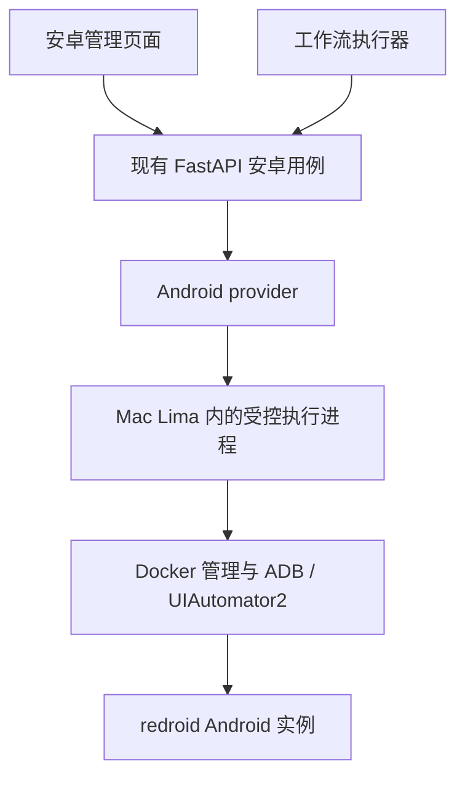

# 安卓管理与工作流接入建议

- 日期：2026-09-13。
- 状态：**proposed**；用户询问下一步的产品与技术路线，本文件不代表正式实施授权。
- 来源：当前正式源码、已确认的 M1/架构决策、Mac redroid Demo 实测、上游官方文档。
- 本轮输出：接入建议与验收切片；没有修改业务代码。

## 当前事实

- Mac 上已验证 redroid Android 13、普通/Magisk 镜像、三实例管理、APK、输入、失败和清理，68 项自动检查通过。应用内 root、环境伪装、摄像头未验证。见 [Mac 实测](../../reference/redroid-demo/MAC_TEST.md)。
- **2026-09-13 更新（confirmed）**：正式工作流 M2 已有浏览器真实运行、停止、事件和产物，当前每工作区一个活跃运行。来源为 [M2 决策](../decisions/2026-09-13-workflows-m2.md) 和 `application/workflows/runs.py`。此前“只有编辑、尚无执行入口”的事实标记为 **superseded**。
- 安卓节点、批量调度、安全暂停/恢复与手动接管仍需扩展；M2 浏览器运行通过不能代替这些能力的验收。[M1 决策](../decisions/2026-09-13-workflows-m1.md) 保留为编辑阶段历史，以 M2 决策与当前源码判断执行状态。
- [已批准架构](../../docs/architecture/README.md) 将 Android 列为可选能力，不能阻塞核心应用启动。正式业务仍属于现有 FastAPI sidecar；reference 不作为正式运行依赖。

## 推荐的下一步目标

交付“主系统中的安卓管理 + 一条真实安卓工作流”，继续以 Mac Apple Silicon 为首个平台。管理模块可独立推进；工作流节点扩展现有 M2 执行契约，不另建安卓专用工作流引擎。

第一条验收流程建议用已验证 APK 或用户指定目标 App：取得设备 → 等待就绪 → 安装/启动应用 → 等待并定位控件 → 输入/点击 → 读取结果及截图 → 自动释放。流程失败、用户停止和宿主恢复必须有明确结果。

## 模块边界

- 主系统负责配置、实例身份、运行占用、记录和产物；VM 执行进程只负责本机 Docker/ADB 命令及其执行状态。它不是另一套业务后台或调度器。
- Mac 平台适配负责 Lima 安装状态、启动、内核与架构检查、连接和恢复；Windows 未来实现 WSL 适配。工作流节点和 React 不执行 `limactl`、`wsl` 或 Docker 命令。
- 沿用当前带鉴权的本机 API、OpenAPI 类型生成和事件方式。VM 通道也需要受控访问和归属校验，不能直接把 Demo 的无鉴权固定端口当作正式接口。
- 复用 Demo 已验证的 Docker/ADB 操作、错误修复、测试及许可证记录；正式版本去掉 Flask 页面入口和进程内业务 job 状态。UI 接入现有 React/shadcn/Tailwind 组件层。
- 拟按现有目录规则增加 android 的 domain/application/provider/HTTP 与 renderer 领域；接口稳定前不预建通用设备插件平台，不与浏览器 Profile 强行共表。

## 最小资源模型

| 概念 | 内容 | 用途 |
|---|---|---|
| 安卓环境配置 | 镜像摘要、架构、分辨率、资源、初始化 APK、可选代理引用及所需能力 | 可复用的创建参数，不含活跃端口和登录态 |
| 安卓实例 | 稳定 ID、workspaceId、环境配置快照、独立数据卷、实际宿主与就绪状态 | 承载已安装应用与持久数据 |
| 运行占用 | workspaceId、instanceId、runId、当前会话及状态 | 保证整次流程的设备归属，运行时解析连接 |

第一版先支持选择已有的持久实例；紧接着增加按配置创建临时实例。借用持久实例只释放占用，不删除数据。临时实例在运行结束后按策略清理自己的容器与卷；需要保留失败现场时显式标记并计入容量。

容器与卷同时标记工作区和实例归属；切换工作区不能接管其他工作区的设备。单机总容量统计仍需覆盖同一 VM 的所有占用，避免不同工作区各自以为还有空余资源。

设备在整次流程期间由一个 run 独占。Demo 的单操作 busy 不足以隔离两个交替点击同台设备的流程。截图采用低优先级只读通道；人工控制需要等待或明确暂停/接管，不能在后台流程运行时自由抢写。

第一版以实际测量配置限定并发并排队。三实例通过仅证明三实例实验，不是任意数量的容量保证。先实现单机容量控制，不增加集群或 Redis 等外部调度基础设施。

## 自动化层

建议优先验证 [openatx/uiautomator2](https://github.com/openatx/uiautomator2)：已有 Python 客户端、UI 层级读取、resourceId/text/description 等选择器、等待、点击与输入能力。用它完成元素层；保留当前 ADB 生命周期、APK、基础按键和坐标操作。具体固定版本在目标 App 实测后确定。

这不是已验证兼容性结论：需要在当前 ARM64 redroid 上实际检查服务部署、两种分辨率、控件可见性、文本输入、重复运行和取消。自绘界面或拿不到 UI 层级的区域可以显式使用坐标/图像动作，不能自动把不确定识别当成可靠定位。

[Appium UiAutomator2 driver](https://github.com/appium/appium-uiautomator2-driver) 已提供会话、WebView 与并行能力，是需要 Appium 兼容或混合应用时的另一条路线。本期无需同时实现两套驱动；若目标 App 验证暴露必须依赖的能力，再调整选型。

## 与工作流 M2 共用的必要契约

1. **运行上下文**：统一 runId/nodeId、输入输出、超时、停止信号、设备句柄与产物目录。节点参数引用稳定设备/配置 ID，端口、Docker 对象和连接凭据不存进工作流文档。
2. **生命周期和恢复**：取得设备并检查实际能力；终止时先停止派发，确认在途命令结束或中止，再释放占用。清理放在执行器的统一收尾逻辑，不能依赖最后一个“释放设备”节点刚好被执行。
3. **未知结果处理**：连接断开或超时不能推断动作未发生。点击、输入、安装等副作用操作不盲目重放；无法确认设备停止时继续隔离，不能仅凭占用到期就交给另一任务。重启后核对运行记录、执行进程与实际容器状态。
4. **日志与产物**：节点开始/完成/失败、选择器与必要诊断、实际环境快照、截图和返回文本关联到 runId/nodeId/instanceId。日志进入 M2 的通用日志界面，不再维护 Demo 专属任务表。
5. **注册与应用生命周期**：后端目录、执行 handler、HTTP schema、生成类型、属性表单一起接入；扩展 M1 固定的 NodeType/runnable 契约。活跃运行和设备占用接入现有 QuiesceGate，正确处理退出和换工作区。

首条流程的节点能力为取得设备、安装 APK、启动应用、等待元素、点击、输入、读取文本、截图。Home/Back/滑动沿用同一设备动作接口。默认超时延续已有 `timeoutSeconds` 契约；不同动作的合理限时应在正式规格中明确。

## 可验收的实施顺序

| 切片 | 交付 | 通过标准 |
|---|---|---|
| A：元素自动化验证与契约 | 当前 Demo 环境上验证 UIAutomator2；确定设备/动作/运行契约 | 目标 App 按元素完成操作并读回结果；两种分辨率、重复执行、等待超时有真实记录 |
| B：正式安卓管理 | 环境准备状态、实例列表、创建/启停、预览/APK、配置和状态持久化 | 从主应用操作真实设备；应用重开可恢复列表；Lima 缺失只影响安卓功能 |
| C：M2 执行闭环 | 共用执行上下文、设备独占、安卓首批节点、日志和截图 | 从正式工作台点击运行完成一条流程；失败定位到节点；停止后无后续动作且占用正确处理 |
| D：批量可靠性 | 临时实例、单机队列、明确清理和恢复 | 用两个可用执行槽处理五个测试运行；一个失败不污染其他运行；持久实例不被误删；服务中断可核对恢复 |
| E：专项环境能力 | 代理/位置/属性、应用级 root、摄像头、视频及拾取录制 | 每项按目标 App 的实际读取值/行为验收，再允许工作流声明依赖 |

B 可先推进，C 扩展已有 M2 执行器；A 的结果决定元素节点承诺。此前关于“M2 执行器尚不存在”的前提已 superseded。D 仍需明确扩展当前每工作区一个活跃运行的边界，不能把资源看板上的并行示意当成已实现。上述切片是建议顺序，不改变已有工作流主线的已确认范围。

## 环境伪装、root 与摄像头

- 环境配置保存“请求值”和“实际观测值”，运行报告引用二者。定位、网络出口、DNS、厂商属性和指纹分别定义验证方式；配置写入成功不等于目标 App 读到了预期环境。
- 镜像架构、启动属性、可运行时修改的属性分别处理；用模板版本和实际镜像摘要保证重复测试的一致性。
- redroid 官方提供网络/DNS及部分属性配置入口，但这不证明能满足目标 App 的全部设备检测。需要按目标 App 与检测项记录兼容性，不提供笼统的“反检测已通过”。见 [官方配置](https://github.com/remote-android/redroid-doc#configuration)。
- shell root 与应用内授权保持分开；未知能力不能满足要求该能力的流程。目标 App 是否能申请 root 必须独立 APK 验证。
- 摄像头需独立验证 Mac 摄像头→VM→Android→目标 App 的实际画面；网页能调用 Mac 摄像头不构成 Android 摄像头已接通的证明。

## 本阶段建议验收目标

用户从主系统选择安卓环境，在正式工作流中执行“安装/启动测试 App → 定位控件 → 输入测试数据 → 读取结果 → 截图”；能查看逐节点日志，停止运行后设备不再被操作；两次运行不串数据和设备，应用重启后可核对恢复。

对架构与当前差距的判断置信度高；UIAutomator2 在具体目标 App 上的成功率、应用 root、环境伪装和摄像头可用性尚未实测，不给工期或通过率承诺。
