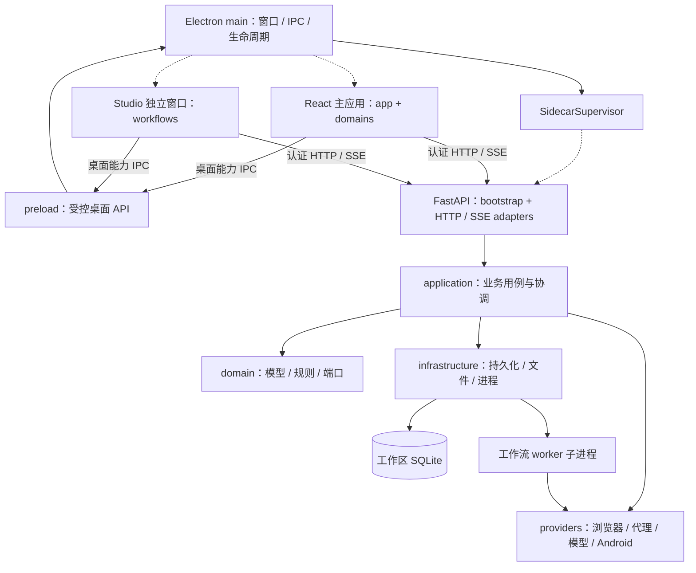
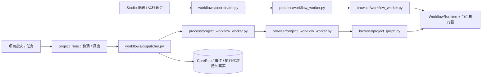

# AutoFlow 项目地图

- 日期：2026-09-28；状态：confirmed（代码结构与工具可用性）。
- 来源：当前工作区源码、CodeGraph 0.9.9 索引、根目录与桌面端 package.json、后端 pyproject.toml；Git 基线 `33ae3aa4`，包含工作区当前内容。
- 范围：开发导航、模块职责、主要运行链路与验证入口。源码存在不等同于功能、平台或发行验收通过。

## 1. 先从哪里读

| 要了解什么 | 入口 |
| --- | --- |
| 项目规则与设计依据 | [AGENTS.md](../AGENTS.md)、[AI 知识库](../.ai/README.md)、[架构规格](architecture/README.md) |
| 桌面窗口、IPC、启动与退出 | [Electron main](../apps/desktop/src/main/index.ts)、[SidecarSupervisor](../apps/desktop/src/main/sidecar/supervisor.ts)、[preload](../apps/desktop/src/preload/index.ts) |
| 主界面导航、工作区与查询缓存 | [App](../apps/desktop/src/renderer/app/App.tsx)、[navigation](../apps/desktop/src/renderer/app/navigation.ts)、[ApiProvider](../apps/desktop/src/renderer/app/ApiProvider.tsx) |
| Studio 独立窗口与后端连接 | [窗口控制器](../apps/desktop/src/main/ipc/automation-studio.ts)、[StudioApp](../apps/desktop/src/renderer/app/StudioApp.tsx)、[StudioHostConnection](../apps/desktop/src/renderer/app/StudioHostConnection.tsx) |
| 后端启动、依赖装配与路由 | [Python 入口](../apps/backend/src/autoflow/__main__.py)、[create_app](../apps/backend/src/autoflow/bootstrap/app.py)、[管理路由](../apps/backend/src/autoflow/bootstrap/http_routes.py)、[项目路由](../apps/backend/src/autoflow/bootstrap/project_http_routes.py) |
| 工作流运行与项目执行接入 | [工作流装配](../apps/backend/src/autoflow/bootstrap/workflows.py)、[WorkflowRuntime](../apps/backend/src/autoflow/application/workflows/runtime.py)、[项目执行协调](../apps/backend/src/autoflow/application/project_runs/coordinator.py) |

## 2. 运行地图

实线表示主要运行调用或资源访问，虚线表示装配/创建；这是人工核对源码后的模块图，不是 CodeGraph 所有边的展开。



后端目标依赖方向是 `adapters → application → domain`，具体依赖由 `bootstrap` 装配；端口实现位于 `infrastructure` / `providers`。这是项目约定，不代表本次已经审计所有 import 是否遵守分层。

## 3. 业务模块定位

前端业务根目录：[renderer/domains](../apps/desktop/src/renderer/domains/)。后端用例根目录：[application](../apps/backend/src/autoflow/application/)。表中路径相对此二者；相应 HTTP、模型、数据库和 provider 仍按后端分层组织。

| 业务 | 前端领域 | 后端用例 | 修改时关注 |
| --- | --- | --- | --- |
| 总览 | `dashboard/` | `dashboard/`、`settings/` | 聚合展示与运行状态 |
| 浏览器配置 / 内核 | `profiles/`、`kernels/` | `profiles/`、`kernels/` | Profile、内核下载、试运行与资源占用 |
| 代理 | `proxies/` | `proxies/` | 代理池、远程管理、凭据读取与运行时代理 |
| 模型 | `models/` | `models/` | 模型目录、供应商与执行绑定 |
| 项目目录 | `projects/` | `projects/` | 项目上下文、生命周期与导航 |
| 项目数据 | `project-data/` | `project_data/`、`project_sync/` | 表、字段、记录、状态、导入导出与同步 |
| 自动化配置 | `project-automations/` | `project_automations/` | 绑定工作流、参数与运行配置 |
| 批次 / 任务 | `project-runs/` | `project_runs/` | 调度、任务日志、证据、停止与人工交互 |
| 持久环境 | `environments/` | `environments/` | 登录上下文与环境资源 |
| Studio | `workflows/` | `workflows/` | 画布、节点配置、文档、执行、调试、事件与助手 |
| Android | `android/` | `android/` | 设备、生命周期、控制台与能力边界 |
| Laya 实验室 | `lab/` | `lab/` | 独立推理入口，具体实现位于 `providers/laya/` |
| 设置 | `settings/` | `settings/` | 桌面设置同时涉及 `main/settings/`；平台路径集中适配 |

共享 UI 当前落在 [renderer/shared/components/ui](../apps/desktop/src/renderer/shared/components/ui/)，主题在 [renderer/styles/index.css](../apps/desktop/src/renderer/styles/index.css)。[packages/ui](../packages/ui/) 是保留骨架，根工作区只注册了 `apps/desktop`，不要把它当作当前组件入口。

## 4. 两条工作流执行入口



- Studio 连接由 `StudioHostConnection` 注入工作区服务地址与认证传输，HTTP 入口是 [http-transport.ts](../apps/desktop/src/renderer/domains/workflows/api/http-transport.ts)，事件入口是 [event-client.ts](../apps/desktop/src/renderer/domains/workflows/api/event-client.ts)。
- 两条链有各自的协调、worker 管理与持久事实；项目图适配器 [project_graph.py](../apps/backend/src/autoflow/providers/browser/project_graph.py) 复用 `WorkflowRuntime`。不要把入口并存误读为可以再实现一套节点执行引擎。
- 文档准备与持久运行服务在 [core_runtime.py](../apps/backend/src/autoflow/application/workflows/core_runtime.py)；图调度在 [runtime.py](../apps/backend/src/autoflow/application/workflows/runtime.py)；节点执行器在 [executors](../apps/backend/src/autoflow/application/workflows/executors/)。同名或重导出的服务应结合文件路径查询。
- 助手编排入口是 [assistant.py](../apps/backend/src/autoflow/application/workflows/assistant.py) 与 [providers/assistant](../apps/backend/src/autoflow/providers/assistant/)；不要把助手编排和工作流图调度混为一谈。

## 5. 契约、测试与研究资料

| 范围 | 入口与验证 |
| --- | --- |
| OpenAPI → TypeScript | [schema_export.py](../apps/backend/src/autoflow/bootstrap/schema_export.py) → [generate-api.mjs](../scripts/generate-api.mjs) → [generated.ts](../apps/desktop/src/renderer/shared/api/generated.ts)；`npm run openapi:check` |
| 桌面 IPC 契约 | [desktop/src/shared](../apps/desktop/src/shared/)；不要与 HTTP DTO 混用 |
| 后端测试 | [backend/tests](../apps/backend/tests/)：unit、contract、integration；在 `apps/backend` 执行 `uv run pytest`、`uv run ruff check .`、`uv run mypy src` |
| 前端与工程 | `npm test`、`npm run typecheck`、`npm run lint`、`npm run build` |
| 仓库与脚本 | [scripts](../scripts/)；`npm run test:structure`、`npm run test:scripts` |
| 平台发行 | [.github/workflows](../.github/workflows/)、[electron-builder.yml](../apps/desktop/electron-builder.yml)；发行证据以对应报告为准 |
| 历史验收与迁移证据 | [docs/migration](migration/)、[项目实施记录](project-management/implementation/) |
| 外部研究与独立实验 | [reference](../reference/)；其中 demo 不属于正式应用运行链 |

本次只检查地图、索引和仓库结构，没有运行整套产品测试或重新做平台验收。以上命令是后续修改对应模块的验证入口。

## 6. CodeGraph 使用与维护

本机原已安装 CodeGraph CLI 0.9.9 和 MCP，本次为 AutoFlow 首次初始化索引。索引在 `.codegraph/`，已被根 `.gitignore` 忽略，不进入产品依赖或 Git；新工作区需重新初始化。

2026-09-28 MCP 状态快照：**2,153 个文件、40,611 个节点、119,718 条关系**。文件语言计数为 Python 1,012、TSX 597、TypeScript 427、JavaScript 111、YAML 4、XML 2。计数包含可索引的测试、脚本及未忽略的 reference demo，不是生产源文件总数；节点包含文件、导入和符号，不全是函数。索引更新后数字可能变化。

在仓库根目录执行：

```bash
# 新工作区首次建索引；已有索引用 sync
codegraph init .
codegraph sync .
codegraph status .

# 搜索、目录导航与调用关系
codegraph query WorkflowRuntime --kind class --limit 5
codegraph files --filter apps/backend/src/autoflow --max-depth 3
codegraph callers configure_project_workflow_runtime --limit 10
```

当前会话已验证 `codegraph_status`、`codegraph_explore` MCP 可查询本项目。跨仓库调用应显式传 `projectPath`；符号重名时同时指定文件或缩小查询词。图的跨文件解析是尽力匹配，HTTP / IPC / 子进程边界仍需结合本地图和源码；图索引不能替代测试。

MCP 服务支持文件监听；未连接监听服务、切分支或怀疑索引过期时，主动运行 `codegraph sync .` 并检查状态。本 Markdown 是人工维护的结构快照，不随 CodeGraph 自动更新。

## 7. 历史描述的使用边界

[目录结构文档](PROJECT_STRUCTURE.md)、[Studio 早期状态](../.ai/memory/studio-status.md)和架构规格中“仅空窗口 / Mock、没有真实后端”的当前状态描述已被后续源码事实 superseded：现有 `bootstrap/workflows.py` 注册真实路由，`StudioHostConnection` 接入认证 HTTP，后端存在两条 worker 入口与运行服务。

这些历史文件仍保留原阶段上下文；不能用旧结论覆盖当前代码，也不能仅凭当前代码推断所有节点和平台验收通过。具体完成度继续查相应迁移/验收报告。
