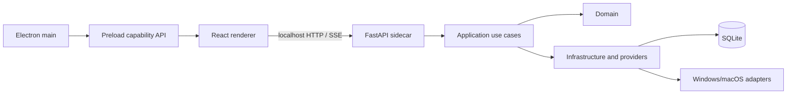

# AutoFlow 系统架构规格

- 状态：草案，等待用户审阅
- 日期：2026-09-11
- 目标：为 Windows + macOS 的 AutoFlow 重建确定运行边界、代码边界、依赖方向和迁移规则
- 适用范围：新仓库 `/Users/zhangtiancheng/Documents/projects/autoflow`
- 不包含：具体业务迁移实现、完整工作流功能实现、发布证书配置

## 1. 设计结论

AutoFlow 采用单仓库桌面应用：Electron 承载桌面能力，React 承载界面，Python FastAPI 作为本地 sidecar 提供业务服务。桌面进程通过受限 preload API 与渲染进程通信；渲染进程通过本机 loopback HTTP 与 sidecar 通信。业务逻辑不放在 Electron 或 React 中。

WebRPA 是源码和能力参考来源。AutoFlow 不与 WebRPA 做运行时集成，不实现 WebRPA 协议兼容，不启动外部 WebRPA，也不把 WebRPA 目录整体作为依赖。要复用的代码先提取能力、重写边界，再放入 AutoFlow 的模块；直接复制代码前必须记录来源文件、固定来源 commit、许可证和修改内容。

## 2. 目标平台和运行时

### 2.1 平台

- Windows：x64 桌面发行版。
- macOS：Apple Silicon 和 Intel 架构分别构建；不在开发机上交叉编译原生 Python 依赖。
- Linux：不属于第一阶段目标，不在目录和 CI 中预留伪支持。

### 2.2 运行时

| 层 | 选择 | 规则 |
|---|---|---|
| 桌面宿主 | Electron | 只负责窗口、托盘、IPC、sidecar 生命周期、系统能力代理 |
| 渲染层 | React + TypeScript + Vite | 页面按领域组织，禁止直接访问文件系统和数据库 |
| UI | Radix primitives + AutoFlow 自有 UI 层 | 组件 API 由 `packages/ui` 统一导出 |
| 流程编辑器 | React Flow | 只负责编辑投影，不作为后端领域模型 |
| 前端状态 | Zustand | 只保存 UI/编辑会话状态，服务端数据使用查询层 |
| 后端 | Python 3.11、FastAPI、Pydantic 2、Uvicorn | 先迁移现有 Python 3.11 基线；升级 Python 版本必须有独立兼容性证据 |
| 浏览器自动化 | Playwright | 通过 provider 端口接入；具体浏览器内核不得泄漏到领域层 |
| 本地数据库 | SQLite + SQLAlchemy 2 + Alembic | 数据库访问只能出现在 infrastructure |
| 契约 | OpenAPI 生成 TypeScript 类型 | 前后端不各自手写重复 DTO |
| sidecar 打包 | PyInstaller，Windows/macOS 分平台构建 | 每个平台的二进制、浏览器和原生依赖单独验证 |

WebRPA 的 React、React Flow、Zustand、FastAPI、Pydantic、Playwright 选择与上述栈相容；这代表技术迁移便利，不代表复制其目录或运行方式。

## 3. 运行边界



### 3.1 Electron main

负责：

- 窗口、托盘、菜单和单实例锁；
- sidecar 启动、健康检查、版本握手、父进程退出监控；
- 原生文件选择、外部链接、应用数据目录；
- 将平台差异隐藏在 `platform/windows` 与 `platform/macos`；
- 将可用桌面能力以最小 preload API 暴露给 React。

不负责：业务实体、数据库查询、工作流执行、表单校验、领域事件。

### 3.2 React renderer

负责：

- 路由、页面组合、领域组件和交互状态；
- API 调用和服务端数据缓存；
- 工作流画布、节点配置、运行日志展示；
- 可访问性、错误边界和加载/空态/失败态。

不负责：文件系统、凭据存储、进程启动、SQL、浏览器控制。

### 3.3 Python sidecar

sidecar 监听随机 loopback 端口，不监听公网地址。启动输出包含 `port`、`apiVersion`、`instanceId` 和健康状态。Electron 只有在健康检查和版本握手成功后才进入正常业务状态。

HTTP API 用于资源 CRUD 和命令请求。长任务事件先使用 SSE；工作流需要双向调试控制时再在同一事件模型上增加 WebSocket。传输实现不能进入 domain 或 application。

## 4. 后端目录和依赖方向

```text
apps/backend/src/autoflow/
├── bootstrap/                 # create_app、配置、生命周期、依赖装配
├── domain/
│   ├── profiles/              # 实体、值对象、领域错误、仓储端口
│   ├── proxies/
│   ├── kernels/
│   ├── models/
│   ├── settings/
│   └── workflows/             # Workflow IR、节点定义、执行状态
├── application/
│   ├── profiles/              # 用例和输入输出命令
│   ├── proxies/
│   ├── kernels/
│   ├── models/
│   ├── settings/
│   └── workflows/
├── adapters/
│   ├── http/                  # FastAPI 路由、请求响应、依赖注入
│   ├── events/                # SSE/WebSocket 事件序列化
│   └── cli/                   # sidecar 入口需要时使用
├── infrastructure/
│   ├── database/              # SQLAlchemy、Alembic、事务
│   ├── filesystem/            # 工作区、临时目录、导入导出
│   ├── credentials/           # Windows/macOS 凭据实现
│   ├── process/               # 子进程和取消
│   └── events/                # 进程内事件总线
└── providers/
    ├── browser/               # Playwright、CloakBrowser 等实现
    ├── proxy/
    ├── kernel/
    └── platform/              # 需要 OS 能力的 provider
```

依赖只能向下：

```text
adapters → application → domain
infrastructure → domain ports
providers → domain ports
bootstrap → all concrete implementations
```

禁止：

- domain import FastAPI、SQLAlchemy、Electron、`ctypes`、平台包；
- HTTP 路由直接执行 SQL 或修改 ORM 对象；
- provider 反向调用 HTTP 路由；
- 一个 `api.py` 聚合多个领域的路由、查询和文件操作；
- 通过 `*_v2.py`、`*_new.py` 持续叠加替代模块而不迁移旧实现。

每个领域至少包含一个 application 用例、一个 domain 模型或端口、一个 HTTP adapter 和对应测试；只有真实需要时才新增目录。

## 5. 前端目录和依赖方向

```text
apps/desktop/src/renderer/
├── app/                       # 路由、应用壳、全局错误和服务恢复
├── domains/
│   ├── profiles/
│   │   ├── api.ts
│   │   ├── model.ts
│   │   ├── components/
│   │   ├── pages/
│   │   └── tests/
│   ├── proxies/
│   ├── kernels/
│   ├── models/
│   ├── settings/
│   └── workflows/
│       ├── canvas/
│       ├── node-catalog/
│       ├── inspector/
│       ├── execution/
│       ├── history/
│       └── tests/
├── shared/
│   ├── api/                   # OpenAPI client和错误归一化
│   ├── components/            # 与领域无关的 UI
│   ├── hooks/
│   ├── lib/
│   └── styles/
└── main.tsx
```

页面只能组合领域组件和 shared 组件。领域 API 只能通过 shared API client 访问后端。React Flow 节点必须先转换为 Workflow IR；画布内部坐标、选中态和拖拽态不能直接发送给后端。

`packages/ui` 只收纳被两个以上领域使用且没有业务语义的组件。单领域组件留在领域目录，禁止提前建立“万能组件”。

## 6. 工作流模型和执行器

工作流能力采用 AutoFlow 自己的版本化 IR：

```text
WorkflowDocument
├── schemaVersion
├── workflowId
├── nodes[]
│   ├── id
│   ├── type
│   ├── config
│   └── platformRequirements[]
├── edges[]
├── variables
└── metadata
```

节点类型由执行器注册表提供：

```text
NodeDefinition
├── type
├── title
├── configSchema
├── inputPorts / outputPorts
├── platformRequirements
└── executorFactory
```

执行器必须提供：

- 配置校验；
- 可用性探测；
- 可取消的异步执行；
- 标准化输入、输出和错误；
- 节点开始、进度、完成、失败、取消事件；
- 平台要求和可选能力说明。

第一批只做跨平台核心节点：变量、条件、循环、HTTP、文件、Playwright 浏览器和子流程。Windows 桌面自动化、macOS Accessibility、OCR、媒体、Android 等作为独立能力包，不能阻塞核心应用启动。

## 7. 跨平台端口

```python
class CredentialStore(Protocol):
    def read(self, key: str) -> bytes | None: ...
    def write(self, key: str, value: bytes) -> None: ...
    def delete(self, key: str) -> None: ...

class DesktopAutomationProvider(Protocol):
    def capabilities(self) -> set[str]: ...
    async def run(self, command: DesktopCommand) -> DesktopResult: ...
```

Windows 使用 DPAPI 或系统凭据存储；macOS 使用 Keychain。业务层只能依赖 `CredentialStore`，不能依赖当前旧项目的 Windows-only `ctypes` 实现。

应用数据、缓存、日志、临时文件、工作区和 sidecar 路径都通过统一 `PathService` 获取，禁止拼接 `%APPDATA%` 或 `~/Library`。

## 8. WebRPA 源码和能力迁移规则

本规格锁定 WebRPA 主分支审查基线为 commit `5ccb900e8dcf1530aae66f676d87593c416c7ebb`。来源目录主要包括：

- `backend/app/executors/`：节点执行能力；
- `backend/app/services/workflow_*`：工作流解析、执行、日志和打包；
- `backend/app/models/workflow.py`：工作流模型；
- `frontend/src/components/workflow/`：画布、节点、配置面板和调试面板；
- `frontend/src/store/`：编辑和运行状态；
- `frontend/src/types/workflow.ts`：前端工作流类型。

移植流程：

1. 为能力建立 AutoFlow 领域需求和最小测试；
2. 读取来源文件及其直接依赖，排除全局状态、启动器、Windows-only 代码和未使用依赖；
3. 把纯算法、节点 schema、解析逻辑和 UI 交互拆成小模块；
4. 改写到 AutoFlow 的 domain/application/adapter 结构；
5. 在 Windows 和 macOS 分别验证；
6. 记录来源 commit、原始路径、修改摘要、许可证文件和删除的依赖。

禁止把 WebRPA 的 `backend/app`、`frontend/src` 或全部 `requirements.txt` 直接复制进新仓库。WebRPA 仓库 LICENSE 明确采用 AGPL-3.0 与商业授权双授权表述，并列出额外的非商业或 GPL 依赖；每个直接复制文件在进入 AutoFlow 前必须完成许可记录和发布策略决策。来源代码不会被默认当作 MIT 或 Apache 代码。

## 9. 打包、更新和安全边界

- Electron 使用 Windows NSIS 和 macOS DMG；签名与 macOS notarization 在发布流水线中完成。
- Python sidecar 在 Windows 和 macOS 各自构建，使用目录分发以便收集 Playwright 和 provider 数据。
- sidecar 只绑定 loopback，随机端口由 Electron 传入；API 必须校验 instance token。
- preload 只暴露明确的能力函数，不暴露 Node、`ipcRenderer` 或任意文件读写。
- 日志按应用实例隔离，错误不得包含凭据、token 或完整请求头。
- 依赖使用锁文件；新增原生依赖必须同时提供 Windows 和 macOS 构建证据。

## 10. 质量门槛

每个迁移切片必须同时满足：

- Python：Ruff、mypy strict、pytest；
- TypeScript：ESLint、tsc、Vitest；
- API：OpenAPI 导出与生成类型一致；
- 领域：纯函数和用例有单元测试；
- 适配器：Windows/macOS 至少各有一条能力或不可用状态测试；
- UI：加载、空态、失败、取消和恢复状态有测试；
- 打包：Windows 和 macOS sidecar 启动、健康检查、退出和升级路径通过冒烟测试。

未完成的平台能力必须返回结构化的 `CapabilityUnavailable`，不能在运行时 import 失败后显示泛化的“未知错误”。

## 11. 第一阶段验收

架构骨架完成后，必须能在两平台完成以下闭环：

1. Electron 启动 sidecar；
2. sidecar 返回健康状态和版本；
3. React 加载 OpenAPI 生成的健康数据；
4. 应用关闭时 sidecar 正常退出；
5. Windows/macOS 使用各自路径服务写入测试数据；
6. Python、TypeScript、打包冒烟检查均可运行；
7. 不包含任何旧项目业务迁移代码。
