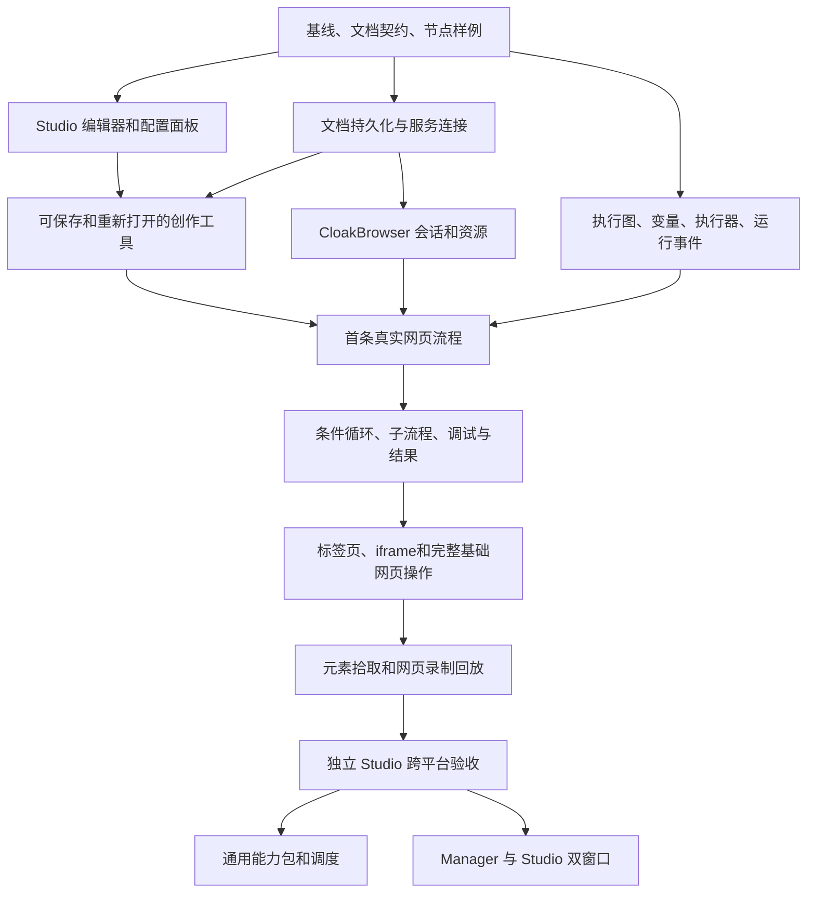

# 从 WebRPA 反推 AutoFlow 开发计划

- 日期：2026-09-11
- 状态：供评审的开发计划；本轮只规划，不开始业务实现。
- 源码基线：`reference/WebRPA`，commit `5ccb900e8dcf1530aae66f676d87593c416c7ebb`。
- 目标：按照 WebRPA 已存在的功能、契约和依赖关系，推导从零构建 AutoFlow 的顺序。此顺序是工程推导，不是对 WebRPA 历史开发顺序的断言。
- 执行顺序以本文为准；旧 `PLAN.md` 的产品形态和目录边界继续适用，旧 `MILESTONES.md` 的阶段编号不再用于排期。
- 技术约束：Electron + React + FastAPI sidecar；CloakBrowser 唯一运行时；Windows/macOS；自动化不依赖 Manager。

## 1. 先修正当前基线认识

### 1.1 一个节点不是一个产品模块

点击、输入和读取属性是网页自动化模块中的动作。编辑器、文档保存、执行引擎、调试、采集结果、录制器则是独立的产品模块，不能靠列出节点数量代替设计。

之前统计的 573 是静态提取的唯一 `module_type` 字符串数量，不是已验证可用模块数。同名类不等于发生重复注册：还要检查装饰器、`executors/__init__.py` 加载清单和最终注册实现。旧盘点中按文件归类的优先级也不直接作为本计划的范围依据。

### 1.2 当前 AutoFlow 后端只能标为原型

此前为验证迁移方向临时写入过 `application/automation`、`executors`、`domain/automation` 和 `infrastructure/cloakbrowser` 原型；本次按“主框架完成后再开发后端”的决定已删除这些实现及测试。后端自动化当前应视为未实现。

后续重启后端工作时，必须先按 R0 冻结前端契约和样例，再从执行图、变量、运行事件和 CloakBrowser 边界开始实现；不能把临时原型或 Mock 调用链当作 WebRPA 行为一致性、真实浏览器或跨平台完成。

### 1.3 前端先展示，契约先于联调

首个可见成果是能编辑、配置、保存样例的 Studio。与此同时提前确定文档形状、节点字段和运行事件样例；真实执行、持久化和调试逐个接通。每个成果分开记录：界面完成、模拟验证、真实接通、平台验收。

## 2. 源码反推出的产品模块地图

以下路径均相对 `reference/WebRPA/`。表中“后续”是开发顺序或待定范围，不表示已授权一次性全量复刻。源码存在不代表能力已经通过测试。

| ID | 功能模块及用户用途 | 主要源码证据 | 先依赖什么 | AutoFlow 处理 |
|---|---|---|---|---|
| F01 | 应用启动与全局设置：服务连接、目录、窗口、配置 | `backend/app/main.py`；`frontend/src/App.tsx`；`frontend/src/services/config.ts` | 无 | 用 Electron/sidecar 归位，复用既有骨架 |
| F02 | 工作流文档管理：新建、命名、保存、打开、导入导出 | `models/workflow.py`；`api/workflows.py`；`api/local_workflows.py`；`services/workflow_folder.py`；`LocalWorkflowDialog.tsx` | F01、文档契约 | 首期；只管理当前文档 |
| F03 | 节点目录：分类、搜索、名称、默认配置、可用性 | `types/workflow.ts`；`types/modules.ts`；`ModuleSidebar.tsx`；`QuickModulePicker.tsx`；`workflowStore.ts` | 节点契约 | 首期；按已迁移批次启用 |
| F04 | 可视化编辑：拖拽连线、选中、复制、撤销重做、分组便签、对齐 | `WorkflowEditor.tsx`；`ModuleNode.tsx`；`GroupNode.tsx`；`NoteNode.tsx`；`workflowStore.ts` | F02、F03 | 首期；撤销重做不等于版本管理 |
| F05 | 配置检查器：字段编辑、校验、路径、变量引用、节点错误策略 | `ConfigPanel.tsx`；`config-panels/`；`models/modules.py`；`workflowStore.ts` | F03、配置契约 | 首期；复杂配置保留专用面板 |
| F06 | 变量与表达式：定义、引用、嵌套访问、作用域、变化追踪 | `models/workflow.py`；`executors/base.py`；`services/variable_manager.py`；`VariablePanel.tsx` | F02、F05 | 首期基础；追踪随调试完成 |
| F07 | 执行图与调度：起点、连线、条件出口、循环出口、汇合、错误边 | `services/workflow_parser.py`；`services/workflow_executor.py` | F02、F06、F08 | 首期核心，不能按数组顺序替代 |
| F08 | 执行器机制：注册、配置处理、结果、运行上下文 | `executors/base.py`；`executors/__init__.py` | 节点契约 | 首期；单一规范实现，状态按运行隔离 |
| F09 | 浏览器会话：启动、设置、上下文、页面、标签页、iframe | `services/browser_engine.py`；`browser_manager.py`；`browser_config_store.py`；`api/browser.py` | F01、资源配置 | 唯一替换为 CloakBrowser |
| F10 | 网页动作：导航、定位、交互、等待、读取、上传下载、截图 | `executors/basic.py`；`advanced_browser.py`；`switch_tab.py` | F08、F09、F06 | 首期分批；不是整文件搬迁 |
| F11 | 运行与调试：启动停止、暂停继续、单步断点、从节点运行 | `api/workflows.py`；`workflow_executor.py`；`DebugPanel.tsx`；`DebugBar.tsx` | F07、F08、F12 | 基础控制随首条真流程；完整调试随后 |
| F12 | 运行事件与日志：状态推送、节点日志、批量日志、结束结果 | `api/workflows.py`；`main.py`；`frontend/src/services/socket.ts`；`LogPanel.tsx` | F08、运行标识 | 第一条真流程即具备；传输层可以适配 |
| F13 | 采集结果与运行附件：数据行、预览、导出、截图、历史运行 | `services/data_collector.py`；`execution_history.py`；`api/data_assets.py`；`DataTable.tsx`；`ExecutionDetailsPanel.tsx` | F06、F10、F12、存储 | 首期结果读取与保存；资产库后续 |
| F14 | 元素拾取与选择器测试：覆盖层、候选、命中、高亮、提示 | `api/element_picker.py`；`services/element_picker.py`；`services/element_picker/`；`executors/base.py` | F05、F09、F10 | 首期创作辅助；用共同会话 |
| F15 | 网页录制：开始停止、事件去重、动作转节点 | `api/recorder.py`；`services/recorder.py`；`RecorderPanel.tsx` | F03–F05、F09–F10；结合 F14 | 首期创作辅助；产物必须能回放 |
| F16 | 流程复用：子流程、文件流程调用、自定义输入输出模块 | `executors/subflow.py`；`workflow_chain.py`；`custom_module.py`；`models/custom_module.py` | F02、F06–F08、F11 | 基础子流程首期；自定义模块与文件链后续 |
| F17 | 通用数据与外部集成：字符串、集合、HTTP、文件、表格、数据库 | `data_structure.py`；`list_advanced.py`；`dict_advanced.py`；`advanced.py`；`advanced_file_ops.py`；`table.py`；`database*.py` | F06、F08、F12–F13 | 基础数据按场景前移；其他按能力包逐步复刻 |
| F18 | 自动触发与调度：定时、事件入口、运行排队、结果通知 | `models/scheduled_task.py`；`services/scheduled_task_manager.py`；`trigger_manager.py`；`run_queue.py`；`api/scheduled_tasks.py` | 稳定运行服务、持久化配置、结果 | 后续；调用同一个 Kernel，不另建执行引擎 |
| F19 | 资源、凭据与资产：浏览器配置、凭据引用、图片/表格资产 | `browser_config_store.py`；`credential_manager.py`；`credential_vault.py`；`api/image_assets.py`；`ExcelAssetsPanel.tsx` | F01、持久化 | 运行必要资源先做；完整管理界面后续 |
| F20 | 企业管理：用户角色、审批、审计、运行看板、节点编排 | `api/rbac.py`；`approvals.py`；`audit.py`；`dashboard.py`；`orchestrator.py` | F18、F19、运行记录 | 本地 Studio 首期不复刻；Manager 按自身需求建设 |
| F21 | 发布与生态：版本历史、发布、打包、市场、插件、WebDAV | `api/workflow_versions.py`；`published_workflows.py`；`workflow_package.py`；`plugins.py`；`services/webdav_manager.py` | 文档与运行核心 | 版本、发布、市场、WebDAV 首期排除；不是普通保存导出 |
| F22 | AI：对话助手、工具调用、生成流程、AI 数据节点、Computer Use | `models/ai_assistant.py`；`services/ai_assistant_service.py`；`executors/ai*.py`；`api/computer_use.py` | 运行、模型资源、工具管理 | 助手/生成/AI 自愈首期排除；普通 AI API 节点另行定范围 |
| F23 | 重型与平台专用：OCR验证码、桌面、Android、媒体、Office桌面、QQ微信 | `executors/captcha.py`、`desktop*`、`phone*`、`media*`、`word_automation.py`、`qq.py`、`wechat.py` 等 | 相应系统及外部运行时 | 按已确认首期边界排除；纯文件读写与桌面 Office 分开判断 |
| F24 | 第二浏览器引擎 | `executors/drissionpage.py`；WebRPA 多浏览器启动分支 | 外部浏览器引擎 | 不迁移运行时选择；能力若需要，由 CloakBrowser 实现 |

前端组件未展开路径的共同前缀为 `frontend/src/components/workflow/`；`workflowStore.ts` 位于 `frontend/src/store/`；表内 `models/`、`api/`、`services/`、`executors/` 的共同前缀为 `backend/app/`。

## 3. 从零构建的依赖顺序



这是依赖关系，不要求先把某一层全部写完：例如日志从首条流程开始接通，不等到独立“日志阶段”；浏览器启动技术验证在编辑器阶段就进行，但不阻塞前端展示。

## 4. 里程碑及验收

### R0：源系统行为拆解与样例冻结

**模块：** F02–F08、F11–F12 的契约部分。**依赖：** 固定源码可读。

开发内容：

1. 从前端创建默认值、保存请求、后端模型、执行器四个位置对照节点字段；不只看 `models/modules.py`。
2. 固定画布节点 `type` 与 `data.moduleType` 的转换规则；保留 `data` 配置、边 handle、位置和样式等文档信息，去掉纯瞬时拖拽/选中状态。
3. 提取基础变量引用、超时单位、错误策略、状态和事件样例。WebRPA 事件如 `execution:started`、`execution:node_start`、`execution:node_complete`、`execution:completed`；HTTP/SSE 替换 Socket.IO 时记录显式映射，不默默换掉语义。
4. 选择首条五节点网页流程和一条变量/条件/循环流程，保存最小输入与预期行为。既有原型差异进入修复清单。
5. 统一冲突文档：早期 `browser.*` 命名草案、`domain/workflows` 与 `domain/automation` 等，不留两套有效约束。

**验收：**

- [ ] 每个首批节点都有源路径、字段/默认值、输入输出、事件、待确认差异。
- [ ] 样例使用真实 WebRPA 字段和变量语法，不以既有 Mock 的写法替代基线。
- [ ] 区分源码声明、实际注册、可执行验证；不把同名类数量作为注册错误证据。
- [ ] 文档明确哪些要求已确认、哪些只是迁移建议；没有擅自排除 Python/普通 AI API 等未逐项决定的能力。

**演示/证据：** 字段对照表、样例 JSON、来源 commit、差异清单。此阶段无需承诺整个参考系统都能启动。

### R1：可编辑的 Studio 前端

**模块：** F03–F06、F11–F13 的界面。**依赖：** R0 的首批样例；不等完整后端。

开发内容：迁移画布、模块侧栏、配置、变量、日志和数据区；选择器/录制入口可以先展示状态。优先移植有效交互和专用配置面板，改善布局一致性；不先建“万能表单生成器”。节点目录的轻量快照来自 R0，后端接通后由契约校验约束它。

**验收：**

- [ ] 拖入五种基础网页节点、连线、配置、移动、删除、复制粘贴、撤销重做可操作；新副本 ID 和连线不冲突。
- [ ] 变量引用可编辑；分组/便签不被当成执行动作。
- [ ] 文件样例加载后显示正确名称、配置、连线、坐标；保存再打开字段不丢失。
- [ ] 模拟开始/节点成功/失败/停止事件能驱动日志和节点高亮；界面明确当前为模拟运行，不显示真实执行成功。
- [ ] 空白、无效配置、未支持节点、服务断开、未保存编辑都有可理解的显示。
- [ ] 参考截图和实际截图逐项评审；Windows/macOS 快捷键遵循各自平台，基本键盘操作可用。

**演示：** 从空白画布创建五节点流程，修改配置并模拟一次失败，定位问题后保存。

**同时消除技术风险：** 确认 CloakBrowser 依赖版本、启动入口和三种目标平台的可获得性。失败记录为浏览器接通风险，不伪装成前端完成。

### R2：当前工作流持久化与服务连接

**模块：** F01–F02、F19 的必要配置。**依赖：** R0；与 R1 开发重叠，验收在 R1 后。

开发内容：Electron/sidecar 连接与恢复；当前工作流 CRUD、校验、保存加载；应用数据目录；必要浏览器资源引用。沿用架构中 SQLite 的存储选择，文档 JSON 导出是交换手段，不建设版本仓库。HTTP DTO 通过 OpenAPI 生成前端类型；临时 Mock 与真实客户端共用相同输入输出。

**验收：**

- [ ] 创建、保存、关闭应用、重新打开后文档相同；节点 ID、配置、变量、边 handle、样式保持。
- [ ] 导入损坏或不支持文档给出明确错误，不覆盖当前有效工作流。
- [ ] 保存失败时仍保留编辑内容和未保存标记；退出时可选择保存/放弃/取消。
- [ ] UI 不直接读写数据库或业务文件；路由不包含 SQL 和执行器逻辑。
- [ ] 模块目录能区分可编辑与可运行；刷新/重新连接不丢文档，不自动重新运行。
- [ ] 受保护接口校验实例 token；服务端配置能在没有 Studio 窗口时读取。

**演示：** 保存含分组、变量和分支的样例，重启应用，再打开并继续编辑。

### R3：第一条真实网页自动化

**模块：** F07–F12、F13 最小结果。**依赖：** R1–R2、可用的 CloakBrowser。

开发内容：修正原型，建立按边执行的基础链、每次运行上下文、唯一注册表；接通 CloakBrowser 启动/页面/关闭；以五个原 `module_type` 实现真实操作。运行 API、节点事件、停止、超时和结果同步接通，不分成几轮孤立的后端工程。

**验收：**

- [ ] 本地网页中执行 `open_page → click_element → input_text → wait → get_element_info`，页面内容和返回值均与输入样例一致。
- [ ] 打乱文档节点数组而不改变连线，执行顺序不变；未迁移图结构在执行前报清楚，不默默当线性流程运行。
- [ ] 点击类型、等待策略、输入标志、读取属性、输出变量/列、默认超时按源行为对照；遗漏字段不以“后端转发了参数”视为完成。
- [ ] `${name}`/`{name}` 等本批所需变量语义通过参考样例；连续两次运行不串变量、页面或结果。
- [ ] 真实点击失败能定位节点、selector、页面 URL；超时和用户停止能区分。
- [ ] 等待中停止和浏览器异常退出会结束本次运行；清理只处理本次运行拥有的资源，不误关共享会话。
- [ ] 同一工作流重复点击运行按明确策略拒绝重复；不同运行标识下事件不串流。
- [ ] 生产浏览器只能由 CloakBrowser 基础设施创建；没有 Chrome/Edge/Firefox/DrissionPage 回退选择。

**演示：** Studio 中配置真实流程，运行后显示网页结果，再演示元素不存在和等待中停止。

**门槛：** 这是首个“真实可运行”的产品节点。测试适配器和动画不能替代验收；移除参考目录后仍能运行。

### R4：流程逻辑、数据结果和调试闭环

**模块：** F06–F08、F11–F13、F16 基础子流程、F17 必要数据操作。**依赖：** R3。

开发内容：迁移 `set_variable`、`condition`、`loop`、`foreach`、`break_loop`、`continue_loop`、`stop_workflow`、`print_log` 和基础 `subflow`；按实际样例补充列表/字典/字符串能力。同步完成真假出口、循环体/结束出口、错误边、禁用节点、变量追踪、数据预览、单步断点；不为首版一次迁移全部数学统计节点。

**验收：**

- [ ] 条件两侧分别测试；循环零次、一次、多次、嵌套、break/continue 与基线一致。
- [ ] 循环出口/错误边的别名和行为有明确对照；孤立节点、多个入口和汇合规则依据 parser/executor 测试确定，不能凭 UI 推断。
- [ ] 多前驱汇合、错误回流和循环回边没有死锁或错误重复执行；暂不支持的结构在运行前被拒绝。
- [ ] 子流程参数、输出、错误传播和取消传播可测试；不要求文件链与自定义模块市场同时上线。
- [ ] 暂停后不启动下一节点，单步遵循 WebRPA 的边界；运行中浏览器动作是否即时可中断单独标注，不把暂停等同强制中断。
- [ ] 从指定节点运行需具备上下文，缺少变量/页面时明确提示，不假设此前节点已执行。
- [ ] 数据列和变量输出不会混淆；最终数据可预览、导出并重启后读取；运行记录与工作流版本历史严格区分。
- [ ] 数据/日志通道断开再连后可查询最终状态和结果，不重跑、不重复追加；必要的 run ID/序号作为传输扩展记录。

**演示：** 遍历本地列表、判断并采集目标项，在循环中断点检查变量，单步后导出结果。

### R5：完整基础网页操作与定位辅助

**模块：** F09–F10、F14。**依赖：** R3；复杂流程回归依赖 R4。

开发内容：导航/刷新/返回、下拉/复选/悬停/滚动/拖拽、标签页/iframe、对话框、文件上传下载、截图、JS 页面操作；迁移元素覆盖层、CSS/XPath 格式化、候选和选择器测试。每小批完成前端配置和真实后端，不等待整套浏览器层完成才联调。

**验收：**

- [ ] 点击打开新标签页时分别验证 `followNewTab` 开关；当前页/新页模式可复现。
- [ ] iframe 进入退出、嵌套定位、页面关闭后重选页按基线处理；输入、读取、等待使用相同的当前目标规则。
- [ ] 拾取输出可以直接用于 click/input/get；选择器测试展示真实命中数和高亮，失败不改当前配置。
- [ ] 保留非 AI 的 selector hints 与候选回退；回写位置、日志和可见性按参考行为记录。若改变回写策略，必须作为独立行为改动评审。
- [ ] 上传/下载/截图的路径、中文、空格、重名、取消和清理分别验证。
- [ ] 浏览器资源缺失、profile 被占用、代理失败均返回可定位错误，不能回退其他浏览器。

**演示：** 拾取表单元素、输入、上传、切换新页和 iframe、下载结果并截图；整条流程再运行一次。

### R6：录制生成与可靠回放

**模块：** F15，复用 F03–F05、F09、F14。**依赖：** R5。

开发内容：迁移录制脚本、事件缓冲、开始/停止及源已有的状态控制；录制事件转现有节点、配置和连线。先覆盖 click/input/select/check/navigate，再补拖拽/滚动/快捷键等已选行为。

**验收：**

- [ ] 从 Studio 启动录制，完成本地表单后停止；结果是现有 `module_type` 文档，不是另一套只供录制器使用的脚本。
- [ ] 连续输入和重复事件的合并按来源样例验证，不漏掉最终文本和必要导航。
- [ ] 录制后保存、重启、打开，使用干净会话回放，得到相同页面结果。
- [ ] 录制过程中换页或关闭浏览器时有明确结果，不吞事件、不丢已有编辑内容。
- [ ] 会话占用规则明确；录制与流程运行不能同时误操作同一页面。
- [ ] 未支持的录制动作明确标记，不自动生成声称可执行的节点。

**演示：** 人工操作一遍 → 自动生成流程 → 修改一个配置 → 用新会话回放。

### R7：独立 Studio 跨平台交付

**模块：** F01–F16 首期部分。**依赖：** R0–R6；平台冒烟从早期持续进行。

**验收：**

- [ ] Windows x64、macOS Intel、macOS Apple Silicon 各自真实验证；缺设备的目标标为待验收，不能由另一平台结果代替。
- [ ] 安装包能启动 Electron、sidecar、CloakBrowser；浏览器缺失时提示并按已确定的供应方式恢复。
- [ ] 正常关闭、强制退出、浏览器崩溃、服务重启后不会遗留本应用拥有的子进程或永久 running 记录；不自动重放中断任务。
- [ ] G01–G16 场景全部有结果；运行记录、截图和输出位于正确应用目录。
- [ ] 排除能力不出现在可运行目录中；加载含未支持节点的文档能解释阻断原因并保留原文档。
- [ ] 干净构建无需 reference 仓库或其依赖；已选节点之外的 OCR/媒体/桌面库不会被默认引入。

**演示：** 安装后从录制到修改、保存、回放、失败排查、重启恢复的完整使用路径。

### R8：通用能力逐包扩展

**模块：** F17–F19、F16 的后续部分。**依赖：** 核心服务已验收；可独立排期，不绑定 Manager。

依次建议：基础数据补齐 → HTTP/文件 → 表格与纯文件 Excel → 数据库 → 自定义模块/文件子流程 → 时间/Webhook/文件触发与排队。

每包都交付“目录与配置 → 真实动作 → 变量/结果 → 错误/停止 → 保存重放”，并验证依赖与平台。不能因读取 Excel 文件而引入 Windows COM；不能因 `python_script` 名称含脚本而直接归入 AI 排除，需单独确认用途和范围。

调度额外验收：没有 Studio 窗口也能获得工作流和浏览器配置；重复触发、占用、时区/夏令时、重启后的错过触发处理有明确策略；手动运行和调度运行进入同一 application 用例。首期不要求分布式节点管理。

### R9：Manager/Studio 组合

**模块：** AutoFlow 自有 Manager、F18–F20 中实际选定的管理能力。**依赖：** R7；涉及调度再依赖 R8 调度包。

**验收：** Manager 可打开指定自动化的 Studio，配置资源、启动运行、查看结果；同一 automation 的编辑会话不重复；双窗口显示同一运行事实；关闭/重新打开 Studio 不复制任务或丢编辑内容；自动化核心测试不需要项目管理。停靠和弹出另列子项，只有实现并验证状态保留后才标完成。

不以完成 Manager 为借口引入 WebRPA 整套 RBAC、审批、分布式编排或市场。独立 Studio 的首版交付不等待 R8/R9。

## 5. 防止前端先行遗漏后端的验收场景

所有场景使用仓库内本地测试网页、固定文档或本地测试服务，不依赖公共网站可用性。基础网页执行必须用 CloakBrowser，单元测试可以用测试适配器。

| 编号 | 场景 | 主验收阶段 | 必须证明 |
|---|---|---|---|
| G01 | 文档保存重开 | R2 | 配置、类型、变量、边、样式不丢失 |
| G02 | 五节点真实网页流程 | R3 | DOM 操作与输出正确，不只检查调用次数 |
| G03 | 数组顺序与连线顺序不同 | R3 | 执行依据图结构 |
| G04 | 变量插值、嵌套访问、连续两次运行 | R3–R4 | 语法/类型符合基线；运行上下文隔离 |
| G05 | 缺配置、未知模块、不存在的元素 | R3 | 区分校验失败和运行失败，定位节点 |
| G06 | 长等待/慢导航中取消 | R3 | 取消可收口、资源可释放、终态不被迟到成功覆盖 |
| G07 | 条件、空集合、嵌套循环、break/continue | R4 | 正确出口和执行次数 |
| G08 | 汇合、错误边回流、循环回边 | R4 | 不死锁、不误执行、不重复落结果 |
| G09 | 子流程正常/失败/取消 | R4 | 输入输出和状态传播 |
| G10 | 暂停、单步、断点、从节点运行 | R4 | 执行边界与上下文要求明确 |
| G11 | 断线恢复、日志和数据输出 | R4 | 不重跑；最终结果可读；UI不重复追加 |
| G12 | 新标签页、iframe、对话框 | R5 | 同一会话状态在所有网页动作间一致 |
| G13 | 拾取、XPath、失效selector与hints | R5 | 可解释的定位和回退，不静默偏离基线 |
| G14 | 上传/下载/截图，中文和空格路径 | R5 | 文件正确，取消后清理按所有权执行 |
| G15 | 录制、保存、干净会话回放 | R6 | 录制结果是真实可执行文档 |
| G16 | 干净安装、崩溃、退出、参考目录移除 | R7 | 平台真实可用、无运行时参考依赖 |

**覆盖规则：** 首期范围中的每个能力必须至少关联一个场景或明确追加场景；没有关联的视为遗漏。测试通过仅对测试环境有效，不能替代其他平台验收。

## 6. 目录落点与架构规则

采用 Studio 计划中的自动化目录，不另开 `packages/workflow-executor` 等并行实现：

```text
apps/desktop/src/main/                  窗口、sidecar、路径与有限系统能力
apps/desktop/src/preload/               受限桌面 API
apps/desktop/src/renderer/domains/automation/
  studio/ canvas/ node-catalog/ inspector/ execution/ logs/
apps/backend/src/autoflow/
  domain/automation/                   工作流、变量、结果、节点元数据与端口
  application/automation/              保存/运行/调试用例与执行编排
  executors/                          ModuleExecutor、注册、core/browser动作
  infrastructure/cloakbrowser/        唯一真实浏览器运行时
  infrastructure/automation/          自动化持久化等实际所需实现
  adapters/http/automation/            HTTP命令与查询
  adapters/events/                    已决定的事件传输适配，按需创建
  bootstrap/                          依赖和生命周期装配
```

- 配置字段与执行行为来自 WebRPA；React Flow 展示类型不等于执行器类型，转换必须可往返。
- domain 不 import FastAPI、SQLAlchemy 或真实浏览器库；具体装配在 bootstrap，执行器不访问 HTTP 路由/前端状态。
- 可在 CloakBrowser 基础设施中使用其所需的 Playwright API；禁止的是执行器自行选择/启动其他浏览器，不是禁止依赖 Playwright 本身。
- HTTP/SSE 等传输依现有架构使用；WebRPA 事件语义保留。新增运行 ID 和事件序号是明确记录的隔离/恢复扩展，不另起一套无人对照的状态命名。
- 节点元数据先覆盖实际迁移批次；用一致性检查避免两套字段漂移，不为所有节点提前建立代码生成平台。
- 所有代码迁移记录 `source_path/source_commit/target_path/action/changed_behavior/verification`。只有架构归位、CloakBrowser 替换、平台适配、明确排除和证据支持的修复可以改变行为。

## 7. 交付与排期管理

**完成状态：** 待实现 → 界面可操作 → 模拟验证 → 真实接通 → 基线对照通过 → 目标平台验收。只写“已完成”时必须达到该能力当前发布范围的全部门槛。

**每次演示提交的证据：** 固定源码/AutoFlow 提交、样例文档、实际操作结果、测试命令与输出、目标 OS/架构/CloakBrowser 版本、未通过项。只有执行了参考行为才称“对照通过”；仅源码审查应标“静态对照”。

**性能/响应指标：** 在 R0/R1 建立基准机和代表性流程，给画布规模、日志量、停止响应设定可测预算并写入验收样例；不凭空宣称支持数千节点或所有浏览器操作都能立即取消。

**日历排期：** 本文确定依赖和验收，不虚构工期。R0 完成后根据现有前端代码可复用程度、CloakBrowser 接入结果、平台测试资源和开发人员确定日期。R1、R3、R6、R7 分别是首次编辑器展示、首次真运行、录制回放展示、独立 Studio 交付。

**接下来第一批工作：** 完成 R0 的样例与文档冲突整理，随后推进 R1 可编辑 Studio；浏览器启动技术验证同步进行。暂不扩展现有五节点后端原型，也不以现有 Mock 测试结果宣布内核迁移完成。
