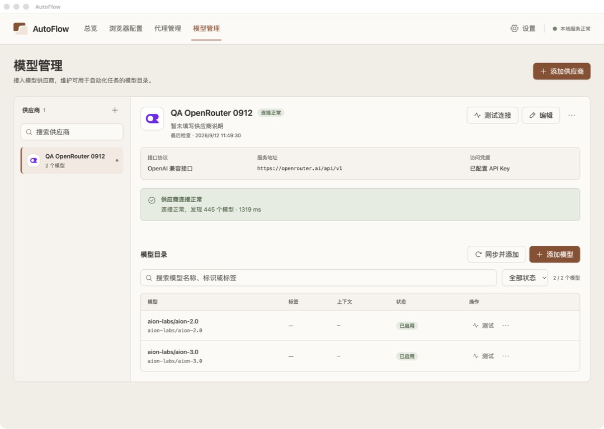
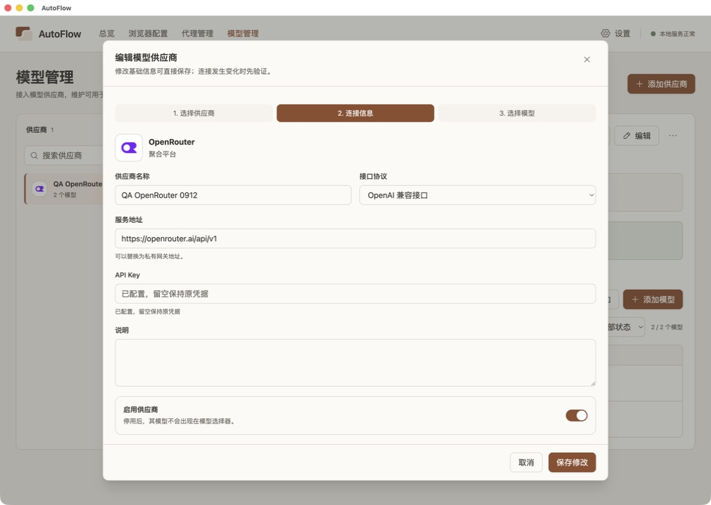
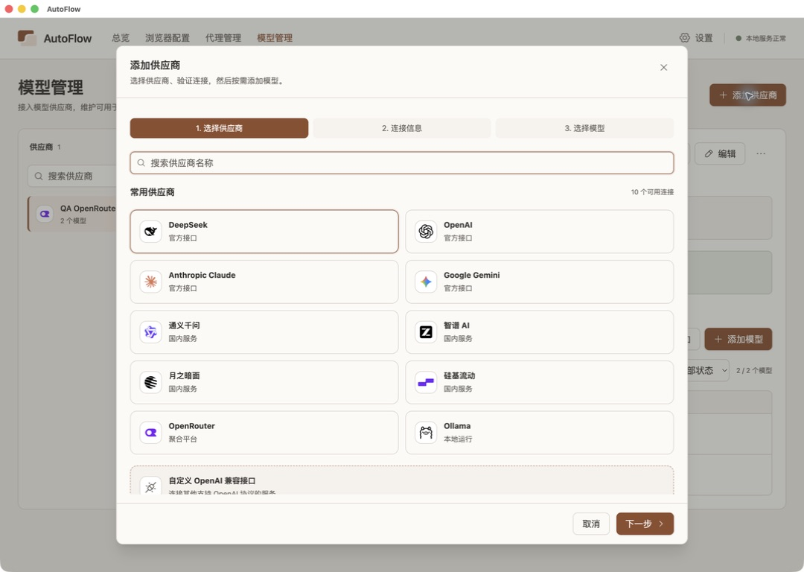
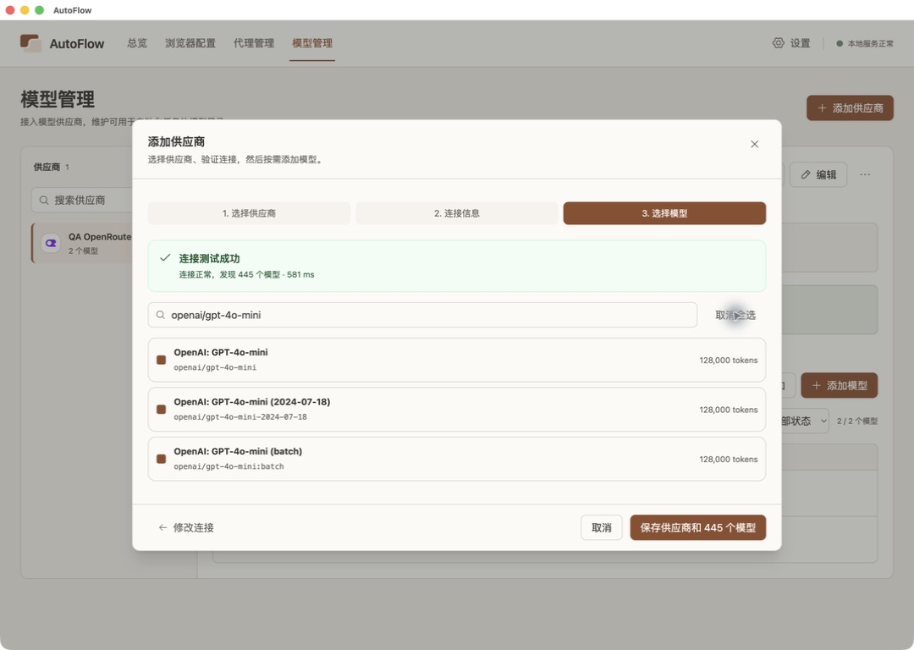
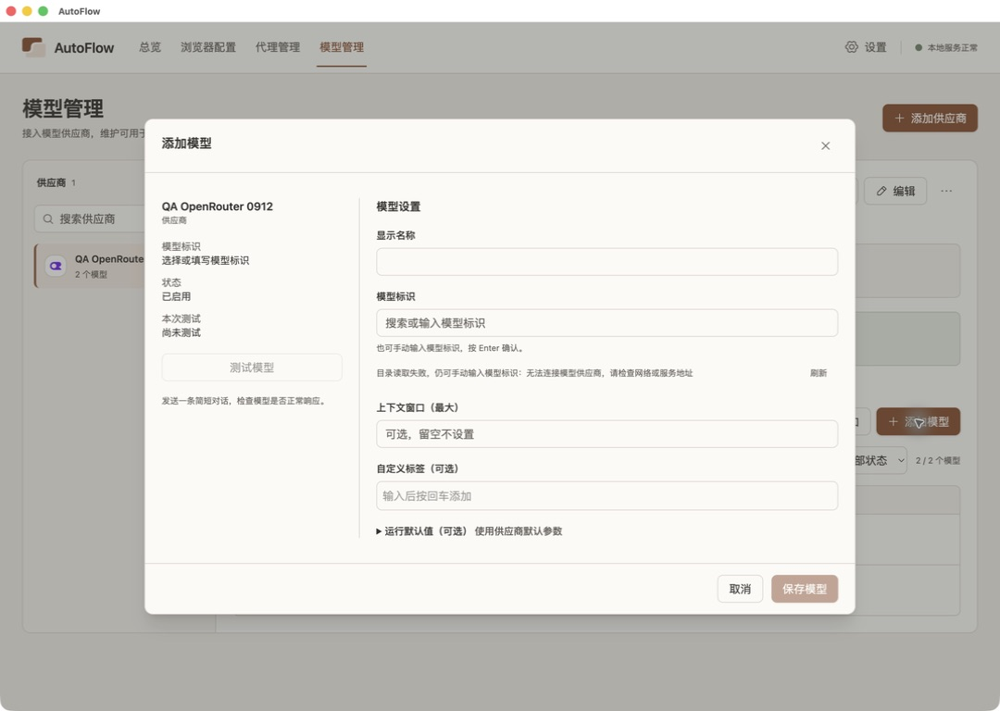
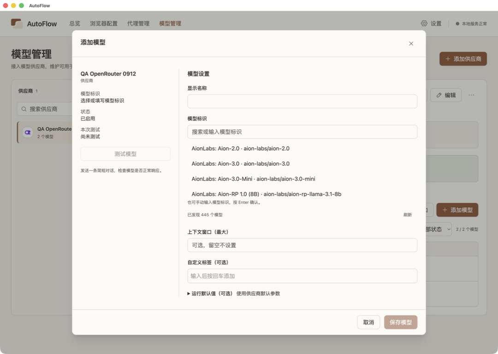
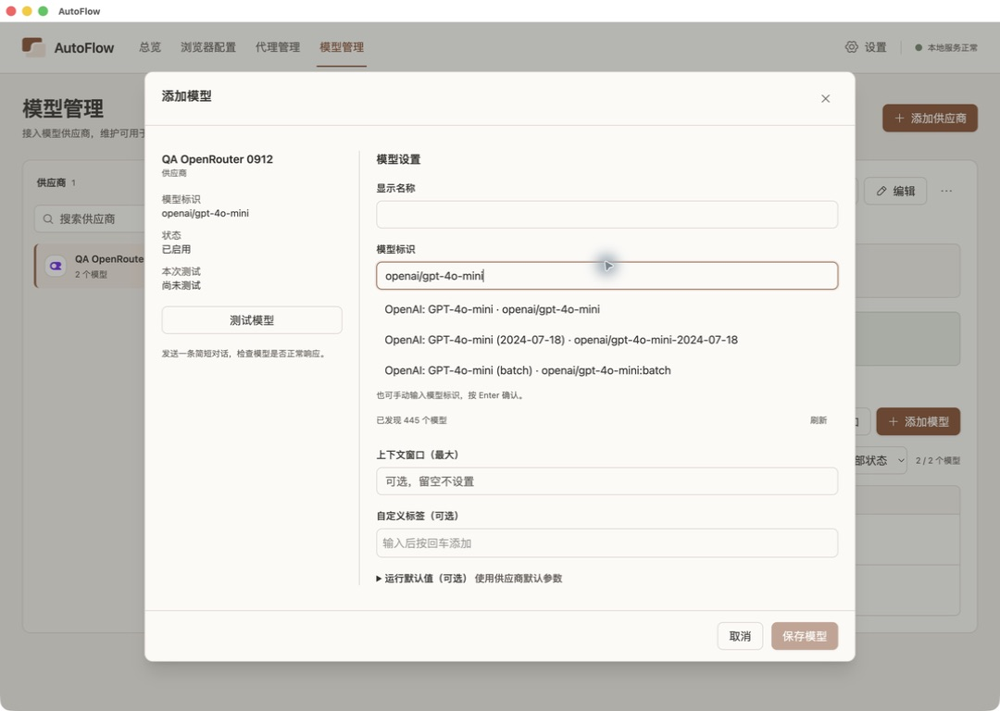
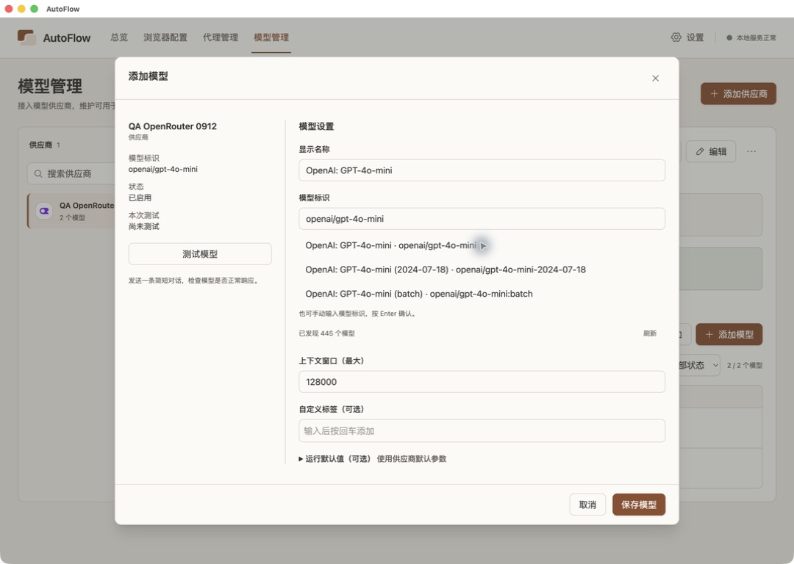
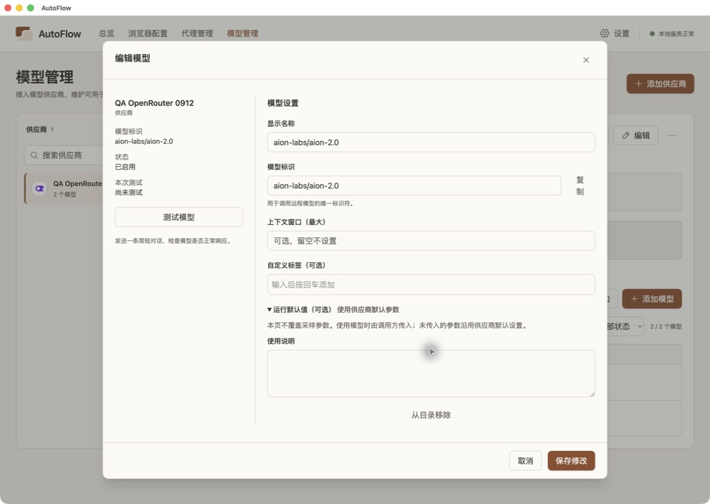
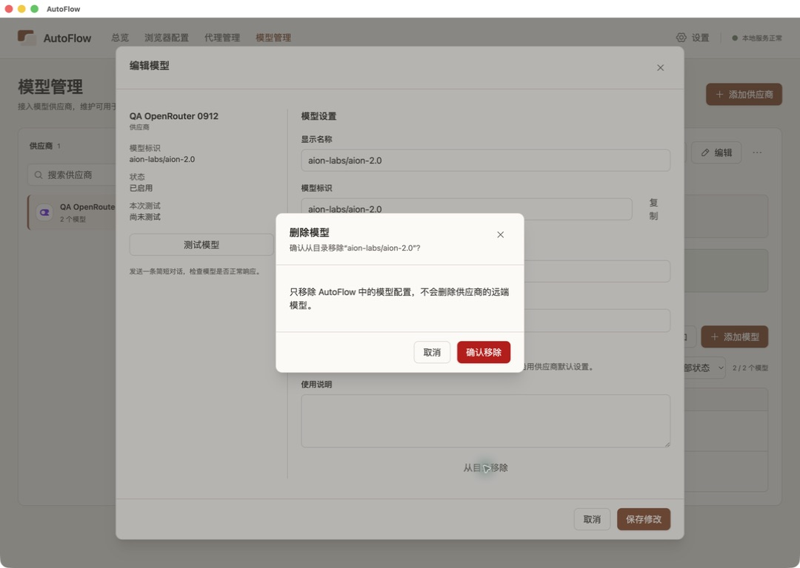

# 模型管理 UI 与交互审查

- 日期：2026-09-12
- 状态：现场观察 confirmed；优化建议 proposed，尚未实施。
- 范围：当前 AutoFlow Electron 的模型管理主页面、供应商接入与编辑、模型添加与编辑、目录错误与恢复、移除确认。
- 来源：本轮实际桌面操作、保存后逐张查看的 10 张原始截图、当前组件源码复核，以及独立子智能体视觉复核。
- 环境：macOS，当前桌面窗口；审查结束时 checkout 为 `codex/architecture-baseline`，HEAD `17e0870`。截图反映运行中的应用，不是重绘原型。
- 置信度：操作复现与可见排版问题为高；审美优先级属于设计判断，置信度中高。

## 结论

当前最需要处理的是模型编辑弹窗的空间分配与选择控件，以及筛选后的全选语义。暖灰与黏土棕配色可以保留，供应商导航也有明确用途。界面的问题集中在信息权重、控件完成度和操作反馈；继续增加卡片、图标或装饰无法解决这些问题。

本轮没有保存临时供应商或模型，没有执行删除，也没有发送模型推理请求。审查结束后仍保留原来的 1 个供应商及 2 个模型，应用已回到主页面。

## 按影响排序的发现

### 1. 筛选后的“选择全部”会选择未显示的所有模型

- 级别：P1，操作范围存在明显误解风险。置信度：高。
- 证据：画板 04；实际搜索 `openai/gpt-4o-mini` 后只显示 3 条候选，点击“选择全部”后，保存按钮变为“保存供应商和 445 个模型”。没有执行保存。
- 问题：按钮位于筛选框旁，用户容易理解为选中当前筛选结果，实际却作用于整个目录。页脚虽然显示 445，但没有在选择动作前说明范围，也没有区分当前可见与隐藏选择。
- 建议：默认操作标为“选择当前 3 项”；如需全目录选择，单独提供“选择全部 445 项”，并持续显示已选数量与隐藏选择数量。
- 源码复核：`ProviderModelsStep.tsx` 的展示列表使用筛选结果，全选逻辑使用完整 `discovery.items`。

### 2. 模型候选列表不像一个完成的选择控件

- 级别：P1，键盘与鼠标结果不一致；P2，状态表达不足。置信度：高。
- 证据：画板 06–08。输入精确 ID，再按 Down、Enter，显示名称与上下文仍空白，保存仍禁用；点击同一候选后名称与上下文自动填入，保存可用。两种操作后的候选列表均继续展开。
- 问题：搜索结果直接堆在表单中，没有清晰的候选容器、活动项高亮和选中后的结束状态。辅助功能树把精确匹配项标记为 selected，但截图中看不出可靠的选中反馈。
- 建议：使用带明确键盘行为的 combobox；Enter 与点击候选触发相同的元数据填入；选中后收起；手动填写独立显示为明确选项。
- 进一步优化：添加时先选择模型，再自动填入名称，名称允许修改。当前名称排在前面，容易引导用户先填一个随后会由候选提供的字段。
- 源码复核：`ModelIdInput.tsx` 的 Enter 只提交字符串，候选点击同时提交模型元数据；没有上下方向键活动项逻辑，也没有收起状态。

### 3. 编辑模型的“复制”出现明显排版失败

- 级别：P2，确定的布局缺陷。置信度：高。
- 证据：画板 09、10，模型标识右侧的“复制”换成上下两个字。
- 问题：当前正常桌面窗口就出现此现象，操作看起来像散落的文字。该字段所在的右栏已经承担全部表单内容，左侧仍有大片空白。
- 建议：为复制操作保留稳定宽度，禁止文案换行，输入框允许正常收缩；也可使用有可访问名称的图标按钮。
- 源码复核：`ModelForm.tsx` 中输入框和按钮直接放在 flex 行内；修复应从这组控件的宽度分配入手。

### 4. 模型弹窗左右信息密度失衡

- 级别：P2，视觉结构与空间使用。置信度：中高。
- 证据：画板 05–09。左侧只放供应商、ID、状态、测试状态、按钮和说明，下面长期空白；右側同时承担搜索候选、名称、上下文、标签和说明。
- 问题：双栏没有让两项任务更容易扫读，反而压缩编辑空间。目录成功加载后，列表直接进入表单排版，弹窗高度与位置也随之变化。
- 建议：先在现有双栏内缩窄辅助区域、统一字段间距、稳定目录区域高度。若后续修订结构，可再讨论将测试区改为紧凑的状态与结果区域。
- 约束：双栏布局属于已经确认的旧项目交互；本报告不擅自把它改为单栏。

### 5. 编辑供应商仍展示不会走完的三步流程

- 级别：P2，操作预期与视觉权重。置信度：高。
- 证据：画板 02。编辑弹窗显示“选择供应商 → 连接信息 → 选择模型”，高亮第二步，但实际直接保存编辑，不走另外两步。
- 问题：最醒目的棕色条传达了错误的流程预期；真实任务只是修改当前连接。
- 建议：新增保留三步向导，编辑使用清楚的编辑标题与连接表单。移除编辑场景下没有实际作用的步骤条。
- 同画板的次要问题：API Key 输入框提示与下方帮助文字重复，说明文本域和启用状态卡占据较多空间，很多边框处于相似的视觉权重。

### 6. 主页面强调连接成功过多，模型目录被压到后面

- 级别：P2，信息层级。置信度：中高。
- 证据：画板 01。侧栏状态点、供应商标题旁状态标签、大面积绿色成功块重复表达连接正常；成功块与模型目录之间又有明显空隙。
- 问题：视线先被连接反馈吸引，真正需要维护的模型列表像页面下方的附属信息。模型名与 ID 相同时逐行重复，占用空间却没有增加信息。
- 建议：持久状态收敛为供应商标题旁的简短标记；测试结果详细信息按需要展开或在测试后呈现。压缩连接摘要与目录之间的空隙，名称与 ID 相同时只显示一次。
- 操作命名：当前“同步并添加”和“添加模型”都进入添加模型弹窗，前者另做目录缓存刷新。应把目录刷新与模型添加的语义说清楚，避免让两个相邻按钮看起来通向不同的添加流程。

### 7. 错误提示比成功提示弱很多

- 级别：P2，恢复路径可发现性。置信度：高。
- 证据：画板 05 是本次真实出现的目录连接失败；原因挤在模型标识下方的小号灰色帮助文字中，“刷新”在远端。点击刷新后恢复正常，见画板 06。
- 问题：这项错误决定目录候选是否可用，但视觉上像可忽略的提示。用户仍可手动填写，所以不应把整个表单表现为不可用。
- 建议：在目录区域提供紧凑的错误块，明确“目录暂时无法加载、可手动填写”，把“重试”放在错误旁。保留表单已有内容，成功后原位替换为候选列表。
- 边界：本次出现一次失败、一次重试成功，不能据此判断服务经常不稳定。

### 8. “运行默认值”标题与展开内容不相符

- 级别：P2，内容与任务语义。置信度：高。
- 证据：画板 09。展开后只有“不覆盖采样参数”的说明及“使用说明”文本域，没有任何默认参数可编辑。
- 问题：标题让用户期待参数设置，打开后却得到备注区域，还暴露“调用方传入”等实现用语。
- 建议：如果本模块只保存备注，直接命名为“使用说明”；参数沿用供应商默认设置可用一句简短说明表达。不为了匹配标题增加未授权的参数功能。

### 9. 供应商选择页底部裁切与选中状态不够清楚

- 级别：P3，布局完成度。置信度：高（裁切事实）；中高（感知判断）。
- 证据：画板 03。默认位置的“自定义 OpenAI 兼容接口”卡片被可滚动区域底部截断；选中供应商的棕色边框与搜索框焦点边框接近，缺少直观的选中标记。
- 建议：给自定义入口独立、完整的位置，或者更清晰地提示目录可继续滚动；选中卡片增加明确标记，分别表达焦点与选中。“10 个可用连接”更适合写成“10 个供应商预设”。
- 不构成问题的部分：不同供应商保留自己的品牌色合理；本轮没有把当前真实品牌标记认定为伪造图标。

### 10. 删除确认可理解，但命名与焦点还可统一

- 级别：P3。置信度：高。
- 证据：画板 09–10。入口叫“从目录移除”，弹窗标题叫“删除模型”，最终按钮叫“确认移除”；打开确认时实际焦点落在关闭按钮。
- 建议：统一使用“移除模型”及其影响说明，危险确认默认焦点放在“取消”。保留清晰的取消与危险主操作。
- 保留项：二次确认本身有合理用途，远端模型不受影响的提示清楚。嵌套弹窗属于已经确认的旧交互，不因为层叠视觉较重就直接判为流程错误。

## 现场画板与逐步检查

以下均为本轮保存后查看过的原始截图，未裁切、重绘或替换。步骤按取证顺序列出，涵盖多个操作分支。

### 01 — 主页面：需调整信息层级

供应商导航、详情与模型目录均可访问。连接反馈占据过多关注，模型名称与 ID 重复。只有一个供应商与两个模型，因此未据此推断大量供应商时的滚动效果。

### 02 — 编辑供应商：流程指示误导

可直接保存连接编辑，却继续展示三步向导。Key 仅显示已配置占位提示，没有截取或记录凭据值。打开时焦点落在关闭按钮，而不是编辑字段。

### 03 — 供应商选择：基本可用，底部与选中状态需打磨

预设可搜索、可选择；默认位置的自定义入口不完整，选择与焦点样式接近。

### 04 — 筛选与批量选择：高优先级误选风险

在未保存的自定义 OpenAI 兼容供应商草稿中，使用 OpenRouter 公开目录读到了 445 个模型。筛选到 3 个结果后全选仍选择 445 个。此路径用于验证组件，不代表本轮验证了 OpenRouter 预设的鉴权；未保存这份草稿。

### 05 — 模型目录读取失败：可恢复，但提示太弱

已有供应商的添加模型弹窗真实出现一次连接失败；手动输入仍可用，恢复入口不够醒目。该图专门记录错误状态，不作为目录正常加载后的排版证据。

### 06 — 刷新后目录恢复：内容加载成功，候选结构松散

点击刷新后显示目录，证明此错误可重试恢复。候选作为表单内普通列表占据高度，与错误状态相比弹窗布局变化明显。

### 07 — 键盘输入并确认：未得到与点击相同的结果

精确输入模型 ID 并按 Down、Enter，名称与上下文仍未填入；保存按钮禁用。这里只验证了该输入路径，没有宣称全部键盘行为都失败。

### 08 — 鼠标选择候选：填入成功，缺少收起与确认反馈

点击同一候选后自动填入显示名称与上下文，保存变为可用；候选列表仍保持展开。取消退出，没有保存模型或调用测试。

### 09 — 编辑模型与展开说明：存在明确排版缺陷

“复制”纵向换行；左侧大片空白，右侧编辑空间紧；“运行默认值”实际只有说明文本域。未修改已有模型数据。

### 10 — 叠加移除确认：可理解，命名与默认焦点需打磨

提示清楚说明不会删除供应商远端模型；默认焦点为关闭按钮。取消确认后可回到编辑，再取消编辑返回主页面；没有执行移除。

## 后续修改边界

- 可先修复的控件与排版：复制按钮换行、文本重复、字段间距、错误区域和恢复入口、选择高亮与键盘行为。
- 需要明确修订交互规格的建议：全选范围、添加字段顺序、编辑场景的步骤指示、运行默认值命名、同步与添加的操作语义。
- 现有约束仍然有效：供应商左栏、模型编辑双栏、叠加移除确认及关闭规则，见 `.ai/decisions/2026-09-12-model-management-legacy-parity.md`。本次审查没有自动废除这些决定，也没有开始实现。
- 建议的设计顺序：先完成模型选择与编辑组件，再整理供应商连接表单，最后调整主页面的信息层级；先给这些关键界面出可审查的改版，再实施。

## 验证与限制

- 已验证：当前桌面窗口中的实际视觉、筛选与全选、目录失败后的恢复、键盘与鼠标选择差异、编辑展开内容、删除确认与取消返回、打开弹窗的默认焦点。
- 数据核对：退出后仍是 1 个供应商、`aion-labs/aion-2.0` 和 `aion-labs/aion-3.0` 两个模型。临时草稿均已取消。
- 未验证：Windows、其他窗口尺寸、屏幕阅读器完整流程、颜色对比度数值、动效帧时长、大量本地模型的长表格体验、本轮未访问的空态和保存失败状态。因此本报告不宣称完成全平台或 WCAG 验收。
- 本轮仅新增审查资料，无业务代码变更，无须重新运行业务测试；未使用此前 API 回归通过的结果来代替本次设计审查。
