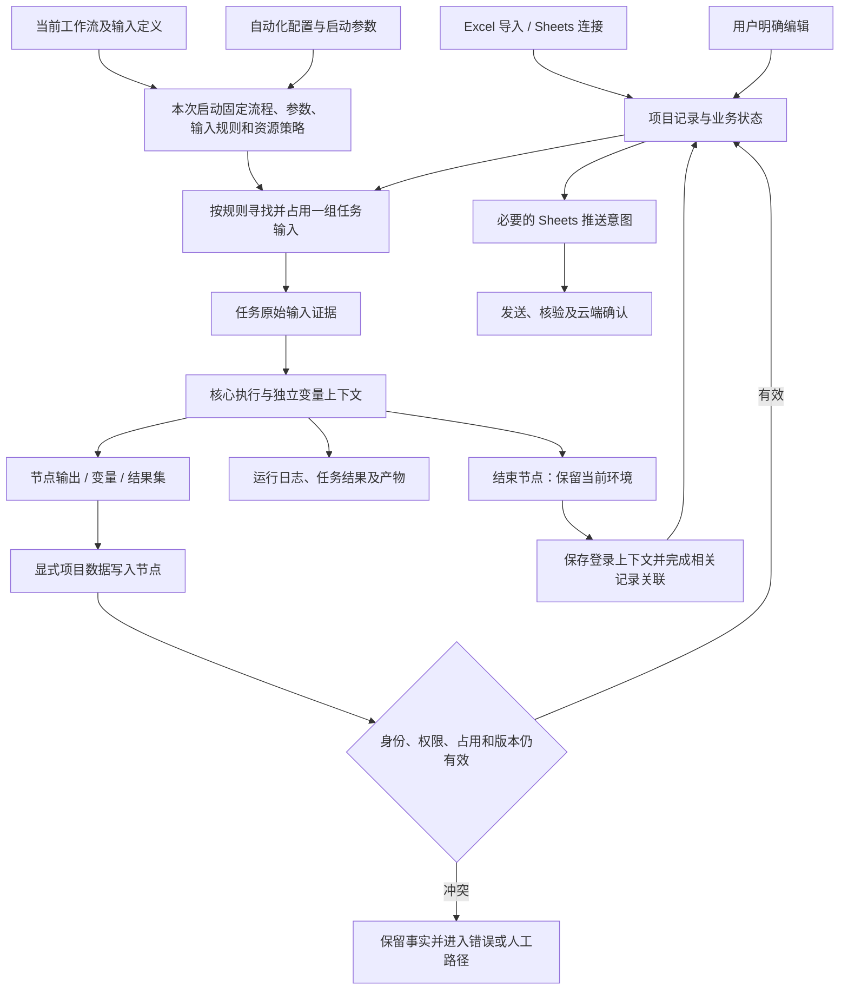

# 项目管理：数据传递与模块契约

- 日期：2026-09-12。
- 状态：**proposed，完整业务设计稿**。用户本轮明确的数据状态/取数/工作流写入/结束节点保留环境规则标记为 confirmed；具体机制仍是推荐设计，不是已实现 API。
- 上游：[完整设计入口](README.md)、[功能与交互](functional-structure.md)。
- 配套：[数据与状态规则](data-and-state-rules.md)、[执行与环境规则](execution-and-environment.md)。
- 依据：旧提交 `324748a` 的 `Workflow-Data-and-Execution-Model.md` 第 38–58、90–115、138–176 行；当前 Studio 工作稿的变量、Run 和独立核心边界；此前审查 R1/R2/R3/R5。

## 1. 总体数据流

关键边界：读取值、计算值、保存项目记录、更新业务状态、推送云端分别有明确效果。用户勾选结束节点的“保留当前环境”时，保存登录上下文及关联相关数据行是一项完整业务操作，内部可分阶段执行；只完成环境文件保存不能宣称整个操作完成。

## 2. 值放在哪里，何时固定，怎样改变

| 数据对象 | 生命周期与归属 | 读取/固定时点 | 改变方式 |
|---|---|---|---|
| 项目记录 | 长期保存在所属项目数据表 | 编辑页读当前版本；任务按领取时点读 | 人工操作或显式数据节点提交，经数据用例校验 |
| 记录业务状态 | 一条记录的单值状态或未设置，属于本地业务数据 | 与领取输入一起形成证据 | 人工明确设置/清空，或设置数据状态节点；不由运行终态推导 |
| 自动化输入绑定 | 自动化的持久配置 | 管理保存时校验；本批启动固定其规则 | 编辑管理配置，仅影响后续启动 |
| 固定参数 | 可有默认值，本批实际值固定 | 启动覆盖 → 自动化已保存值/默认值，依字段契约解析 | 新启动时改变；运行中只读 |
| 原始任务输入 | 本任务最初使用的记录值、状态及版本 | 本次领取提交时固定 | 永不覆盖；用户之后编辑和同步不会改这份证据 |
| 工作流变量 | 每个核心执行实例独立 | 从本次流程定义中的初值深复制 | 本实例明确赋值；不回写下次初值或项目表 |
| 节点输出 | 某次节点尝试实际产生的值 | 节点成功时提交输出，失败信息独立记录 | 下游显式引用；重试形成新的尝试，历史输出保留 |
| 循环局部值 | 当前循环迭代及其作用域 | 每次迭代重新建立 | 依核心变量规则改变，不遗留给下一迭代作为假输入 |
| 本任务已确认记录版本 | 执行内部用于下一次显式写入 | 初始来自领取；本任务写成功后推进 | 仅接收后端确认结果，不因其他人编辑而自动推进 |
| 运行输出/结果集 | 本次运行的结果或产物 | 由实际结果输出动作产生 | 后续查看/导出；不会仅因列名相同写入项目表 |
| 环境引用 | 所属项目中的稳定环境身份 | 选源时解析并固定实际内容代次 | 结束节点保留环境时完成约定的记录关联；浏览器配置名称不是环境身份 |

`项目记录`与`运行结果集`分开：页面抓到十条商品信息，可以先成为本次结果集；只有明确选择“新增项目记录”等动作，才进入项目表并参与后续自动化。运行日志中的文本也不会被系统解析为数据写入指令。

## 3. 输入定义、绑定和值的对应

### FLOW-01 · 三层分别保存

1. **工作流输入定义**：定义输入用途、名称、字段类型、必需性；说明流程要求什么。
2. **项目自动化绑定**：将每个输入绑定到本项目的数据表、字段和取数规则；说明从哪里得到。
3. **任务输入证据**：记录本次实际使用了哪些记录、哪些值和版本；说明这一次用了什么。

三个层次使用稳定身份对应。用户改显示名称不改变绑定；删除输入、删除字段或改变类型会产生可定位的配置问题。后台刷新和 Studio 保存不能静默替管理页重选数据表。

管理配置保存与工作流文档保存仍各自独立。启动必须校验两者当前选定版本的兼容性，并固定本次真正执行的内容。管理保存成功不代表工作流草稿已保存，Studio 保存也不代表输入绑定已经更新。

### FLOW-02 · 字段引用不靠猜名称

字段通过稳定字段身份映射；界面显示名称与用途。旧规则中字段名是字面键，含点号的字段名也不自动解释为嵌套路径。两个表同名字段不能跨表自动匹配，缺失字段不能补成空字符串蒙混通过。

以下只是业务读法：`账号输入 → 用户名字段`、`节点“读取结果” → 返回值`。具体变量插值和表达式语法沿 Studio 契约验证，不由项目管理另造第二套语言。持久配置保存结构化引用，界面负责生成正确引用并提示来源。

### FLOW-03 · 类型、空值与缺失

- 项目业务字段沿用字符串、数值、布尔、日期等已选类型；嵌套对象/数组不因此进入项目字段模型。工作流内部是否支持列表/字典由核心变量能力负责。
- 缺少必需输入与可选输入为空不同。可选输入没有取得记录时，整个输入为空，不沿用上一个任务的记录。
- 必需字段缺失、字段存在但为空、类型不匹配分别报错。`0`、`false` 和空字符串不能统一按“没有值”处理；是否允许空字符串由字段校验决定。
- 类型转换需要明确规则或转换节点；不会自动把 `"0012"` 改为 `12`、把 `"false"` 改为真值、把日期解释成浏览器时区。身份精度与前导零规则见数据规格。
- 枚举选择、记录状态、环境引用使用稳定身份，名称只显示。密钥仍通过现有凭据能力按需取用，记录日志和结果时不展开凭据。

## 4. 从本次启动到数据进入任务

### FLOW-04 · 分两次固定，保持批次行为可解释

**启动固定规则**：流程内容及其实际依赖、参数、输入绑定/条件、最大任务数、并发和环境/资源选择策略。保存编辑只影响后续新批次。

**领取固定事实**：在实际产生一项任务时，读取当前仍合格的记录并完成所需占用，然后固定本任务数据、所选环境及实际资源内容。不能把启动时的预览计数或列表当作之后的领取结果。

临时环境与已保存环境的资源解析不同。已保存环境读取内容的时点、身份固定和版本推进由环境规格统一定义；不能用“模板批次固定”覆盖掉“下一任务明确使用刚保存环境”的规则。

### FLOW-05 · 领取失败不制造半个业务任务

必要输入、关联输入及必需环境的解析有一个完整的候选结果。不能一边执行网页动作、一边发现第二个必要输入没有数据。

数据占用提交与实际浏览器启动不能放进一个长数据库事务。Task、原始输入、lease 和 queued CoreRun 在同一个短事务中提交；合法恢复窗口是这组事实已一并提交但尚未派发，或提交响应丢失后尚未查询确认，不能留下没有 CoreRun 的孤立 Task。用同一个可查询的启动身份恢复派发或确认实际状态。实际启动失败时不假装没有安排过这条任务；记录失败、释放已核验可释放的占用，按明确批次策略和当前条件继续领取，包括已释放且仍匹配的原记录。

固定和占用规则解决的是 AutoFlow 本地协调，不能承诺外部网页操作与本地事务同时成功或回滚。

## 5. 节点之间传递与保存

### FLOW-06 · 原始输入不因写回变成另一份输入

例：领取时姓名为“陈一”、内容版本 5。写节点明确把备注保存为“已核验”，后端返回版本 6。

- 任务详情的原始输入仍是版本 5。
- 写节点输出显示实际确认的新值及版本 6，下游可明确引用这个输出。
- 内部写入上下文推进到版本 6，使本任务下一次写入能接续自己的已提交变化。
- 普通变量不会因为后台记录变化被偷偷改值；原始输入也不会更新成版本 6。
- 若人工随后改成版本 7，本任务依版本 6 写入时冲突；不能自动读取版本 7 再强行覆盖。

需要重新读当前记录时使用明确读取动作；重新读取可以帮助分支或人工核对，但不隐式授权重放已经失败的写入。是否据新值进行新的业务写入，必须经过流程明确的校验和动作。

### FLOW-07 · 写入能力是明确的项目动作

| 动作 | 输入 | 成功结果 | 不允许的隐含效果 |
|---|---|---|---|
| 读取项目资料 | 本项目表/字段及明确条件 | 单条或受限查询结果、读取时点；形状由节点声明 | 不自动领取，不自动获写权限 |
| 更新记录字段 | 可写记录引用、字段身份与值、预期版本、操作身份 | 实际已保存值、新版本、变更事实 | 不自动变更业务状态，不覆盖未提交字段 |
| 设置/清空数据状态 | 可写记录引用、目标状态或清空、预期状态版本 | 状态事实、新版本和操作来源 | 不把状态当任务成功/失败，不回滚此前节点 |
| 新增项目记录 | 目标表及明确字段值 | 新记录引用和已确认内容 | 不靠同名结果列自动入表，不按业务字段猜是否重复 |
| 删除项目记录 | 明确记录引用及占用/版本校验 | 删除事实及必要同步意图 | 不由任务失败自动删除输入 |
| 保存环境 | 本任务拥有的浏览器现场、保存目标及预期来源代次 | 已发布的环境引用和内容代次 | 不自动改记录状态或改绑另一条数据 |
| 关联环境 | 受校验的记录与同项目环境引用 | 可再次解析的关联事实 | 不复制 Cookie 到普通业务字段，不使用任意文件路径作环境ID |

可写范围由本项目、节点声明的目标表和受控项目执行能力限定。查询只返回读取快照，不附带写权；后续明确写节点可以对查询得到的记录重新校验身份/版本，并非阻塞地取得本任务所需占用。若其他任务已持有该记录，返回占用错误而不是持锁等待；后续按有限节点重试或错误分支处理。既有和动态取得的占用统一在任务收尾释放，新建记录也通过后端确认的引用承接；前端任意传入记录ID不能绕过这些检查。

上表中的“保存环境”和“关联环境”是后端职责拆分，不能据此要求用户给“保留当前环境”额外补两个节点。结束节点负责调用完整保留用例；默认关联所选初始输入，可显式选择本任务新建记录或写节点返回且仍由本任务占用的记录；纯查询结果不自动获关联权限。已有引用冲突和恢复行为见执行与环境规格。单独的管理动作可用于事后修复，不是正常保留流程的必经步骤。

若某节点暂未实现，目录或校验明确标记不可运行；完整设计列出能力，不代表当前核心已提供对应节点。

### FLOW-08 · 分支、循环、重试和子流程

- 未执行分支的输出不存在，引用时应在编辑/运行校验中解释，不能读取上一次运行残留值。
- 循环每一轮有自己的局部输出；需要累计时由流程明确写入集合变量或结果集。单条任务内循环不会自动申请更多项目输入。
- 节点失败后的重试保留同一业务操作身份，先查询之前的本地写入结果；已经确认的新增/修改不因返回丢失再次执行。实际发起新一轮业务写入时使用新的明确操作身份。
- 网页动作是否可重试取决于动作与已知结果，不能用本地幂等ID声称网站动作也具有幂等性。结果不明时保留证据并进入核验/人工路径。
- 子流程通过显式输入/输出传递值；父任务的受控数据能力和取消上下文随调用传递，不能因进入子流程绕过项目归属、占用或版本校验。
- 子流程变量不与另一任务共享可变对象；原流程及实际子流程内容在同次运行中保持确定，不读取之后编辑的新内容。

## 6. 状态如何跨自动化流转

### FLOW-09 · 状态由业务动作改变，下一自动化按条件读取

**用户已确认：**是否能再次使用一条记录，由该记录当前业务状态和工作流取数条件决定。没有独立的一次性/可复用属性，也没有自动排除本批已使用记录的过滤。活动占用解除后，只要仍符合条件，同一或另一个工作流均可再次取得；工作流是否改变状态由自身决定。“最终态”是业务含义，不是系统自动禁止再次领取的特殊状态类型。

设计样例：同一项目有“创建资料”和“更新资料”两个自动化。数据表由用户定义“待创建、已创建、待核验”状态。

1. “创建资料”领取状态为“待创建”的记录。
2. 网页动作取得明确成功结果，流程显式写回业务编号。
3. 流程显式设置“已创建”；这一步成功时，状态变更独立持久化。
4. 当前任务仍运行或保留人工现场期间，其他需要独占的任务不能领取同一记录。
5. 记录占用解除后，“更新资料”在自己的新批次中按“已创建”等条件领取当前版本。
6. 首期没有因为状态变化自动启动另一个自动化的暗中触发器。未来调度仍调用同一执行入口。

若第 3 步后第 4 步中的后续节点失败，记录仍是“已创建”，任务结果是“失败”；两者同时显示。用户可从状态变更来源定位实际节点，再决定后续处理。系统不能为了看起来一致而抹掉已发生的业务事实。

业务状态目录默认不要求另配一张允许转换图。是否只能从 A 转到 B，可由输入条件、流程条件和明确状态节点表达；状态目录用于声明可用状态，避免叠加另一套审批/流程引擎。涉及这种推荐的具体规则以数据规格裁定为准。

## 7. 外部动作、数据、环境与同步的部分成功

### FLOW-10 · 按真实边界呈现结果

| 已发生的事实 | 后续失败 | 保存什么 | 用户可采取的动作 |
|---|---|---|---|
| 网页提交成功 | 本地字段写入冲突 | 网页节点结果、截图/产物和冲突信息；原始输入不变 | 核对现有记录及网站结果，明确修正，不盲目重发网页提交 |
| 字段已写回 | 设置业务状态失败 | 已确认字段变化；状态保留之前的值 | 处理状态冲突或按流程进入人工，不把整条记录改回旧版 |
| 状态已设置 | 后续页面节点失败 | 状态变化和失败任务均保留 | 按业务事实筛选后续处理；历史任务只读 |
| 环境已保存 | 记录关联写入失败 | 环境保留并标明来源任务及未完成关联 | 重新核对目标记录后明确关联；不因关联失败删除唯一有效环境 |
| 本地字段已保存 | Sheets 断网或权限失效 | 本地版本和待处理队列 | 恢复连接、重试或核验；本地操作不回退 |
| Sheets 已发送 | 回应丢失或核验暂失败 | 实际发送目标与版本、待核验状态 | 先读取确认，不能自动重复追加 |
| 任务完成 | 浏览器清理失败 | 原任务终态与待清理资源分别保留 | 在环境中处理清理，不重跑任务 |

本地单次记录修改及对应变更事实、必要同步意图可在一个事务提交。浏览器保存、网页动作与 Sheets 远端确认不是同一事务；设计必须保留这些中间事实，不能承诺自动整体回滚。

## 8. 工作流对字段、列和记录的增删改查

### FLOW-11 · 记录内容与表结构分别校验

**用户已确认：**工作流可以在明确步骤中修改或新增字段/列及数据，执行表的增删改查。系统维护每表的业务状态列，不能用“只支持修改已导入单元格”缩减该能力。

具体设计如下，详细影响矩阵以数据规格为准：

| 操作 | 正常行为 | 活动任务与后续节点 |
|---|---|---|
| 新增记录 | 按当前表结构校验，返回稳定记录引用；状态默认未设置，需要初始化时明确连接状态节点 | 本任务可显式使用返回引用；不会改其他任务已领取的原始输入 |
| 更新/删除记录 | 精确目标和预期版本，遵循占用与归属规则 | 他任务占用时不抢写；删除结果按同步规则处理，不靠下一次刷新猜测成功 |
| 新增字段/列 | 给出名称、类型、校验规则和已有记录的值处理方式；返回稳定字段引用 | 兼容性新增可在活动期间提交；已有输入证据不自动多一列，本任务通过新增节点返回的字段引用明确继续操作 |
| 修改字段显示名称 | 稳定字段身份不变，展示引用影响 | 使用稳定字段身份的绑定不改指向；冻结的本次输入别名和值不变；不能把含点的名称改读为路径 |
| 改变类型、收紧必填/规则、删除字段 | 先校验全部受影响记录、来源映射、流程绑定和活动读取/写入依赖 | 影响正在执行的字段契约时明确拒绝，给出哪个任务/绑定阻止；不能因为由工作流发起就绕过检查 |
| 修改系统状态列 | 只能通过状态目录/设置状态能力操作 | 普通字段删除、改类型和 Sheets 映射不能移除或覆盖系统业务状态列 |

新增字段的同名竞争有确定结果：同一操作身份重复请求返回同一结果；另一个操作已经创建同名字段时，报告冲突并返回可核对信息，不悄悄加数字后缀。新增必填字段若现有记录缺值，须有明确填充值或校验不通过；结构与必要值变更作为受控操作处理，不暴露半完成结构。

新增本地字段不会自动修改 Sheets 未映射的列或公式。来源映射明确决定哪些字段向远端推送；需要扩展远端列时通过有明确目标与影响的来源结构操作处理，不能把本地字段名当成云端写入坐标。Excel 仍为一次导入，不回写原工作簿。

数据传递使用“新建记录/字段”动作返回的稳定引用。流程不能依赖“最后一行”“第 N 列”来找回刚创建的对象；并发新增时位置不等于身份。

## 9. 页面、管理应用与执行核心的契约

| 契约 | 调用方 → 责任方 | 必须能确认的结果 |
|---|---|---|
| 工作流保存/加载/校验 | Studio → 核心应用服务 | 当前文档与保存冲突；不能覆盖未保存管理草稿 |
| 输入映射与启动检查 | 项目自动化 → 项目数据/资源 + 核心校验 | 缺哪个输入/字段/资源、是否可编辑与是否可运行 |
| 批次启动/停止/查询 | 项目 UI → 项目运行协调 | 操作身份、批次状态、真实阻断原因 |
| 单次执行/取消/查询 | 项目协调或独立 Studio → 同一核心入口 | 同一执行身份、确定输入、核心拥有的终态 |
| 项目数据读取/写入/状态设置 | 核心中的项目能力端口 → 数据应用服务 | 归属、可写能力、占用与版本核验后的事实 |
| 环境选源/保存/释放 | 核心及项目协调 → 环境应用服务 | 具体环境与内容代次、保存结果、仍需处理的占用 |
| 等待人工/继续/人工结束 | 共用详情 → 项目协调 + 核心 | 核心接受的唯一状态转换；现场和继续前提有效 |
| 查询与变化通知 | 页面 → HTTP 查询；服务 → SSE | 服务端当前事实；重连后补查，迟到通知不覆盖终态 |

HTTP/OpenAPI 是生成前端传输类型的依据。这里列的是业务契约，不提前声称某条新路由或类已经存在。独立 Studio 未装配项目数据能力时，项目数据节点明确不可运行；通用网页、变量和结果能力仍可独立运行。

前端服务端状态沿用 TanStack Query，表单草稿沿用 RHF/Zod；项目页面不复制一个执行状态引擎，也不因 Studio 的画布状态工具而引入新的项目全局 store。页面显示由权威事实组合的结果。

## 10. 完整场景验收

以下固定样例根据本轮用户确认的规则构造，用于整体设计走查及后续实现验收；这些不是已运行测试。

| ID | 固定输入和动作 | 必须观察的结果 |
|---|---|---|
| FLOW-A01 | 零项目输入、固定参数运行两次 | 每次变量独立；第一任务的输出不进入第二任务初值 |
| FLOW-A02 | 两个任务领取不同记录，同时改同名变量 | 各自值和写回目标不同，不串记录、变量或浏览器 |
| FLOW-A03 | 输入版本 5；本任务写到 6，再执行第二写 | 第二写可使用本任务已确认版本；任务原始证据仍为 5 |
| FLOW-A04 | 上例在第二写前被人工更新为 7 | 第二写冲突，保留人工值；不自动升级版本重试覆盖 |
| FLOW-A05 | 可选输入第一次存在，第二次没有 | 第二次输入为空，不能读到第一次记录 |
| FLOW-A06 | 节点新增记录成功但回应丢失后重试 | 查询原操作并返回同一新增记录，不新增第二条 |
| FLOW-A07 | 设置“已创建”后下一节点失败 | 数据状态保留；任务失败；可查状态由哪个任务/节点改变 |
| FLOW-A08 | 第二自动化筛选“已创建” | 等前任务释放所需占用后，读取明确写出的当前字段和状态 |
| FLOW-A09 | 保存登录环境成功但关联记录冲突 | 环境可查且保留；关联未成功不能显示已关联；可人工核对 |
| FLOW-A10 | 结果集有用户名列但没有项目写节点 | 项目表不发生变化；结果仍可在本次运行中查看 |
| FLOW-A11 | 子流程写数据时父任务已被撤销 | 项目写入被拒绝，迟到事件不能恢复已失效执行 |
| FLOW-A12 | 网页成功、本地保存成功、Sheets 暂未确认 | 分别显示三处事实；不得统一显示“全部失败”或“云端已成功” |
| FLOW-A13 | 记录状态保持工作流所需的最终态，连续运行两项任务 | 释放活动占用后同一记录可再次匹配；系统不因本批已使用而排除 |
| FLOW-A14 | 工作流新增一个可空字段，随后用返回引用写入该字段 | 原始输入证据不变，字段和新值可查；其他任务不被强制改成新输入形状 |
| FLOW-A15 | 工作流尝试删除另一活动任务正在依赖的字段 | 拒绝并解释依赖，原结构不变；工作流发起不获得绕过保护的权限 |
| FLOW-A16 | 结束节点勾选保留，并选择相关输入及本任务新建记录 | 登录环境持久化且约定记录关联完成；无需额外添加关联节点；部分失败明确可恢复 |

设计验收还须与数据输入组合、状态目录和环境连续两次使用的场景交叉走查。正式实施计划应将这些 ID 映射到后端规则/契约测试、组件测试和真实应用场景，不能只测试值有没有显示在表格中。
