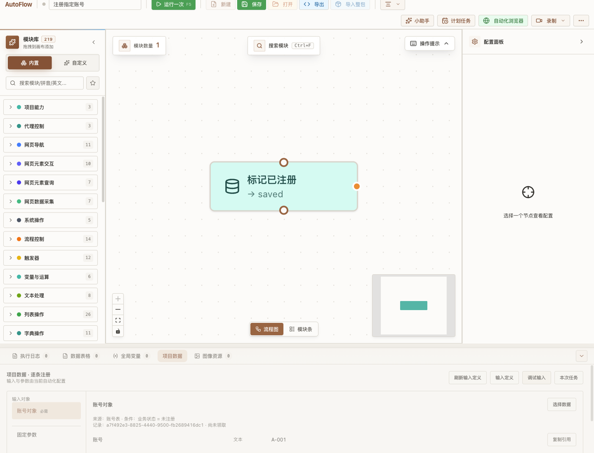
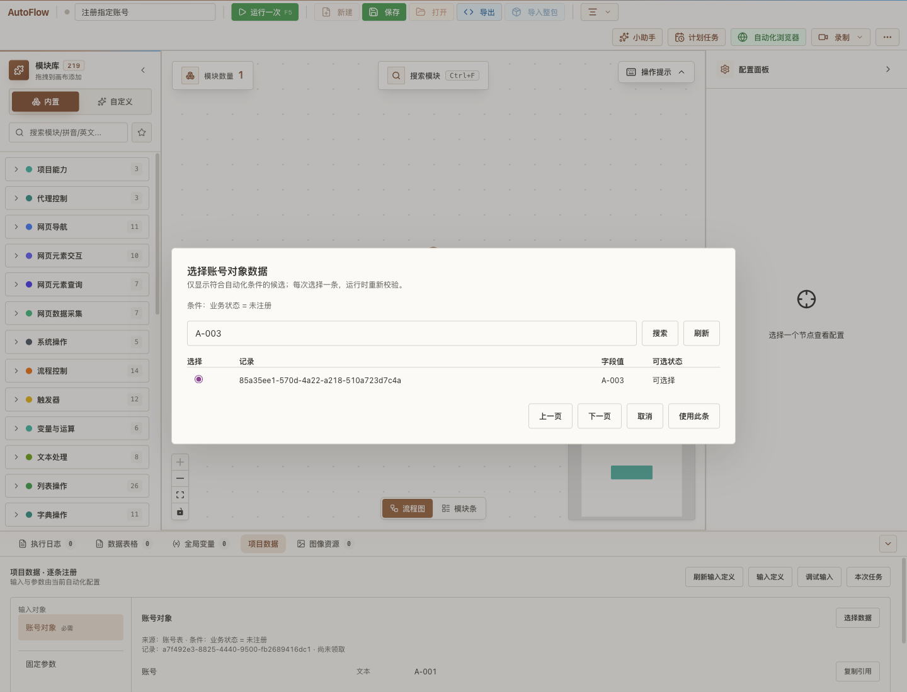
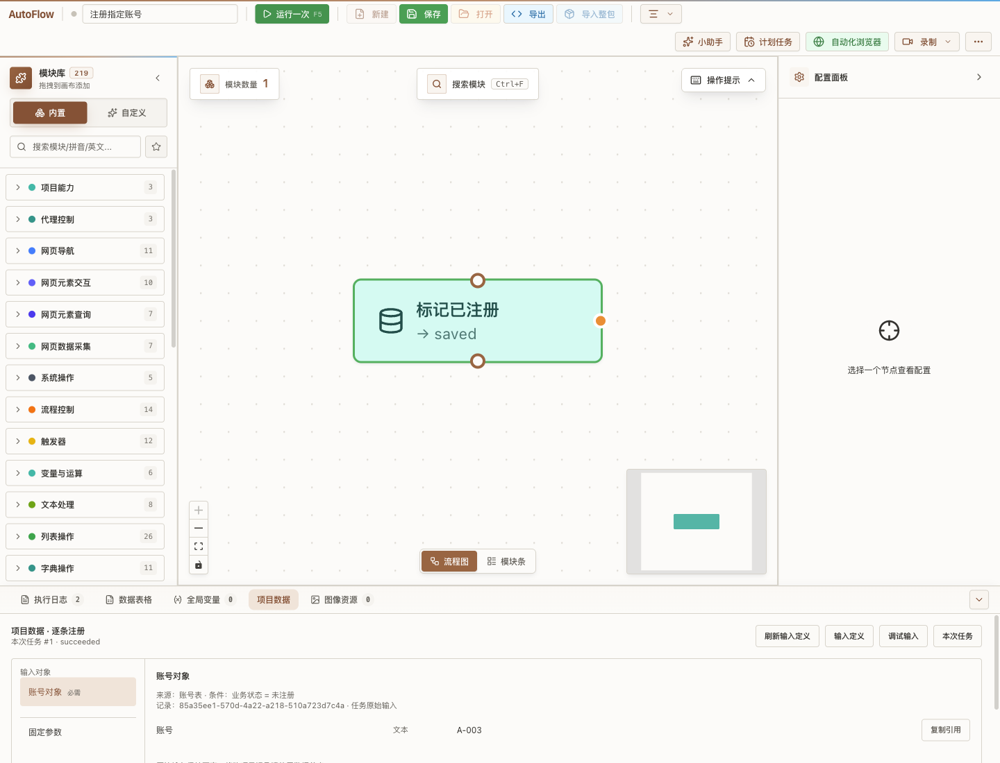

# 自动化与项目输入一体化验收

日期：2026-09-26。状态：implemented / locally verified。来源：用户批准修订版、生产 HTTP / 独立 Electron / 真实 worker 验收以及断言测试。`releaseAccepted=false`。

## 交付行为

创建自动化时服务端在同一事务生成空白工作流和幂等操作记录；公共 POST 不再接受 workflowId，更新不能换绑。旧自动化、运行历史和普通独立工作流保留。内部服务的旧 workflowId 创建入口仅用于已有兼容场景和历史测试数据，不开放为新建界面选项。

从自动化“编辑工作流”打开 Studio 时携带 automationId 并校验归属。底部“项目数据”按对象显示输入定义、调试输入和本次任务；固定参数与全局变量隔离。输入与字段均使用稳定身份表达式引用，保存时记录引用类型，改名不改变引用，失效和类型变化在运行准备阶段提供节点错误。

候选选择只读，不提前领取；搜索叠加已有筛选，分页沿用有界候选扫描。每个对象单选，可选输入可明确为空，固定记录不能改选，关联对象跟随上游重新匹配。只有真实单任务调试接受 debugSelection（记录身份及 content/status/linkRevision），启动和原子领取阶段均重验，失效或占用拒绝且不替换。

“运行一次”直接启动一个并发为 1 的真实任务；有未保存修改时先保存。请求结果不明时保留原命令，恢复查询同一批次。项目事件补读到已有日志和节点状态，不新增执行器。任务输入与本任务写入记录分开，后续失败不回滚已确认写入，结束释放占用，普通批次重新按当前条件领取。

## 规格与证据

| 验收条件 | 可运行证据与断言 |
|---|---|
| 创建原子、重试幂等、专属工作流 | `tests/contract/test_automation_owned_workflow.py`：相同请求得到同一 ID；名称冲突不留下孤立工作流；旧公共创建传 ID 被拒绝。现有 automation contract 覆盖更新归属与历史 |
| 默认第一组、指定第三条、不替换 | `tests/integration/test_project_debug_inputs.py`：第三条精确选择；版本在准入后改变，领取拒绝且任务数为 0 |
| 分页、搜索、关联、固定与可选空 | 同文件：逐页取得不同记录；搜索不能越过条件；换上游重匹配；原关联组失效拒绝；固定可选明确 null；可选忙记录也不可选 |
| 多对象、参数隔离、引用改名与类型错误 | `tests/unit/test_project_input_context.py` 和真实 worker 集成用例：项目上下文覆盖同名普通变量但读取返回副本；稳定 ID；单双引号引用均检查类型；删除给出 nodeId |
| 输入面板、粘贴引用、本次任务 | `project-input-panel.test.tsx`：对象属性面板、候选入口、节点引用类型捕获、删除实时定义后仍显示冻结输入 |
| 丢响应与监控恢复、事件补读 | `run-project-once.test.ts`：原幂等 key/body；已接受批次只恢复监控；409 不换选择；真实任务事件归属与重复运行；零任务不能显示前次成功 |
| 保存后的写入不撤销、结束释放 | 真实 worker 成功/后续失败两个用例：内容和业务状态保留；原输入不变；任务所有租约 released 且 released_at 非空；下一正常批次排除注册记录 |
| 实际桌面完整链 | `scripts/smoke-automation-project-inputs.mjs`：默认 A-001，搜索单选 A-003，真实 worker 仅处理 A-003；原快照保留；正常批次重新选 A-001。并检查弹窗背景不透明且层级高于画布 |

## 实际界面

以下是当前构建运行截图，不是 mock 原型。





## 运行方式

仓库根目录：

```sh
npm run build
UV_NO_SYNC=1 PYTHONPATH="$PWD/apps/backend/src" node scripts/smoke-automation-project-inputs.mjs artifacts/project-inputs
PYTHONPATH="$PWD/apps/backend/src" apps/backend/.venv/bin/pytest -q apps/backend/tests/contract/test_automation_owned_workflow.py apps/backend/tests/integration/test_project_debug_inputs.py apps/backend/tests/unit/test_project_input_context.py
npm test -- --run src/renderer/domains/workflows/tests/project-input-panel.test.tsx src/renderer/domains/workflows/tests/run-project-once.test.ts
```

桌面脚本创建并清理自己拥有的临时工作区，使用生产 HTTP 和真实子进程 worker，不改用户项目，不依赖外部网站授权。需要先安装项目锁定依赖。生成的 `verification.json` 和三张截图是验收输出。

## 验证边界与基线问题

最终针对性后端 27 项通过，增加租约和可选忙记录断言后集成 5 项再次通过；前端面板/调试 8 项和工具栏 48 项通过。较早功能范围回归前端 130 项通过。类型检查、lint、构建、OpenAPI 一致性、修改 Python 的 Ruff 均通过。

完整回归不是全绿：后端较早 908 通过 / 18 失败，其中 17 个旧新建契约夹具已经修复并针对性复验，剩余 1 个代理节点元数据范围错误在 baseline 复现。前端较早 5859 通过 / 5 失败及 1 个套件加载失败，本功能 3 个补读测试错误已修复，缺少本地冻结参考文件已补只读链接并复验，剩余 2 个代理节点计数断言在 baseline 复现。脚本套件 101 通过 / 4 失败，4 项均为同类冻结范围问题并在 baseline 复现。后端 mypy 的 65 条错误 / 11 个文件与 baseline 逐条归一化比较相同，属于 Android 既有类型问题。

未把上述基线问题算作功能通过，也未扩大本轮范围修改它们。未重复跑全部回归掩盖结果；失败修复、最后样式修改分别有针对性测试和真实桌面重验。本分支 CI、Windows/macOS 双架构及打包/签名/OAuth/实机发布链不由本记录声明通过。

本分支基于本地 baseline `b1ad5cb3`；远端 baseline 在验收时为 `2cc06c63`，落后 10 个已有提交。只推功能分支，不擅自更新 baseline；草稿 PR 需明确这一前置差异。
