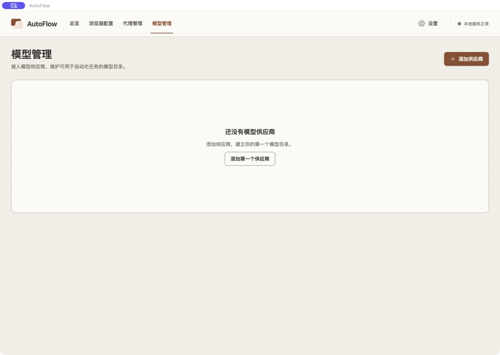
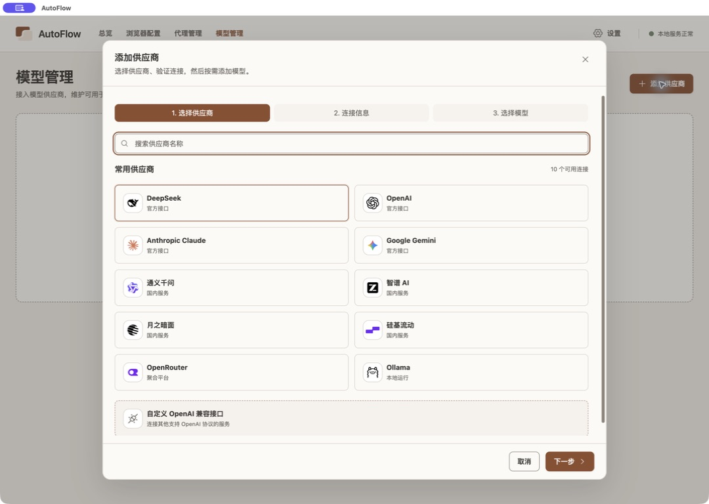
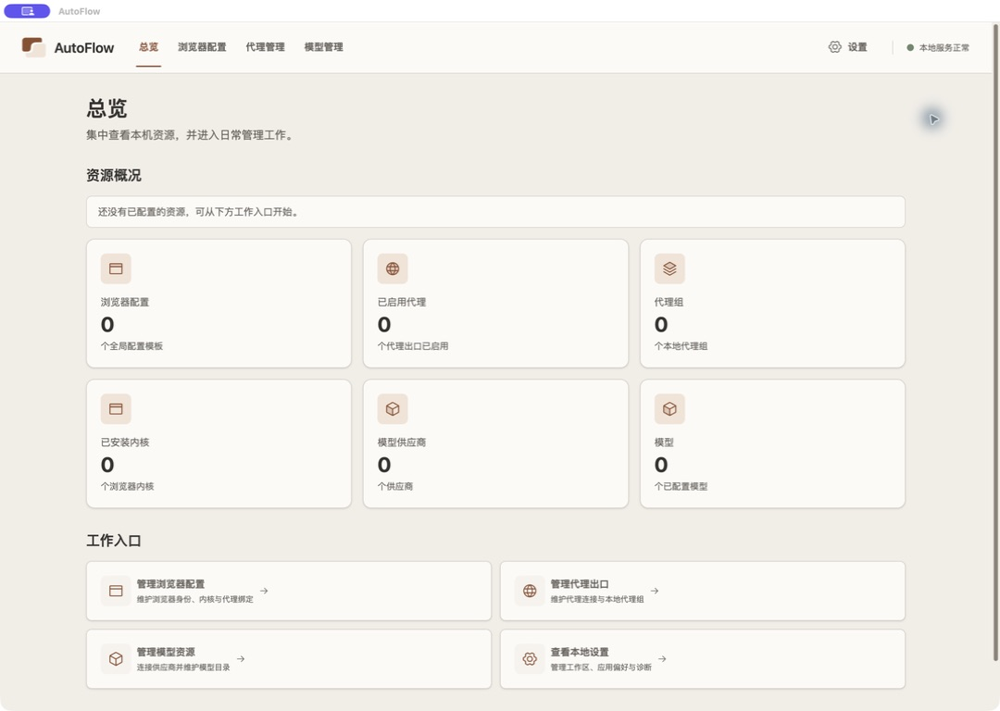

# 第二轮 UI 计划：当前页面复核

- 日期：2026-09-12。
- 状态：现场事实 confirmed；设计建议 proposed，等待本次用户评审。
- 来源：本轮 CUA Electron 截图及 AX 状态；主工作区和控件 worktree 的 git、依赖、样式与组件源码。
- 范围：设计探路，只检查已有界面并形成计划；没有修改业务代码、安装依赖或提交业务数据。
- 正式计划：[第二轮 UI 升级](../../../superpowers/plans/2026-09-12-ui-refresh-phase-two.md)。既有草案继续作为正文，本次补充现场依据，不把历史原型当作用户本次已选择的方案。

## 基线

主工作区为 `2faf2a0`，有其他工作的未提交文件。进程路径和窗口 URL 均指向 `autoflow-ui-controls-plan`；其源码 HEAD 为 `1fb58e1`，检查时工作区干净。运行的是该目录的构建产物，本轮没有重新构建来证明产物与 HEAD 完全一致。

源码确认：首轮已有 tokens/controls、Button loading 与尺寸、统一选择控件、Table、EmptyState、减少动效规则。总览资源图标重复使用 Browser 和 Cube；不同资源均使用棕色底板。设置标题仍用 text-3xl，浏览器页面用 text-2xl；字体层级需要落实到调用方。浏览器 ProfileList 是全宽纵向列表，本次计划不能依据主目录另一版 ProfileCard 擅自改成双列。

## 1. 模型管理空态：可理解，但视觉组织单薄

标题、说明和创建入口明确；大面积虚线容器缺乏模块识别，内容与容器比例不协调。建议在既有 EmptyState 中试验 72–96px 透明插画，缩短装饰性空白，保持一个明确的空态主操作。上方已有的新增入口和业务流程保持一致。

## 2. 供应商选择：品牌素材齐全，适合精修组件

品牌 Logo、搜索、步骤、选择列表与底部操作清楚，搜索焦点可见。继续复用本地品牌素材；统一 Logo 光学大小、卡片圆角、内边距及选择反馈。选中态可补勾选符号，使颜色之外也能识别，不改变单选和向导语义。

## 3. 总览：结构清楚，模块识别不足

资源和工作入口可以扫读。六张卡片使用同一棕色底板；浏览器配置/内核、供应商/模型使用重复图形。建议采用浏览器雾蓝、代理青绿、模型灰紫的低饱和辅助色，资源图标分别对应窗口、芯片、网络出口、资源组、连接、模型。主操作仍用品牌棕。只读统计卡保持静态，可点击入口提供轻量 hover 反馈。

## 验证边界与下一步

三张截图均为本轮获取并从保存文件重新打开检查。窗口期间被用户切换，工具拒绝了旧元素操作；本轮随后重新读取当前状态，没有强制恢复用户页面。没有创建供应商或发起模型测试。

本次没有完成浏览器配置、代理、设置全流程视觉回归；相关判断限于读取的源码。截图不能证明动画帧率、完整键盘行为、读屏或跨平台可访问性。没有运行测试/lint/build，因为只新增文档和截图；实施时按正式计划运行对应检查，并做 macOS/Windows 字体与缩放验证。

优先顺序：统一基线 → 组件样张与图标规范 → 一张空态资产试验 → 共享层 → 浏览器卡片/表单和模型表格/弹窗 → 其余页面。建议首版不新增运行时动效依赖。

置信度：已读取代码与已观察页面事实高；视觉方案中，须通过样张定稿。
