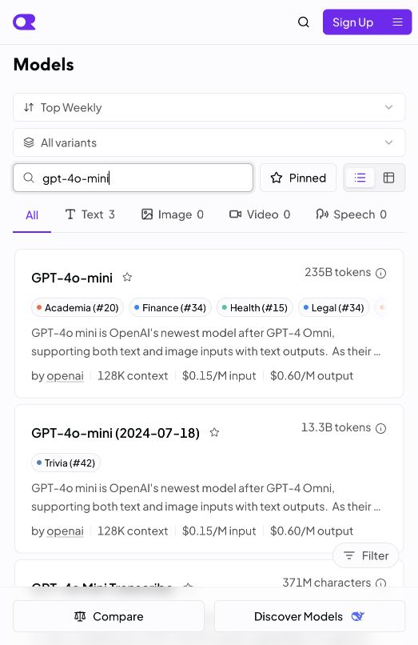
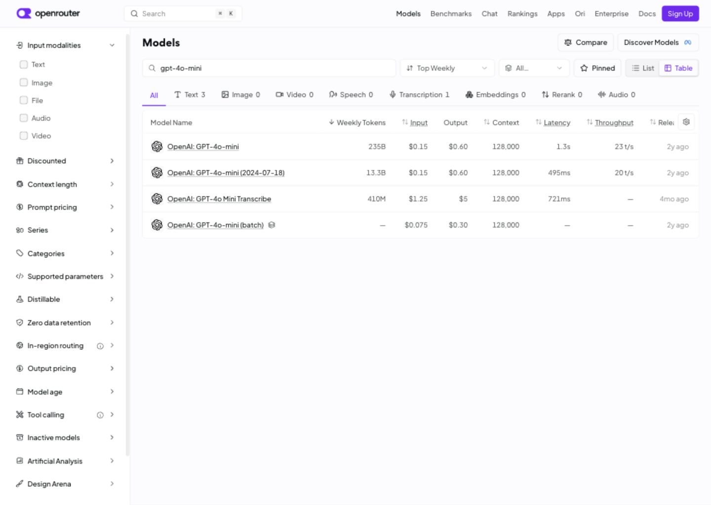
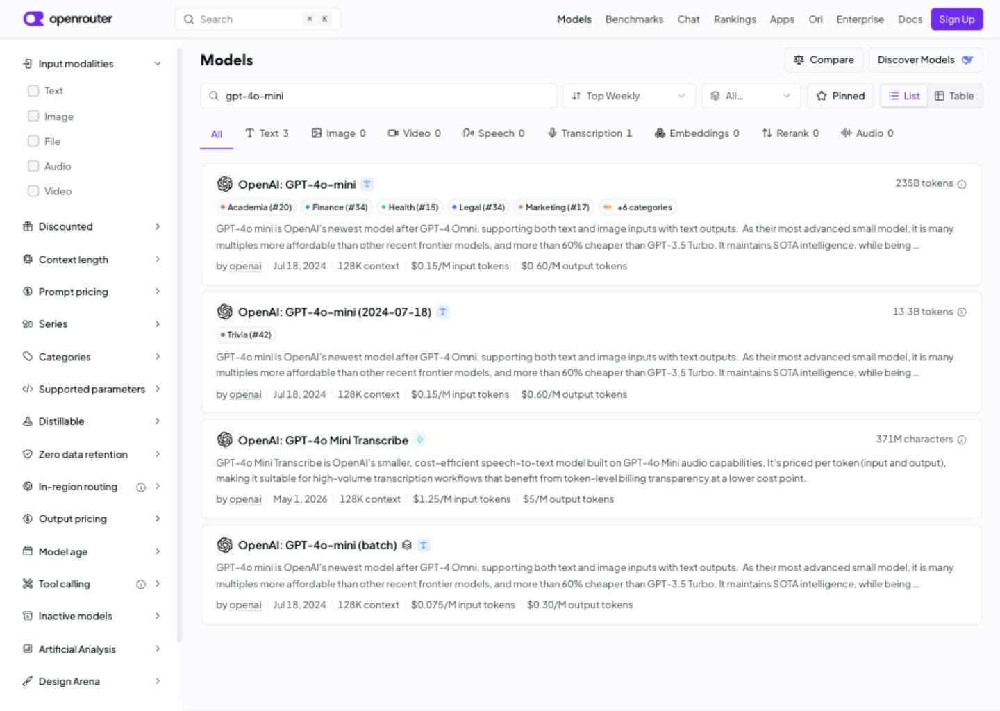

# 模型管理重设计：产品与组件模式参考

- 日期：2026-09-12
- 状态：参考事实 confirmed；AutoFlow 设计推论 proposed。
- 目标：为 Windows/macOS AutoFlow 的模型列表、目录添加、模型单选、供应商连接和模型编辑建立一致的任务结构。
- 方法：现场查看 OpenRouter 公开模型目录；查阅 Dify、LobeHub、Carbon、shadcn/ui 和 WAI-ARIA 官方资料；复核 AutoFlow 当前 DTO、路由和 UI。
- 置信度：现场操作及直接可读的官方资料高；对 AutoFlow 的方案适配中高，仍需原型验证。没有以产品知名度代替可用性证据，也没有推断任何方案已经过用户实验。

## 1. OpenRouter：搜索结果与比较信息

来源：[模型目录](https://openrouter.ai/models)。证据类型：本轮实际公开页面操作与原始截图。

实际执行了搜索 `gpt-4o-mini`、切换 List/Table，并在 1440×1024 桌面尺寸观察两种视图。同一批结果在列表中突出名称与描述，在表格中把属性对齐以便比较。搜索、排序和显示方式属于目录工具区。

可借鉴的是“搜索结果有稳定结构，属性能横向比较”。AutoFlow 的管理任务更适合默认紧凑表格；没有必要同时增加卡片/表格双视图。OpenRouter 展示的价格、吞吐、排行榜、模型模态和多维侧栏不直接迁入 AutoFlow；这些信息需要可靠数据和明确任务需求。

截图为原始 JPEG；浏览器临时尺寸已恢复。第一次搜索尚未完成时的截图被重拍替换，未当作稳定结果。截图内价格、指标和型号介绍只是参考页面当时的内容，不作为 AutoFlow 的元数据或对模型能力的推荐依据。

## 2. Dify：连接配置、模型补充和使用配置分工

来源：[官方模型供应商文档](https://docs.dify.ai/zh/cloud/use-dify/workspace/model-providers)。证据类型：直接读取的官方文档；没有登录 Dify 实操。

当前文档把供应商设置、验证密钥、补充列表外模型和默认模型配置分开描述。对 AutoFlow 有价值的是任务分工：凭据属于连接；添加模型只处理模型；使用模型不必重复理解凭据表单。

不照搬 Dify 的工作空间角色、平台消息额度、多密钥分摊和插件市场。其手动模型凭据规则也不能套用到 AutoFlow 当前“一个连接引用一套凭据”的模型上。

官方页面文字已读取；其中两张内嵌图片的独立请求返回 403，因此没有把它们作为视觉取证或声称复核了相应弹窗。

## 3. LobeHub：连接配置与选择使用的辅助参考

来源：[Anthropic 供应商使用文档](https://lobehub.com/docs/usage/providers/anthropic/)。证据类型：子智能体官方文档调研；根任务复读时遇到工具不支持该响应类型，因此本项仅作辅助，不能作为像素或完整流程基准。

辅助证据支持先配置供应商、再为使用场景选择模型的分工。没有验证其图形界面的远程目录批量添加，不把该能力当作已经观察的事实。

## 4. Carbon：数据表的操作秩序

来源：[Data table usage](https://carbondesignsystem.com/components/data-table/usage/)。证据类型：官方设计规范。

参考其主内容区中的表格布局、工具栏、行操作以及勾选后出现的批量操作区域。应用到 AutoFlow 时，表格优先获得空间；搜索、过滤、数量和动作有固定位置；只在真正支持批量动作的目录添加场景引入多选。

“全选当前筛选结果，明确隐藏选择数量”是根据 AutoFlow 已复现问题提出的规则，并非声称 Carbon 原文规定了相同的跨筛选语义。

## 5. shadcn/ui 与 WAI-ARIA：完整的选择控件

来源：[shadcn/ui Combobox](https://ui.shadcn.com/docs/components/combobox)、[Data Table](https://ui.shadcn.com/docs/components/data-table)、[WAI-ARIA Combobox Pattern](https://www.w3.org/WAI/ARIA/apg/patterns/combobox/)。证据类型：官方组件资料和交互规范。

参考搜索建议、分组、空态、禁用与无效状态，以及方向键、Enter、Escape 的一致行为。视觉选中项、键盘活动项与真正提交的值需有清楚关系。

AutoFlow 继续使用已有 shadcn/Radix/Tailwind 体系。本轮不升级组件底层、不安装依赖；当前 shadcn 文档默认入口包含不同基础实现，后续落地需核对项目版本。使用组件库本身不会自动解决任务结构与信息层级。

## 对 AutoFlow 的归纳

1. 主页面优先服务已经添加的模型，供应商连接独立管理。
2. 目录多选添加与任务内单选使用采用不同容器与提交方式，共享模型条目的基本视觉。
3. 明确区别供应商连接名称与模型发布方；通过 OpenRouter 连接使用 OpenAI 模型时，品牌与调用来源不能互相冒充。
4. 状态词准确：启用、上次连接检查结果、本次模型测试结果分别表达。
5. 只给任务需要且数据能证明的信息；减少重复文字、常驻成功横幅和没有用途的边框。

具体拟议方案见 [模型管理重设计简报](../../prototype/model-management/redesign-brief.md)。
