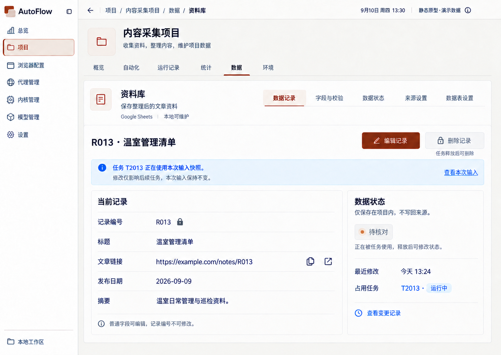
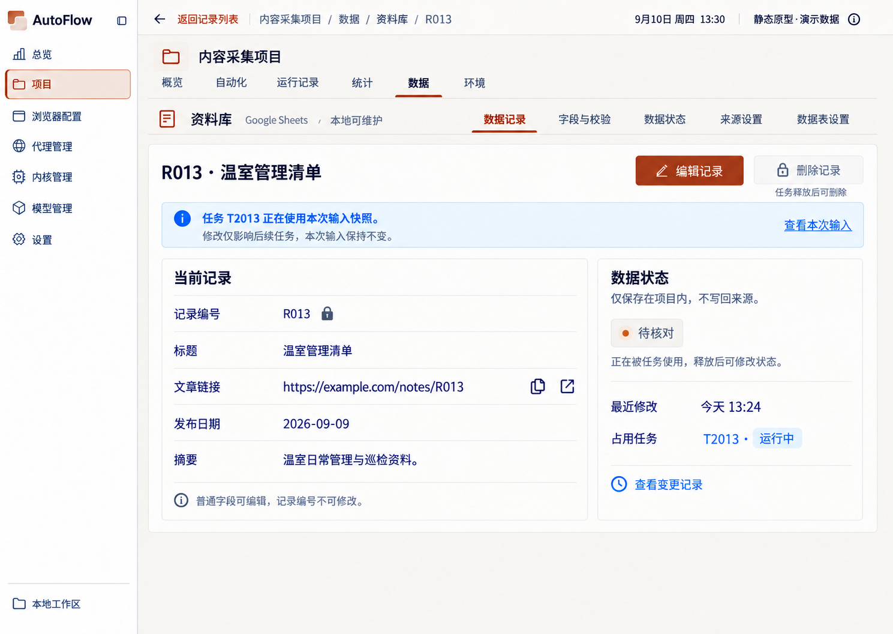

# 版本关系与同日待比对

## 无法证明先后的同日稿

以下两张同属 2026-09-10，分别来自数据规则与公共控件批次，均展示“记录被任务占用”。新旧顺序未知；两个版本都保留，不自动批准任意一张。

### 记录被占用 · 数据规则 v2

来源：`02-refinement-20260910/data-rules-v2/01-record-occupied.png`

### 记录被占用 · 公共控件 v1

来源：`02-refinement-20260910/shared-controls-v1/05-data-record.png`

## 移出当前阅读集的旧版本

| 原页面/状态 | 采用的后续稿 | 依据 |
|---|---|---|
| [概览主页](history/01-overview/001-overview-v1-approved-b0f8a7.png) | [概览主页 · 公共控件修订](latest/01-overview/001-overview-cd1094.png) | 显式更高版本或原 README 定义的后续修订批次；非新增批准 |
| [自动化空态](history/02-automation/006-empty-0abed1.png) | [自动化空态 · 公共控件修订](latest/02-automation/006-automation-empty-695f71.png) | 显式更高版本或原 README 定义的后续修订批次；非新增批准 |
| [任务历史日志](history/03-runs/005-task-logs-approved-3b3e7f.png) | [任务历史日志 · 公共控件修订](latest/03-runs/005-task-log-510347.png) | 显式更高版本或原 README 定义的后续修订批次；非新增批准 |
| [02-manual-list](history/03-runs/200-manual-list-57f2c7.png) | [等待人工列表](latest/03-runs/003-manual-list-selected-v2-09ab4d.png) | 显式更高版本或原 README 定义的后续修订批次；非新增批准 |
| [07-manual-detail](history/03-runs/200-manual-detail-20a9a7.png) | [人工处理详情](latest/03-runs/008-manual-detail-v2-approved-d5f491.png) | 显式更高版本或原 README 定义的后续修订批次；非新增批准 |
| [加载失败](history/04-statistics/006-load-error-6e2707.png) | [统计加载失败 · 公共控件修订](latest/04-statistics/006-statistics-error-2a8897.png) | 显式更高版本或原 README 定义的后续修订批次；非新增批准 |
| [统计下钻任务](history/04-statistics/007-drilldown-tasks-01b3a6.png) | [统计快照下钻任务](latest/04-statistics/007-frozen-drilldown-00b0db.png) | 显式更高版本或原 README 定义的后续修订批次；非新增批准 |
| [持久环境列表](history/06-environments/004-persistent-environment-list-83b10b.png) | [持久环境列表 v3](latest/06-environments/004-persistent-list-9f9960.png) | 显式更高版本或原 README 定义的后续修订批次；非新增批准 |
| [项目默认资源编辑](history/06-environments/006-project-default-resources-edit-00c31c.png) | [项目默认资源 · 公共控件修订](latest/06-environments/006-resource-defaults-445587.png) | 显式更高版本或原 README 定义的后续修订批次；非新增批准 |
| [持久环境列表 v1](history/06-environments/100-persistent-list-default-3f90c7.png) | [持久环境列表 v3](latest/06-environments/004-persistent-list-9f9960.png) | 显式更高版本或原 README 定义的后续修订批次；非新增批准 |
| [重命名与备注编辑 v1](history/06-environments/100-rename-notes-editor-2c4153.png) | [环境重命名抽屉 v3](latest/06-environments/100-rename-drawer-b15079.png) | 显式更高版本或原 README 定义的后续修订批次；非新增批准 |

## 早期未选布局候选

以下内容已去重并放入 history，不混入最新页面集。

- [02-information-first](history/03-runs/200-information-first-1af273.png)：`00-initial-design/run-records-v1/manual-detail-v2-candidates-20260910/02-information-first.png`
- [03-scene-and-dock](history/03-runs/200-scene-and-dock-1f4f1e.png)：`00-initial-design/run-records-v1/manual-detail-v2-candidates-20260910/03-scene-and-dock.png`
- [01-trend-first](history/04-statistics/200-trend-first-98375c.png)：`00-initial-design/statistics-v1-candidates/01-trend-first.png`
- [02-workflow-comparison](history/04-statistics/200-workflow-comparison-dc2bfc.png)：`00-initial-design/statistics-v1-candidates/02-workflow-comparison.png`
- [01-catalog-table](history/05-data/200-catalog-table-3df851.png)：`00-initial-design/data-v1-candidates/01-catalog-table.png`
- [03-table-preview](history/05-data/200-table-preview-503f22.png)：`00-initial-design/data-v1-candidates/03-table-preview.png`
- [01-list-first](history/06-environments/200-list-first-5777b7.png)：`00-initial-design/environment-v1-candidates/01-list-first.png`
- [03-split-workspace](history/06-environments/200-split-workspace-2f7ea6.png)：`00-initial-design/environment-v1-candidates/03-split-workspace.png`

## 保留状态差异

- 普通记录详情含状态下拉展开与来源推送失败；占用记录稿含任务占用限制，不能当作同一状态去重。
- 统计正常页、刷新成功和从任务返回统计分别展示不同状态；后续 v2 冻结下钻只替代原下钻页面。
- 环境 v3 覆盖列表与重命名抽屉；校验冲突、删除影响、保存警告、引用失效及清理结果仍各自保留。
