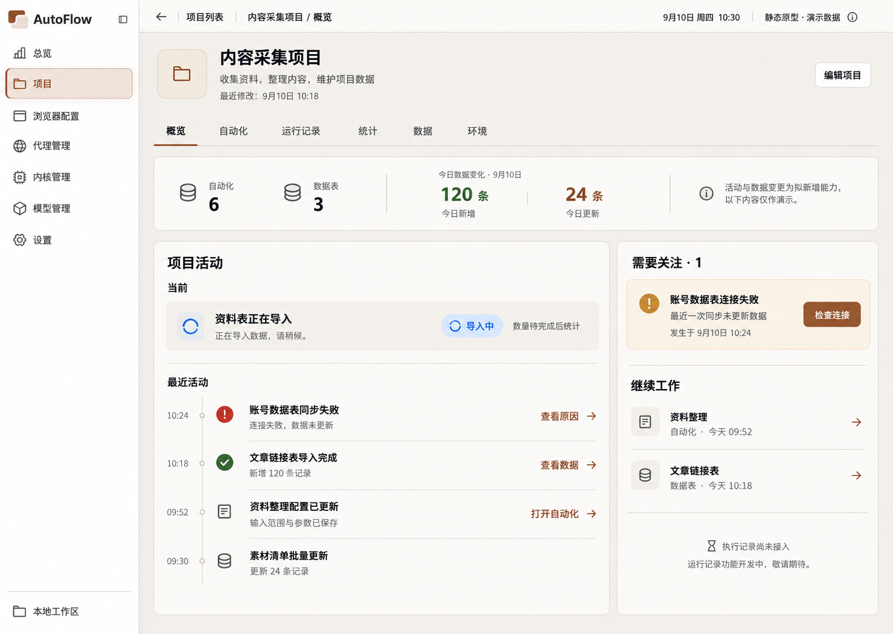
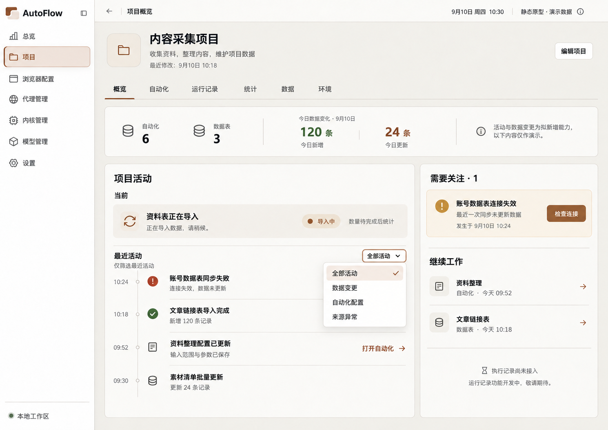
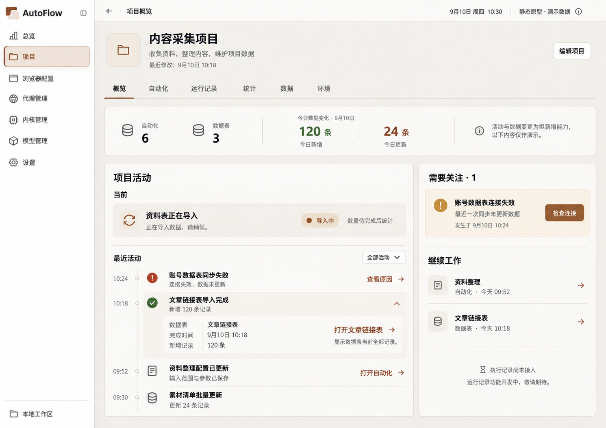
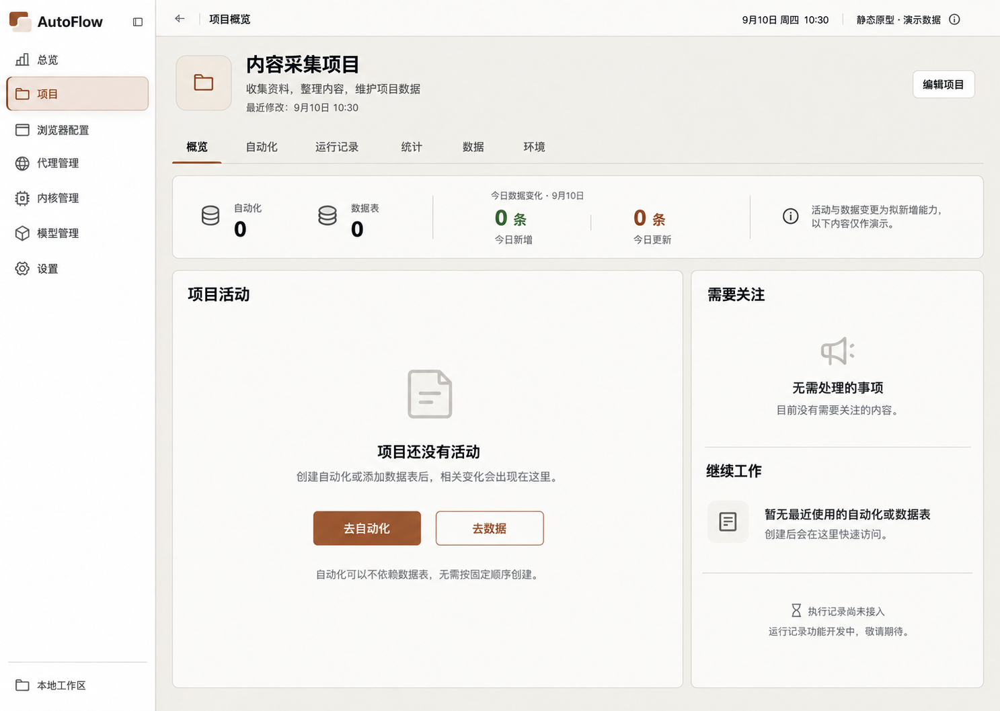
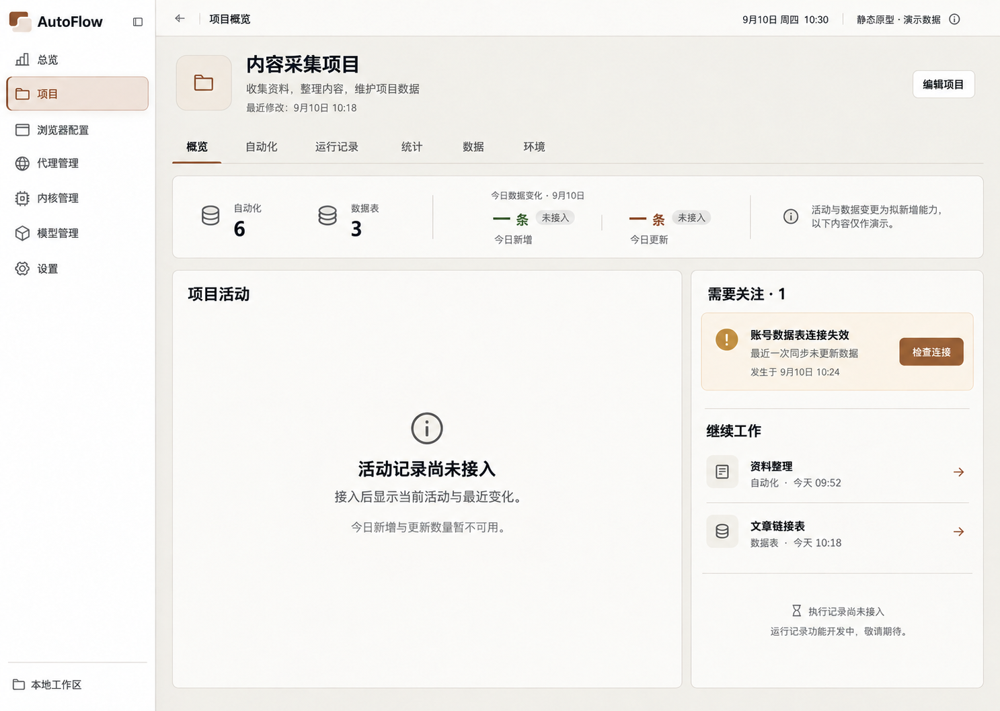
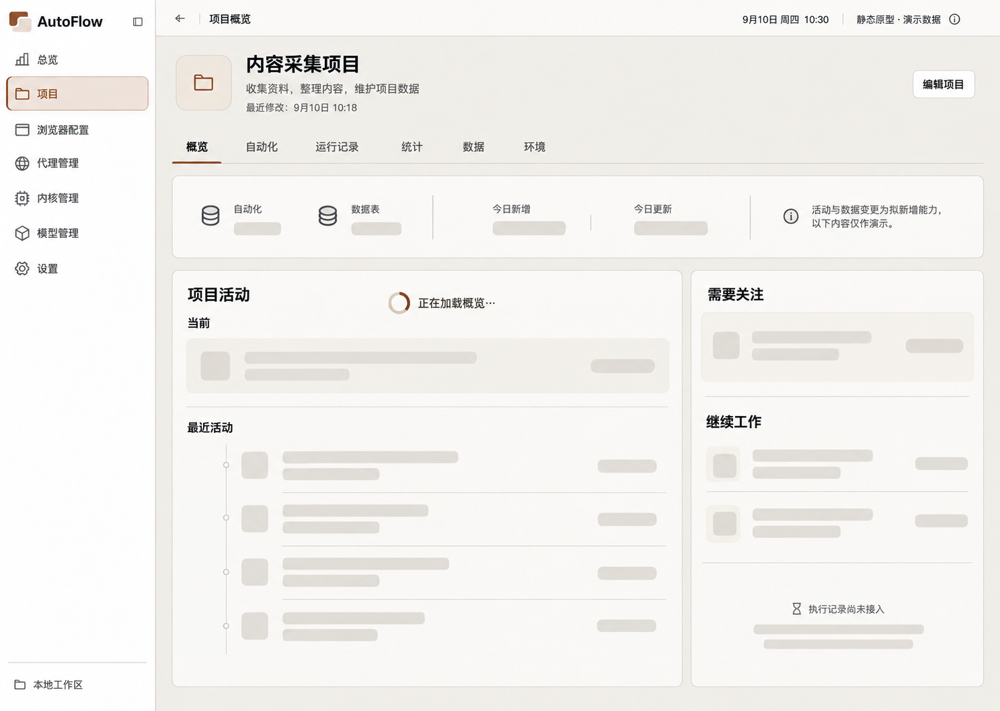
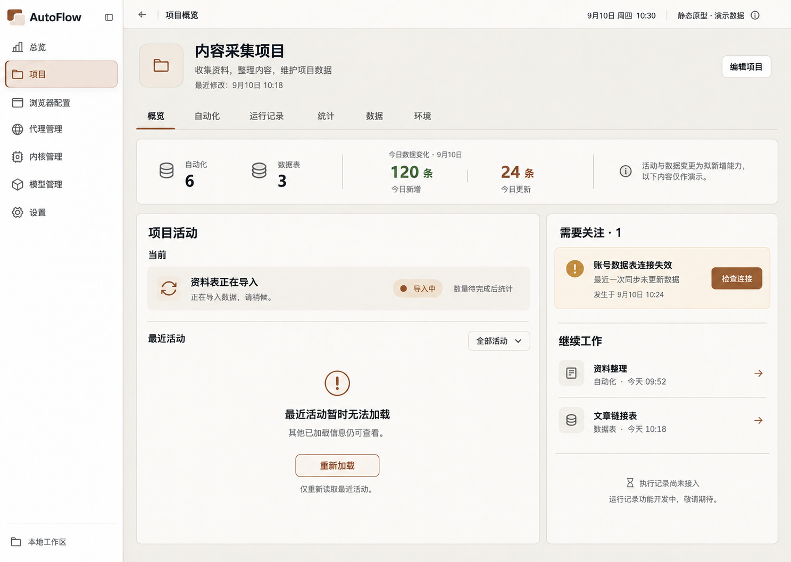
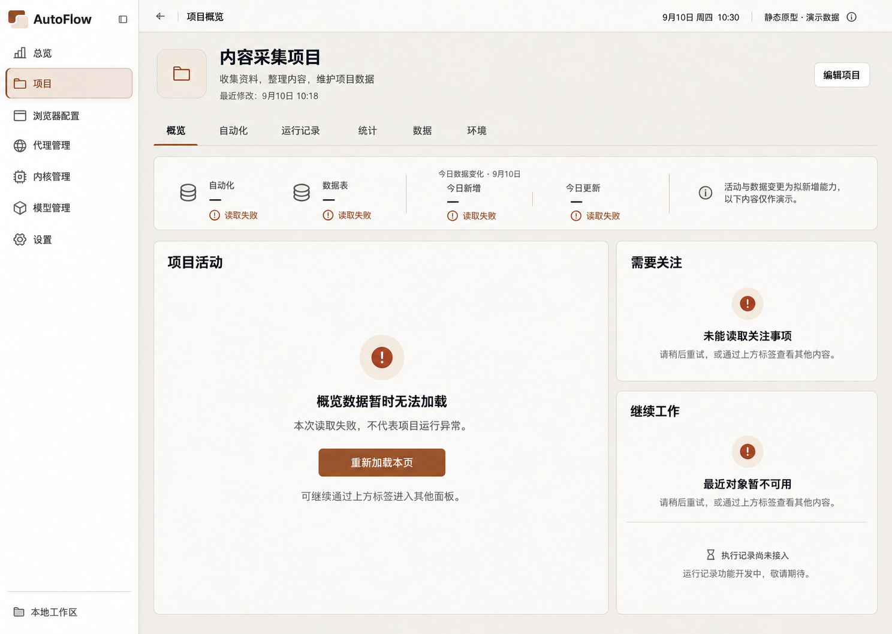
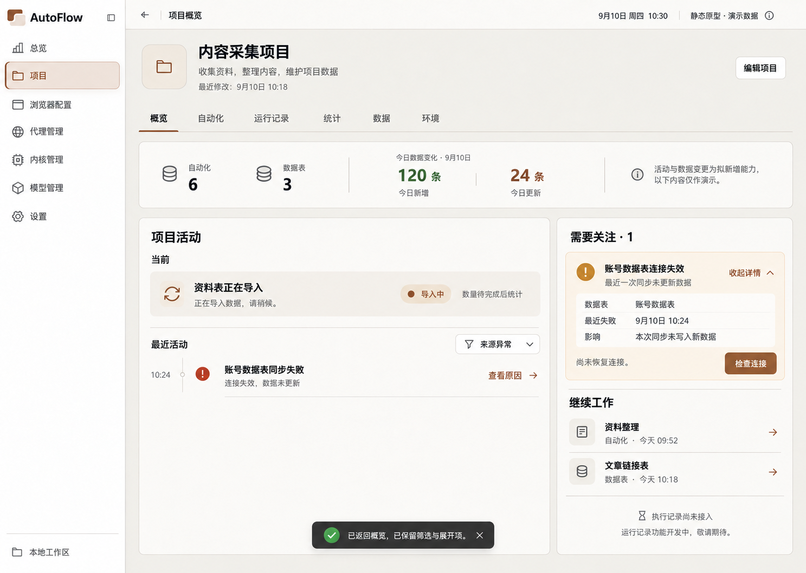

# 概览原型图

当前阅读集：9 张。图像原样复制；候选不等于已确认。

[返回总索引](../../README.md)

## 概览主页 · 公共控件修订

2026-09-10 · v1 · 修订候选；未找到批准记录

[打开原尺寸](001-overview-cd1094.png) · `1489 × 1056`

来源：`02-refinement-20260910/shared-controls-v1/01-overview.png`

## 活动筛选

2026-09-10 · v1 · 旧审查快照；原归档标记当前有效，不等于新 AutoFlow 已批准

[打开原尺寸](002-activity-filter-b960a7.png) · `1490 × 1056`

来源：`00-initial-design/overview-interaction-states-v1/01-activity-filter.png`

## 活动展开

2026-09-10 · v1 · 旧审查快照；原归档标记当前有效，不等于新 AutoFlow 已批准

[打开原尺寸](003-activity-expanded-734910.png) · `1491 × 1055`

来源：`00-initial-design/overview-interaction-states-v1/02-activity-expanded.png`

## 新项目空态

2026-09-10 · v1 · 旧审查快照；原归档标记当前有效，不等于新 AutoFlow 已批准

[打开原尺寸](004-new-project-empty-c2947a.png) · `1487 × 1058`

来源：`00-initial-design/overview-interaction-states-v1/03-new-project-empty.png`

## 能力不可用

2026-09-10 · v1 · 旧审查快照；原归档标记当前有效，不等于新 AutoFlow 已批准

[打开原尺寸](005-capability-unavailable-e8dc42.png) · `1487 × 1058`

来源：`00-initial-design/overview-interaction-states-v1/04-capability-unavailable.png`

## 初次加载

2026-09-10 · v1 · 旧审查快照；原归档标记当前有效，不等于新 AutoFlow 已批准

[打开原尺寸](006-initial-loading-6d99f9.png) · `1487 × 1058`

来源：`00-initial-design/overview-interaction-states-v1/05-initial-loading.png`

## 活动加载失败

2026-09-10 · v1 · 旧审查快照；原归档标记当前有效，不等于新 AutoFlow 已批准

[打开原尺寸](007-activity-load-error-cae7e1.png) · `1487 × 1058`

来源：`00-initial-design/overview-interaction-states-v1/06-activity-load-error.png`

## 概览加载失败

2026-09-10 · v1 · 旧审查快照；原归档标记当前有效，不等于新 AutoFlow 已批准

[打开原尺寸](008-overview-load-error-7d3ff7.png) · `1488 × 1057`

来源：`00-initial-design/overview-interaction-states-v1/07-overview-load-error.png`

## 关注事项返回

2026-09-10 · v1 · 旧审查快照；原归档标记当前有效，不等于新 AutoFlow 已批准

[打开原尺寸](009-attention-return-bfd624.png) · `1487 × 1058`

来源：`00-initial-design/overview-interaction-states-v1/08-attention-return.png`
