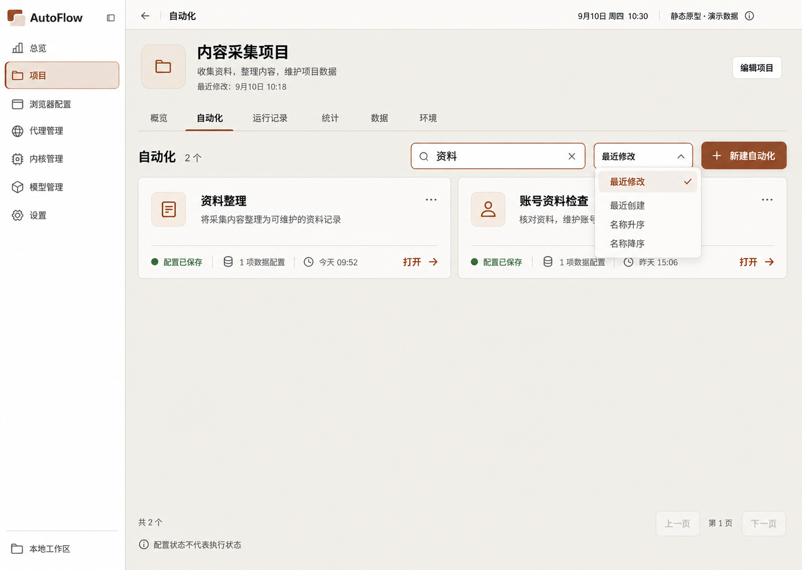
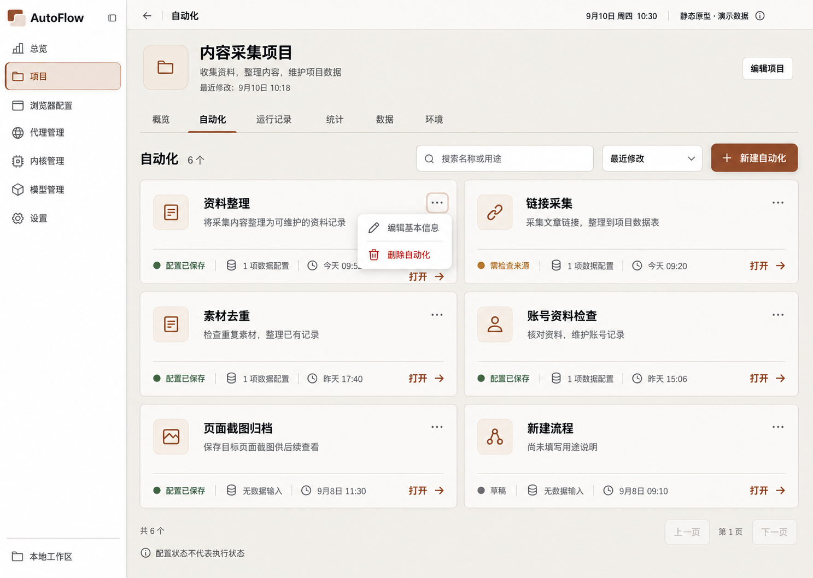
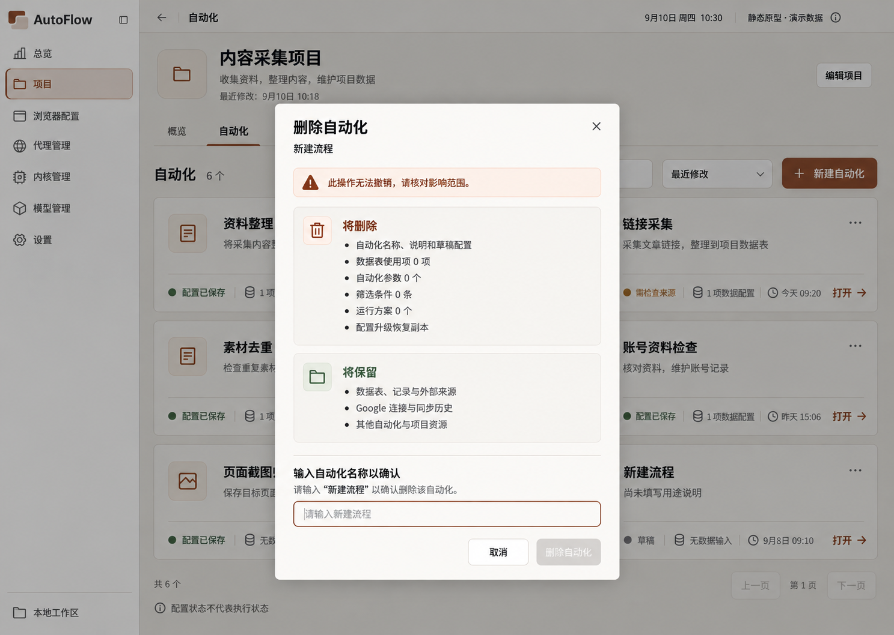
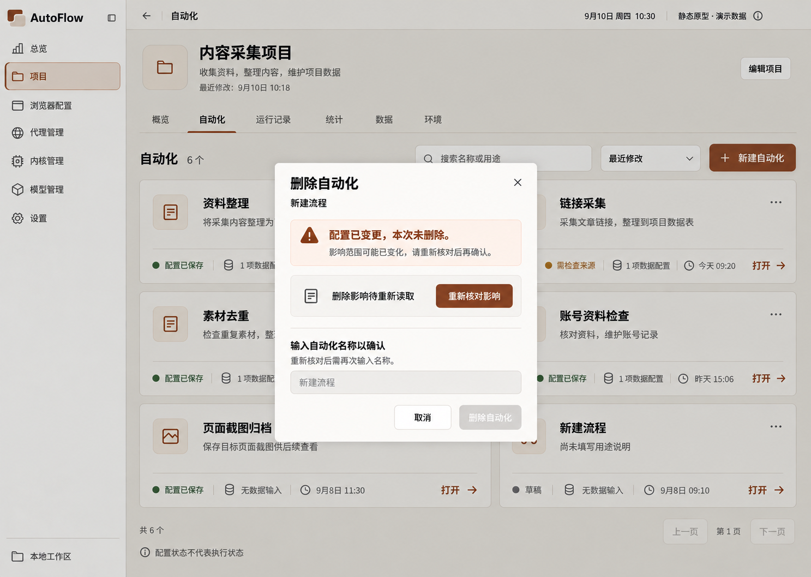
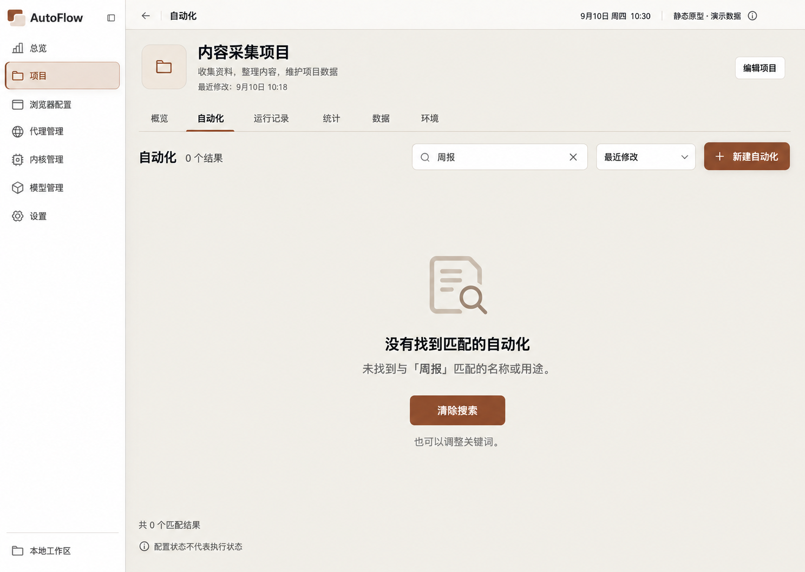
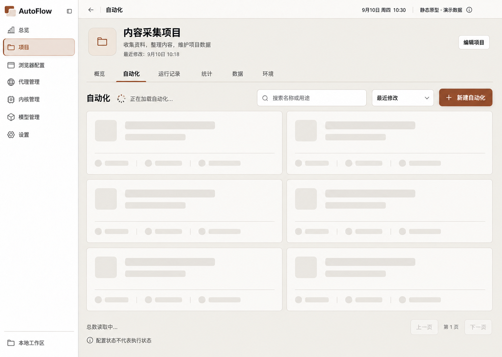
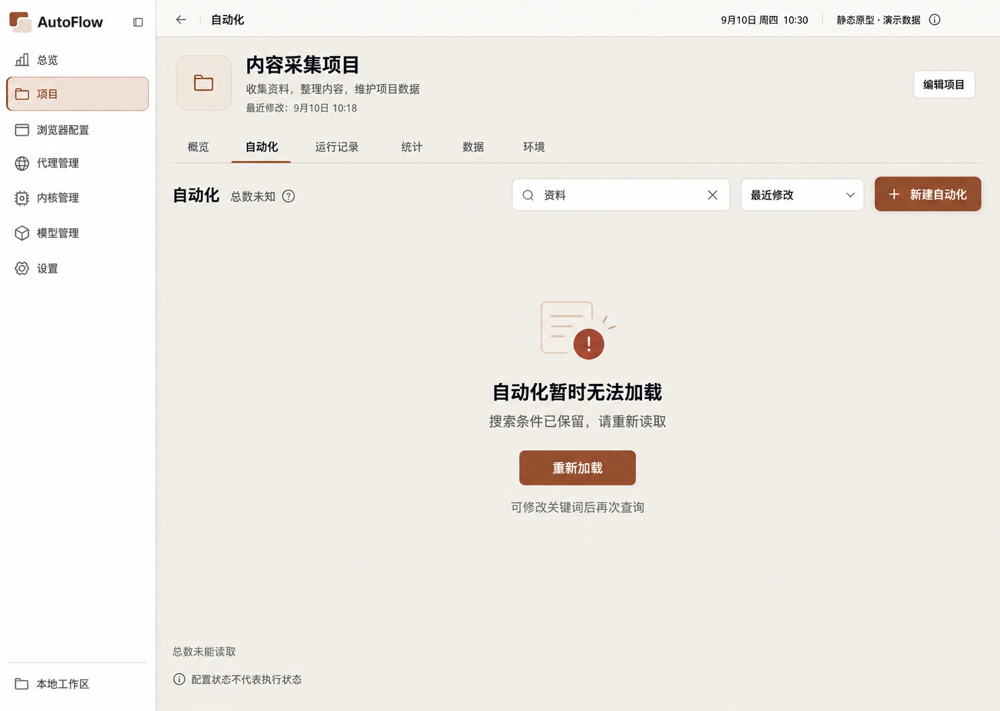
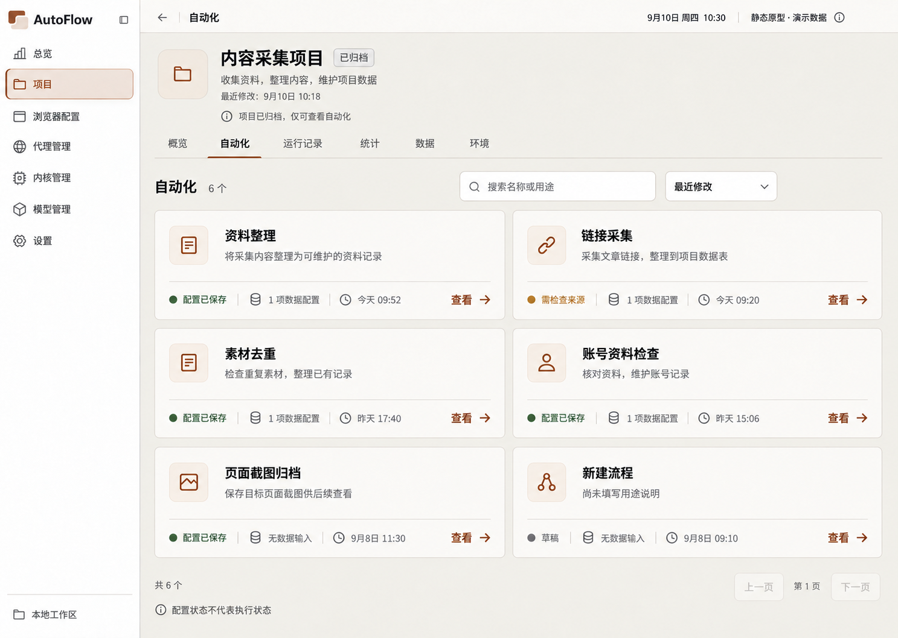
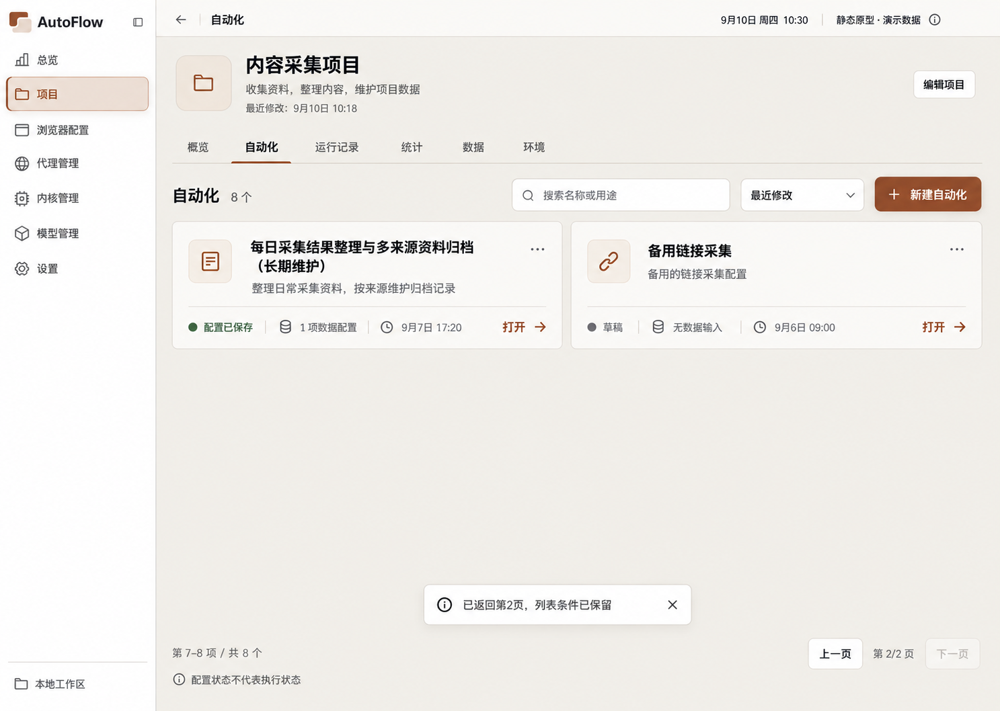

# 自动化原型图

当前阅读集：11 张。图像原样复制；候选不等于已确认。

[返回总索引](../../README.md)

## 自动化列表

2026-09-10 · v1 · 旧审查快照；原归档标记当前有效，不等于新 AutoFlow 已批准

[打开原尺寸](001-automation-v1-approved-a45201.png) · `1487 × 1058`

来源：`00-initial-design/automation-v1/automation-v1-approved.png`

## 搜索与排序

2026-09-10 · v1 · 旧审查快照；原归档标记当前有效，不等于新 AutoFlow 已批准

[打开原尺寸](002-search-sort-7bda39.png) · `1487 × 1058`

来源：`00-initial-design/automation-v1/interaction-states/01-search-sort.png`

## 更多操作菜单

2026-09-10 · v1 · 旧审查快照；原归档标记当前有效，不等于新 AutoFlow 已批准

[打开原尺寸](003-more-menu-79f558.png) · `1487 × 1058`

来源：`00-initial-design/automation-v1/interaction-states/02-more-menu.png`

## 删除确认

2026-09-10 · v1 · 旧审查快照；原归档标记当前有效，不等于新 AutoFlow 已批准

[打开原尺寸](004-delete-confirm-54c904.png) · `1487 × 1058`

来源：`00-initial-design/automation-v1/interaction-states/03-delete-confirm.png`

## 删除冲突

2026-09-10 · v1 · 旧审查快照；原归档标记当前有效，不等于新 AutoFlow 已批准

[打开原尺寸](005-delete-conflict-eb1bd0.png) · `1487 × 1058`

来源：`00-initial-design/automation-v1/interaction-states/04-delete-conflict.png`

## 自动化空态 · 公共控件修订

2026-09-10 · v1 · 修订候选；未找到批准记录

[打开原尺寸](006-automation-empty-695f71.png) · `1489 × 1056`

来源：`02-refinement-20260910/shared-controls-v1/02-automation-empty.png`

## 无匹配结果

2026-09-10 · v1 · 旧审查快照；原归档标记当前有效，不等于新 AutoFlow 已批准

[打开原尺寸](007-no-results-8f42cb.png) · `1487 × 1058`

来源：`00-initial-design/automation-v1/interaction-states/06-no-results.png`

## 加载中

2026-09-10 · v1 · 旧审查快照；原归档标记当前有效，不等于新 AutoFlow 已批准

[打开原尺寸](008-loading-95c1cb.png) · `1487 × 1058`

来源：`00-initial-design/automation-v1/interaction-states/07-loading.png`

## 加载失败

2026-09-10 · v1 · 旧审查快照；原归档标记当前有效，不等于新 AutoFlow 已批准

[打开原尺寸](009-load-error-b0e31b.png) · `1487 × 1058`

来源：`00-initial-design/automation-v1/interaction-states/08-load-error.png`

## 归档只读

2026-09-10 · v1 · 旧审查快照；原归档标记当前有效，不等于新 AutoFlow 已批准

[打开原尺寸](010-archived-readonly-46a6a4.png) · `1487 × 1058`

来源：`00-initial-design/automation-v1/interaction-states/09-archived-readonly.png`

## 返回列表恢复

2026-09-10 · v1 · 旧审查快照；原归档标记当前有效，不等于新 AutoFlow 已批准

[打开原尺寸](011-page-return-6939c7.png) · `1487 × 1058`

来源：`00-initial-design/automation-v1/interaction-states/10-page-return.png`
