# 运行记录与人工处理原型图

当前阅读集：21 张。图像原样复制；候选不等于已确认。

[返回总索引](../../README.md)

## 运行批次列表

2026-09-10 · v1 · 旧审查快照；原归档标记当前有效，不等于新 AutoFlow 已批准

[打开原尺寸](001-run-records-v1-approved-2cd367.png) · `1487 × 1058`

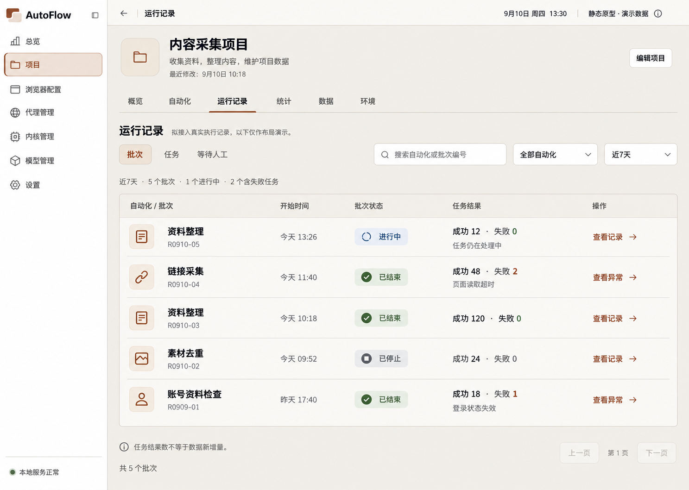

来源：`00-initial-design/run-records-v1/run-records-v1-approved.png`

## 任务列表

2026-09-10 · v2 · 旧审查快照；原归档标记当前有效，不等于新 AutoFlow 已批准

[打开原尺寸](002-task-list-approved-9a81f1.png) · `1488 × 1057`

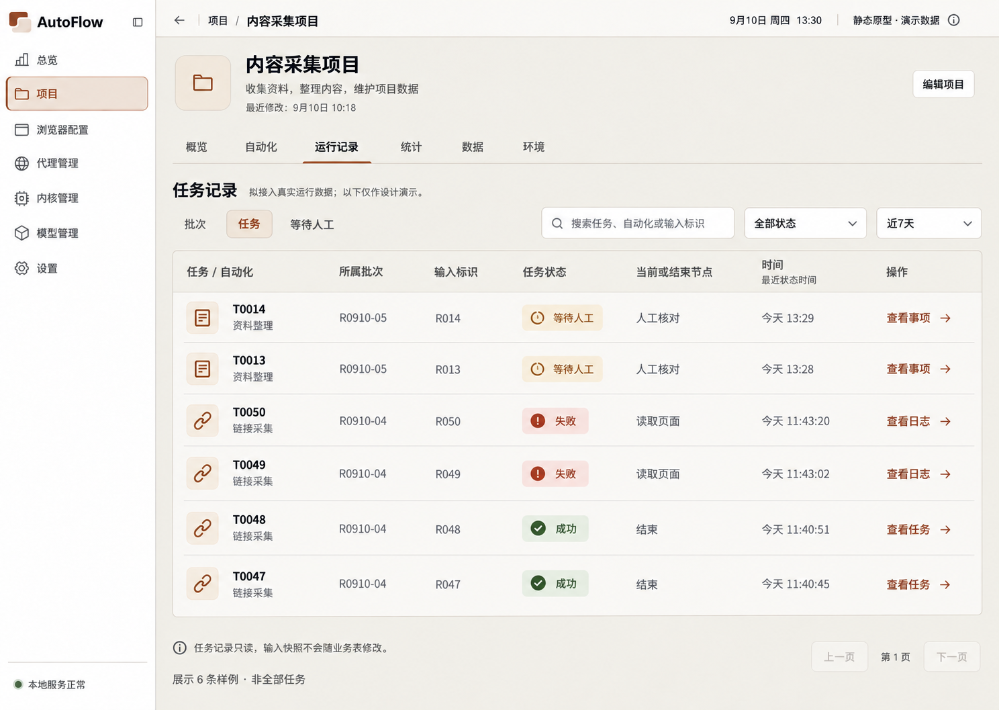

来源：`00-initial-design/run-records-v1/selection-v2-20260910/01-task-list-approved.png`

## 等待人工列表

2026-09-10 · v2 · 旧审查快照；原归档标记当前有效，不等于新 AutoFlow 已批准

[打开原尺寸](003-manual-list-selected-v2-09ab4d.png) · `1486 × 1058`

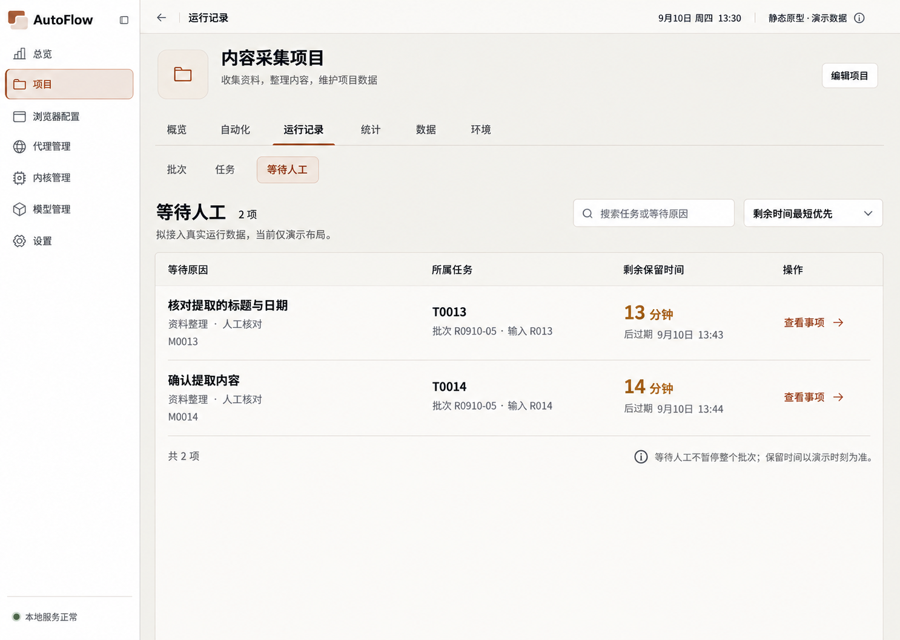

来源：`00-initial-design/run-records-v1/selection-v2-20260910/02-manual-list-selected-v2.png`

## 批次详情

2026-09-10 · v2 · 旧审查快照；原归档标记当前有效，不等于新 AutoFlow 已批准

[打开原尺寸](004-batch-detail-approved-459f25.png) · `1487 × 1058`

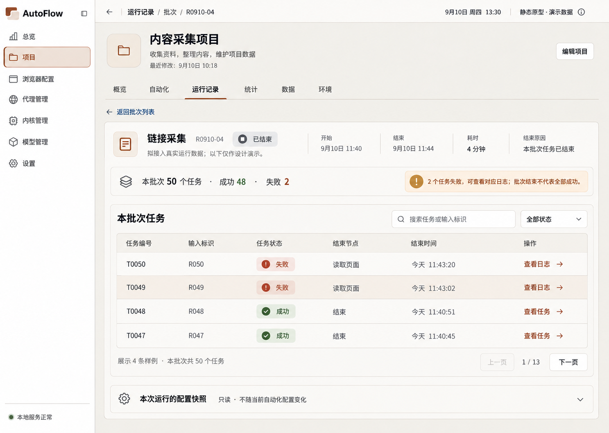

来源：`00-initial-design/run-records-v1/selection-v2-20260910/03-batch-detail-approved.png`

## 任务历史日志 · 公共控件修订

2026-09-10 · v1 · 修订候选；未找到批准记录

[打开原尺寸](005-task-log-510347.png) · `1489 × 1056`

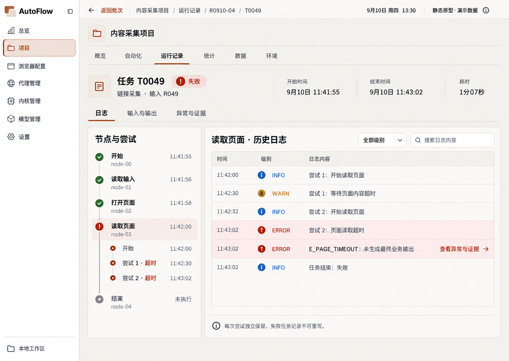

来源：`02-refinement-20260910/shared-controls-v1/03-task-log.png`

## 任务输入与输出

2026-09-10 · v2 · 旧审查快照；原归档标记当前有效，不等于新 AutoFlow 已批准

[打开原尺寸](006-task-input-output-approved-7af0aa.png) · `1487 × 1058`

来源：`00-initial-design/run-records-v1/selection-v2-20260910/05-task-input-output-approved.png`

## 任务异常与证据

2026-09-10 · v2 · 旧审查快照；原归档标记当前有效，不等于新 AutoFlow 已批准

[打开原尺寸](007-task-exception-evidence-approved-559ddf.png) · `1487 × 1058`

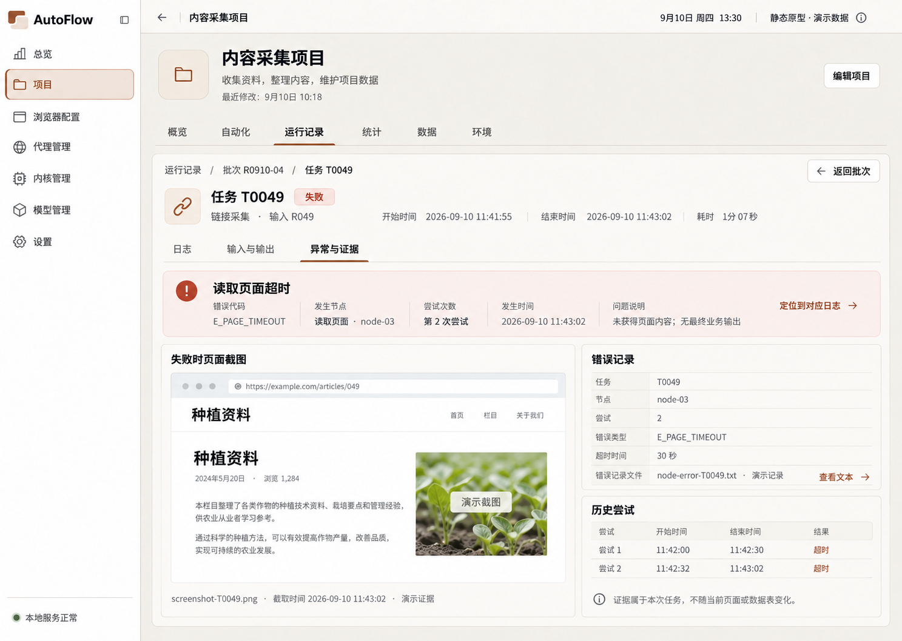

来源：`00-initial-design/run-records-v1/selection-v2-20260910/06-task-exception-evidence-approved.png`

## 人工处理详情

2026-09-10 · v2 · 旧审查快照；原归档标记当前有效，不等于新 AutoFlow 已批准

[打开原尺寸](008-manual-detail-v2-approved-d5f491.png) · `1487 × 1058`

来源：`00-initial-design/run-records-v1/manual-detail-v2-approved/manual-detail-v2-approved.png`

## 任务筛选

2026-09-10 · v1 · 旧审查快照；原归档标记当前有效，不等于新 AutoFlow 已批准

[打开原尺寸](009-task-filter-cfe619.png) · `1487 × 1058`

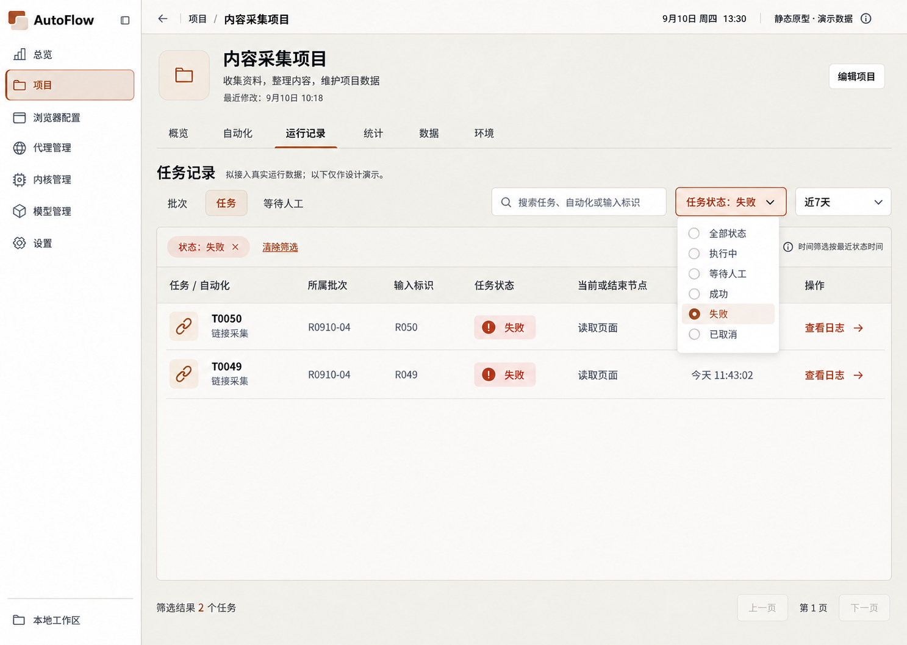

来源：`00-initial-design/run-records-v1/interaction-states-v1/01-task-filter.png`

## 能力不可用

2026-09-10 · v1 · 旧审查快照；原归档标记当前有效，不等于新 AutoFlow 已批准

[打开原尺寸](010-capability-unavailable-7c122b.png) · `1487 × 1058`

来源：`00-initial-design/run-records-v1/interaction-states-v1/02-capability-unavailable.png`

## 运行记录空态

2026-09-10 · v1 · 旧审查快照；原归档标记当前有效，不等于新 AutoFlow 已批准

[打开原尺寸](011-empty-a916de.png) · `1487 × 1058`

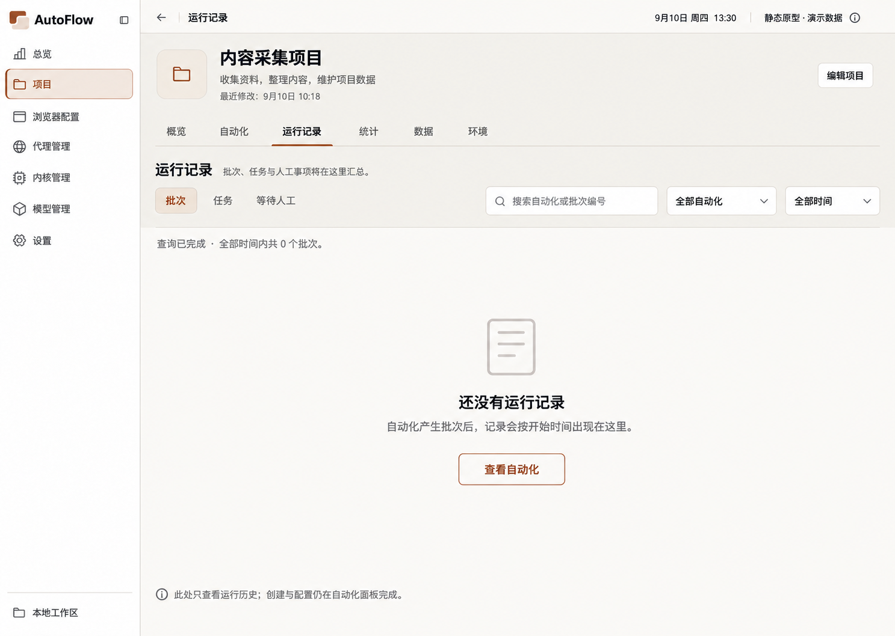

来源：`00-initial-design/run-records-v1/interaction-states-v1/03-empty.png`

## 无匹配结果

2026-09-10 · v1 · 旧审查快照；原归档标记当前有效，不等于新 AutoFlow 已批准

[打开原尺寸](012-no-results-8f158b.png) · `1487 × 1058`

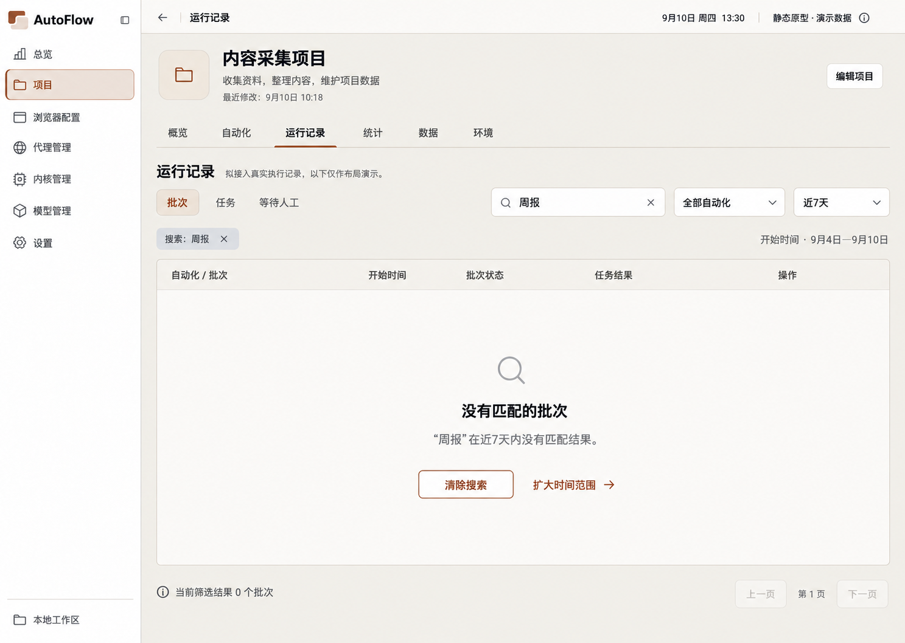

来源：`00-initial-design/run-records-v1/interaction-states-v1/04-no-results.png`

## 加载中

2026-09-10 · v1 · 旧审查快照；原归档标记当前有效，不等于新 AutoFlow 已批准

[打开原尺寸](013-loading-b84d0e.png) · `1487 × 1058`

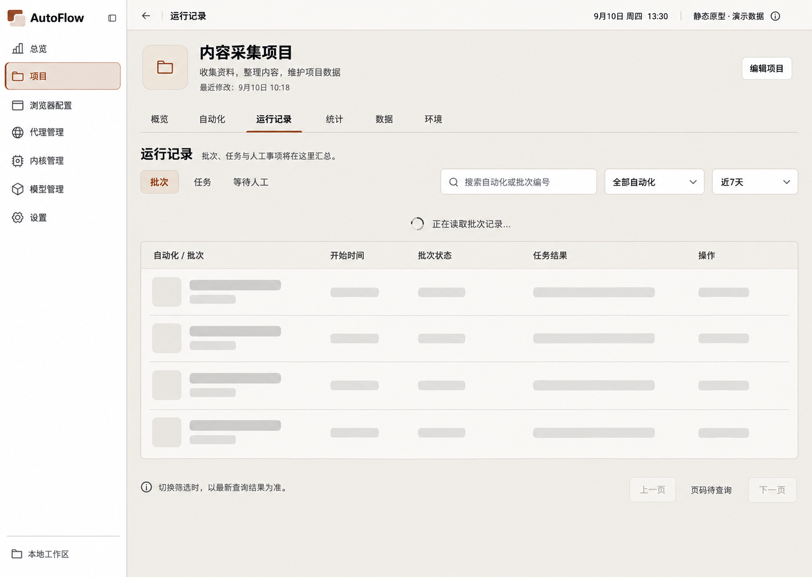

来源：`00-initial-design/run-records-v1/interaction-states-v1/05-loading.png`

## 刷新失败

2026-09-10 · v1 · 旧审查快照；原归档标记当前有效，不等于新 AutoFlow 已批准

[打开原尺寸](014-refresh-error-28344b.png) · `1487 × 1058`

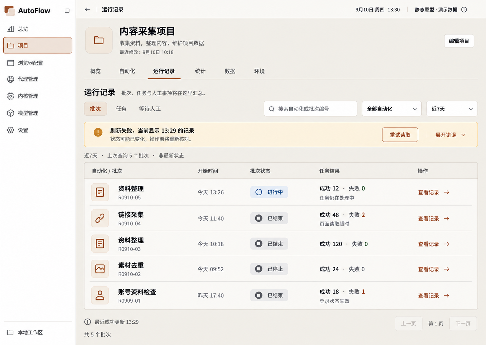

来源：`00-initial-design/run-records-v1/interaction-states-v1/06-refresh-error.png`

## 停止确认

2026-09-10 · v1 · 旧审查快照；原归档标记当前有效，不等于新 AutoFlow 已批准

[打开原尺寸](015-stop-confirm-e79f81.png) · `1487 × 1058`

来源：`00-initial-design/run-records-v1/interaction-states-v1/07-stop-confirm.png`

## 强制停止确认

2026-09-10 · v1 · 旧审查快照；原归档标记当前有效，不等于新 AutoFlow 已批准

[打开原尺寸](016-force-stop-confirm-00d61e.png) · `1487 × 1058`

来源：`00-initial-design/run-records-v1/interaction-states-v1/08-force-stop-confirm.png`

## 运行中任务日志

2026-09-10 · v1 · 旧审查快照；原归档标记当前有效，不等于新 AutoFlow 已批准

[打开原尺寸](017-running-task-logs-d5287c.png) · `1487 × 1058`

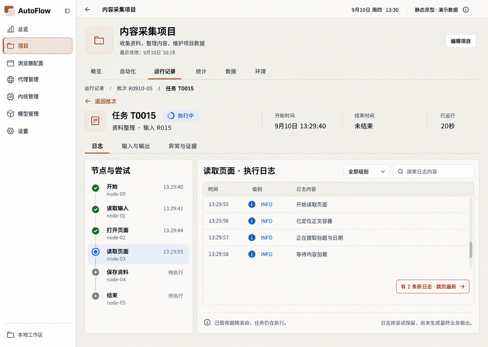

来源：`00-initial-design/run-records-v1/interaction-states-v1/09-running-task-logs.png`

## 人工检查失败

2026-09-10 · v1 · 旧审查快照；原归档标记当前有效，不等于新 AutoFlow 已批准

[打开原尺寸](018-manual-check-failed-85b8b5.png) · `1487 × 1058`

来源：`00-initial-design/run-records-v1/interaction-states-v1/10-manual-check-failed.png`

## 人工完成确认

2026-09-10 · v1 · 旧审查快照；原归档标记当前有效，不等于新 AutoFlow 已批准

[打开原尺寸](019-manual-complete-confirm-919ab5.png) · `1487 × 1058`

来源：`00-initial-design/run-records-v1/interaction-states-v1/11-manual-complete-confirm.png`

## 人工等待过期

2026-09-10 · v1 · 旧审查快照；原归档标记当前有效，不等于新 AutoFlow 已批准

[打开原尺寸](020-manual-expired-98016b.png) · `1487 × 1058`

来源：`00-initial-design/run-records-v1/interaction-states-v1/12-manual-expired.png`

## 证据缺失

2026-09-10 · v1 · 旧审查快照；原归档标记当前有效，不等于新 AutoFlow 已批准

[打开原尺寸](021-evidence-missing-f523b7.png) · `1487 × 1058`

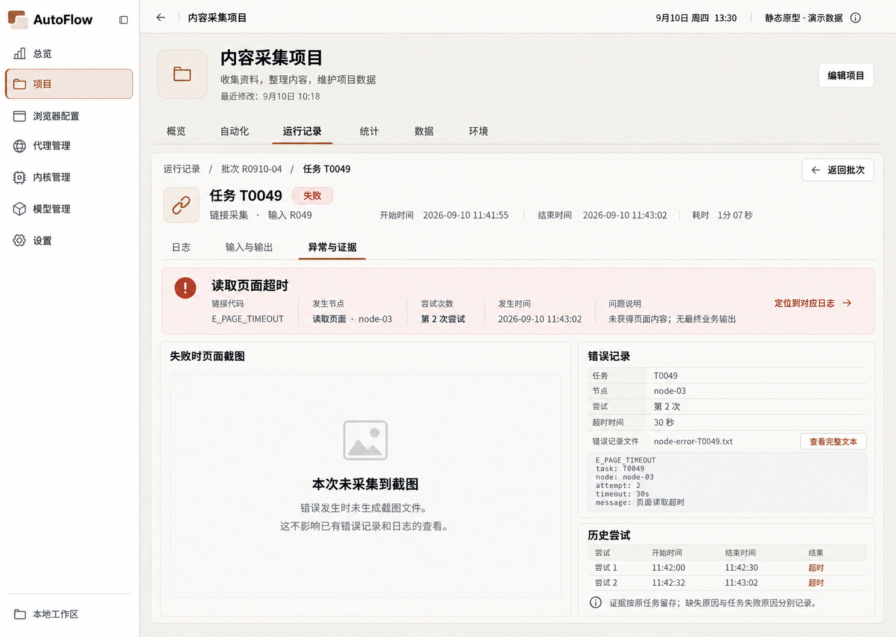

来源：`00-initial-design/run-records-v1/interaction-states-v1/13-evidence-missing.png`
