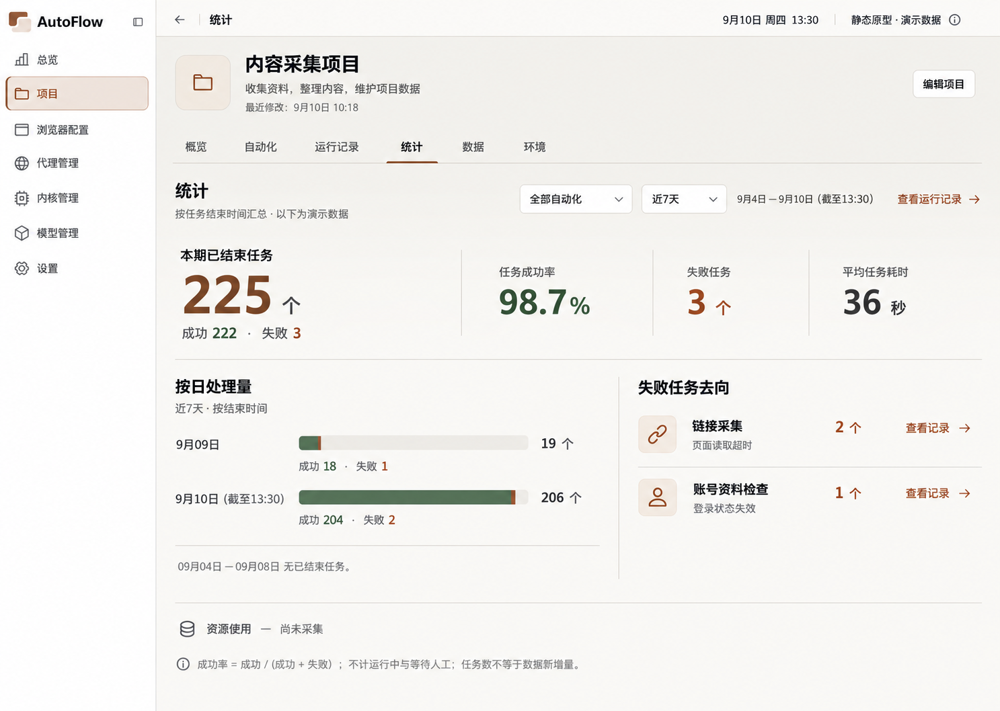
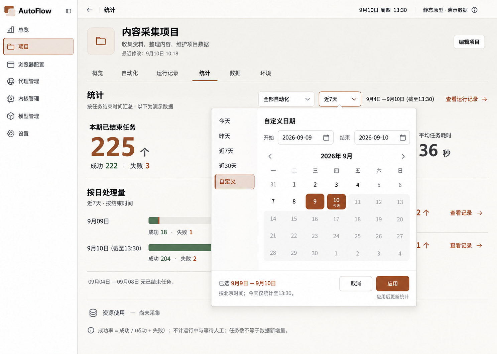
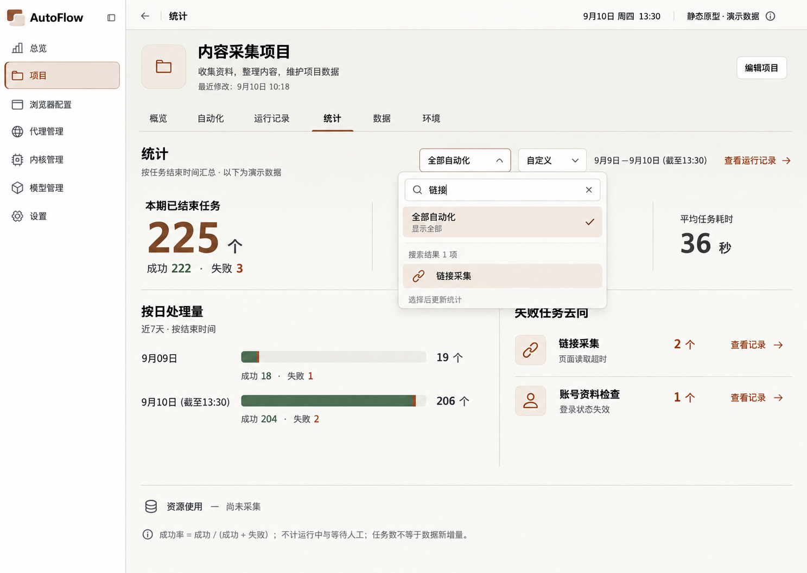
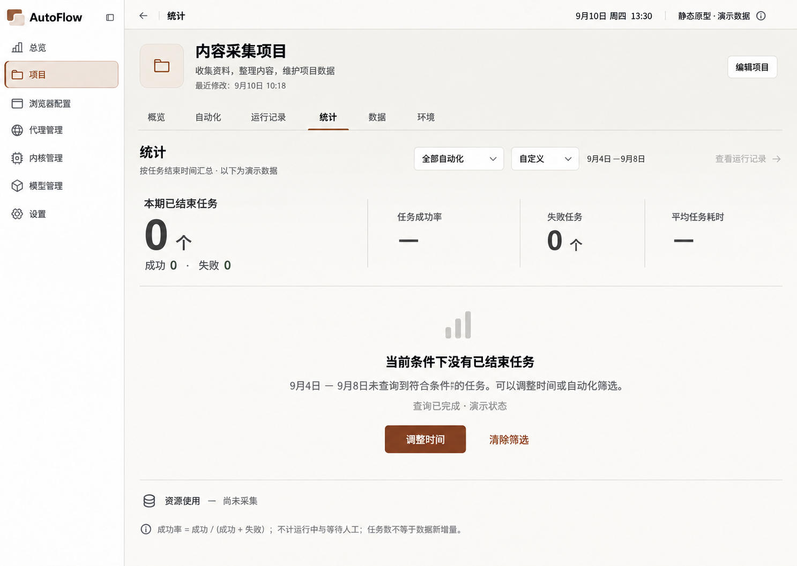
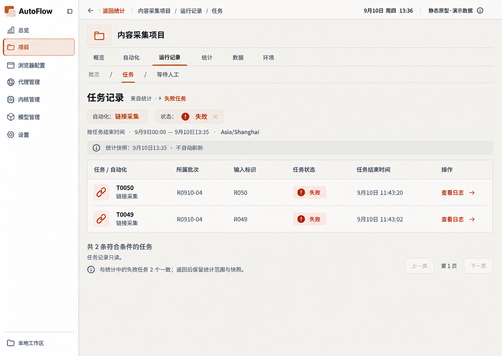
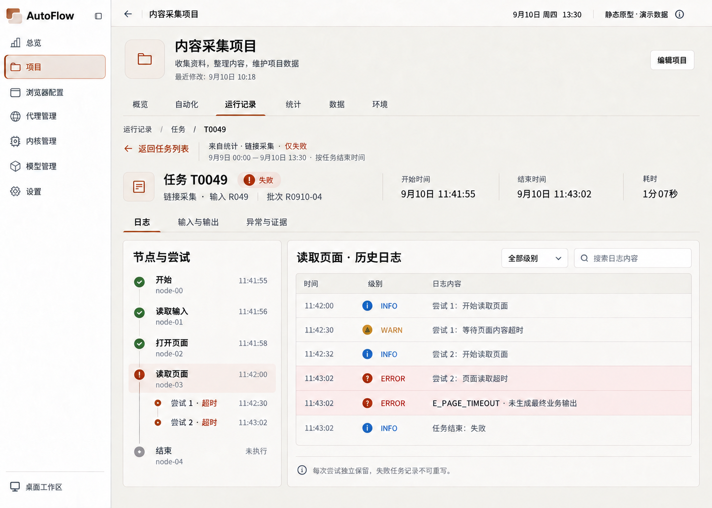
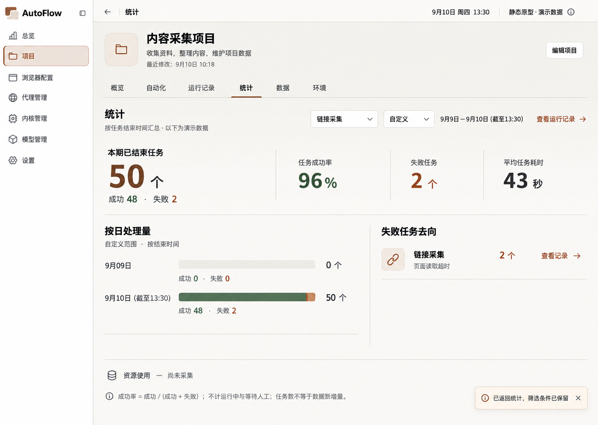
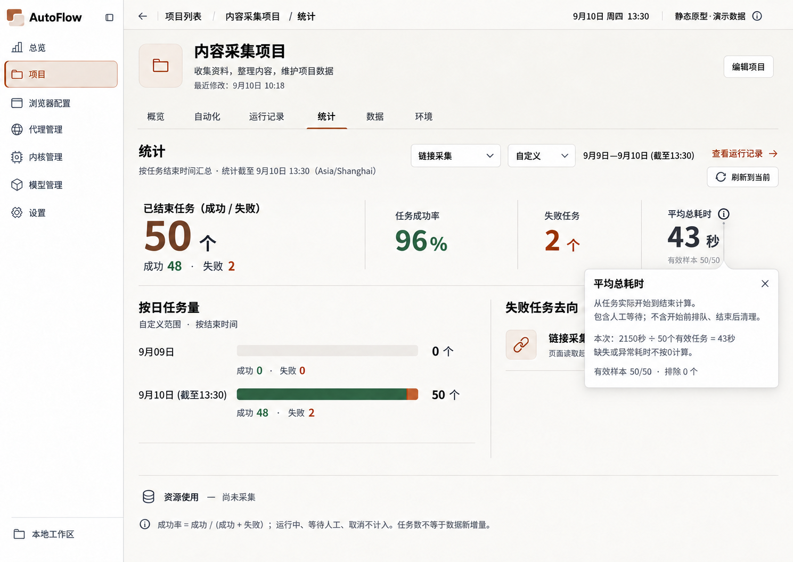
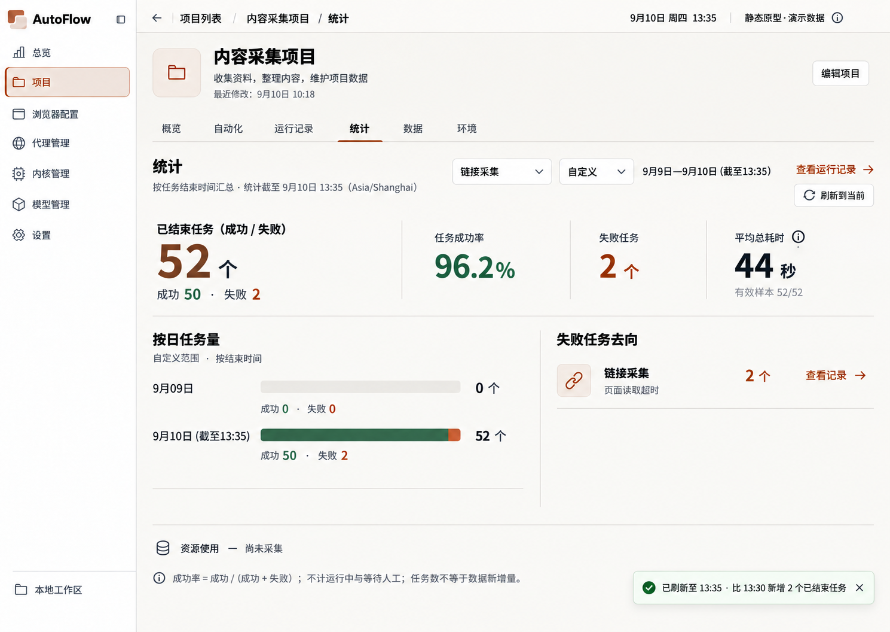

# 统计原型图

当前阅读集：11 张。图像原样复制；候选不等于已确认。

[返回总索引](../../README.md)

## 统计主页

2026-09-10 · v1 · 旧审查快照；原归档标记当前有效，不等于新 AutoFlow 已批准

[打开原尺寸](001-statistics-v1-approved-14eafd.png) · `1487 × 1058`

来源：`00-initial-design/statistics-v1-approved/statistics-v1-approved.png`

## 日期范围

2026-09-10 · v1 · 旧审查快照；原归档标记当前有效，不等于新 AutoFlow 已批准

[打开原尺寸](002-date-range-eaef3a.png) · `1487 × 1058`

来源：`00-initial-design/statistics-v1-approved/interaction-states/01-date-range.png`

## 自动化筛选

2026-09-10 · v1 · 旧审查快照；原归档标记当前有效，不等于新 AutoFlow 已批准

[打开原尺寸](003-automation-filter-916059.png) · `1487 × 1058`

来源：`00-initial-design/statistics-v1-approved/interaction-states/02-automation-filter.png`

## 统计空态

2026-09-10 · v1 · 旧审查快照；原归档标记当前有效，不等于新 AutoFlow 已批准

[打开原尺寸](004-empty-6704bb.png) · `1487 × 1058`

来源：`00-initial-design/statistics-v1-approved/interaction-states/03-empty.png`

## 加载中

2026-09-10 · v1 · 旧审查快照；原归档标记当前有效，不等于新 AutoFlow 已批准

[打开原尺寸](005-loading-ba3147.png) · `1487 × 1058`

来源：`00-initial-design/statistics-v1-approved/interaction-states/04-loading.png`

## 统计加载失败 · 公共控件修订

2026-09-10 · v1 · 修订候选；未找到批准记录

[打开原尺寸](006-statistics-error-2a8897.png) · `1489 × 1056`

来源：`02-refinement-20260910/shared-controls-v1/04-statistics-error.png`

## 统计快照下钻任务

2026-09-10 · v2 · 修订候选；未找到批准记录

[打开原尺寸](007-frozen-drilldown-00b0db.png) · `1489 × 1056`

来源：`02-refinement-20260910/statistics-rules-v2/03-frozen-drilldown.png`

## 任务详情返回

2026-09-10 · v1 · 旧审查快照；原归档标记当前有效，不等于新 AutoFlow 已批准

[打开原尺寸](008-task-detail-return-e91144.png) · `1484 × 1060`

来源：`00-initial-design/statistics-v1-approved/interaction-states/07-task-detail-return.png`

## 返回统计恢复条件

2026-09-10 · v1 · 旧审查快照；原归档标记当前有效，不等于新 AutoFlow 已批准

[打开原尺寸](009-statistics-restored-dde8ef.png) · `1487 × 1058`

来源：`00-initial-design/statistics-v1-approved/interaction-states/08-statistics-restored.png`

## 统计指标口径说明

2026-09-10 · v2 · 修订候选；未找到批准记录

[打开原尺寸](100-metric-definition-8036c5.png) · `1489 × 1056`

来源：`02-refinement-20260910/statistics-rules-v2/01-metric-definition.png`

## 刷新到当前后的统计汇总

2026-09-10 · v2 · 修订候选；未找到批准记录

[打开原尺寸](100-refreshed-summary-b18988.png) · `1489 × 1056`

来源：`02-refinement-20260910/statistics-rules-v2/02-refreshed-summary.png`
