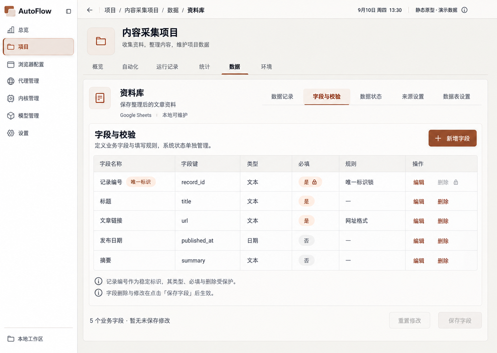
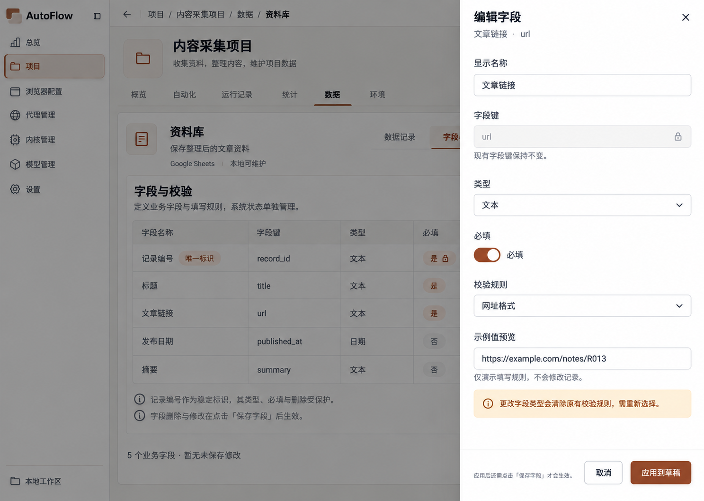
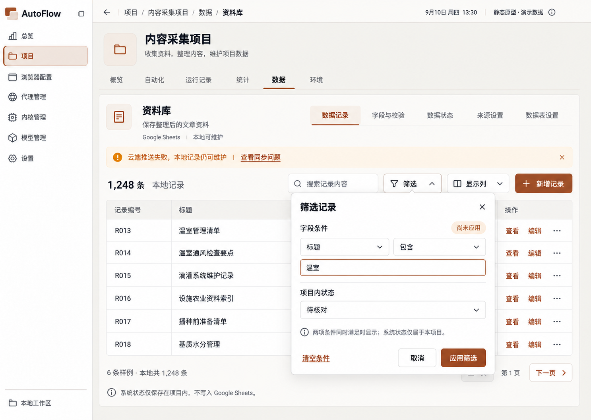
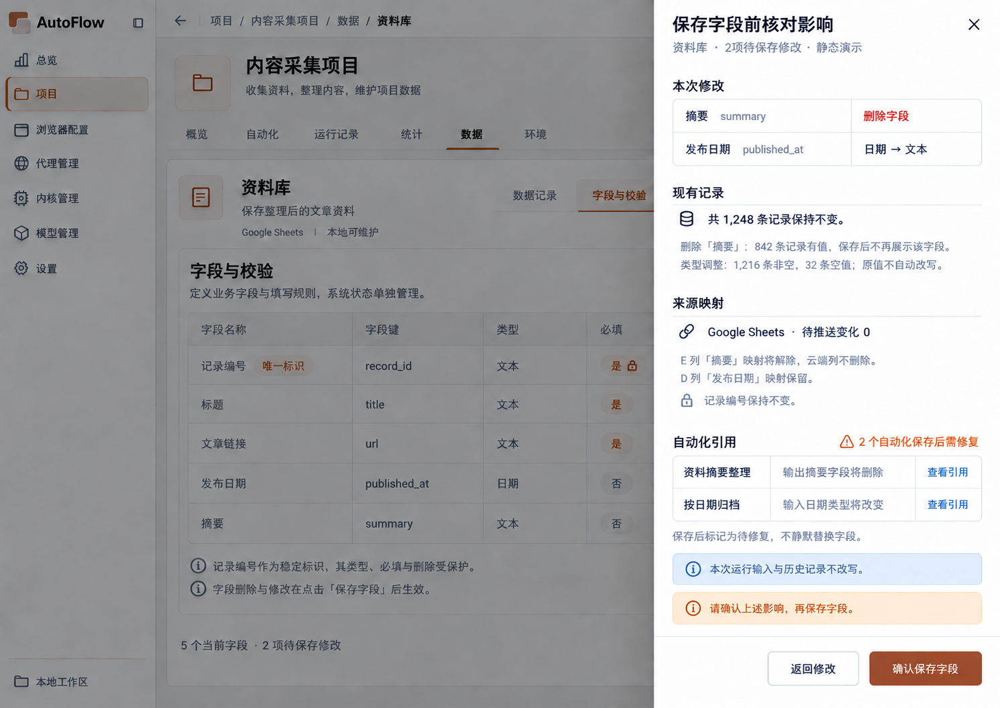
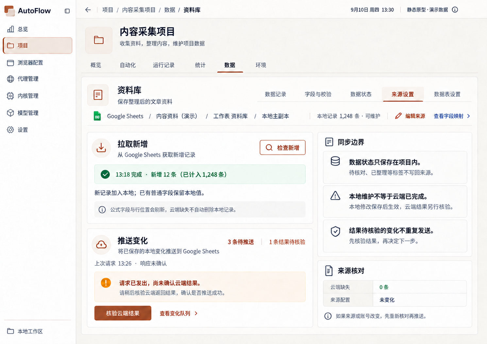

# 数据管理原型图

当前阅读集：19 张。图像原样复制；候选不等于已确认。

[返回总索引](../../README.md)

## 数据表目录

2026-09-10 · v1 · 旧审查快照；原归档标记当前有效，不等于新 AutoFlow 已批准

[打开原尺寸](001-data-v1-approved-ca940d.png) · `1487 × 1058`

来源：`00-initial-design/data-v1-approved/data-v1-approved.png`

## 记录列表

2026-09-10 · v1 · 旧审查快照；原归档标记当前有效，不等于新 AutoFlow 已批准

[打开原尺寸](002-records-c496e3.png) · `1487 × 1058`

来源：`00-initial-design/data-v1-approved/secondary-pages-v1/01-records.png`

## 记录详情与状态选择

2026-09-10 · v1 · 旧审查快照；原归档标记当前有效，不等于新 AutoFlow 已批准

[打开原尺寸](003-record-detail-d3f6c5.png) · `1487 × 1058`

来源：`00-initial-design/data-v1-approved/secondary-pages-v1/02-record-detail.png`

## 新增记录

2026-09-10 · v1 · 旧审查快照；原归档标记当前有效，不等于新 AutoFlow 已批准

[打开原尺寸](004-record-create-72de4a.png) · `1487 × 1058`

来源：`00-initial-design/data-v1-approved/secondary-pages-v1/03-record-create.png`

## 编辑记录与校验

2026-09-10 · v1 · 旧审查快照；原归档标记当前有效，不等于新 AutoFlow 已批准

[打开原尺寸](005-record-edit-validation-421c54.png) · `1486 × 1058`

来源：`00-initial-design/data-v1-approved/secondary-pages-v1/04-record-edit-validation.png`

## 未保存确认

2026-09-10 · v1 · 旧审查快照；原归档标记当前有效，不等于新 AutoFlow 已批准

[打开原尺寸](006-unsaved-changes-948956.png) · `1485 × 1059`

来源：`00-initial-design/data-v1-approved/secondary-pages-v1/05-unsaved-changes.png`

## 删除记录确认

2026-09-10 · v1 · 旧审查快照；原归档标记当前有效，不等于新 AutoFlow 已批准

[打开原尺寸](007-record-delete-confirm-76a0e5.png) · `1486 × 1058`

来源：`00-initial-design/data-v1-approved/secondary-pages-v1/06-record-delete-confirm.png`

## 字段列表

2026-09-10 · v1 · 旧审查快照；原归档标记当前有效，不等于新 AutoFlow 已批准

[打开原尺寸](008-fields-378eb2.png) · `1487 × 1058`

来源：`00-initial-design/data-v1-approved/secondary-pages-v1/07-fields.png`

## 字段编辑

2026-09-10 · v1 · 旧审查快照；原归档标记当前有效，不等于新 AutoFlow 已批准

[打开原尺寸](009-field-editor-c3de19.png) · `1487 × 1058`

来源：`00-initial-design/data-v1-approved/secondary-pages-v1/08-field-editor.png`

## 业务状态管理

2026-09-10 · v1 · 旧审查快照；原归档标记当前有效，不等于新 AutoFlow 已批准

[打开原尺寸](010-states-d59f55.png) · `1487 × 1058`

来源：`00-initial-design/data-v1-approved/secondary-pages-v1/09-states.png`

## Google Sheets 来源

2026-09-10 · v1 · 旧审查快照；原归档标记当前有效，不等于新 AutoFlow 已批准

[打开原尺寸](011-source-sheets-8e6927.png) · `1487 × 1058`

来源：`00-initial-design/data-v1-approved/secondary-pages-v1/10-source-sheets.png`

## Excel 来源

2026-09-10 · v1 · 旧审查快照；原归档标记当前有效，不等于新 AutoFlow 已批准

[打开原尺寸](012-source-excel-cf611c.png) · `1486 × 1059`

来源：`00-initial-design/data-v1-approved/secondary-pages-v1/11-source-excel.png`

## SQLite 来源（旧业务）

2026-09-10 · v1 · 旧审查快照；原归档标记当前有效，不等于新 AutoFlow 已批准

[打开原尺寸](013-source-sqlite-d81799.png) · `1486 × 1058`

来源：`00-initial-design/data-v1-approved/secondary-pages-v1/12-source-sqlite.png`

## 数据表设置

2026-09-10 · v1 · 旧审查快照；原归档标记当前有效，不等于新 AutoFlow 已批准

[打开原尺寸](014-table-settings-070d7f.png) · `1487 × 1058`

来源：`00-initial-design/data-v1-approved/secondary-pages-v1/13-table-settings.png`

## 删除数据表被阻止

2026-09-10 · v1 · 旧审查快照；原归档标记当前有效，不等于新 AutoFlow 已批准

[打开原尺寸](015-delete-table-blocked-2b8a64.png) · `1487 × 1058`

来源：`00-initial-design/data-v1-approved/secondary-pages-v1/14-delete-table-blocked.png`

## 新建数据表

2026-09-10 · v1 · 旧审查快照；原归档标记当前有效，不等于新 AutoFlow 已批准

[打开原尺寸](016-create-table-73d061.png) · `1487 × 1058`

来源：`00-initial-design/data-v1-approved/secondary-pages-v1/15-create-table.png`

## 记录筛选

2026-09-10 · v1 · 旧审查快照；原归档标记当前有效，不等于新 AutoFlow 已批准

[打开原尺寸](017-record-filter-672930.png) · `1487 × 1058`

来源：`00-initial-design/data-v1-approved/secondary-pages-v1/16-record-filter.png`

## 字段变更影响确认

2026-09-10 · v2 · 修订候选；未找到批准记录

[打开原尺寸](100-field-impact-eb086d.png) · `1490 × 1056`

来源：`02-refinement-20260910/data-rules-v2/02-field-impact.png`

## Sheets 拉取与推送方向

2026-09-10 · v2 · 修订候选；未找到批准记录

[打开原尺寸](100-sheets-directions-d6ac8c.png) · `1490 × 1056`

来源：`02-refinement-20260910/data-rules-v2/03-sheets-directions.png`
