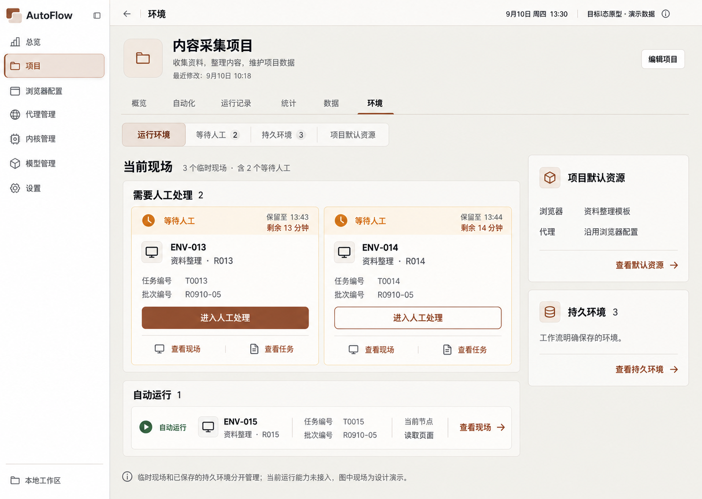
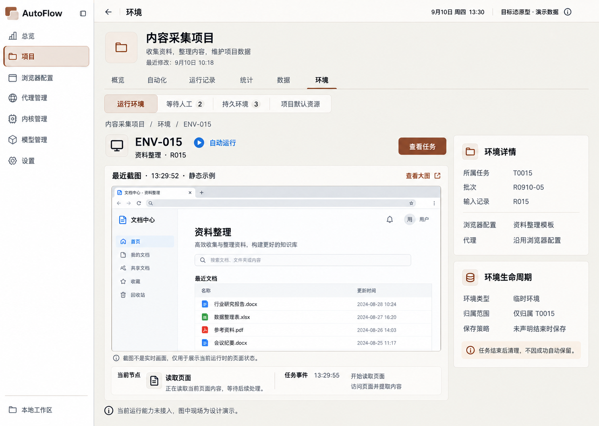
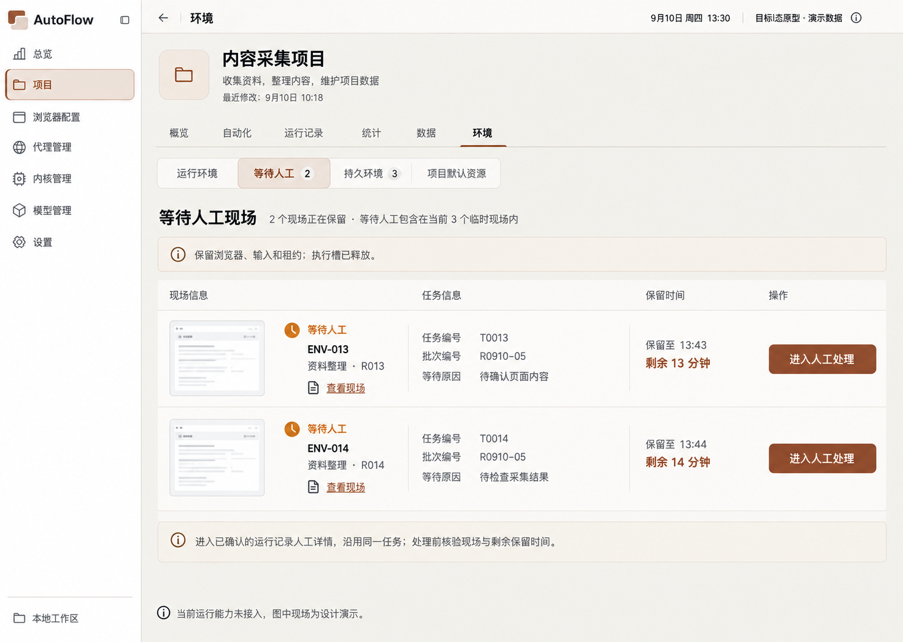
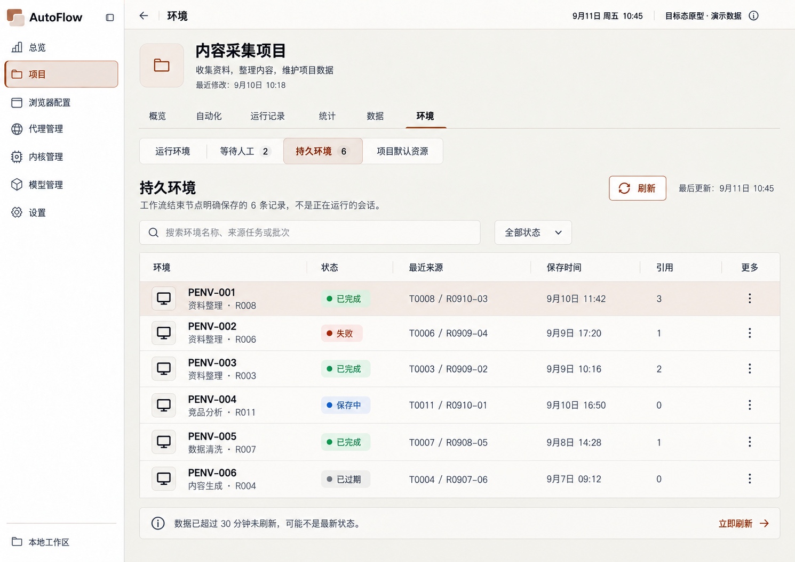
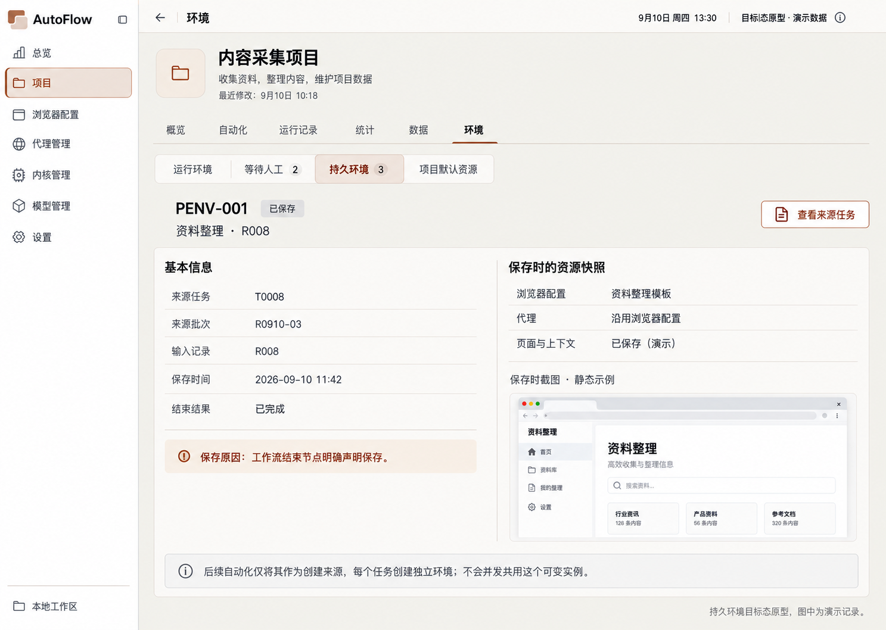
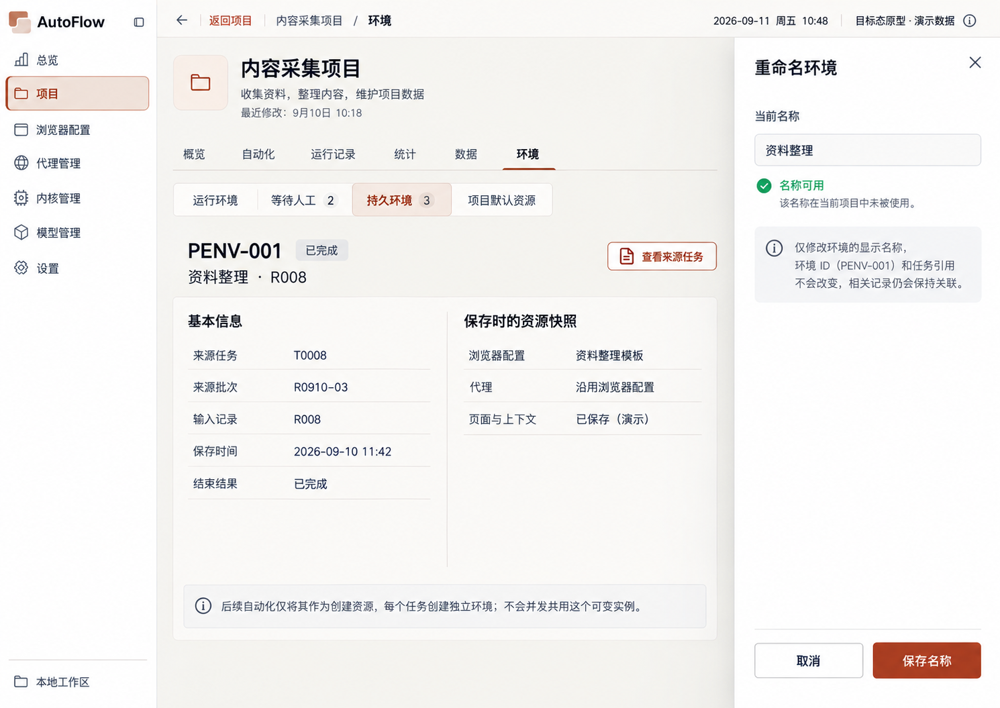
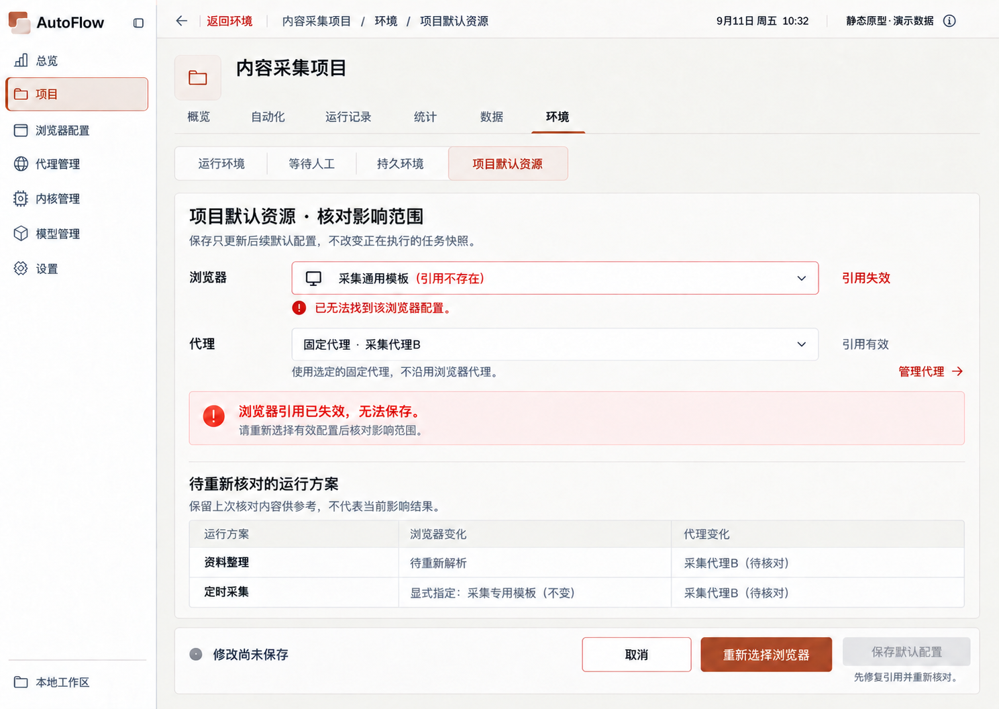
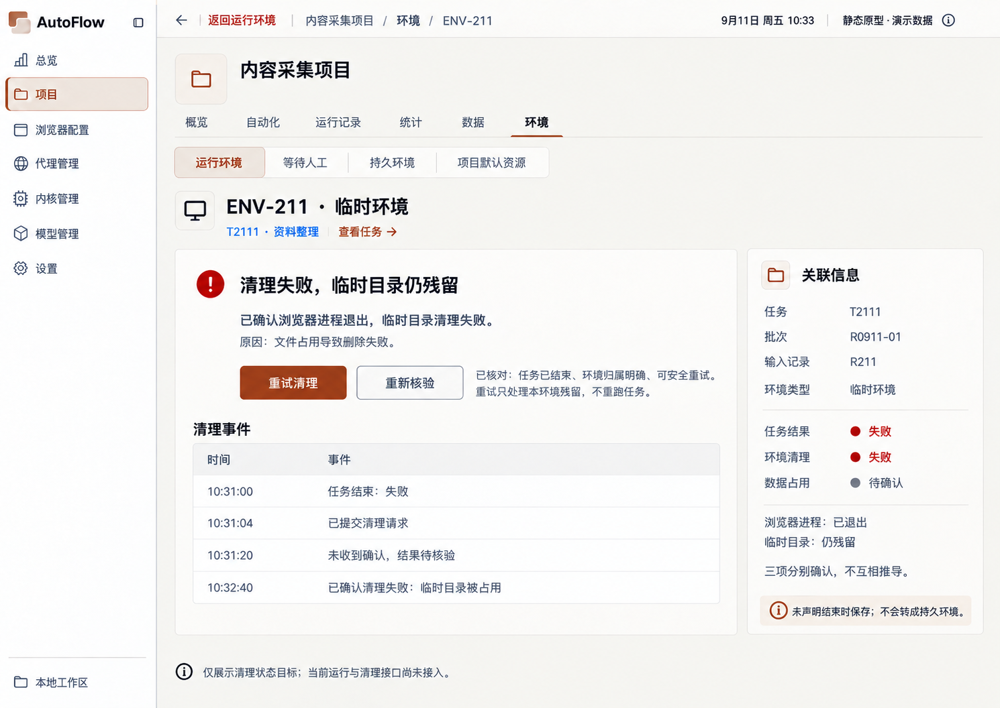
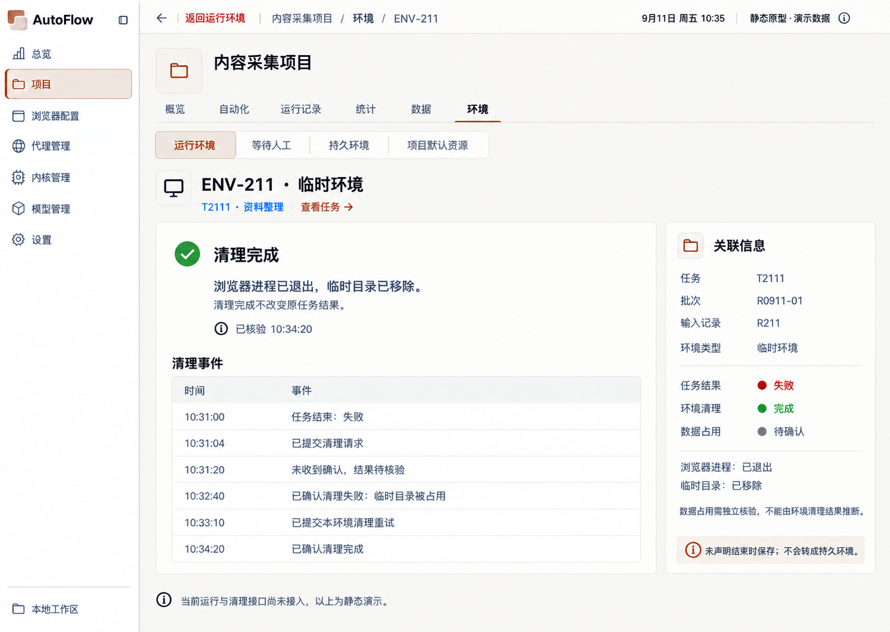

# 环境原型图

当前阅读集：18 张。图像原样复制；候选不等于已确认。

[返回总索引](../../README.md)

## 运行环境主页

2026-09-10 · v1 · 旧审查快照；原归档标记当前有效，不等于新 AutoFlow 已批准

[打开原尺寸](001-environment-main-v1-approved-f757d2.png) · `1487 × 1058`

来源：`00-initial-design/environment-v1-approved/environment-main-v1-approved.png`

## 运行环境详情

2026-09-10 · v1 · 旧审查快照；原归档标记当前有效，不等于新 AutoFlow 已批准

[打开原尺寸](002-running-environment-detail-9ff896.png) · `1487 × 1058`

来源：`00-initial-design/environment-v1-approved/secondary-pages-v1/01-running-environment-detail.png`

## 等待人工环境

2026-09-10 · v1 · 旧审查快照；原归档标记当前有效，不等于新 AutoFlow 已批准

[打开原尺寸](003-manual-environment-list-3a0ed2.png) · `1487 × 1058`

来源：`00-initial-design/environment-v1-approved/secondary-pages-v1/02-manual-environment-list.png`

## 持久环境列表 v3

2026-09-11 · v3 · 修订候选；未找到批准记录

[打开原尺寸](004-persistent-list-9f9960.png) · `1490 × 1056`

来源：`03-refinement-20260911/environment-maintenance-v3/01-persistent-list.png`

## 持久环境详情

2026-09-10 · v1 · 旧审查快照；原归档标记当前有效，不等于新 AutoFlow 已批准

[打开原尺寸](005-persistent-environment-detail-70a735.png) · `1487 × 1058`

来源：`00-initial-design/environment-v1-approved/secondary-pages-v1/04-persistent-environment-detail.png`

## 项目默认资源 · 公共控件修订

2026-09-10 · v1 · 修订候选；未找到批准记录

[打开原尺寸](006-resource-defaults-445587.png) · `1489 × 1056`

来源：`02-refinement-20260910/shared-controls-v1/06-resource-defaults.png`

## 资源影响与失效

2026-09-10 · v1 · 旧审查快照；原归档标记当前有效，不等于新 AutoFlow 已批准

[打开原尺寸](007-resource-impact-and-invalid-b6a666.png) · `1487 × 1058`

来源：`00-initial-design/environment-v1-approved/secondary-pages-v1/06-resource-impact-and-invalid.png`

## 资源版本冲突

2026-09-10 · v1 · 旧审查快照；原归档标记当前有效，不等于新 AutoFlow 已批准

[打开原尺寸](008-resource-version-conflict-8598c1.png) · `1487 × 1058`

来源：`00-initial-design/environment-v1-approved/secondary-pages-v1/07-resource-version-conflict.png`

## 资源未保存离开

2026-09-10 · v1 · 旧审查快照；原归档标记当前有效，不等于新 AutoFlow 已批准

[打开原尺寸](009-resource-unsaved-leave-47ae56.png) · `1487 × 1058`

来源：`00-initial-design/environment-v1-approved/secondary-pages-v1/08-resource-unsaved-leave.png`

## 运行时可用性状态

2026-09-10 · v1 · 旧审查快照；原归档标记当前有效，不等于新 AutoFlow 已批准

[打开原尺寸](010-runtime-availability-states-8eb31d.png) · `1487 × 1058`

来源：`00-initial-design/environment-v1-approved/secondary-pages-v1/09-runtime-availability-states.png`

## 环境重命名校验与冲突

2026-09-11 · v1 · 修订候选；未找到批准记录

[打开原尺寸](100-rename-validation-conflict-ea6135.png) · `1586 × 992`

来源：`03-refinement-20260911/environment-maintenance-v1/03-rename-validation-conflict.png`

## 删除环境影响预览

2026-09-11 · v1 · 修订候选；未找到批准记录

[打开原尺寸](100-delete-impact-preview-3a2ef6.png) · `1586 × 992`

来源：`03-refinement-20260911/environment-maintenance-v1/04-delete-impact-preview.png`

## 环境重命名抽屉 v3

2026-09-11 · v3 · 修订候选；未找到批准记录

[打开原尺寸](100-rename-drawer-b15079.png) · `1490 × 1055`

来源：`03-refinement-20260911/environment-maintenance-v3/02-rename-drawer.png`

## 环境保存警告

2026-09-11 · v2 · 修订候选；未找到批准记录

[打开原尺寸](100-save-with-warning-b144be.png) · `1489 × 1056`

来源：`03-refinement-20260911/environment-rules-v2/01-save-with-warning.png`

## 环境引用失效

2026-09-11 · v2 · 修订候选；未找到批准记录

[打开原尺寸](100-invalid-reference-eaa49a.png) · `1489 × 1056`

来源：`03-refinement-20260911/environment-rules-v2/02-invalid-reference.png`

## 环境清理结果待核验

2026-09-11 · v2 · 修订候选；未找到批准记录

[打开原尺寸](100-cleanup-unknown-da1214.png) · `1490 × 1056`

来源：`03-refinement-20260911/environment-rules-v2/03-cleanup-unknown.png`

## 环境清理失败

2026-09-11 · v2 · 修订候选；未找到批准记录

[打开原尺寸](100-cleanup-failed-6a82d6.png) · `1490 × 1056`

来源：`03-refinement-20260911/environment-rules-v2/04-cleanup-failed.png`

## 环境清理完成

2026-09-11 · v2 · 修订候选；未找到批准记录

[打开原尺寸](100-cleanup-completed-6c0606.png) · `1489 × 1056`

来源：`03-refinement-20260911/environment-rules-v2/05-cleanup-completed.png`
