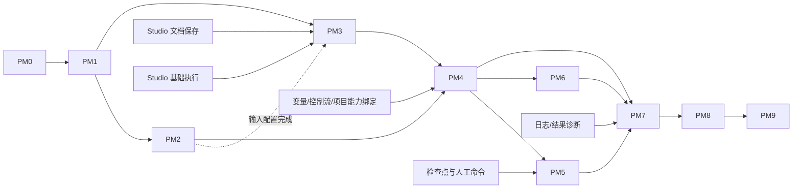

# 项目管理完整模块里程碑实现计划

> **面向 AI 代理的工作者：** 必需子技能：使用 subagent-driven-development（推荐）或 executing-plans 逐任务实现此计划。步骤使用复选框（`- [ ]`）语法来跟踪进度。

**目标：** 分阶段完整交付项目、数据、自动化、执行诊断、统计和浏览器环境，让工作流按业务状态使用多表数据，并按结束节点设置保存与继续使用登录环境。

**架构：** 沿用 Electron + React 前端、单 FastAPI sidecar 和 SQLite；项目运行协调只管理批次、输入领取与核心调用，Studio 保持唯一工作流执行器。数据写入和环境保存经注入的应用端口完成，平台行为集中在适配器；先完成组件与契约，再组合真实页面。

**技术栈：** Python 3.11、FastAPI/Pydantic、SQLAlchemy/Alembic；Electron、React/TypeScript、现有 shadcn/Radix + Tailwind、TanStack Query、RHF/Zod；CloakBrowser。Excel 适配沿旧项目 openpyxl 能力迁移，依赖在 PM2 引入并锁定；Sheets 复用 httpx 和系统凭据能力。

**规格：** [完整设计入口](../../project-management/design/README.md)、[功能结构](../../project-management/design/functional-structure.md)、[数据规则](../../project-management/design/data-and-state-rules.md)、[传递契约](../../project-management/design/data-flow-and-contracts.md)、[执行与环境](../../project-management/design/execution-and-environment.md)。用户于 2026-09-13 整体确认；[确认记录](../../../.ai/decisions/2026-09-13-project-management-design-approved.md)明确本计划使用的推荐默认。

- 日期：2026-09-13。
- 状态：**里程碑计划 confirmed；用户已授权PM0实施；业务代码尚未开始。**
- 粒度：本文件确定全部里程碑、交付包、文件归属、依赖和验收；每个交付包开工时按 `writing-plans` 展开带实际测试代码和逐步命令的执行卡。执行卡不得改变本计划的业务规则或删掉完整范围。
- 索引：[48 项功能与规则覆盖表](../../project-management/implementation/coverage.md)、[机器可核验映射](../../project-management/implementation/coverage.json)、[代码与依赖基线](../../project-management/implementation/current-baseline.md)。

## 全局约束

- 只迁移能力，不兼容旧业务数据，不连接 WebRPA 运行时，不引入项目模板市场或工作流发布/版本管理。
- 每表一个系统维护的业务状态列，单值或 null；目录初始为空。人工或明确节点决定变化，任务终态不隐式改状态。
- 释放占用后是否可再取，只由当前状态和工作流条件决定；没有消费类型、本批去重或失败历史暗筛。
- Task、原始输入、所需 lease、环境预约及 queued CoreRun 同一短事务提交；文件、网页和云端动作在事务外进行。
- 原始输入、参数、变量、节点输出、当前记录分开；本任务写入成功推进自己的版本，不能自动覆盖他人的新版本。
- End“保留当前环境”包含登录上下文保存和约定记录关联；部分完成不能报完整成功，修复不重跑网页或改历史 Run。
- 输入、数据、运行、环境、同步的业务规则在设计中已定义；本计划不把这些问题留给页面开发者临时决定。
- 前后端按交付包一起完成。HTTP/OpenAPI 生成客户端类型，正式页面不以 mock 数据验收。
- 共享 UI 使用现有暖灰与黏土棕体系；不重造已完成基础控件、不添加系统外观下拉面板，不增加无用途侧栏。
- 平台：Windows x64、macOS Intel、macOS Apple Silicon；每个平台分别记录运行、文件、凭据、恢复和安装包证据。
- 主目录和其他任务分支只读参考；实施在隔离 worktree 进行。主协调者独占路由、装配、迁移合并和生成类型的集成操作。

## 1. 完成路径与里程碑总览

| 里程碑 | 用户可获得的成果 | 主要依赖 | 退出条件 |
|---|---|---|---|
| PM0 契约与实施基线 | 明确完整范围、共享接口、文件责任和验收样例 | 已确认设计；Studio 最小契约 | 无接口重名/状态冲突/验收孤项，明确唯一迁移顺序和 UI 来源 |
| PM1 项目入口与组件基础 | 真正创建、编辑、搜索、打开项目，保留项目上下文 | PM0；统一控件基线 | 重启后项目可查，跨项目不串数据，实际页面可键盘操作 |
| PM2 本地数据闭环 | 空白表、Excel 导入、记录/字段/状态维护、XLSX 导出 | PM1 | 新建→编辑→筛选→导出真实成立；来源原文件不变 |
| PM3 自动化与首个真实批次 | 保存自动化、进入 Studio，运行参数型流程、看日志并停止 | PM1；Studio 文档与基础执行；数据绑定依 PM2 | 真实 CloakBrowser 执行，启动幂等，停止和丢响应可查询 |
| PM4 多表数据工作流 | 多表取数、并发占用、关联、字段/状态/记录与列操作 | PM2 + PM3；核心变量/控制流能力 | 共享资料可重用，显式状态控制后续流转，冲突不丢数据 |
| PM5 登录环境与人工处理 | 保留环境及关联行，后续继续登录；人工介入后继续同一任务 | PM4；核心检查点/人工命令 | 两次连续使用同一业务身份，End 部分失败可恢复，竞争只有一个有效结果 |
| PM6 Google Sheets 闭环 | 连接、多绑定、拉取、推送、核验、公式与来源调整 | PM2 + PM4；可与 PM5 并行 | 本地与云端事实可解释；超时不重复追加、旧队列不写新来源 |
| PM7 完整运行诊断与统计 | 完整日志/结果互查、统计下钻、概览关注项、失败后续入口 | PM4；全量关注项依 PM5 + PM6；核心诊断数据 | 图表、任务与业务事实一致，失败后开启新批次且保留原输入分组 |
| PM8 生命周期整体收口 | 归档、恢复、永久删除、清理残留、跨重启核验与工作区切换 | PM5 + PM6 + PM7 | 所有活动/未知资源有去向；不误删外部资料，不自动重跑或重投 |
| PM9 全系统与平台验收 | Windows/macOS 安装包内完整使用项目管理 | PM1–PM8；已消费 Studio 能力的真实平台证据 | 全部功能与规则有证据，无核心缺项、假按钮或未说明的平台空白 |

**可感知交付点：PM2 能管理真实业务数据；PM3 能运行真实流程；PM5 能承接完整登录业务；PM8 业务功能收口；PM9 才达到整个模块的发行验收。**



PM3 的参数型链路可与 PM2 后半段并行；自动化输入配置在 PM2 表/字段契约可用后接入。PM7 的查询和组件可先做，完整退出须 PM5/PM6 的事实可供查询。并行只缩短等待，不跳过验收。

## 2. 文件职责与组件落点

以下均相对实施 worktree 根目录；“新增”是计划目标，不代表文件已经存在。包内文件随对应交付首次需要时创建，不能先生成整片空目录。更细 DTO 留在所属领域，生成类型只有一份。

| 编号/阶段 | 文件范围 | 职责 |
|---|---|---|
| F0 / PM0 | `docs/project-management/implementation/contracts.md`、`api-contracts.md`、`execution-ledger.md` | 固定共享对象、路由/错误/命令、交付卡及真实验收记录 |
| F1 / PM1 | 新增 `domain/projects/models.py`、`application/projects/service.py`、`infrastructure/database/projects.py`、`adapters/http/projects.py`（前缀均为 `apps/backend/src/autoflow/`） | 项目身份、修订、目录、最近访问及生命周期准入 |
| F2 / PM2–PM6 | 新增 `domain/project_data/models.py`、`identity.py`、`rules.py`、`ports.py`；`application/project_data/tables.py`、`records.py`、`imports.py`、`claims.py`、`writes.py`、`sync.py` | 表/字段/记录/状态、稳定身份、版本、领取和同步用例；按阶段创建相应文件 |
| F3 / PM2–PM6 | 新增 `infrastructure/database/project_data.py`、`project_leases.py`、`project_sync.py`；`adapters/http/project_data.py`；`infrastructure/filesystem/project_excel.py`；`providers/data/google_sheets.py` | 持久化、HTTP、Excel 与 Sheets 传输；不在 HTTP 重写领域规则 |
| F4 / PM3–PM8 | 新增 `domain/project_automations/models.py`、`application/project_automations/service.py`、`core_port.py`、`adapters/http/project_automations.py`、`infrastructure/database/project_automations.py` | 管理配置及 Studio 引用；`core_port.py` 是消费核心服务的窄端口，不是执行器 |
| F5 / PM3–PM8 | 新增 `domain/project_runs/models.py`、`application/project_runs/coordinator.py`、`queries.py`、`followup.py`、`adapters/http/project_runs.py`、`infrastructure/database/project_runs.py` | 批次/Task、原子领取与启动协调、查询、失败后续范围；不遍历执行图 |
| F6 / PM5–PM8 | 新增 `domain/environments/models.py`、`application/environments/service.py`、`retention.py`、`manual.py`、`adapters/http/project_environments.py`、`infrastructure/database/environments.py`、`infrastructure/filesystem/environment_store.py` | 环境身份、工作副本、完整保留、人工协调、发布与清理 |
| F7 / PM7 | 新增 `application/projects/overview.py`、`statistics.py`、`adapters/http/project_statistics.py` | 直接读取已有事实与 SQL 聚合；不增加事件溯源或 BI 服务 |
| F8 / PM1–PM8 | 修改 `bootstrap/app.py`；按需新增 `bootstrap/projects.py`；复用 `infrastructure/database/session.py`、`infrastructure/filesystem/paths.py`、`infrastructure/credentials/system.py`；扩展 `application/settings/runtime.py` | 装配、工作区路径、系统凭据、停机 gate；各用例不自行判断平台 |
| F9 / 各阶段 | 新增迁移 `infrastructure/database/migrations/versions/pm01_projects.py`、`pm02_project_data.py`、`pm03_project_automations.py`、`pm04_project_runs.py`、`pm05_environments.py`、`pm06_project_sync.py` | 增量 schema。PM0 核对实际 Alembic heads 并登记 down_revision；核心迁移由 Studio 所有者提交，集成者解决分支汇合，不改已应用脚本 |

F2–F9 中后端路径同样以 `apps/backend/src/autoflow/` 为前缀。上述文件职责固定，内部必要拆分以审查中实际代码复杂度为依据，不创建仅转发一次的层层包装。

### 前端：基础控件 → 领域组件 → 页面

1. 优先接入 `autoflow-ui-controls-plan@1fb58e1` 已完成的控件和下拉展开宽度修复。现有正式落点 `apps/desktop/src/renderer/shared/components/ui/`；Table、Pagination、Combobox、ScrollArea 等已有实现不能再复制一套。集成者核对主线差异后接入对应提交/文件并回归。
2. 保持 `renderer/shared/api/generated.ts` 唯一生成文件；复用 `ApiProvider`、`client.ts`、`events.ts`、RHF 与既有反馈组件。
3. 项目复合组件落在领域内；只有两个以上实际消费者且语义一致时才提升 shared。项目统计与概览不塞进全局 Dashboard。

下列路径统一以 `apps/desktop/src/renderer/` 开头：

| 领域 | 先完成的组件（新增） | 后组装的页面（新增） |
|---|---|---|
| `domains/projects/` | `components/ProjectHeader.tsx`、`ProjectTabs.tsx`、`ProjectFormDialog.tsx`、`ResourceReferenceField.tsx`、`ReferenceImpactPanel.tsx`、`ProjectLifecycleDialog.tsx` | `pages/ProjectDirectoryPage.tsx`、`ProjectOverviewPage.tsx` |
| `domains/project-data/` | `components/DataTableGrid.tsx`、`RecordEditor.tsx`、`BusinessStatusField.tsx`、`FieldSchemaEditor.tsx`、`StatusCatalogEditor.tsx`、`ConditionBuilder.tsx`、`ExcelImportWizard.tsx`、`ExportTableDialog.tsx`、`SheetsBindingWizard.tsx`、`SyncOperationPanel.tsx` | `pages/DataTableDirectoryPage.tsx`、`DataTableDetailPage.tsx` |
| `domains/project-automations/` | `components/AutomationEditor.tsx`、`InputBindingEditor.tsx`、`ParameterEditor.tsx`、`RunSettingsEditor.tsx`、`WorkflowLinkPanel.tsx`、`LaunchConfirmationDialog.tsx` | `pages/AutomationDirectoryPage.tsx`、`AutomationDetailPage.tsx` |
| `domains/project-runs/` | `components/BatchSummary.tsx`、`TaskEvidencePanel.tsx`、`NodeAttemptTimeline.tsx`、`StopRunDialog.tsx`、`FailedRunFollowup.tsx`、`StatisticsPanel.tsx` | `pages/RunRecordsPage.tsx`、`BatchDetailPage.tsx`、`TaskDetailPage.tsx`、`StatisticsPage.tsx` |
| `domains/environments/` | `components/EnvironmentDirectory.tsx`、`ManualTaskPanel.tsx`、`EnvironmentSourceField.tsx`、`EnvironmentMaintenanceDialog.tsx`、`EnvironmentCleanupPanel.tsx` | `pages/EnvironmentsPage.tsx`、`ManualTaskDetailPage.tsx`、`SavedEnvironmentDetailPage.tsx` |

每个领域按实际用例新增 `api.ts`、`hooks.ts`、表单需要时新增 `form-schema.ts`，传输对象从生成 DTO 导出；不手写第二份服务端状态。修改入口：`app/ApplicationHeader.tsx`、`app/App.tsx`。项目路由参数显式携带 projectId/对象与视图，返回保留筛选和位置。

桌面文件选择/保存能力由 `apps/desktop/src/shared/project-files.ts`、`main/ipc/project-files.ts`、`preload/index.ts` 受控接入，遵循现有 settings/kernel IPC 校验方式。业务层只使用授权文件能力，不接受渲染端任意路径执行文件操作。

Studio 端口、节点配置、结束节点组件与编辑器窗口由 Studio 专项所有者维护其唯一实现；本计划消费 XE-C01–C18，不另建 `ProjectWorkflowEditor` 或项目执行引擎。

## 3. 各里程碑交付包与验收

### PM0：契约、基线和覆盖冻结

**依赖：** 已确认完整设计；当前主线与 UI 分支只读核对；Studio 最小共享契约协作。

**文件：** F0；更新 `docs/PROJECT_STRUCTURE.md` 与本覆盖表；在实施卡中登记 F9 迁移归属。此阶段不创建无消费者的业务骨架。

- [x] **PM0-A 基线与接口卡**：记录主线、UI、Studio 实际提交；统一 Project/Automation/RecordRef/FieldRef、独立 revision、TaskInputSnapshot、Batch/CoreRun/Operation、EnvironmentRef 和 capability 绑定。XE-C01–C18 写清输入、输出、错误、事务参与、查询身份和所有者。
- [x] **PM0-B 传输与集成卡**：在 `api-contracts.md` 明确 `/api/v1/projects` 及其表、自动化、批次、环境子资源的路由表，核心 Run 继续引用 Studio 路由。确定命令查询与 SSE 的序号/重连规则、文件授权 IPC、Alembic 顺序、生成类型的集成人。OpenAPI 与真实 handler 同交付，不发布空端点。
- [x] **PM0-C 验收卡与并行边界**：将本覆盖表全部 ID 对应到交付包及测试文件；把 FX-01–07 和代表工作流的数据写成可复用 fixture 定义；登记哪个组件、数据 schema 或核心接口只能由一个负责人修改。

**验收：** 引用、核心状态和对象命名无冲突；业务规则没有开放空项；18 项执行契约及全部功能/规则都有里程碑。文档示例中的类型均有定义，拟新增文件与现有文件区分清楚。PM0 不计算任何业务测试“通过”。

### PM1：项目入口与统一组件接入

**依赖：** PM0。无需等待 Studio 编辑器或执行器。

**文件：** F1/F8/F9 的 `pm01_projects.py`；项目 Header/Tabs/FormDialog/Directory/Overview；共享控件接入、App 路由。

- [ ] **PM1-A 真实项目目录**：项目创建/编辑、名称校验、修订冲突、搜索/排序/分页、最近访问；ORM/API/生成 DTO/领域组件/页面一起接通。
- [ ] **PM1-B 组件与导航上下文**：复用统一控件，完成项目头与六页签路由、资源引用字段和影响展示模式。加载/空/错误/只读/保存中/冲突均走真实状态；尚未接入的能力不提供假操作。
- [ ] **PM1-C 最小生命周期保护**：项目写入校验归属和活动状态；删除只能对无依赖且已确认安全的对象开放。后续每引入运行/同步/环境，就同步接入 blocker，不能等 PM8 才防止误删。

**自动验收文件：** `apps/backend/tests/contract/test_projects.py`、`tests/integration/test_project_repository.py`（后者也在 backend）；`apps/desktop/src/renderer/domains/projects/tests/ProjectDirectoryPage.test.tsx`。

**固定场景：** 同名两个请求只接受一个；两个项目切换不串筛选/记录；保存冲突保留草稿；后台刷新不清空编辑；重启后项目和最近访问仍在。

**真实应用：** 新建→编辑→打开→返回→搜索→重启再打开。200% 缩放、长名称及下拉展开不撑宽；Tab/Enter/Escape 可完成表单路径。

### PM2：本地表、Excel、业务状态与导出

**依赖：** PM1；PM0 稳定身份、版本和未来节点数据契约。

**文件：** F2 的 models/identity/rules/tables/records/imports，F3 的 project_data/project_excel/HTTP，F9 `pm02_project_data.py`；数据领域除 Sheets 的组件与页面；project-files IPC；`apps/backend/pyproject.toml`、`uv.lock` 增量依赖。

- [ ] **PM2-A 本地数据与状态**：表目录及五页签、空白本地表、字段规则、记录增删改查、查询排序分页/列显示、单值状态目录与设置/清空。稳定身份、内容/状态/关联/结构版本从首次落库即分开。
- [ ] **PM2-B Excel 导入与替换**：检查工作簿、选择工作表、字段映射、全量身份/类型验证、文件指纹复检、原子发布导入代次；重新导入显示本地变化及引用影响，禁止按行号继承状态。受阻导入不发布半表。
- [ ] **PM2-C 导出与人工变更证据**：整表/当前筛选、选列及可选系统状态，生成新的单表 XLSX；文本编号保留前导零，公式导出已确认显示值。人工写入记录来源/版本，为运行和同步提供同一事实，不在此阶段伪造云端成功。

**自动验收文件：** `apps/backend/tests/unit/test_project_data_rules.py`、`tests/integration/test_project_data_repository.py`、`tests/integration/test_project_excel.py`、`tests/contract/test_project_data.py`；前端 `domains/project-data/tests/DataTableDetailPage.test.tsx`；桌面 `apps/desktop/src/main/ipc/project-files.test.ts`。

**固定场景：** `0012` 与整数 `12` 不被误合并；重复/空身份阻止导入；新记录状态 null；清空状态仍推进版本；并发编辑旧版本不覆盖新值；导出文件能重新读取且原 Excel 字节不变。兼容增列成功，收紧必填无合法值时拒绝。

**真实应用：** 空白表新增数据→定义状态→筛选；Excel 导入→编辑→导出→用表格软件核对。分别检查取消文件选择、中文/空格路径、写入失败和已有文件冲突。

### PM3：自动化配置与首个真实参数批次

**依赖：** PM1；输入配置依 PM2；Studio C01/C02 文档真实保存，C05/C06/C07 基础 Run、日志、取消和受控浏览器生命周期。

**文件：** F4/F5/F8，F9 `pm03_project_automations.py`、`pm04_project_runs.py`（与核心 Run 迁移顺序联合冻结）；自动化四页签和启动弹窗；BatchSummary、基础任务/日志、StopRunDialog；Studio 窗口 IPC 以现有 `shared/automation-studio.ts` 扩展，核心所有者实施。

- [ ] **PM3-A 自动化管理与 Studio 关联**：四页签聚合保存、稳定输入绑定和参数、运行默认；独立流程显式关联同一文档，一个流程最多一个项目自动化。真实保存/校验/打开/返回，管理草稿与 Studio 文档分别保存。删除检查从引用建立时生效，完整 UI 在 PM8 汇合。
- [ ] **PM3-B 参数型真实启动**：启动固定内容/参数/资源策略；默认有限 1 次；零输入/只有可选输入禁止不限次数。原子建立 Task 与 queued CoreRun、提交后派发；同操作身份双击和超时仅一个批次。
- [ ] **PM3-C 基本诊断与停止**：实际 Run 状态、输入参数、节点基础日志、错误/截图、停止和强停请求、结果未知查询、重连补查；首次运行就接入退出 blocker 和旧 Worker 撤权，不能把恢复安全推迟到 PM8。

**自动验收文件：** `apps/backend/tests/contract/test_project_automations.py`、`tests/integration/test_project_run_start.py`、`tests/integration/test_project_crash_recovery.py`（本阶段建基础停止/重启用例，PM8扩展组合场景）、`tests/contract/test_project_runs.py`；前端 `domains/project-automations/tests/AutomationDetailPage.test.tsx`、`domains/project-runs/tests/RunRecordsPage.test.tsx`。

**固定场景：** 参数值两次运行隔离；双击/响应丢失只一个 Batch/Run；事务失败没有孤立 Task；提交后派发失败留下真实失败任务；停止后不再执行下一网页动作；服务重启不自动重放。资源缺失允许保存草稿，阻止实际运行。

**真实应用：** 在正式 Studio 保存“打开本地测试页面→输入参数→点击→读取结果”，从项目运行并查真实页面效果、日志和 Task；停止长等待并核对浏览器处置。本阶段创建 `apps/desktop/tests/fixtures/project-management/index.html`，提供提交计数、延时响应和登录态检查入口，后续环境/重启验证复用。核心未满足时该包保持未完成，PM1/PM2可继续交付。

### PM4：多表领取、并发与工作流数据操作

**依赖：** PM2 + PM3；核心变量、分支/循环、子流程、错误策略及项目 capability 调用。

**文件：** F2 claims/writes/ports，F3 project_leases，F5 coordinator；InputBindingEditor/ConditionBuilder/RecordEditor 的占用和冲突状态；项目节点由 Studio 执行器调用注入能力，配置与实现不在管理页复制。

- [ ] **PM4-A 完整输入选择与原子领取**：独立/固定引用/精确关联，同表不同角色、显式别名、必要和可选输入、依赖 DAG、候选回溯；全组原子提交。无匹配、暂占、结构错误和扫描预算耗尽分别返回，不创建缺输入的半任务。
- [ ] **PM4-B 显式写入与版本**：查询后非阻塞取得动态写 lease；记录新增/编辑/删除、状态设置、字段新增/确保存在及安全修改；返回稳定记录/字段引用。全量初始输入证据不变，本任务确认版本推进，人工新值触发冲突。新增/修改幂等，失败不回滚此前节点。
- [ ] **PM4-C 批次完整调度语义**：并发、有限/不限次数、真实耗尽、默认失败后停止新任务/显式继续。只按当前状态条件复用，不添加本批排除集合；同物理来源的排他键与本地 RecordRef 分开，Sheets 的来源解析在 PM6 接入。

**自动验收文件：** `apps/backend/tests/unit/test_project_input_selection.py`、`tests/integration/test_project_claims.py`、`tests/integration/test_project_node_writes.py`；前端 `domains/project-automations/tests/InputBindingEditor.test.tsx`、`domains/project-data/tests/RecordConflict.test.tsx`。

**固定场景：** 一行最终态不变连续执行 3 Task；人员可重取而邮箱显式变状态；X可取R1/R2、Y仅R1必须找到X=R2/Y=R1；两个输入竞争任一失败整组不提交；任务读v5、自己写v6、人工写v7后旧写冲突；新增账号回应丢失不重复新增；新增列返回fieldId并供下一节点使用。

**真实应用：** 三张表完成注册型 fixture：人员状态不变、邮箱显式改变、新增账号记录；另一个自动化读取新账号。检查失败任务原始输入和当前记录差异可见。无浏览器环境保留的流程此阶段必须已完整可用。

### PM5：环境持续使用与人工介入

**依赖：** PM4；Studio 生命周期和 End 节点；人工 C12/C13 检查点、合法位置、继续同一 Run 和权威终结命令。

**文件：** F6/F8/F9 `pm05_environments.py`；环境领域全部组件/页面、运行页人工入口；Studio End 配置消费唯一保留契约 C18。

- [ ] **PM5-A 保存身份、来源与工作副本**：全局 Profile 是模板；稳定 environmentId、内容代次和实际身份资源独立保存。新建来源、指定保存来源、数据行关联来源；同身份任务/维护独占，实际选择每 Task 固定，后续任务可使用刚确认保存的版本。
- [ ] **PM5-B End 完整保留及维护**：勾选即保存登录上下文并关联所选初始输入/本任务新增或仍占用的写结果。默认更新原来源，可明确另存；替换不同已有行引用须显式授权。保存候选/发布/整组关联可查询，失败保留有效副本，修复用新授权且不改历史 Run。
- [ ] **PM5-C 人工、额度与竞争**：一份人工详情供运行/环境入口使用；浏览器处理后校验并继续同一任务；人工结束、超期、取消、窗口关闭和现场失联按核心唯一转换处理。并发运行额度与保留现场额度分别计数，现场满说明阻断。

**自动验收文件：** `apps/backend/tests/integration/test_project_environment_retention.py`、`tests/integration/test_project_manual_actions.py`、`tests/contract/test_project_environments.py`；前端 `domains/environments/tests/EnvironmentRetention.test.tsx`、`ManualTaskDetailPage.test.tsx`。

**固定场景：** 输入来自两个不同环境时明确选源；End关联邮箱与新账号但不关联共享人员；保存成功/关联冲突不报完整成功；迟到保存不覆盖已发布新版本；人工继续与超期竞争只接受一次；重启核验不自动执行网页。Cookie/本地存储的真实保存能力以 provider 声明和测试证据为界。

**真实应用：** 本地测试站设置登录态→End保留→完全关闭进程→另一工作流按账号关联环境启动，确认仍有已保存状态；修改并再次保存，第三次读取新内容。验证人工打开维护和原任务继续，不能用仅复制一个JSON文件替代浏览器证据。

### PM6：Google Sheets 来源与同步

**依赖：** PM2 + PM4；可与 PM5 并行开发，环境关联不是 Sheets 接通前提。

**文件：** F2 sync，F3 google_sheets/project_sync，F9 `pm06_project_sync.py`；SheetsBindingWizard、SyncOperationPanel；复用系统凭据与统一写操作记录。

- [ ] **PM6-A 连接/身份/多绑定**：连接保存凭据引用、工作表与字段映射、身份全量核验；共享物理来源记录的 Workspace 排他，各项目状态和本地普通值独立。显示映射重叠，不能把不同本地行号当同一身份。
- [ ] **PM6-B 本地意图→远端核验**：人工立即推送、工作流变化按设计目标合并并可立即同步；待推送/发送中/待核验/确认/失败分开。Spreadsheet 串行定位与写入，按实际变更字段发送；超时先核验，新建不重复追加，远端缺失/重复身份停止危险写入。
- [ ] **PM6-C 公式、增列与来源调整**：公式只读且刷新已存在公式显示值，普通本地值保留；新增字段先本地意图、再受控远端列创建/核验、发布映射后才写值。来源/身份/映射变化处理旧队列并隔离代次；暂停/断开/重连和重启核验在本阶段同时可用。

**自动验收文件：** `apps/backend/tests/integration/test_project_sheets_identity.py`、`test_project_sheets_sync.py`、`test_project_sheets_recovery.py`；前端 `domains/project-data/tests/SheetsBindingWizard.test.tsx`、`SyncOperationPanel.test.tsx`。

**固定场景：** 同物理行跨两项目不能同时占用；两项目状态可不同；回应丢失核验只一条新增；旧映射写入不能投到新工作表；公式复制失败整条新增不能报云端确认；新增列回应丢失不再追加第二列；进程重启保留未知发送事实。

**真实应用：** 使用用户明确授权的测试工作表，对照本地与云端新增/更新/删除；手工制造公式、改列/移行、网络故障和同源多项目，核对真实最终内容。没有授权测试资源时继续自动与本地工作，实网项保持未验收，PM6不得记完整通过。

### PM7：运行诊断、统计和失败后续

**依赖：** PM4 可启动查询/组件工作；全量退出依 PM5 + PM6 的真实事件、Studio 日志/结果/attempt/变量快照数据。

**文件：** F5 queries/followup，F7；运行领域完整页面/组件、项目Overview；统计查询 DTO 与运行筛选共用。

- [ ] **PM7-A 完整证据与互查**：批次/任务/人工三视图，节点访问与重试链、输入快照、当前数据、输出/附件、错误和变化来源；日志分页/筛选，迟到事件不能覆盖终态，跳转返回保留上下文。复用 Studio 日志数据和可共享展示，不建立第二份日志事实。
- [ ] **PM7-B 概览与统计**：继续工作、当前活动/需要关注、最近变化、六模块聚合；按任务结束时间、统一时区和同次结果标识计算指标/趋势/下钻。成功率只取成功与失败作分母，零分母无样本，耗时包含人工与重试、不含启动前排队。
- [ ] **PM7-C 失败后的新批次快捷入口**：保留原始输入分组及来源任务，明确候选范围，按当前状态/条件重新取数；不凑错组、不自动改状态、不重放未知副作用。所选行数不保证相同数量的不同Task，已匹配的行仍可重复使用。

**自动验收文件：** `apps/backend/tests/integration/test_project_statistics.py`、`test_project_failure_followup.py`；前端 `domains/project-runs/tests/TaskEvidencePanel.test.tsx`、`StatisticsPage.test.tsx`、`FailedRunFollowup.test.tsx`。

**固定场景：** 成功2、失败1、取消1、中断1：成功率2/3，取消/中断单列；无有效耗时不纳入平均值；跨日边界归属唯一；迟到事件出现后旧结果标识下钻仍一致或明确过期；7个失败输入组进入新批次仍保留分组与条件规则。

**真实应用：** 从概览异常→任务→节点→当前记录/环境→回原列表；从统计下钻核对相同任务集合；创建后续新批次后原失败历史不变。新事件到达时长日志与表格不丢筛选、不撑宽窗口。

### PM8：完整生命周期与恢复收口

**依赖：** PM5 + PM6 + PM7。各阶段本身已经具备必要崩溃保护；PM8 验收跨模块组合和完整用户处置入口。

**文件：** F1项目生命周期、F4自动化删除、F5协调、F6清理、F8 QuiesceGate 和全局资源引用检查；ProjectLifecycleDialog/ReferenceImpactPanel/EnvironmentCleanupPanel；迁移只在真实新增持久事实时增加，不改历史脚本。

- [ ] **PM8-A 归档/恢复/删除影响**：先冻结新工作，再处理在途运行、人工、同步与环境保存；归档只读，保留未推送变化；恢复不自动重跑/重投。删除独立流程只解绑，项目所有流程经核心占用检查后删除；外部Excel/Sheets和全局资源保留。
- [ ] **PM8-B 跨重启核验与残留处理**：启动时撤权旧Worker，查询Run/文件发布/关联/发送事实，隔离不明现场；已知结果可幂等完成清理，未知不能假释放。文件失败保留可见操作记录和修复去向；重试不会复活旧Task。
- [ ] **PM8-C 工作区与资源集成**：关闭Studio不取消任务；退出应用/切换Workspace检查所有阻断。全局Profile、内核、代理/池、模型删除同时检查项目静态引用与活动占用，前后端共同保护。

**自动验收文件：** `apps/backend/tests/integration/test_project_lifecycle.py`、`test_project_crash_recovery.py`、`tests/contract/test_project_resource_references.py`；前端 `domains/projects/tests/ProjectLifecycleDialog.test.tsx`；扩展 `apps/backend/tests/contract/test_settings_dashboard.py` 与对应桌面设置/窗口测试。

**固定场景：** 同时存在人工等待、保存中、发送未知时申请归档，列出真实阻断且不继续领取；恢复后无自动新任务或旧队列重发；删除过程中断电后可核对残留；跨项目/外部文件/全局资源不被级联误删；撤权后的迟到Worker不能写记录。

**真实应用：** 活动任务退出/切换工作区→处理阻断→重启核验→归档→只读导出→恢复→删除，逐个核对本地文件、外部原文件和全局资源。此阶段完成后48项功能达到业务完整，平台发行仍需PM9。

### PM9：全应用与三平台发行验收

**依赖：** PM1–PM8；项目实际消费的 Studio 能力、双窗口及运行时平台证据。完整 Studio 的其他节点/录制/编辑器专项继续由其计划交付，不复制到项目计划；如果宣称整个 AutoFlow Studio 完整对齐，必须另外满足 Studio M6/M7。

**文件：** 新增 `scripts/smoke-project-management.mjs`、`scripts/smoke-project-management-desktop.mjs`；复用并补齐 PM3 起使用的 `apps/desktop/tests/fixtures/project-management/index.html`；新增 `apps/backend/tests/integration/test_project_full_scenarios.py`；扩展 `.github/workflows/ci.yml`、必要打包资源清单；每阶段证据汇总到 `docs/migration/project-management-validation.md`。

- [ ] **PM9-A 全功能闭环**：覆盖表所有功能、DATA/FLOW/XE场景逐项对应真实测试/验收记录，复核空态/错误/冲突/未知/恢复与跨页返回；不存在仅有单元测试而无真实入口的能力。
- [ ] **PM9-B 故障与规模**：固定1万记录、1千日志/分钟的合成输入作为测试负载，不承诺未经测量的毫秒性能；核对服务端分页、内存增长和交互响应。网络断开、磁盘写失败、进程终止、重复命令、长文本、200%缩放和键盘操作均保留证据。
- [ ] **PM9-C Windows/macOS 安装包**：Windows x64、macOS Intel、macOS Apple Silicon分别构建并执行真实项目流程；核对中文/空格路径、文件保存、凭据、环境保存恢复、服务生命周期与安装包内sidecar。未运行的平台明确标未验收，不能用CI配置存在代替执行结果。

**最终验收链：** 创建项目→Excel/空白表→多表条件与参数→Studio保存→真实批次→明确数据变化→End保留并关联新账号→另一流程继续登录→人工处理→Sheets推送与核验→统计下钻→失败后续→归档恢复→安全删除。每个平台都跑本地完整链；授权Sheets场景另记录实网平台及资源。

## 4. Studio 依赖与责任划分

主线 2026-09-13 Studio 计划已改用 M0–M7；原设计的 R2/R3/R4/R7/R9仅为历史定位。以本表能力名连接，不按旧编号机械等待。

| 项目交付 | 需要的核心能力 / 设计契约 | Studio 计划定位 | 责任 |
|---|---|---|---|
| PM0 | 文档、Run、事件、capability、事务参与规则 | M0 | 两侧共同确认签名，核心拥有通用契约 |
| PM3 | 真实保存/校验/唯一编辑关联；prepare/dispatch/query/cancel；受控浏览器、基础日志 | M1文档 + M2运行；C01/02/03/05/06/07/11/16 | Studio实现核心，项目实现批次及引用，集成者共同验证短事务 |
| PM4 | 变量/作用域、控制流、子流程、错误策略及项目节点绑定 | M3相关能力；C04/08/09 | 项目负责数据与占用，核心只调用绑定能力和推进节点 |
| PM5 | End完整收尾等待、checkpoint/合法继续/人工终结；环境工作副本生命周期 | M2/M3运行底座 + M4检查点相关部分；C10–16/18 | 数据/环境执行保留，核心决定Run状态；普通Debug暂停不等于人工业务完成 |
| PM6 | 已存在写节点/Run身份与事实查询 | 不增加整个上游里程碑依赖 | 来源同步归项目数据适配器 |
| PM7 | 节点尝试、变量快照、日志/结果/附件与查询 | M4相关诊断能力；C07 | 一份核心事实，多入口展示；项目统计独立聚合 |
| PM8 | 文档/Run占用、停止/核验、核心终态 | C16/17，已消费能力组合 | 项目生命周期统筹，不增加执行循环 |
| PM9 | 实际消费能力在双窗口和三平台的运行证据 | 对应Studio M7验收项 | 联合验收；不替另一任务宣称全部Studio完成 |

项目能力通过核心定义的窄接口注入：数据查询/写入、环境访问、End最终化；查询写入的动态lease封装在数据用例内部，不额外暴露任意占用操作给节点。独立Studio未绑定项目能力时能执行通用流程，依赖项目的节点明确不可运行。核心不得import项目ORM；项目不得调用Profile测试浏览器worker来解释工作流。

## 5. 并行、提交与验收执行方式

默认沿用用户已表达的多智能体偏好：普通有界交付包可由 `gpt-5.6-sol` 执行，核心事务、数据身份和恢复规则由主协调者审查。每包按规格审查、工程质量审查两轮，未通过不进入下一依赖包。

| 可并行窗口 | 并行任务 | 必须串行的集成点 |
|---|---|---|
| PM0 | 数据契约核对、Studio契约核对、前端组件/验收对应 | 最终公共签名、路由、迁移顺序 |
| PM1–PM2 | 后端数据规则/仓储与前端领域组件；前端使用冻结样例做组件测试 | 生成DTO后真实页面联调，不能以样例交付页面 |
| PM2–PM3 | 本地数据后半段与参数型批次；Studio自身文档/执行工作 | 数据输入配置接入、原子核心准备 |
| PM4完成后 | PM5环境/人工与PM6 Sheets；PM7查询组件先做 | End关联组、同步物理排他、PM7全量事实汇总 |
| PM8–PM9 | 各平台构建/真实验收、互相独立的问题修复 | 最终合并、全部平台证据与覆盖表关闭 |

本机最多4个同时活动角色：主协调/集成，后端数据，前端领域组件，核心/环境或来源适配。工作量变化时交换角色，不让多个任务同时修改同一文件。schema/生成类型/App路由/bootstrap由集成者收口；不要把整个前端与整个后端分给两人后到最后一次性联调。

每个交付包生成一张执行卡，必须包含以下可勾选步骤；本里程碑计划中的固定场景是测试内容来源：

- [ ] 读取对应规格段、既有代码和文件责任；列出会改变的对外行为。
- [ ] 写出实际可执行的失败测试，先确认失败原因是缺行为而非测试环境损坏。
- [ ] 实现后端模型/用例/接口；生成DTO；完成领域组件，再接页面。
- [ ] 运行有意义的规则、事务、HTTP、组件与对应真实fixture测试，记录预期与实际结果。
- [ ] 检查规格一致性和工程质量，修复当前包问题，提交独立变更，更新覆盖状态。

这张执行卡在阶段开工时必须有实际测试代码、确切命令和提交范围；无法落到测试的包继续拆小，不把一个里程碑当作一次大提交。

### 验证命令

从实施 worktree 根目录运行。以下命令来源为当前 package scripts、pyproject 与 CI；本次规划只核对存在性，没有执行新功能测试。

```bash
# 后端交付包：将目标路径换成该阶段上面明确列出的测试文件。
uv run --directory apps/backend pytest tests/contract/test_projects.py -q
uv run --directory apps/backend ruff check .
uv run --directory apps/backend mypy src

# 前端组件/页面交付包。
npm --workspace @autoflow/desktop test -- src/renderer/domains/projects/tests/ProjectDirectoryPage.test.tsx
npm run openapi:generate
npm run openapi:check
npm run typecheck
npm run lint
npm run build

# 每个里程碑集成门。
uv run --directory apps/backend pytest -q
npm test
npm run test:scripts
npm run test:structure

# PM9：上述阶段创建的真实项目冒烟；三个平台分别运行。
node scripts/smoke-project-management.mjs
node scripts/smoke-project-management-desktop.mjs
npm run backend:build
npm run package:dir
```

预期：目标测试均通过，静态/类型/生成检查退出0，无stale生成类型；真实冒烟完成对应业务链且无遗留活动资源。只运行存在的目标测试，不能以“没有找到测试”作为通过。CLI通过与真实应用验收分别登记，UI展示页只辅助组件验收。

PM9 还需在安装包内运行项目冒烟；沿现有CI逐平台查找sidecar和Electron可执行文件的方式，给两个新增脚本提供 `--executable` 参数并跑同一业务断言。源码模式通过不能抵扣安装包失败。

## 6. 最终完成定义与排期方式

1. 48项功能全部达到其完整验收阶段；178条 DATA/FLOW/XE-A 场景都有可定位证据，18项XE-C与7项XE-G的依赖/责任无空项。
2. 每次数据修改能追到来源；每次任务能解释实际输入与环境；失败/未知/部分成功能按事实处置，不能靠用户猜测或重跑掩盖。
3. 真实应用所有已开放入口接通后端，没有mock数据、假按钮、永远加载或静默跳过未知节点。
4. 数据、记录占用、运行、同步、环境与生命周期的组合验收通过；外部文件/工作表/全局资源未被越界删除。
5. Windows/macOS各目标架构证据完整，未执行的项保持未通过；提交、文档、生成类型与测试记录一致。

不预设未经验证的日历工期。先完成PM0登记依赖，再用PM2真实数据切片与PM3核心接入的实际速度估算余下排期。外部核心或测试资源阻塞时，登记“阻塞对象＋所需能力＋责任人＋可并行工作”；不能把阻塞的功能从最终范围中删除。

2026-09-13状态更新：本总计划已获实施授权，当前按[PM0执行卡](2026-09-13-project-management-pm0.md)落地契约与实施基线；用户PM0验收后再进入PM1。原规划阶段的核验记录保留历史来源，不作为业务通过证据。
