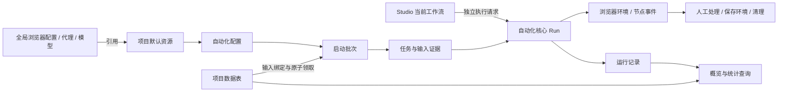

# AutoFlow 项目管理：业务整理与总体设计方案

- 日期：2026-09-12。
- 状态：**proposed，供用户审查**。历史已接受结论、源码事实和本次建议分别标记；不是实施完成声明。
- 定位：项目管理的总规格与模块拆分依据。先补齐整个模块的功能规格、跨模块规则与交互，再形成覆盖完整范围的实施计划；确认后分批开发。
- 证据：[研究说明与来源索引](../../project-management/research/README.md)、[历史结论](../../project-management/research/legacy-decisions.md)、[当前代码基线](../../project-management/research/current-baseline.md)、[原型目录](../../project-management/research/prototype-index.md)。
- 基线：旧项目 `324748abe7095f085b4ffb9467be9cb5c8851a5c`；新主线 `2faf2a037f16555482f7213a13efcd89a009eedd`；统一控件分支 `1fb58e188c3b1063c86e19d4c6d80bba0ecbe92e`。主目录 Studio 工作稿另作 working-tree 资料，不当成已实现功能。
- 推进方式（2026-09-12，confirmed）：用户要求先构建相对完整的功能模块，再小步开发。本次落实为“完整模块设计与计划先行，统一规格下分批实现”；具体业务取舍仍为 proposed。见[推进决策](../../../.ai/decisions/2026-09-12-project-management-complete-design-first.md)。

## 1. 建议结论

项目是**围绕同一业务组织数据、自动化、运行和浏览器环境的工作空间**。一个项目可以有多个自动化，共享项目数据；全局浏览器配置、内核、代理和模型通过引用使用。

保留已确认的六个项目页签：**概览、自动化、运行记录、统计、数据、环境**。项目列表是全局入口，项目基本设置放编辑弹窗和更多菜单。六个页签是用户的工作入口，不等于六套互相独立的后端。

先把整个项目管理模块的目标功能、业务路径、状态规则、页面交互和架构契约统一设计，再编写完整实施计划。开发阶段，项目管理与 Studio 可以按明确依赖并行，前后端按切片一起交付。首条真实执行链是计划中的验证步骤，不替代完整模块范围；多输入、持久环境和人工处理等关键规则在整体设计阶段先定清。

首期继续面向个人本地工具、Windows 与 macOS、CloakBrowser。无需旧数据兼容；不引入团队审批、权限角色、跨机器调度、工作流市场或另一套资源管理系统。本次不改变 Studio 的节点迁移范围。

## 2. 现实业务与历史演变

### 2.1 用于设计的业务场景

旧决策以“同一业务有注册、找回、资料更新等多个流程，人员、邮箱、账号等记录参与不同流程”为例。本方案将这些抽象为通用能力，**不创建专门的账号业务或行业专用数据模型**。

同时支持两条合法路径：

1. 数据驱动：导入待处理记录 → 自动化筛选并领取 → 执行 → 写回业务字段或数据状态 → 查看失败和人工事项。
2. 参数驱动：创建自动化 → 填写固定参数和浏览器资源 → 执行一次或明确数量的任务；没有数据表、输入或参数也可以是有效配置。

长期浏览器登录状态由项目环境承接，不放进全局浏览器配置。两条路径共享执行核心。整体设计同时覆盖两条路径及长期环境；实现顺序在完整功能与依赖明确后安排，不按最先实现的一条路径裁剪设计范围。

### 2.2 不能按旧目录直接复制的结论

| 历史内容 | 核实结果 | 新方案处理 |
|---|---|---|
| 项目六面板 | 9 月 10 日明确保留；早期缩减导航讨论被覆盖 | 沿用六页签；保留当前应用级导航 |
| 自动化五步向导、独立运行方案页、逐并发槽配置 | 被 R5 四页签与单一运行配置替代 | 不恢复旧动线，也不保留兼容接口 |
| 数据来源含外部 SQLite | 9 月 11 日数据规格改为 Excel、Sheets；旧代码尚未落实收缩 | 新系统不提供 SQLite 文件来源；内部 SQLite 存储继续使用 |
| Excel 记录只读 | 旧实现主要是导入、查询和系统状态；新规格要求本地 CRUD | 本地记录维护是需要实现的能力，不能宣称直接已有 |
| Sheets 推送返回成功即同步成功 | 旧代码存在这条路径；新规格要求推送后核验 | 拆分本地保存、已发送、待核验和云端确认 |
| 平面 AND 条件 | R5 后续支持嵌套 AND/OR | 保留有类型限制的条件树，不开放任意脚本筛选 |
| 浏览器内核在自动化里独立配置 | 旧管理页如此；新系统 Profile 已包含内核和代理 | 推荐以浏览器配置作为资源入口，避免两处内核冲突 |
| 运行记录、统计、环境图稿 | 多数是已选视觉或候选规则，旧实现仍有占位 | 按真实实体、事件和运行能力重新建立 |
| 工作流版本历史、快照 | 新 Studio 排除产品级版本库；运行证据仍需要固定当时输入和配置 | 内部运行证据单独裁定，不提供发布、回滚、版本比较 |
| 旧项目数据与接口兼容 | 本次用户已明确旧数据没有保留价值 | 新库按新模型实现；只迁移有价值的算法和业务规则 |

每项的版本关系及来源见研究文档。本表中的推荐调整尚待本方案确认。

## 3. 方案取舍

| 方案 | 交付方式 | 主要问题 |
|---|---|---|
| A：先逐页复制全部 UI | 六页签和弹窗先做齐，再补后端 | 容易复制失效字段，运行与统计长期依靠演示数据，返工集中在后期 |
| B：先完成整个执行引擎 | Studio 全部成熟后再做项目管理 | 项目数据、导入和环境管理长期无法使用，运行契约可能缺少真实业务约束 |
| **C：完整模块设计与计划先行，再分批实现（采用的推进方式）** | 统一六页签及跨模块业务规格、交互和契约；设计确认后形成完整计划，开发按依赖拆分，管理与 Studio 协同接入 | 前期需投入完整业务梳理；依赖与验收必须明确，避免分批开发演变为范围缩水 |

完整设计以当前项目管理范围为边界，不预建通用调度平台，也不要求 Studio 所有专项能力都先实现。先定义本模块实际依赖的接口、状态和失败处置，开发时按计划建立持久化和服务；保持单 sidecar、单本地数据库和成熟基础组件。

## 4. 核心对象及归属

| 对象 | 职责与关系 | 状态源 |
|---|---|---|
| Workspace | 当前应用数据根；包含多个项目和全局资源 | 现有设置与路径服务 |
| Project | 业务归属、名称、描述、归档、默认资源 | 项目领域 |
| Automation | 项目内可复用的业务配置：输入绑定、参数、资源和运行规模 | 项目管理应用服务 |
| WorkflowDocument | 当前流程、节点配置、变量定义与编辑内容；由 Automation 引用 | Studio/自动化核心 |
| DataTable / Record | 项目数据表及有稳定身份的记录、字段规则、来源与业务状态 | 数据领域 |
| Batch | 一次项目启动；控制领取上限、并发和停止，聚合任务结果 | 项目执行协调服务 |
| Task / CoreRun | Task 关联本次输入与业务结算；CoreRun 执行一个确定的流程请求 | 项目层关联核心 runId，执行结果由核心提供 |
| NodeAttempt | 一次节点尝试，保留重试链和结果 | 执行核心 |
| DataLease | 某记录当前由哪个任务占用、代次和回收状态 | 数据领取服务 |
| ManualAction | 一项待人工处理的任务及现场、期限、允许动作 | 运行协调服务；两处 UI 共用 |
| EnvironmentInstance | 当前浏览器现场及其独占使用、生命周期、清理状态 | 浏览器运行时与环境领域 |
| PersistentEnvironment | 项目保存的浏览器上下文及来源、引用、有效性 | 环境领域 |
| Operation / Event / Artifact | 长操作状态、已提交事实和日志/截图等证据 | 各用例写事实；读取侧组合 |

这是一张职责表，不要求每行都建独立微服务、数据库或通用框架。字段精确定义在开发前的完整详细规格中确定，各对象的业务关系和共享语义一起审查。

关键约束：切换项目不切换 Workspace、不重启 sidecar；删除项目不删除全局资源；执行核心不读取项目表，Studio 可独立运行；界面窗口不拥有业务真相。

## 5. 功能模块清单

### 5.1 项目入口与生命周期

- 创建、编辑、打开、搜索名称/描述、稳定排序、服务端分页、最近访问、活动/归档列表。
- 沿用历史名称约束：去首尾空白后 1–36 字符、描述 0–120 字符；同一 Workspace 内大小写归一后唯一，归档项目仍占名。后端承担最终校验。
- 打开仅更新最近访问，不能更新业务修订号和“最近修改”。列表不放跨项目启动、停止或批量运行。
- 归档只读、恢复、归档后永久删除。编辑、归档、删除使用乐观并发检查；冲突保留草稿并展示最新状态。
- 永久删除统一展示真实影响和名称确认；不显示尚不存在实体的虚假数量。

运行能力接入后，归档变为真实协调操作：先禁止新批次及数据领取，再停止活动执行；确认结束后归档。未发出的 Sheets 变化保留并显示数量，归档停止自动同步；正在发送或结果未知的操作须先核验或明确进入阻断状态。恢复不自动重跑旧批次、不自动发送旧队列。

项目永久删除需阻止仍运行、归属未知或清理未确认的资源，列出未同步本地变化；不会删除原 Excel、远端 Sheets、全局浏览器配置、代理或模型。数据库删除与本地文件清理采用可恢复的操作记录，失败保留可见的待清理结果。

### 5.2 概览：继续工作与处理异常

- 项目基本信息、自动化/数据表数量、真实数据变化摘要、当前活动、最近活动、需要关注、继续工作。
- 运行接通后增加活动批次、失败和等待人工入口。没有运行能力时显示能力状态，不用零值冒充“没有失败”。
- 每项活动携带对象身份与目标位置：同步失败进入对应表的来源设置；任务失败进入对应日志；人工事项进入同一处理详情；资源失效进入相关配置。
- 健康不做隐藏评分。保留受阻、需关注、正常、空闲，并增加信息过期/未知的呈现。仅对具体受影响能力说明阻断范围；某表 Sheets 推送失败不等于所有本地执行都不能运行。
- 业务状态（例如“待处理”“已完成资料”）不参与运行健康。概览、数据和运行统计中的“完成”不混用。

### 5.3 自动化：业务配置与 Studio 入口

- 列表支持创建、打开、编辑基本信息、删除、搜索、排序、分页、配置问题提示；零输入和零参数不标异常。
- 管理页保留四个页签：**基本信息 / 输入数据 / 参数配置 / 运行设置**；页签不代表步骤或完成度。一次管理保存采用一个事务，不能保存一半成功一半失败。
- 输入：具名输入、数据表绑定、必需/可选、字段契约、AND/OR 条件树、排序与只读可领取预览。没有默认主表，不按表行号拼接输入，也不隐式做笛卡尔积。
- 参数：名称、类型、默认值、必填与启动覆盖；批次内固定，和节点局部变量、实例变量、项目数据分开。
- 运行设置：浏览器配置继承/指定、代理继承/不使用/固定/代理组、最大任务数、并发、必要超时与停止行为。一个自动化一套配置，不出现逐槽编辑器。
- 进入 Studio 编辑工作流；当前工作流与管理配置独立保存，互不覆盖。
- 草稿允许不完整。**建议允许先编辑流程，把缺内核、浏览器配置等限制放到运行前**；这修订了旧项目“缺资源不能首次进入画布”的规则，并符合 Studio 可独立创作的方向。实际节点配置错误仍定位到字段。
- 项目自动化与核心工作流通过显式关联连接；不会因全局相同 ID 或名称自动跨项目共享业务配置。首期不增加工作流发布库、项目模板市场或项目复制全量数据功能。

归属建议：从项目创建的流程属于该项目的自动化；独立 Studio 创建的流程在显式绑定前保持独立。首期一个流程至多绑定一个项目自动化，避免无意联动修改；绑定时明确是否转为项目所有，默认只关联。项目删除只解除独立流程的关联；项目所有流程则列入删除影响，由核心确认无运行/编辑占用后删除。打开 Studio 的窗口方式不改变这个归属。

### 5.4 运行记录：批次、任务与人工处理

- 三个视图：批次、任务、等待人工。支持时间、自动化、状态筛选、分页、详情和返回恢复。
- 批次详情：启动参数、数据绑定、并发、上限、已创建/运行/成功/失败/取消数、停止状态和受阻原因。
- 任务详情：实际输入、执行证据、当前/结束节点、时间、业务结果、节点尝试、日志、输出及截图等产物。
- 节点重试保留同一任务和资源，新增 attempt；历史失败任务只读，不提供“重跑失败任务”按钮。用户修正数据状态或配置后启动新批次，由正常领取产生新任务，旧结果不覆盖。
- 只提供停止与强制停止，不加入批次暂停/恢复。停止先停止领取，再结束已开始任务；强制停止要确认受影响任务和现场。
- 人工详情共用一个业务对象：进入浏览器现场、查看任务、校验可继续节点、继续执行、人工结束、超期/现场丢失只读。环境页只是另一入口，不再复制一个人工待办系统。
- 运行结果、浏览器清理和业务状态分别展示。任务失败后清理成功仍是失败；任务成功但云端推送失败仍显示待处理同步。

### 5.5 统计：有口径、能下钻

- 支持时间范围、自动化筛选、刷新、成功/失败数量、成功率、吞吐与耗时、按日趋势、失败任务入口。
- 首期不做资源计费、CPU/内存时序仓库或自定义 BI。未采集的指标不显示估算值。
- 建议成功率 = 成功任务 /（成功任务 + 失败任务）；取消、中断、仍运行分别显示且不悄悄计入分母。分母为零显示“无样本”。
- 平均总耗时按有有效开始和结束时间的成功/失败任务计算，包含执行中人工等待和节点重试，不包含任务开始前排队；取消/中断单列。显示样本数，不能混用节点尝试耗时。
- 按任务结束时间归属统计区间；使用应用统计时区与明确的 `[开始, 结束)` 区间，不使用某个浏览器配置的时区。原始时间统一 UTC。
- 筛选条件、截止时间与查询结果版本固定到一次查询，图表、指标和下钻使用同一结果版本；仅固定截止时间不能防止迟到事件改变旧统计。服务端返回有有效期的结果标识，失效明确要求刷新；点击刷新原子更新整组结果。记录缺失或无效耗时单独说明。

上述精确口径属于本次推荐；旧统计 v2 仍为候选，不能将它的全部内容视为已批准。

### 5.6 数据：表、记录、字段、状态与来源

**数据表目录**：名称、用途、来源、记录数、最近活动、连接/同步状态；搜索、来源/状态筛选、排序、分页、创建及删除影响。

**表内五个页签**：数据记录、字段与校验、数据状态、来源设置、数据表设置。

| 子模块 | 必须具备的行为 |
|---|---|
| 记录 | 查询、筛选、排序、分页、列显示、详情、新增/编辑/删除、业务状态；失败保留草稿，版本冲突明确 |
| 字段与校验 | 稳定字段身份、名称/键、字符串/数值/布尔/日期、必填和已有格式规则；类型/删除变更先展示记录、来源映射和自动化影响 |
| 数据状态 | 每表自定义状态目录，初始为空；名称可变、身份稳定；修改或删除被引用状态必须显示影响 |
| 来源设置 | Excel 文件/工作表/导入批次；Sheets 连接/绑定/字段映射/拉取/推送/核验/错误；两条同步方向独立 |
| 表设置 | 名称、说明、视图设置、删除影响与项目归属；不暴露数据库技术操作 |

**Excel**：检查工作簿 → 选择工作表 → 映射字段 → 全表身份/类型校验 → 确认导入。inspect 与提交之间检查文件指纹。导入后是可维护的本地副本，不回写、不监测原文件。重新导入若采用全量替换，必须展示本地修改、记录引用和业务状态重置影响；有活动占用时阻止替换。新代次不根据行号接续旧任务。

**Google Sheets**：项目级连接，一张数据表对应一个工作表绑定。本地副本是任务读取和编辑的事实源；入站仅拉取新增记录，出站推送受管理字段的本地变化，不实现任意双向合并。人工保存先提交本地并触发即时推送，工作流变更按现有业务目标合并后周期推送，提供手动触发；周期等具体参数在同步切片确认。

推送必须经过 `待推送 → 发送中 → 待核验 → 云端确认`。超时/响应不明先核验，不盲目重发；失败保留本地版本和队列。远端既存记录改动、缺失、身份重复或字段结构变化明确提示，不覆盖未映射列、不按行号写回。手工改业务字段不自动改系统业务状态。

同一物理 Sheets 工作表若同时被多个项目独立维护，会产生跨项目写入竞争。**首期建议同一 Workspace 内只允许一个有效可写绑定**，冲突时显示现有归属；不是引入全局数据页面。Excel 同一文件的多次导入仍是独立本地数据集。Sheets 更换账号、工作表、身份或映射前须处理旧队列，操作固定目标与绑定代次，绝不把旧变更投递给新来源。此限制修订早期允许多项目引用同源的方向；将来有真实共享需求再设计共享写入协调。

**稳定身份**：优先验证可靠业务 ID，允许手动指定可靠字段，最后是明确确认的系统身份。身份禁止空值、重复、公式和不稳定浮点值；整数与字符串要按明确规则保留类型，前导零不能悄悄丢失。系统身份在 Excel 本地保存；Sheets 涉及写入归属列时需要明确动作和核验。绑定完成后身份不可任意修改，排序和插行不改变记录身份。

**占用期间编辑**：建议普通业务字段允许提交新版本，仅影响后续任务；已执行任务的输入证据不变。身份、删除、来源重绑、全量替换以及被运行依赖的字段结构变更受阻断。对正在占用记录的业务状态手工改动先禁止，避免与任务结算竞争；此项是本次取舍，不把旧候选设计自动当已确认。

不提供外部 SQLite 文件接入和历史兼容页。数据表可先保存空结构并配置来源；无来源的表处于待配置，首期不隐式增加第三种“独立手建数据来源”。

### 5.7 环境：浏览器现场与持久保存

- 四个区域：运行环境、等待人工、持久环境、项目默认资源。可用内部分段页签；不增加项目资源侧栏。
- 运行环境：所属任务/批次、来源浏览器配置、实际内核和代理摘要、状态、查看浏览器、诊断与清理。不能把配置卡片当运行实例。
- 临时环境默认在任务终结后清理；等待人工保留现场至明确期限；工作流显式保存或受控人工操作才形成持久环境。
- 持久环境：列表、搜索/状态筛选、详情、改名、备注、来源任务、保存时资源信息、引用影响、受控删除。更新名称不改身份或任务关联。
- **推荐持久环境作为独立上下文的保存来源**：后续任务从它创建独立工作副本，避免并发打开同一浏览器数据目录。若需要维护原环境，可显式进入独占维护会话，关闭确认后保存；不把当前任务自动写回共享来源。
- 首期只承诺在当前平台内保存/恢复相容的 CloakBrowser 上下文。跨机器、跨系统复制浏览器目录不等于登录态可迁移；暂不提供环境迁移/云同步能力。
- 浏览器配置的 seed 是模板字段；创建环境时将实际 seed 固化到环境记录。默认沿用所选配置，若用户明确要新指纹则显式生成并记录；不因每次运行自动随机化身份，也不让重置模板改变已有持久环境。
- 内核不再在项目里管理。项目选择 Profile，由 Profile 解析其内核；Profile 改动影响下次独立维护启动或新批次，当前批次后续任务仍使用本批已固定配置，既有现场也不改变。
- 代理可继承 Profile 或项目/自动化显式覆盖，UI 清晰显示最终来源。代理组按任务解析和记录具体结果；失败不静默切为直连。

环境规则 v3 的列表/重命名可作最新参考；清理和删除的状态规则尚需与真实运行时结合验证。

## 6. 跨模块必须统一的业务规则

### 6.1 资源继承与引用

推荐优先级：启动时明确覆盖 → 自动化运行配置 → 项目默认 → Profile 内部默认。只有该资源允许继承时才沿链解析；“不使用代理”是明确值，不是缺失。当前没有业务需求的启动覆盖字段不提前制作通用编辑器。

资源存在/配置有效与运行可用分开。断网不阻止保存有效引用；不存在或归属不合法的引用阻止新增绑定。已有对象变失效时保留原引用及草稿，提供修复入口；真实启动必须重新校验，禁止自动替换内核、代理或模型。

新增项目引用后，必须扩展全局 Profile、代理组、模型和内核的删除/占用检查。只在项目表单里禁用按钮不足以保护另一页面的删除。活动运行的使用关系与配置的静态引用分别检查。

### 6.2 批次领取与执行

启动时固定流程解释所需内容、参数、输入绑定/条件、有效 Profile 内容/版本/seed/内核以及代理策略和候选集合；实际记录值在**每个任务领取时**固定。池成员按任务从本批允许集合选择并检查当前可用性，记录实际分配；不把新加入成员或改动的端点悄悄带进旧批次。凭据通过引用按需取用，不将密钥复制进运行证据。预览可领取数量是估计，不是任务预先分配。

空闲并发名额到来后，重新检查批次可领取 → 查找合格记录 → 原子占用所有必要输入 → 记录任务输入 → 调用唯一核心执行入口。任一必要输入失败则全部释放本轮临时占用，不创建半成品任务。

任务写回必须携带预期内容/状态版本及有效租约代次。若人工在任务期间已保存新内容，任务不能用旧输入覆盖新版本；该写节点返回冲突并进入可处置的失败/人工路径，不自动读取新版本后强制覆盖。显式写字段/设置状态节点各自提交，数据修改、变更事件和必要同步意图同事务保存；之前成功的节点效果不会因为后续节点失败隐式回滚。下一写节点使用本任务已确认的新版本，结束节点不统一重写整条记录。核心通过注入的数据读写能力端口调用项目用例，不直接查询项目表；独立 Studio 不绑定此能力时，相关节点明确不可用。

**本次新增建议**：同一批次同一输入的已处理记录默认不再次领取，即便业务状态未修改；要再处理由用户显式创建新批次。这比旧“只按业务筛选决定再次领取”更保守，避免没有改状态的流程重复处理同一行；如实际业务需要同批反复领取，另行定义可见规则。数据排他保证同一有效记录不会被两个活动任务同时消费，不承诺外部网站动作具有事务式的“恰好一次”。

最大任务数和并发独立。正数为本批次总上限；不限数量只允许有必要数据输入且具备耗尽条件的路径。零输入/仅可选输入的参数型自动化默认运行一次，必须指定有限数量，避免无条件无限创建任务。

必要输入耗尽后不再创建任务，已有任务正常结束；被其他任务暂时占用、来源不可用、数据结构无效与真正无匹配分别处理。首期不通过“不限数量”隐式创建永续监听器。

### 6.3 运行证据与版本库

运行请求提交后，执行核心必须使用同一确定内容完成该次运行；保存编辑不能改变正在执行的流程。持久化排障必需的流程标识/内容摘要、必要节点配置、实际参数、数据版本和资源结果，凭据只保留引用。

此证据只用于解释当时执行，不增加版本列表、发布、对比、恢复编辑或重放历史按钮。它需要补到当前 Studio 的 Run 草案，是待双方确认的共享契约，不能借此引入完整工作流版本系统。

### 6.4 四条状态链分开

| 状态链 | 示例 | 不允许的推断 |
|---|---|---|
| 执行结果 | 排队、运行、等待人工、停止中、成功、失败、取消、中断 | 进程失联不等于成功停止 |
| 数据业务状态 | 用户定义；可未设置 | 执行成功不自动等于业务已完成 |
| 同步状态 | 待推送、发送中、待核验、已确认、失败 | 本地保存成功不等于云端成功 |
| 环境处置 | 活动、保存中、清理中、清理失败、结果未知、已清理 | 清理成功不覆盖失败任务结果 |

### 6.5 失联、取消、人工处理

- 失联立即撤销旧 Worker 的有效写入代次；不能仅因心跳到期就让另一个任务复用仍可能在运行的环境或记录。确认旧执行已终止/隔离后再释放；未知状态提供核验入口。这是对旧“立即释放”的可靠性修订。
- 所有写命令有可查询的操作身份；重复点击、请求超时和重连不能无条件重放。终态不能被迟到的进度事件覆盖。
- 人工继续前校验现场仍存在、任务仍等待、代次有效、目标节点及变量/输入前提满足。不能用任意跳转绕过节点前置条件。
- 等待人工释放执行名额，但保留数据占用、代理和浏览器现场。执行并发数与存活现场数量分别计数；首期存活现场上限默认等于配置并发数，达到上限停止创建新现场，继续人工任务优先调度。上限显式可见，不因释放执行名额无限累积浏览器；调整策略放运行设置的高级项。
- 人工期限、浏览器关闭、强制停止和正常继续并发时，后端只接受一个有效状态转换；失败保留当前事实和可行动提示。
- 退出/切换 Workspace 复用现有停机协调机制，把运行、环境保存、清理及同步写入纳入占用检查。关闭 Studio 窗口本身不等于取消运行。

## 7. 前后端架构落点

沿用当前 `apps/backend/src/autoflow` 分层和 `renderer/domains`，不恢复旧项目平铺 service/api 文件。以下是逻辑归属，只有切片需要时才创建目录。

| 能力 | 推荐落点 | 依赖边界 |
|---|---|---|
| 项目生命周期、默认资源 | `domain/projects`、`application/projects`、`domains/projects` | 引用全局资源，不调用全局页面组件内部逻辑 |
| 表、记录、身份、来源、同步 | `domain/project_data`、`application/project_data`、`domains/project-data` | 文件和 Sheets 实现放 infrastructure/providers |
| 项目自动化配置、批次与数据领取 | 项目管理应用服务，按实际复杂度拆 `project_automations` / `project_runs` | 组合数据/资源及自动化核心端口，核心不反向 import |
| 实例、保存与清理 | `domain/environments`、`application/environments`、`domains/environments` | 复用浏览器 provider、路径、凭据和进程能力 |
| 工作流、单次执行、节点日志 | 现有 Studio 专项约定的自动化核心 | 不要求 Project 才能编辑或运行 |
| 概览、统计 | 项目读取用例与查询 DTO | 消费事实，首期直接 SQL/聚合查询，不搭事件溯源平台 |

同一 sidecar、同一 SQLite 基础设施；管理写入与修订检查处于事务内。导入/同步/浏览器运行不占用长数据库事务，使用明确的后台操作状态。大表查询、筛选、排序和分页在服务端完成；不要把整张 Sheets 或所有日志先加载进 React 再筛选。

HTTP/OpenAPI 是唯一契约源，生成 TypeScript 类型；SSE 只通知变化，重连补查权威快照。TanStack Query 保存服务端状态，RHF/Zod 管表单草稿；Studio 的画布状态层按专项使用，项目 CRUD 不因此引入第二套全局 store。

完整设计阶段统一对齐本模块依赖的共享契约：工作流保存/校验、资源解析、单次启动/取消/查询、事件身份与顺序、输入输出/产物、环境生命周期，以及等待检查点、可继续位置校验、恢复同一 Run、人工终结命令和权威结果事件。P6 接入时依赖相应核心能力已实现并验证；项目层不能自行改 Task 状态冒充核心已继续/结束。名称和 HTTP 路由细节在实施计划前落实，尚无实现证据的部分明确技术验证门槛，不把关键业务语义推迟到 P6 开发时再决定，也不建立额外兼容协议。

## 8. 组件化与交互

- 统一控件分支尚未合入主线。实施前先核对合并基线，复用已完成的 tokens、Button、Input、Select/Combobox、Dialog、Drawer、Tabs、Table、Pagination、ScrollArea、反馈和表单组件。
- 基础 Table 不等于业务数据表。项目记录的列配置、单元格、筛选和编辑属于数据领域；只有实际跨模块重复的模式才提到 shared。
- 先完成复用模式，再组装页面：项目上下文头、资源引用选择器、修订冲突提示、影响确认、只读状态；领域内再实现数据表工作区、条件编辑器、批次列表、任务日志、环境详情。
- 应用导航沿用当前 AutoFlow，项目内部以顶部页签组织；原图的全局左栏和独立内核入口不作为新系统要求。浏览器管理等已定页面不随本任务改版。
- 长记录表/日志在容器内横向滚动，页面本身不被撑宽。长标题截断并可查看完整内容，大量候选使用现有可搜索选择器；严格资源引用不可自由输入伪 ID。
- 正常、加载、无数据、无匹配、局部/整体错误、过期、只读、忙态、冲突和结果未知均有明确定义。后台刷新保留草稿和筛选，不把错误结果替换成零条。
- 页面返回恢复项目、页签、筛选、排序与分页；从统计/活动进入任务后能回原上下文。同一人工详情从两个入口进入，返回来源各自保留。
- 嵌套弹窗复用既有浮层和焦点规则。危险确认默认焦点“取消”；忙态阻止重复提交；Escape/遮罩与草稿保护一致。键盘、输入法、缩放、读屏沿用设计系统验收规范。

## 9. 分阶段交付建议

### 9.1 开发前先形成完整模块基准

这是推进路线，**不是已获批准的逐文件实施计划**。用户已确认完整模块先设计、再小步开发的方式；当前总规格仍需完成以下设计工作，不能把已有功能清单当作全部规格已经齐备。

| 设计交付 | 完整范围与检查标准 |
|---|---|
| 完整功能地图 | 项目列表/生命周期及概览、自动化、运行记录、统计、数据、环境六页签；每项有用途、入口、输入、动作、结果和归属，明确范围内/范围外 |
| 跨模块业务规格 | 参数型与数据型运行、多输入组合及复用、数据写回、环境选择及持续保存、人工处理、同步、归档删除；每条关键规则有具体样例和异常结果 |
| 页面与交互基准 | 页面、弹窗、抽屉、空/加载/错误/冲突状态、跳转与返回、草稿保护及反馈；继承已确定的全局导航和控件规范，复核旧原型后补齐本模块交互 |
| 架构与共享契约 | 数据对象与归属、前后端边界、Studio 依赖及输入输出、核心状态与项目状态对应、资源和组件复用；平台差异集中在适配器 |
| 模块总体实施计划 | 设计确认后覆盖全部目标能力，标明每阶段依赖、文件范围、组件、前后端任务、测试与验收；可拆成总计划及有统一编号的子计划，但每项功能都有任务归属 |

先对[审查报告](../../project-management/reviews/2026-09-12/README.md)中的多输入、持久环境、Studio 接入、Sheets 绑定与公式规则形成一致设计。失败记录后续处理、空白本地表和结果导出的建议，在完整范围确认时明确纳入或排除，不因本次推进方式确认就自动纳入。

允许以只读源码核验、样例和独立验证解决设计不确定性；不把“以后开发该页时再决定”作为影响数据模型、共享接口和业务结果的关键规则。完整性只约束当前模块边界，不扩展团队协作、行业账号系统或 Studio 全部节点。

### 9.2 在完整方案下分批实现

以下 P1–P7 是候选实现分组，最终顺序由完整实施计划确定。小步指任务与验证粒度；每阶段均要求前后端契约、真实持久化、组件、页面和对应测试一起交付，整体完成标准覆盖全部已确认功能。

| 阶段 | 交付闭环 | 依赖与完成门槛 |
|---|---|---|
| P0：完整设计与实施计划确认 | 完成 9.1 全部设计交付、处理审查意见、统一 Studio 依赖、核对实现基线 | 功能→交互→契约→任务→验收可对应；业务设计和完整计划确认后进入实现 |
| P1：项目与资源底座 | 项目创建/编辑/列表/归档/恢复/删除、六页签壳、默认资源、真实概览配置活动 | 无演示项目或虚构运行指标；删除与归档服务端保护 |
| P2：本地数据闭环 | 表/字段/业务状态、Excel 检查导入、稳定身份、本地 CRUD、查询与冲突 | 从文件到可维护记录完整通过；原文件不改变 |
| P3：Sheets 与同步 | 连接/绑定、拉取新增、推送、核验、失败恢复及来源影响 | 使用授权测试资源验证本地和远端，不只 fixture |
| P4：自动化管理与 Studio 接入 | 四页签、输入条件/参数、资源解析、打开/返回 Studio、当前工作流保存 | Studio 已有真实文档保存；不以模拟运行动画验收 |
| P5：运行与批次执行 | 按已设计规则从参数单次、单输入小批次逐步接入完整的输入组合、占用、停止、日志和回收 | 首条真实执行链先验证集成；该组完成时覆盖本模块已确认的完整执行范围 |
| P6：环境与人工业务 | 持久环境保存/维护/引用、人工现场/继续/到期、异常回收 | 使用真实浏览器验证现场、登录上下文、并发和失联 |
| P7：概览统计与整体收口 | 真实活动/健康/下钻/统计、完整归档删除、性能与跨平台验收 | 同一数据集数字可复算，真实应用端到端闭环 |

完整设计和计划确认后，P2/P3、Studio 专项及环境切片可以在依赖允许时并行；P5/P6 的接入遵循同一契约与依赖表。Sheets 不自动成为本地运行的前置条件；先验收单输入不等于取消多输入，环境较晚实现也不等于较晚才设计选源和保存语义。

录制、元素拾取、调度、AI 辅助和更多节点沿 Studio 原有专项排期，不隐含在项目管理“全部页面完成”里。定时启动最终调用同一批次/核心执行入口；当前手动启动闭环稳定后再加入，不制作第二套调度执行器。

## 10. 验收清单

| 类别 | 自动验收 | 真实应用 / 人工验收 |
|---|---|---|
| 项目隔离 | 跨 projectId 请求拒绝；同名/修订/归档竞争；删除只影响归属对象 | 两项目切换、返回、重启持久化、归档恢复 |
| 数据 | Excel 指纹/重复身份/前导零、CRUD、字段影响、分页与状态；原子多输入占用 | 导入真实样例并编辑，原文件不变，重导入保护 |
| Sheets | 超时、登录失效、并发修改、身份重复、发送后核验、队列恢复 | 授权表真实读写及故障恢复，核对远端最终内容 |
| 自动化 | 四页签聚合保存、条件树、空输入/参数、失效引用、草稿不互相覆盖 | 配置 → Studio 编辑 → 返回 → 再打开内容一致 |
| 执行 | 幂等启动、停止/强停、节点重试、失联 fencing、终态/迟到事件 | CloakBrowser 实际执行及手动关窗；结果不明时可核验 |
| 人工与环境 | 独占维护、保存/删除影响、超期/继续竞争、清理失败不改任务结果 | 真实现场继续、保存后恢复、同目录不会并发打开 |
| 统计与概览 | 固定样例复算，窗口/时区边界、重试不增加任务数、下钻一致 | 从异常进入对象，返回保留筛选，零样本/失败态正确 |
| UI | 领域组件、表单、焦点、嵌套浮层、长内容、缩放与无障碍检查 | 至少 1440×900、1100×760，并覆盖 100%/125%/200%；真实输入法与键盘 |
| 系统 | OpenAPI、pytest/mypy/Ruff、Vitest/tsc/ESLint、构建、迁移完整性 | Windows x64、macOS 的启动/打包/退出/恢复，按架构分别记录 ARM/Intel |

规模目标先沿历史工作负载验证：20–100 个项目、长表和日志分页；详细切片使用固定行数/节点数/并发数及机器信息建立基线，不未经测量承诺统一毫秒数。展示页只辅助基础控件验收，最终必须走真实业务页。

本轮只进行了文档和源码研究；没有运行新业务、联网操作 Sheets、启动工作流或执行跨平台测试。任何旧报告的测试数都不能抵扣新系统验收。

## 11. 审查重点与下一步

建议整体验收以下取舍：六页签与四页签管理；Excel/Sheets 两来源且 Excel 本地可维护；项目只引用全局资源；资源缺失允许流程创作、阻止运行；环境独占维护与任务工作副本；内部运行证据不扩展产品级版本库；运行前后四条状态链独立。

下一步先把本模块整理为完整功能地图和详细业务规格，集中处理审查意见，补齐交互与共享契约；经整体设计确认后，使用 writing-plans 编写覆盖完整范围的总计划与子计划，再按计划分批开发。保留组件先于页面、前后端一起交付和独立审查；不会把六页签分派为互不相干的页面任务。
