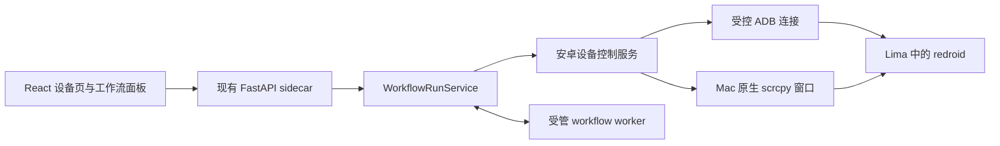
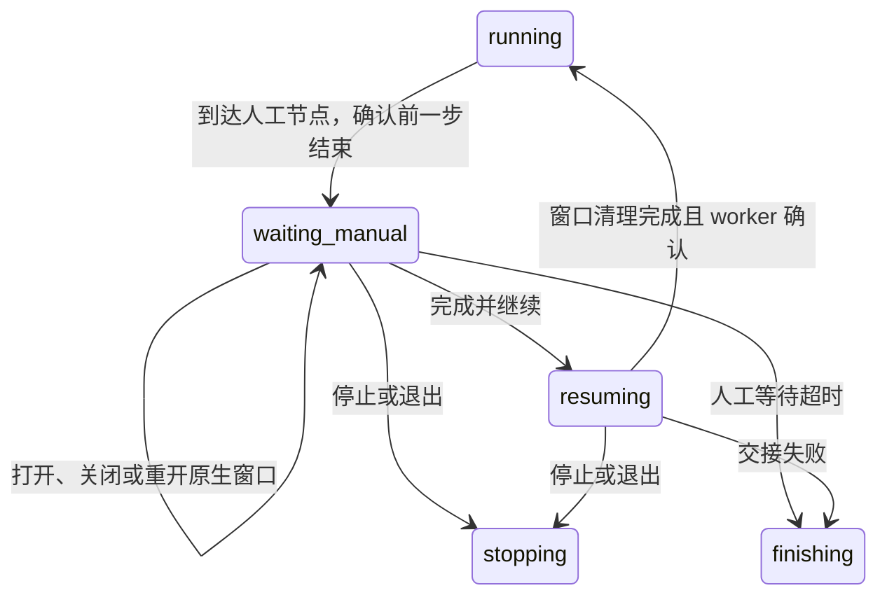

# 安卓工作流与原生窗口交接：首个正式切片

- 日期：2026-09-13；状态：**proposed，待用户确认实施**。
- 授权范围：用户同意开始“接口与状态设计，再接入正式系统”；本文件不是已实现能力声明。
- 输入：当前正式 workflows 源码、M2/M3 约束，以及用户已通过的 [Mac 原生窗口验证](../../../reference/redroid-demo/NATIVE_MAC_TEST.md)。
- 实施计划：[安卓工作流交接计划](../plans/2026-09-13-android-workflow-handoff-implementation.md)。

## 1. 用户得到什么

工作流绑定一台安卓设备，启动应用、执行动作、保存截图；走到“人工处理”节点时停止自动输入，用户从页面打开 Mac 原生窗口完成操作，然后点击“完成并继续”。系统关闭该原生连接、确认控制权收回，才执行后续节点。结束时释放设备占用，Android 和数据保留。

首个真实验收流程：**绑定测试设备 → 打开系统设置 → 截图 A → 人工进入任意设置子页 → 完成并继续 → 自动返回 → 截图 B → 释放设备**。另用一次坐标点击验证动作节点。截图和事件保存在本次运行的产物与历史中。

### 首版范围

| 包含 | 本阶段边界 |
| --- | --- |
| Mac 原生 Android | 已验证的 Apple Silicon Mac → Lima Linux → redroid；沿用固定 scrcpy 3.3.4。Windows 返回明确不可用，不声称已验证 |
| 设备选择和占用 | 一个本地运行环境；一次运行只绑定一台设备；沿用每工作区一个活跃运行 |
| 自动执行 | 五个节点：启动应用、点击坐标、系统按键、截图、人工处理 |
| 人工操作 | 原生 scrcpy 窗口；页面负责状态、打开、完成并继续、停止 |
| 故障处理 | 启动失败、设备离线、超时、取消、窗口异常退出、应用退出、服务重启、清理失败 |
| 暂缓 | 多工作流并行、设备池自动分配、浏览器与安卓混合图、任意节点即时暂停、录制、中文输入、APK 管理界面、摄像头、环境伪装、集群 |

批量需求仍保留在产品目标中。本切片不取消 `active_slot` 唯一约束，不把“能开三台模拟器”当成“能并行跑三条工作流”。后续扩展需独立设计运行配额、排队、公平性和设备池。

## 2. 已核实的现状与缺口

依据为 HEAD `49637e9` 及当前工作区读取结果；工作区同时存在另一任务的 M3 未提交修改，实施前必须重新核对合入基线，不能覆盖它。

| 现有代码 | 事实与本次影响 |
| --- | --- |
| `application/workflows/runs.py` | start 强制获取 Profile、浏览器内核和代理；运行接入不能只增加节点列表 |
| `domain/workflows/runs.py`、HTTP run schemas | 活跃态只有 starting/running/finishing/stopping，没有人工等待；Profile 字段必填 |
| `infrastructure/process/workflow_worker.py` | 进程环境和 payload 绑定 CloakBrowser；读取事件有节点时间预算；人工等待必须改预算，不能靠无限超时 |
| `providers/browser/workflow_worker.py` | stdin 后续用于退出监控，没有“人工完成后继续”的命令协议 |
| `infrastructure/database/workflow_runs.py` | 单活跃名额、快照/事件原子写入、崩溃记录 interrupted；新增等待态必须仍占名额 |
| `RunToolbar.tsx` / `useWorkflowRun.ts` | 顶栏依赖浏览器配置；保留现有草稿快照、请求幂等和响应世代机制，补安卓资源选择 |
| reference 原生启动器 | 一次一个窗口的内存锁只约束 8082 自身，8081 的旧 Demo 可以绕过它；不能用作正式设备控制权 |

复用 M2 的运行记录、顺序事件、产物下载、停止清理和离开协议。新增安卓 provider 与必要的资源模型，不另建工作流数据库、WebSocket 服务或通用调度框架。

## 3. 运行和设备边界

- React 不提交 shell、ADB 地址、可执行文件或宿主路径。Electron 保持窗口/sidecar 生命周期职责，不执行安卓动作。
- Python application 管理资源占用和交接；Mac 路径、Lima、SSH、scrcpy 和进程身份落 platform/provider/infrastructure。业务层不判断操作系统。
- 安卓 worker 负责节点顺序和变量，**不持有可自行输入的 ADB 连接**。经已有 JSONL 管道发送有界、带 requestId 的设备命令，由父进程的安卓控制服务串行校验并执行。这样所有自动输入只有一个入口；worker 无法在人工窗口存活时绕过控制服务继续输入。
- JSONL 仅增加固定命令/响应，限制单消息 64 KiB；PNG 通过既有产物存储落盘，管道只传元数据。浏览器 worker 分支保持原行为，不为安卓单独启动第二套服务。
- 原生窗口由同一控制服务启动和持有；关闭页面、刷新或 SSE 断开不释放设备占用。应用退出按现有离开协议停止并清理。

### 设备如何进入正式切片

首版使用一台**独立创建的集成测试设备**，不自动接管现有三台 Demo 设备。提供一次性准备命令和“连接检查/设备选择”，先不实现完整创建向导。

准备命令只创建新 container/volume，写入 AutoFlow 安装与工作区归属标识、稳定 deviceId；在正式设备表登记容器 ID、卷 ID、镜像 ID/digest 与运行环境标识。Docker 名称前缀和归属 label 与 `afd-` / 旧 Demo labels 分离；正式接口只接受登记且归属相符的设备。已有三台 Demo 与测试文字原样保留。

provider 通过已配置的 Lima 环境和固定 argv 的 Docker/ADB 命令执行，直接检查真实容器及 Android readiness，不调用旧 Flask 8081/8082 服务。重用 reference 中验证过的思路，复制自有代码须记录来源；两个上游仓库保持只读。端口每次 inspect，不能保存动态 ADB 端口当设备身份。

首版只允许一个 AutoFlow 控制器管理该运行环境：使用由平台适配器持有的安装级独占锁，拒绝第二个控制器；登记设备也校验工作区归属。锁由统一路径服务分配，不能由前端指定。锁取得后仍要完成遗留进程核验，不能认为“进程锁释放”就等于 Android 没有在执行命令。

排他承诺覆盖 AutoFlow 所有入口；人为在终端直接连接 ADB/Docker 不在这个软件锁的控制范围内。旧 Demo 必须无法通过其归属筛选管理新设备，纳入契约测试。

## 4. 设备占用与控制权

把两个概念分开：`ownerRunId` 表示整轮占用；`control` 表示当前允许谁输入。进入人工处理时，ownerRunId **不变**，不能把设备释放到空闲池。

拟新增设备记录字段：`deviceId, name, runtimeId, containerId, volumeId, imageId, workspaceId`；运行时投影：`androidStatus, ownerRunId, control, generation, nativeSession, lastError`。容器/卷内部定位信息不进入普通 UI DTO。

`control`：`idle | workflow | opening_manual | manual | closing_manual | recovery_required`。`nativeSession.state`：`starting | open | closed | failed`，附 sessionId、handoffId、简短原因。浏览器不持有内部控制凭证。

| 时刻 | 设备控制权 | 允许的行为 |
| --- | --- | --- |
| 接受安卓运行 | idle → workflow，写入 ownerRunId | 本运行的固定安卓命令；其他运行、独立手动窗口和设备变更返回 409 |
| 到达人工节点 | run 进入 waiting_manual，设备仍归本运行 | 暂停自动命令派发；等待用户打开窗口或直接继续 |
| 打开窗口 | opening_manual → manual | 确认没有未结束设备命令后启动 scrcpy；窗口真实就绪才显示可操作 |
| 用户自行关窗 | manual → workflow，但 run 仍 waiting_manual | 可重开窗口、完成并继续或停止；**关窗不自动继续** |
| 点击完成并继续 | run → resuming；control → closing_manual | 禁止再打开；先退出窗口进程、确认控制连接清理，再派发继续 |
| 继续确认 | control → workflow，run → running | 当前人工节点成功，推进下一节点，不重跑此前节点 |
| 运行停止/结束 | 清理后清空 ownerRunId，control → idle | Android 保持运行，卷和应用数据保留 |
| 任一清理结果不明 | control → recovery_required，保留占用 | 拒绝新运行、继续、窗口重开；只允许读状态和重试清理 |

不提供强制抢占，不用超时自动“抢锁”。每次交接增加 generation；旧请求、旧窗口退出通知不能释放新会话。父进程校验 runId、当前节点、handoffId、generation 和允许的动作；worker 只在匹配交接的继续确认后推进。

## 5. 人工节点与运行状态

在现有八种 RunState 上增加 `waiting_manual` 和 `resuming`，两者都属于 ACTIVE_RUN_STATES，继续占工作区名额并触发离开保护。停止优先于打开窗口和继续；终态保持 succeeded/failed/cancelled/interrupted。

`handoff` 投影：`handoffId, nodeId, state, prompt, deadlineAt, nativeSessionId, error`。handoffId 由服务生成，绑定本次 run/节点进入序号；不能只拿 nodeId 当交接身份。人工节点尚未继续时不加入 completedNodeIds。

本切片只做显式“人工处理”节点，不提供在任意动作中点暂停后即时接管。固定节点天然给出动作边界，避免输入已提交但还没结束时同时交给人工。

人工节点默认预算 600 秒，可配置 30–3600 秒；从进入该节点开始计时，包含窗口打开、等待和恢复交接，重开不重置。倒计时以后端 deadlineAt 为准；超时关闭窗口并清理，记 `ANDROID_MANUAL_TIMEOUT`，不自动继续。进程通信采用 5 秒心跳、15 秒失联判断作为初始设计常量；心跳不延长节点预算。最终数值需实现时通过真实测试验证，不能把人工等待当 worker 卡死。

继续请求先持久化 resuming 和请求身份，再做清理；只有清理已确认且继续决定已持久化，才向 worker 发继续。写库失败时保持等待/恢复，不先发动作再补记录。停止一旦取得控制，后到的继续返回冲突；清理任务沿用 shield 和可重试所有权。

## 6. 节点与运行绑定契约

保持 workflow document 的 schemaVersion 和浏览器现有节点名。节点目录增加 runtimeKind/category；安卓图与浏览器图首版分别运行，混用返回定位到节点的 422。运行前校验资源能力，不能让安卓图为了满足旧参数而偷偷启动浏览器。

| 节点类型 | 关键配置 | 语义与输出 |
| --- | --- | --- |
| `android_launch_app` | packageName，timeoutSeconds 默认 30 | 严格校验包名，解析 launcher 并确认启动结果；没有 launcher 明确失败，不执行用户 shell |
| `android_tap` | x/y 整数；basisWidth/basisHeight；timeoutSeconds 默认 15 | 使用上一张截图的实际设备像素基准；实时尺寸不符报 `ANDROID_SCREEN_CHANGED`，不按窗口大小猜坐标；相同尺寸的内容变化由流程自身负责 |
| `android_key` | key 枚举 HOME/BACK/ENTER/APP_SWITCH；默认 15 秒 | 固定按键映射；完成表示命令成功，不宣称业务页面加载完毕 |
| `android_screenshot` | variableName；默认 15 秒 | 真 PNG、原始宽高、时间及设备信息；输出 `{artifactId,width,height}`，复用现有产物下载与防路径逃逸 |
| `android_manual` | prompt；timeoutSeconds 默认 600 | 暂停自动动作；人工明确继续且连接清理确认后成功；无秘密输入日志 |

初版坐标采用设备绝对像素，截图宽高由结果面板提供。可视化点选、控件树定位、滑动和文字节点另加切片，避免把 CUA 的 Mac 坐标问题带入工作流。所有自动动作经安卓命令接口执行，不驱动 scrcpy 窗口。

运行启动扩展为 `{runId, document, layout, target}`，其中 target 为 `{kind:"android",deviceId}` 或 `{kind:"browser",profileId}`。兼容现有顶层 profileId：只有未传 target 时才解释为浏览器；同时传两者返回 422。

浏览器旧请求哈希算法保持不变，新 browser target 归一化到同一输入再计算，防止升级后同 runId 的合法重试变成冲突；android 使用独立 target 参与哈希。相同 runId 不同设备拒绝。安卓运行快照保存 deviceId/name/imageId/分辨率等实际观察，不保存 ADB 地址或令牌。

RunRead/RunSummary 增加 `target`、`targetName`，RunRead 增加 `targetSnapshot`、可空 `handoff`。旧 profileId/profileName/profileSnapshot 为兼容保留：浏览器有值，安卓为 null；生成客户端和 UI 必须同步接受 null，禁止伪造 Profile。读取历史记录时从旧字段补 browser target，不改写旧历史请求哈希。

## 7. HTTP 和进程控制契约

沿用正式 sidecar token 校验、结构化错误和 OpenAPI，不沿用 reference 的固定端口认证方式。

| 接口 | 输入 | 结果 |
| --- | --- | --- |
| `GET /api/v1/android/environment` | 无 | 实际环境能力与诊断；未安装/不支持平台给明确原因 |
| `GET /api/v1/android/devices` | 无 | 当前工作区已登记且归属通过的设备投影，含占用状态；运行环境不可达不能回假空闲 |
| `GET /api/v1/android/devices/{deviceId}` | 无 | readiness、占用、窗口状态与错误 |
| 既有 `POST /api/v1/workflows/runs` | 新旧 RunStart | 沿用 201 和 runId 幂等；202 不代表已执行的问题不另创一套语义 |
| `POST /api/v1/workflows/runs/{runId}/handoffs/{handoffId}/open` | `{requestId}` | 202，返回当前运行；失败通过 run/handoff 状态展示；同 requestId 不重开进程 |
| `POST /api/v1/workflows/runs/{runId}/handoffs/{handoffId}/continue` | `{requestId}` | 202，进入 resuming；重复同请求返回已有结果，禁止推进两次 |
| 既有 `POST .../{runId}/stop` | 无 | 停止并清理本轮连接和 worker；清理失败沿用 503 可重试，不显示已释放 |
| 既有 get/events/stream/artifacts | 原有参数 | 新增人工交接事件，seq 原子递增；刷新补读恢复当前状态 |

requestId 为 UUID。控制请求回执随 run payload 保存，限定本轮 handoff 与 command；相同 ID 不同命令返回 409。旧 handoff 的新命令返回 `ANDROID_HANDOFF_STALE`；重复已接受命令查询旧回执，不能创建新窗口。一次运行图有界，回执按节点进入次数有界保存。

初版人工窗口只从活跃运行的人工节点打开。资源页其他时间提示“请在含人工处理节点的运行中打开”，不先实现第二套独立手动会话；reference 手动 Demo 保留独立用途。

新增事件：`manual_requested, native_opening, native_opened, native_closed, native_failed, resume_requested, resumed`；现有 RunEvent 可承载 type/message/nodeId/error，详细状态通过 RunRead.handoff 查询，避免把原生 PID 或控制凭证塞入公共事件。旧事件消费者忽略未知 type 后刷新运行，不能报解析崩溃。

内部 worker 设备请求为 `{type:"android_command",requestId,runId,nodeId,operation,args}`；operation 仅上述自动节点及进入人工等待。父进程关联该 worker 的运行身份，不信任其自行提供的其他设备标识。命令的 generation 由父进程从当前资源记录取得；同一时刻每台设备一个未完成命令。响应为结构化 result/error，另有绑定 handoffId 的 resume 确认。EOF/服务丢失结束 worker，禁止离线继续执行。

## 8. 失败与恢复必须满足的规则

| 情况 | 必须发生 |
| --- | --- |
| 等待 Android 启动超时 | 本轮失败；不打开窗口、不执行下一节点；保留设备数据 |
| scrcpy 启动失败 | run 仍 waiting_manual，记录错误；预算内允许新 requestId 重试或无需窗口直接继续 |
| 用户关窗/窗口异常退出 | 记录 closed/failed，run 仍等待；失去窗口不等于人工已完成 |
| ADB 命令超时或连接断开 | 停止新输入；不能因本机 adb 退出就假定 Android 命令已结束；无法确认则 recovery_required |
| 点击停止与继续并发 | 一个串行决定点；停止获胜后不再派发动作；迟到的“已打开”窗口立即归清理任务处理 |
| 关闭 Studio、切换工作区、重启服务 | 复用保存/停止/取消离开协议；waiting_manual/resuming 同样阻塞；清理成功后才离开 |
| UI 断线或刷新 | 后端仍持有设备；查询原 runId/交接，不重建运行、不断开窗口 |
| sidecar/worker 崩溃 | 历史运行标 interrupted，不重放；设备先 recovery_required，核对并回收本次登记的进程/连接后才 idle |
| 清理或数据库写入失败 | 原清理责任和占用继续保留；可显式重试，不用 finally 无条件解锁 |

原生进程和 SSH 隧道登记 PID、进程出生身份及本次 session 标识；信号前复核，避免 PID 复用。重启后先检查登记的遗留会话，不扫描并杀死用户其他 scrcpy/ADB。不得 `adb kill-server`。ADB 操作结果不明时隔离设备；本切片不自动停 Android 来消除不确定性，需要有明确诊断的恢复操作。

设备占用/未清理会话持久化到新增设备表，供重启核验；活跃 run 的历史状态与设备可复用性分开，标 interrupted 不得自动清空设备隔离。M2 原有浏览器恢复行为保持，安卓恢复在 bootstrap 装配完成后运行，恢复完成前拒绝设备新命令。

## 9. 页面呈现

沿用用户选中的暖灰与棕色资源卡片方向、现有 shadcn/Radix 基础控件。本切片不再生成另一套视觉方案。

- 设备页卡片：名称、Android 就绪、尺寸、占用运行、原生窗口状态；资源故障明确显示原因。
- 工作流顶栏：根据节点 runtime 显示“安卓设备”或“浏览器配置”；不允许在活跃运行中换设备。
- 人工节点状态面板：任务提示、设备名、剩余时间、“打开操作窗口”“完成并继续”“停止运行”。窗口已开时按钮禁用，说明去 Mac 窗口操作；resuming 时展示“正在收回控制权”，禁用重复命令。
- 关窗后的提示：“窗口已关闭，工作流仍在等待”；不显示完成勾号，不自动重开。
- 运行结果：截图 A/B 和交接事件；历史/当前草稿不一致沿用原有标记规则。
- 加载、环境不可用、设备忙、超时、结果未知、清理待重试、刷新恢复均有组件测试；文案不把 control/generation 等内部实现术语暴露给用户。

## 10. 落点与不变量验收

新增 `domain/android`、`application/android`、`providers/android` 及 HTTP android adapter；平台差异在 `providers/platform` 或既有平台适配层。进程、数据库和路径继续放 infrastructure。前端新增 `renderer/domains/android`，工作流内只加节点配置与交接面板。具体文件按垂直切片创建，不先搭空目录。

数据库新增设备/占用/会话记录迁移；编号以实施时当前 Alembic head 为准，不预占编号、不修改 0005/0006。运行的新 target/handoff 字段存既有 JSON payload，读取旧记录补默认；request hash 保持兼容。

必须通过：同设备竞争只有一个接受；人工窗口在启动/使用/关闭期间没有自动输入；继续与停止竞争不重复派发；关窗不推进；断线刷新不重放；所有等待态保持工作区活跃名额；清理失败不解锁；旧 session 不能清理新 session；新设备不被旧 Demo 操作；浏览器 M2/M3 回归仍通过。

方案置信度：Mac 人工操作可行性高（自动验证及用户反馈）；与工作流对接的接口和边界为设计结论，尚未实施验证。批量、跨平台与混合工作流不据此宣称支持。
