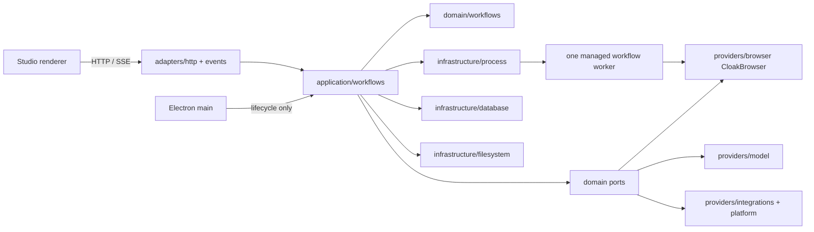

# Studio 后端 WebRPA 迁入设计规格

状态：已批准并进入实施；B0 数据兼容与范围护栏已完成，B1 实施中。

日期：2026-09-15

## 1. 目标与权威来源

目标是在 AutoFlow 正式 sidecar 中迁入冻结 WebRPA 后端的真实业务能力，直接接上已经完成的 Studio 前端。产品可见行为以冻结源码为基准；浏览器、存储、进程、服务、凭据和 Electron 宿主边界按 AutoFlow 现有架构适配。

权威顺序如下：

1. [后端全局约束](../../automation-studio/BACKEND_GLOBAL_CONSTRAINTS.md)：仅 CloakBrowser、仅批准节点、遵循 AutoFlow 架构、小助手实际使用 LangGraph。
2. [当前范围决定](../../migration/studio-frontend-completion/scope-database-dp-cloakbrowser.md)：227 个节点、中文单语言、Studio 只消费主应用 CloakBrowser Profile。
3. [逐节点能力台账](../../migration/studio-frontend-completion/capabilities.json)：每个节点的前端证据和 `backendMigration` 后端映射。
4. [前端交接合同](../../migration/studio-frontend-completion/backend-handoff.md)、[合同矩阵](../../migration/studio-frontend-completion/contract-matrix.md)和其直接引用：请求、响应、事件、错误、分页、幂等和恢复语义。
5. 冻结源码 `reference/WebRPA`，提交 `5ccb900e8dcf1530aae66f676d87593c416c7ebb`，产品版本 3.2.0。
6. 本规格与[实施计划](../plans/2026-09-15-studio-backend-webrpa-migration-implementation.md)。

冻结仓库的 [许可证副本](../../../LICENSE.WebRPA) 与上游 `reference/WebRPA/LICENSE` 哈希一致。项目负责人于 2026-09-15 确认已经获得在本项目范围内使用并迁入 WebRPA 源码的授权，源码使用不再阻塞实施。该确认不表示某种具体商业授权或公开发布授权；每个迁入文件仍须保留来源 commit、原路径、上游许可证和修改记录。

历史 M1–M6 和旧 R0–R8 文档只用于查找已验证的失败场景，不恢复其自定义执行模型。若历史说明与上述顺序冲突，以上述较高层事实源为准。

## 2. 已核实基线

| 范围 | 当前事实 | 结论 |
|---|---|---|
| 前端 | 227 个节点、配置、工具、Store、运行/Debug/拾取/录制/日志/资源界面和正式窗口已验收 | 前端已验收，不重新全量审计 |
| Mock | memory 与 HTTP/SSE Mock 已验证命令身份、事件补读、错误和恢复 | 只证明消费协议，不证明真实动作 |
| 真实后端合同 | `workflow_studio_schemas.py` 和 OpenAPI schema 导出存在；生产工作流路由未注册 | DTO 可复用，业务实现待迁入 |
| 真实工作流实现 | B0 已加入 227 节点运行时范围护栏；仓储、worker、执行器、拾取和录制仍待 B1–B8 迁入 | 不从 Mock 或范围护栏推断节点已经可执行 |
| 工作流存储历史 | 历史 Android revision 已逐字恢复，`0011_merge_android_project_data` 是唯一 head；临时历史库与故障回滚通过，ORM 与仓储尚未接回 | 可复用既有表意；正式用户数据库必须先验证只读副本 |
| 浏览器基础 | Profile、CloakBrowser 内核与 License、测试浏览器 worker、Profile 使用锁和受管进程清理存在 | 作为正式会话适配基础，不复制原浏览器配置系统 |
| 其他基础 | 模型、系统凭据、代理、工作区停写、sidecar、窗口离开协调存在 | 通过端口复用，禁止节点直接读取全局配置 |
| 冻结执行器 | 227 个节点全部找到真实入口；226 个装饰器注册，`subflow` 手动注册 | 源码覆盖完整，运行语义仍需差分测试 |

节点分布为：B1 首个真实闭环 5 个、B2 其余网页节点 30 个、B3 控制流/变量/画布 21 个、B4 纯数据与表格 88 个、B5 AI 22 个、B6 触发器及外部能力 61 个。110 个执行器以原版直接迁入为主，117 个涉及 AutoFlow IO 边界适配。

## 3. 明确范围

### 3.1 纳入

- `capabilities.json` 中当前 227 个节点的真实执行行为及独有配置分支。
- WebRPA 图解析、并行、条件、循环、错误边、重试、变量、子流程、自定义模块和必要画布几何语义。
- 工作流保存、运行、Debug、拾取、定位测试、录制、日志、结果、产物、运行期输入和脚本回传。
- 节点依赖的模型、MCP、凭据、网络、通知、SSH、共享、触发器、计划任务、图片资源和路径服务。
- Studio 小助手的多轮状态、模型/工具调度、批准/拒绝、取消和恢复；使用 LangGraph 实际编排，工具集合仍受 227 节点范围和前端权限合同约束。
- AutoFlow 工作区隔离、Profile 和内核占用、sidecar 与 worker 监护、停止清理、OpenAPI 和正式 Electron 生命周期。

### 3.2 排除

- 数据库 48 个节点和 DP 反检测 9 个节点；兼容层只识别并明确拒绝旧文档，不迁入执行器。
- 先前已排除的 Excel/PDF/WPS/Word、SAP、Windows 桌面自动化、音视频/图像编辑、机器人、飞书、发布/版本和企业管理能力。
- WebRPA 浏览器类型、可执行文件、扩展目录、启动参数和内核管理 UI；这些由主应用 CloakBrowser Profile 管理。
- WebRPA 运行时进程、目录或远程协议兼容层；AutoFlow 不启动外部 WebRPA。
- 新的通用调度框架、插件平台或第二套工作流 IR。
- 用 LangGraph 替换普通工作流执行器，或增加绕过 LangGraph 的第二条完整小助手循环。

## 4. 方案选择

采用“保留业务内核、替换 IO 边界”的迁入方式：

- 原执行器类、注册次序、图解析、变量解析、条件/循环/并行/子流程算法和错误策略按源码迁入。
- 原 `app.main`、`app.api`、全局 `browser_engine`、进程内单例、目录拼接和明文配置访问改为 AutoFlow domain port 或 application callback。
- 前端现有合同是唯一 renderer 接口。后端在 adapters 层适配字段，执行器内部不感知 HTTP/SSE。
- 一次运行使用一个受管 worker；Debug 命令复用该 worker 的有限控制协议。拾取和录制使用同一浏览器会话端口与互斥协调，不建设通用 RPC。

没有采用以下方案：

- **整目录复制 WebRPA backend**：会破坏依赖方向、复制全局状态和多浏览器配置，无法安全接入工作区与凭据。
- **根据前端合同重新写执行器**：会丢失经过使用验证的图解析、变量、重试和节点边界，违背复刻目标。
- **恢复历史 M1–M6 后端**：其节点模型和控制语义已经被当前 WebRPA 迁入方向替代，只能复用通用进程、测试和故障经验。

## 5. 目标架构

依赖继续遵守 `adapters → application → domain`，具体 infrastructure/provider 实现由 bootstrap 装配。执行器不能 import FastAPI、SQLAlchemy、Electron 或 HTTP route；provider 不能反向调用 adapter。

### 5.1 领域层

`domain/workflows` 保存没有 IO 的规则：

- WebRPA 文档节点、边、变量和必要布局投影；保留未知字段以保证往返。
- 原图解析、分支/循环端口、子流程成员与必要几何判断。
- 变量解析、作用域、表达式和类型转换。
- 运行、执行、事件、命令和资源所有权状态机。
- Browser、Artifact、Credential、Model、Integration 和 Clock 端口。

领域层不把 React Flow 的 `selected`、`dragging` 等瞬态写入文档，也不能删除原执行需要的组位置、尺寸、端口或排序信息。

### 5.2 应用层

`application/workflows` 负责：

- 文档、模块、资源和工作区用例。
- 把冻结快照交给原执行器调度内核。
- 运行/Debug/拾取/录制的互斥、命令幂等和清理顺序。
- 在事件持久化成功后发布 SSE。
- 调用 Browser、Model、Credential、Integration 和 Artifact 端口。

原 `executors/*.py` 按源码模块边界进入 `application/workflows/executors/`。纯算法保持类和行为；有 IO 的执行器通过 `ExecutionContext` 的窄端口调用 provider。迁入不能把 227 个节点改成一个巨大 `match` 文件。

### 5.3 provider 与 infrastructure

- `providers/browser` 用 CloakBrowser 0.5.9 实现页面/context/locator/下载/截图/网络/拾取/录制能力。
- `providers/model` 复用主应用模型目录和秘密引用；Studio 不维护第二份供应商配置。
- `providers/integrations` 按首次真实消费者增加通知、SSH、邮件、共享等窄实现，不建立空插件平台。
- `infrastructure/process` 复用进程出生标识、进程组和强制回收逻辑，增加 workflow/inspection/recording worker 管理器。
- `infrastructure/database` 提供仓储和事务；`infrastructure/filesystem` 负责工作区产物、导入导出和安全路径。

## 6. 文档与持久化

### 6.1 工作流文档

服务端保存前端提交的 WebRPA 文档语义，不先转换成另一个简化 IR。持久化分成：

- `document`：节点、边、变量、节点配置、子流程、自定义模块引用和业务元数据。
- `layout`：位置、尺寸、组几何、双视图和断点等编辑投影。
- 服务元数据：稳定 ID、名称、revision、创建/修改时间和内容摘要。

保存使用 `expectedRevision`；文档与布局在同一事务提交。保存失败或冲突不改变现有行。保存响应只确认请求对应的内容摘要，前端继续编辑时旧响应不能把新草稿标为已保存。

### 6.2 运行和事件

运行接受当前草稿的不可变快照，不能要求文档先保存，也不能顺带创建文档。稳定 `runId` 与请求摘要组合提供幂等：同 ID 同请求返回原运行，同 ID 不同请求返回 409。

运行持久化：

- `workflow_runs`：来源文档、快照、Profile 非敏感快照、模式、状态、起止时间和清理状态。
- `workflow_run_events`：每个 run 内严格递增序号、executionId、nodeId、循环/子流程上下文和事件数据。
- `workflow_run_artifacts`：结果、截图、下载、日志导出和诊断文件索引；文件写入成功后才登记。
- `workflow_debug_commands`：命令身份、请求摘要、pauseId、controlRevision、状态、结果或错误。

旧迁移 `0005`–`0008` 只能在 B0 通过 schema 对照后使用；不修改旧迁移。新增字段使用当前真实 Alembic head 后的增量迁移。

### 6.3 自定义模块与资源

自定义模块保存独立稳定 ID、revision、节点/边/变量、资源依赖和使用元数据。工作流保存时校验依赖存在，但不把模块正文复制进每个文档；运行快照必须冻结解析后的模块内容和依赖摘要，避免运行中编辑改变执行。

图片、大文本、下载和诊断数据进入工作区文件目录，数据库只保存相对登记路径、大小、哈希、MIME、purpose 和归属。下载接口按 artifact ID 查找，拒绝任意文件路径。

## 7. 执行语义

### 7.1 图和注册表

- 保留原执行器注册表和 `_SUBMODULES` 顺序；重复类型以原 last-write-wins 结果为准，并在启动时验证最终映射。
- 226 个装饰器注册节点和手动注册的 `subflow` 都进入静态迁入清单。
- 保留原起始节点、孤立节点、条件分支、循环分支、错误边、并行、子流程和必要几何规则。
- 未知、排除或未迁入执行器必须在预检或调度处明确失败，不能静默成功或跳过。
- 运行终态以调度器结束且资源清理完成为准，不能用“唯一节点完成数等于文档节点数”判断循环或重试流程结束。

### 7.2 变量和配置

- 保留原 `${name}`、`{name}`、递归字典/列表解析、局部优先和 scope stack 行为。
- 安全表达式、数字和集合转换沿用冻结实现及其测试；不引入历史 M4 规则表单之外的新表达式语言。
- 节点配置在实际调度前解析，运行输出只修改本次运行变量，不回写文档。
- 每次节点调度生成 executionId；循环、重试和子流程中的同一 nodeId 不覆盖历史事件或产物。

### 7.3 失败、重试和取消

- 节点按原配置决定错误分支、重试和继续/停止；没有配置重试的副作用动作不自动重试。
- 单次节点超时沿用冻结执行器字段和单位；HTTP adapter 只做字段映射，不偷偷转换两套默认值。
- 停止优先于普通控制命令，解除暂停或等待，取消当前操作，关闭浏览器，必要时清理进程树，最后释放锁和活跃名额。
- worker/sidecar 崩溃后标记中断，不恢复执行，不重放已经发生的网页或外部动作。

## 8. CloakBrowser 与会话

Studio 只接收 `profileId`。应用层从 ProfileService 读取并冻结配置，校验 CloakBrowser 内核、License、代理和秘密；秘密只通过受控进程通道传给 worker，不写入快照、日志或事件。

一个工作区同一时间只允许一个会占用交互浏览器的 Studio 会话：普通运行、Debug、拾取或录制。占用从启动请求接受持续到 worker、浏览器和临时文件清理完成。

工作流会话必须复用：

- `FilesystemProfileUsageGuard` 的 Profile 占用语义；
- `FilesystemKernelInstallationStore.guard` 的内核操作协调；
- `browser_processes.py` 的进程身份和进程组清理；
- sidecar 父进程监护和工作区停写门。

原版共享 `browser_engine` 不能直接迁入。页面列表、当前页、iframe、弹窗、新标签、下载和关闭都通过本次 worker 内的 `BrowserSessionPort` 管理。是否复用一次 Studio 会话内的页面按冻结 WebRPA 行为执行；不能跨工作区或跨资源所有者共享。

## 9. Debug、拾取和录制共享边界

三者使用相同的 BrowserSessionPort、页面身份、Profile/内核锁、进程清理和工作区所有权，但保留各自有限协议：

- Debug：节点边界暂停、断点、单步、继续、变量和运行期交互；命令携带 commandId、pauseId 和 controlRevision。
- 拾取：sessionId、pageId、requestId、候选/相似元素、定位测试和取消；页面或字段版本变化使结果失效。
- 录制：sessionId、commandId、确认序号、步骤分页、审查 revision 和生成预览；只把数据库已提交步骤报告为确认。

三者不能建立各自的浏览器启动器或进程清理器。共享状态机只负责资源所有权和生命周期，不合并三套业务协议。

## 10. HTTP、SSE 与错误合同

正式后端实现 [合同矩阵](../../migration/studio-frontend-completion/contract-matrix.md) 中已有消费者的操作，并保持以下公共规则：

- renderer 使用 loopback origin 和 `X-AutoFlow-Token`；不接受外部 origin、重定向或 URL 中的 token。
- HTTP 命令响应表示已登记或拒绝；动作事实由命令查询和带身份事件确认。
- SSE 带递增序号，支持 last confirmed sequence 补读；断线不改变运行状态。
- 所有命令稳定 ID 幂等；相同 ID 不同载荷返回 409。
- 错误采用 AutoFlow error envelope，包含 code、message、可重试性及适用的 nodeId/path/runId/sessionId/requestId。
- 大值、图片、下载和导出通过登记资源按需读取，不放入 SSE。
- 静态路由在动态 `/{id}` 之前注册，并由 route-shadowing 测试保护。

若真实源码行为与前端合同冲突，处理顺序是：保留用户可见业务语义，在 adapter 做最小字段适配；若无法兼容，登记字段、源证据、影响和最小前端修正。禁止返回伪造成功或删除前端能力。

## 11. 凭据、模型、MCP 和外部服务

- License、代理密码、模型密钥、通知/SSH/邮件凭据使用 AutoFlow CredentialStore 或秘密引用。
- 节点文档只保存资源 ID、字段名或非敏感配置；读取时按运行所有权校验。
- 模型节点解析主应用 `modelId`，通过现有 ModelService/ModelGateway 调用；不复制 WebRPA 全局模型配置。
- MCP 管理沿前端已冻结保存、测试、重载和状态合同接入；执行器只依赖 MCP port。
- 外部请求必须支持 timeout、取消、代理策略和结构化错误。第三方返回中的秘密在进入日志前脱敏。
- `shutdown_system`、`lock_screen`、`printer_call` 等保留节点逐平台探测；不可用平台返回 `CapabilityUnavailable`，不能 import 崩溃或假成功。

### 11.1 Studio 小助手的 LangGraph 边界

- LangGraph 只编排 Studio 小助手的上下文准备、模型调用、结构化工具校验、权限等待、工具结果回传、后续对话、结束/失败/取消；普通工作流仍由 WebRPA 执行器和调度内核运行。
- 底层模型继续通过 AutoFlow `ModelService`/`ModelGateway` 使用主应用 `modelId` 与秘密引用，不固定单一供应商，不建立 Studio 专属模型配置。
- 图状态、thread/checkpoint 与 Studio 助手会话建立工作区隔离映射。检查点使用受管 SQLite 或工作区存储，框架对象不能泄漏进 HTTP/SSE 合同。
- 画布工具只发出前端已批准的工具请求并等待实际应用确认。模型文本、网页内容、MCP 返回或导入内容都不能扩大工具范围；排除节点在服务端再次拒绝。
- 权限批准绑定工作区、会话、工具、实际参数和修订。参数变化、过期、拒绝或取消不能借用旧批准继续执行。
- 恢复先查询原工具 `commandId`；LangGraph 节点重入不能自动重复点击、发送、保存、运行等副作用。确认丢失时记录 outcome unknown，等待查询或人工处理。
- 模型文本增量、工具请求、权限状态、结果、错误和结束投影到现有编号事件；不能把 LangGraph 内部事件直接透传给 renderer。
- B5 实施时先验证兼容版本、Python 3.11、取消、持久化、PyInstaller 收集和无外部遥测默认值，再锁定依赖。未完成这些验证前不把 LangGraph 加入生产依赖。

## 12. 生命周期顺序

启动：

1. 验证 token、工作区代次和停写状态。
2. 以稳定 ID 登记命令并取得工作区活跃名额。
3. 取得 Profile 和内核占用，读取并冻结资源。
4. 持久化运行快照和启动事件。
5. 创建受管 worker，再启动 CloakBrowser。
6. worker 确认后发布事件并执行。

停止/结束：

1. 将运行置为 stopping，拒绝新普通命令。
2. 取消当前动作、暂停等待和在途交互请求。
3. 关闭页面/context/浏览器；超时后按进程身份清理进程树。
4. 刷新文件并提交最后事件、结果与清理状态。
5. 释放 Profile、内核和工作区活跃名额。
6. 提交 completed/failed/cancelled/interrupted 终态并通知前端。

新建、打开、关闭 Studio、退出和切换工作区继续由 Electron 的离开协调发起：先处理草稿，再停止并清理活跃会话，最后离开或关闭 sidecar。保存失败、冲突或用户取消时不先停止现场。

## 13. 数据库兼容历史与 B0 结果

B0 前代码迁移 head 是 `0009_merge_project_data`。已记录的正式用户数据库包含当时分支不存在的 `0010_android_fleet`，直接启动会被 Alembic 拒绝。该 revision 已在提交 `f573a44` 查实：`0010_android_fleet` 的父级是 `0009_merge_android_m5`，它通过 `0008_merge_android_m4` 将 `0007_android_devices` 和 `0007_workflow_artifacts` 合并，再与 `0008_workflow_debug` 汇合。`0009_merge_project_data` 则将 `0008_workflow_debug` 与 `pm02_schema_drafts` 汇合，因此两条历史在 `0008_workflow_debug` 之后分叉。

B0 已完成以下代码与临时数据验证：

1. 从提交 `f573a44` 原样恢复 `0007_android_devices.py`、`0008_merge_android_m4.py`、`0009_merge_android_m5.py` 和 `0010_android_fleet.py`；只恢复迁移历史，不恢复 Android 业务路由、服务或 UI。
2. 提供只读副本检查器，列出 `alembic_version`、表、列、索引、外键、行数和非秘密列数据哈希；正式用户数据库副本尚未提供，相关实库用例保持外部等待。
3. 增加 `0011_merge_android_project_data.py`，其 `down_revision` 为 `("0010_android_fleet", "0009_merge_project_data")`，`upgrade`/`downgrade` 均为空；Alembic 必须只报告一个 head。
4. 用程序创建的临时历史库验证 upgrade 的事务性、幂等性和失败恢复；正式数据副本取得后按同一工具补验。
5. 已确认实现不执行 downgrade、stamp、drop，也未读取或修改用户数据库。当前 Alembic 唯一 head 为 `0011_merge_android_project_data`。

在证据完成前，所有后端开发和真实浏览器测试只使用临时工作区。

## 14. 测试策略与证据

每个节点至少有三项唯一验收 ID，已写入 `capabilities.json`：

- `BE.<type>.source-parity`：原执行器配置、输入输出、错误和副作用与冻结源码对照。
- `BE.<type>.contract`：真实 HTTP/事件/错误满足前端合同。
- `BE.<type>.real-execution`：正式 Electron 通过真实 UI 编排并在真实 provider 上执行。

共享规则只集中测试一次，但每个节点必须验证真实注册、配置映射和独有分支。测试分层：

1. 原版冻结用例和差分 fixture，验证算法和节点语义。
2. domain/application 单元测试，使用窄 fake port，不用 Mock 执行器。
3. SQLite、文件、worker、Profile 和 HTTP/SSE 集成测试。
4. CloakBrowser 与本地多 origin 受控网页真实测试。
5. 正式 Electron 通过点击、输入、快捷键和原生对话框完成端到端；不直接修改 Store。
6. PyInstaller 和 Electron 正式包冒烟；macOS arm64、macOS Intel、Windows 分别记录。

证据写入 `docs/migration/studio-backend-migration/evidence/<milestone>/`，结构化结果写入[后端验收矩阵](../../migration/studio-backend-migration-validation.md)。未实测平台、外部依赖或真实凭据场景标为未验收。

## 15. 已知未知项和决策

| 项目 | 置信度 | 处理方式 |
|---|---|---|
| 227 节点源码入口 | 高 | 已逐项映射；执行时以注册表检查防漂移 |
| 图、变量和子流程算法 | 高 | 原源码与测试完整，按行为迁入 |
| CloakBrowser 替换全局 browser_engine | 中 | B1 用 5 节点真实链路探路，失败则暂停扩大网页节点 |
| 跨域 iframe、Shadow DOM、下载和网络拦截 | 中 | B2 本地多 origin 实测，不靠静态推断 |
| 外部通知、SSH、AI供应商和系统能力 | 未知 | B5/B6 先做依赖探测；缺凭据时完成本地 fake server 合同，真实外部等待单列 |
| LangGraph 版本、检查点和 PyInstaller | 未知 | B5 先做隔离兼容性 spike；通过后锁版本并迁入小助手，不允许保留绕过图的完整旧循环 |
| WebRPA 本项目源码使用授权 | 高 | 已由项目负责人确认；保留来源、上游许可证和修改记录，不推断具体授权类型或公开发布权 |
| 正式数据库 `0010_android_fleet` | 高（拓扑已查实，数据尚未验证） | B0 恢复四个历史迁移并增加 `0011_merge_android_project_data`，只在副本验证，禁止碰用户数据库 |
| macOS Intel 和 Windows 打包 | 未知 | 对应机器实测前不标通过 |

需要用户决定的真实产品冲突：**无**。本项目范围内源码使用授权已确认，不再阻塞 B1.2。该记录不扩展为具体商业授权或公开发布授权；发现新的业务冲突时必须附冻结源码位置和无法兼容的具体字段再提交决策。

## 16. 完成标准

- 227 个节点均有真实执行、合同和正式 UI 证据；排除节点始终拒绝且不恢复入口。
- 工作流文档、模块、运行、事件、日志、产物、拾取、录制和 Debug 在重启后按合同恢复。
- 停止、失败、崩溃、退出和换区后没有遗留受管进程、永久锁或伪造终态。
- 正式后端不读取 WebRPA 目录，不依赖开发服务器或 Mock 服务。
- OpenAPI、pytest、Ruff、mypy、前端合同回归、renderer/main/preload、PyInstaller 和 Electron 包检查通过。
- 平台和外部等待据实记录；未完成的真实后端能力不能由 Mock 结果替代。
