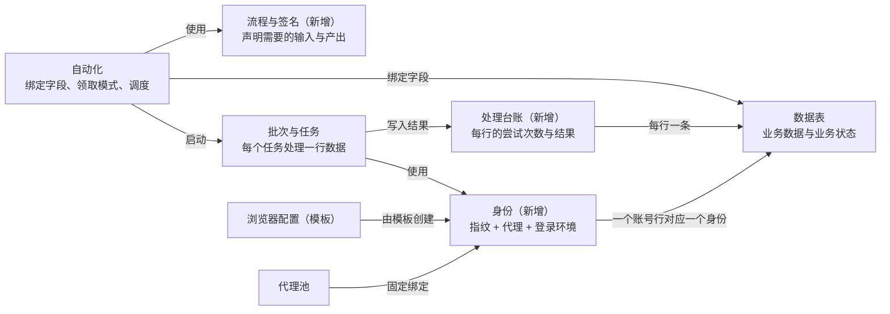

# AutoFlow 整改方案

- 日期：2026-09-30
- 状态：confirmed整改方向；r2按用户授权修订，生产功能未实施，后续步骤级审查规则见总纲
- 来源：claude.ai 文档「AutoFlow 整改方案」导出；评审依据见 docs/qa/2026-09-30-remediation-reviews/
- 里程碑索引：docs/superpowers/specs/2026-09-30-remediation-roadmap.md

AutoFlow整改保留7个阶段。原“前后端各1人、13周”估算已superseded，M0/M1退出后再据实际成本重估。首先消除"静默失效"，包括设置了却不生效的选项、被吞掉的错误、已处理的失败仍算失败；然后依次解决业务模型、可靠性、吞吐、身份隔离和交互体验。依据是项目中的「系统设计评审」和「前端交互评审」两份文档（基于提交 ea2cc5b），本方案把其中的所有问题落成可执行、可验收的整改项。

## 摘要

**一句话诊断：** 设计文档强调一致性、幂等、崩溃恢复，这些保护必须保留；同时批量自动化最核心的三件事——跑得快、出错有办法、账号之间互不牵连——设计得很薄；界面又照搬了后端的数据结构，用户需要理解 UUID、版本号和 JSON 才能把数据用起来。

**整改目标：**

1. **不静默失效。** 界面上每一个选项都在后端生效；每一次失败都能说清原因和下一步。
2. **结果可预期。** 批次对每一行数据的处理结果可追踪：成功、失败几次、为什么、是否已隔离。一条坏数据不会拖垮整批。
3. **吞吐可扩展。** 并发按机器能力配置，1 万行数据的批次能在合理时间内跑完，服务不卡顿。
4. **身份隔离。** 每个账号有自己的指纹、固定的出口 IP 和登录环境，三者一致且不会串用。
5. **用户按业务语言操作。** 在流程里用"账号·邮箱"而不是表达式；写回数据用表单；运行时看得到每一行卡在哪里。

**整改原则：**

- **用指标说话。** 先建立黄金场景基准（见"验收基准"一节），每项整改都以基准数据的变化作为完成标准，而不是文档或状态机的完整度。
- **一个执行引擎。** Studio 调试和批量运行走同一条执行路径，避免"调试正常、批量出错"。
- **没有实现就不展示。** 后端没实现的选项先从界面隐藏；节点配置有 schema，未知配置项在运行前报警。
- **业务状态和系统状态分开。** 用户定义的"已注册"等状态归用户；"尝试了几次、上次为什么失败"归系统台账。
- **冻结非核心范围。** Android/iOS 模拟器、桌面触发器等功能在整改期间冻结，不再投入。

**成功指标（整改完成时）：**

| 指标 | 现状 | 目标 |
| --- | --- | --- |
| 界面上不生效的配置项 | 至少 3 类（出错策略、重试次数、超时动作） | 0 |
| 批量运行失败日志含真实原因的比例 | 0%（统一为"工作流节点执行失败"） | 100% |
| 全局最大并发任务数 | 2（写死） | 按机器配置，8 核 16GB 机器不少于 6 |
| 1 万行表单次领取耗时 | 2.0–2.6 秒（本地实测） | 小于 20 毫秒 |
| 领取期间服务主循环阻塞 | 2 秒以上 | 小于 50 毫秒 |
| 一条持续失败的记录对批次的影响 | 可能无限循环或耗尽全部次数 | 可安全再做的失败预算内重试；未知结果统一待核实 |
| 同一批次多个账号的指纹 | 同Profile种子可能共用（原评审观察） | 新分配唯一；旧重复保留并显式报告 |
| 流程中引用项目数据时可见的内部 ID | UUID 表达式 | 0，全部以可读标签显示 |

## 业务模型与概念重构

把系统围绕"身份 × 数据行 × 流程 → 每行的处理结果"重新组织：新增身份、流程签名、处理台账三个核心对象，浏览器配置降级为模板。这是其余所有整改的基础，必须先定下来。

### 要服务的业务场景

现在的设计没有明确"为哪些场景服务"，导致范围不断扩张（220 种节点、模拟器管理）而核心场景没做好。建议明确以下 5 类场景，其他需求都以是否服务这 5 类来判断优先级。

| 场景 | 典型流程 | 关键要求 | 现状 |
| --- | --- | --- | --- |
| 多账号运营 | 注册、登录、养号、资料维护 | 每个账号独立的指纹、固定 IP、持续的登录状态 | 部分支持：指纹共用、代理不固定 |
| 数据采集 | 按关键词或链接列表抓取、翻页、写入结果表 | 高吞吐、复用浏览器会话、结果自动入表 | 弱：并发 2、每个任务冷启动 |
| 批量录入与后台操作 | 批量提交表单、批量更新后台记录 | 每行恰好处理一次、失败有限重试、可审计 | 弱：没有处理台账 |
| 定时巡检 | 定时检查价格、库存、状态，变化时通知 | 定时触发、与上次结果对比 | 无：项目批次不能定时 |
| 人机协作 | 验证码、人工审核、异常接管 | 人工接管不占执行名额、有待办列表 | 有，但会占用全局 2 个名额 |

### 核心对象重新划分

| 对象 | 整改后的定义 | 现状问题 | 动作 |
| --- | --- | --- | --- |
| 项目 | 一项业务的容器：数据、流程、自动化、身份、运行记录 | 基本合理 | 保留 |
| 数据表与业务状态 | 用户的业务数据；业务状态只表达业务含义（待注册、已注册） | 状态被多个自动化拿来控制"要不要再处理"，彼此干扰 | 保留，处理进度改由台账承担 |
| 流程签名（新） | 流程声明自己需要的输入（如"账号：邮箱、密码"）和产出 | 流程不声明需求，输入由自动化定义，设计流程时无数据可用 | 新增 |
| 自动化 | 把流程签名绑定到数据表字段，并规定领取模式、重试预算、身份策略、调度 | 自己定义输入、不能定时 | 改造 |
| 身份（新） | 一个对外身份，通常对应一个账号：唯一指纹种子 + 固定代理 + 登录环境 + 地区（时区、语言） | 这几项分散在浏览器配置、已保存环境、代理策略中，互不一致 | 新增 |
| 浏览器配置 | 降级为"身份模板"：内核、默认语言、扩展、行为参数 | 持有指纹种子，导致同一配置的所有任务共用指纹 | 改造 |
| 批次与任务 | 一次启动与其中每次执行；任务带结果分类 | 结果只有成功/失败，分不清业务失败和技术失败 | 改造 |
| 处理台账（新） | 每个自动化对每一行数据的处理记录：尝试次数、最后结果、最后错误、下次可领取时间 | 不存在，失败行会被反复领取 | 新增 |
| 运行 | 流程的一次执行；Studio 调试和批量共用一个引擎 | 两套执行栈、两套运行表 | 合并 |

自动化把流程签名绑定到数据表并启动批次；每个任务用一个身份处理一行，结果写入处理台账。

### 业务规则的改变

1. **"要不要再处理这一行"由领取模式决定。** 三种模式：
   - 未成功处理的行（默认）：每行成功一次即止，失败在预算内重试；
   - 所有符合条件的行（循环复用）：即现在的语义，适合养号、巡检；
   - 只重试失败的行。
2. **记录关联的是身份，而不只是环境。** 账号行的"当前环境"改为"身份"，身份包含环境、指纹和代理。下次处理这个账号时，三者一起恢复。
3. **任务结果分五类：** 成功、业务失败（流程明确判定，如"账号已被封"）、技术失败（元素找不到、超时）、基础设施失败（代理、浏览器、网络）、结果不明（可能已提交）。每类有不同的重试和批次处置规则，见 A 节。
4. **"最多任务数"拆成两个数字：** "本批最多处理几行"和"每行最多尝试几次"。现在的 1–100 上限取消。
5. **批次可以被定时或 Webhook 启动。** 复用现有的启动用例和幂等机制，增加"上一批未结束时：跳过 / 排队"的策略。
6. **统计口径以"行"为单位。** 除了任务成功率，还要有"已处理行 / 待处理行 / 已隔离行"，这才是用户关心的进度。
7. **表结构只在设计期修改。** 运行中的流程只读写数据，不再增删改字段。

## 路线图（r2）

权威依赖与状态见[里程碑总纲](2026-09-30-remediation-roadmap.md)，本节不维护第二套周历。

M0可信基准→M1止血→M2A可靠性→M2B数据契约→M3性能→M4身份→M6剩余迁移/清理。M2C触发与网页扩展独立交付，不挡M2B/M3。M5A必要基础随M1，M5B业务闭环随M2A/B，M5C身份随M4，M5D全量视觉完善不阻塞5B。

M1前置共用最小错误转换；M2B前置节点输出元数据和后端previewWrites；perIdentity从M3移至M4。原先“M6只做减法”和“所有M2功能完成才能优化”的安排已superseded。单写线程、进程池、JSONL与存储优化分别按测量决定，不为规划完整强制同时重构。

## A 执行语义与失败处理

让"出错之后会发生什么"变得明确、可配置、可解释。这一节的 A1–A3 属于止血，必须在阶段 1 完成。

### A1 实现节点错误策略（或先隐藏）

- **问题：** Studio 配置面板提供"出错时：跳过并继续 / 原地重试 / 回流到上层重试"、"重试次数 / 间隔"、"超时后：重试 / 跳过"（`ConfigPanel.tsx` 约 1608–1714 行），后端没有任何代码读取这些配置。默认值还自相矛盾："超时后：重试"但"重试次数 0"。
- **第 1 周先止血：** 把这些选项从界面隐藏；已保存文档里存在这些配置时，在运行前预检中提示"此设置尚未生效"。
- **正式实现的节点策略模型：**

| 字段 | 含义 | 默认值 |
| --- | --- | --- |
| onError | stop（停止本流程）/ continue（跳过继续）/ retry（原地重试）/ goto（回到指定节点重试） | stop |
| maxRetries | 最多重试次数 | 0；选了 retry 时至少 1 |
| backoff | 固定间隔或指数退避，带随机抖动 | 指数，1s 起、最多 30s |
| retryOn | 哪些错误类别才重试（超时、元素找不到、网络） | 超时 + 网络 |
| sideEffect | 节点是否可能产生外部副作用（提交、下单、发送） | 按节点类型内置，点击类默认"可能" |
| onExhausted | 重试用尽后：停止 / 走错误分支 / 继续 | 走错误分支，没有则停止 |

- **旧配置：** 原先无效的重试设置仅转换为候选，用户明确启用后才执行；打开旧文档不能静默激活。
- **关键规则：** sideEffect 为"可能"的节点，只有确认失败发生在动作之前（如元素根本没找到）才自动重试；动作已发出后超时，按“结果不明”处理，所有领取模式均不自动重做。动作前同步持久化重放门禁；成功提交后后续读取失败，也不能重跑整个Task或goto越过提交。
- **实现位置：** `application/workflows/runtime.py` 的 `_execute_claimed` 和 `_execute_node`；每次重试是一个新的 attempt 事件，原 attempt 保留。
- **防回归：** 每种节点的执行器声明配置 schema（可用 pydantic），运行前预检对未知配置项报警。CI 增加检查：前端配置面板出现的每一个键，必须在对应执行器 schema 中存在。
- **验收：** 黄金场景中注入"首次加载超时"，配置 retry 的节点自动恢复且日志有两个 attempt；点击提交后超时不被重做。

### A2 失败日志带上真实原因

- **问题：** `providers/browser/project_graph.py:424` 把所有失败改写成"工作流节点执行失败"。实测一个解析非法 JSON 的节点，日志里没有任何具体原因。Studio 的 worker 却会保留原因。
- **目标行为：** 每条失败包含结构化错误：`code`（稳定编码）、`category`（见 A4）、`message`（用户可读的原因）、`hint`（下一步建议）、`nodeId`、`attempt`、失败截图引用。
- **实现：** 从 `event['error']` 和 `event['message']` 取真实信息；含凭据派生值时由已有的 `_reported_result` 脱敏，不要再一刀切隐藏。各执行器把常见异常映射到稳定编码（如 `ELEMENT_NOT_FOUND`、`NAVIGATION_TIMEOUT`、`PROXY_CONNECT_FAILED`）。
- **同时修复：** worker 子进程的标准错误输出现在被丢弃（`project_workflow_worker.py:171`），改为写入按运行归档的诊断日志；项目能力调用失败时返回的"项目能力请求未完成"同样要带上具体原因。
- **验收：** 黄金场景中注入的每种故障，批量日志都能显示准确的原因和类别。

### A3 明确"已处理的失败"不算失败

- **问题：** 节点失败后即使走了错误分支并正常结束，整个运行仍然是 failed（`runtime.py:333` 记录失败后从不清除）。配合批次"失败即停止"的默认值，一个账号登录失败就让整批停止。
- **新语义：**
  1. 被错误分支接住的失败标为"已处理"，记入日志，但不决定运行结果；
  2. 运行结果由最后到达的 End 节点的"业务结果"决定；没有 End 时，没有未处理失败即为成功；
  3. 未被接住的失败才是技术失败。
- **兼容：** 这是对 WebRPA 行为的有意改变。仓库内对应的对照测试需要更新；导入的 WebRPA 文档可以打开"兼容模式"开关保留旧行为。
- **验收：** "登录失败 → 标记该行为登录失败 → End(业务失败)"的流程，任务结果为业务失败，批次继续处理下一行。

### A4 失败分类与处置规则

每种失败有不同的正确处置，现在全部混在一起。分类由执行器和运行时共同给出。

| 类别 | 例子 | 自动重试 | 消耗该行重试预算 | 对批次的影响 |
| --- | --- | --- | --- | --- |
| 基础设施失败 | 已证明动作未开始的代理预检/浏览器启动失败 | 退避重排，资源变更遵守绑定策略 | 否 | 连续阈值暂停 |
| 页面技术失败 | 元素找不到、导航超时、脚本错误 | 按节点策略 | 是 | 计入失败率 |
| 业务失败 | 流程判定"账号已封""库存不足" | 否 | 直接记为业务结果 | 不影响 |
| 结果不明 | 提交后超时、worker 在动作中途失联 | 否 | 该行进入"待核实" | 不影响，进入人工待办 |
| 已取消 | 用户停止且已证明无未知外部结果 | 否 | 否 | 若动作结果不明仍进入待核实 |

### A5 批次失败策略改为阈值和熔断

- **问题：** 现在是"任一任务失败即停"或"永远继续"二选一。前者太脆弱，后者遇到系统性故障（如网站改版）会把所有行都跑坏。
- **新策略（默认值可调）：**
  - 最近 20 个任务中页面技术失败超过 50%，暂停批次并提示"疑似页面变化"；
  - 连续 5 次基础设施失败，暂停批次并指出资源；
  - 同一错误编码连续出现 10 次，暂停并把该错误置顶。
- 暂停后用户可以"修复后继续"或"结束批次"，已处理的进度保留在台账中。

## B 数据领取与处理台账

用处理台账解决"哪些行该处理、处理到哪了"，用 SQL 下推解决领取慢，用流程签名解决"流程怎样拿到数据"。

### B1 处理台账

- **问题：** 领取时不排除失败过的行，且排序固定。一条每次都失败的行排在最前面时："失败后继续 + 不限次数"会永远在这一行上循环；有限 N 次时 N 次全浪费在这一行。这是设计文档明确规定的语义（执行规格 §4.1、验收样例 XE-A21/A22）。
- **数据模型（新表 `automation_record_ledger`）：**

| 字段 | 含义 |
| --- | --- |
| 台账作用域 | automation_id、processing_input_id、完整RecordRef（project/table/dataset_generation/typed key）及Sheets identity_namespace；不用裸record_key |
| state | pending 待处理 / succeeded 已成功 / failed\_retryable 失败可重试 / quarantined 已隔离 / needs\_review 待核实 / skipped 已跳过 |
| attempts / processing_cycle / cycle_attempts | 历史累计/处理轮次/本轮预算次数；确定启动前基础设施失败不计入。成功后新cycle轮次才自动刷新预算，失败换批次不刷新；人工reset须审计且先过未知门禁。 |
| last\_outcome, last\_error\_code, last\_error\_message | 最后一次的结果与原因 |
| last\_task\_id, last\_attempt\_at, first\_attempt\_at | 追溯 |
| next\_eligible\_at | 退避后下次可领取时间 |

- **处理单位：** 指定required主输入processingInputId，参考的fixedRecord/related等不消费；迁移歧义列报告且新批次需明确选择。批次独立记录纳入的主单位与历史Task关系，进度不从全自动化最新台账倒推。
- **写入时机：** Task终态投影与台账同事务，按task_id/终态版本去重；并发reset/resolve有修订与活动租约守卫。
- **领取模式（自动化的运行设置）：**
  - 未成功处理（默认）：state 为 pending 或 failed\_retryable、cycle_attempts 小于预算、已过 next\_eligible\_at；
  - 循环复用：允许成功行在后续批次再用；统一阻止needs_review/quarantined/skipped，仍受退避与最小60秒间隔保护；
  - 只重试失败：只取failed_retryable；quarantined须先明确reset；needs_review只能经resolve确认未执行后解除。
- **默认预算：** 每行最多 3 次尝试，退避 1 分钟、5 分钟、30 分钟；超过预算进入"已隔离"，在批次页列出，可一键重置或跳过。
- **界面：** 数据表增加按自动化切换的"处理状态 / 尝试次数 / 最后错误"列；批次页按 state 分组显示进度。
- **验收：** 黄金场景中 1% 的行永远失败，批次仍完成其余 99%，可安全重试的这些行各总尝试3次后隔离；退避未到不视为批次完成。

### B2 领取性能：筛选和排序交给数据库

- **问题：** 每领取一个任务，`infrastructure/database/project_claims.py` 都要加载最多 10,001 整行（包括全部字段 JSON），用 Python 自定义函数排序，再在 Python 里过滤；还要加载全库所有活动租约、逐行解析租约身份。本地实测 1 万行表单次领取 2.0–2.6 秒，且在服务主循环上同步执行（`scheduler.py:418`）。
- **改造：**
  1. 优先复用独立状态/台账列索引；动态字段必要时用record_index且与记录写同事务，包含完整身份及typed排序规则。不同时设计生成列和索引副本两套方案。
  2. 筛选表达式译成 SQL WHERE；暂不支持下推的条件在预检时提示性能风险。
  3. 预取候选队列：一次查询取出并发数 × 4 条候选，逐条用条件写入抢占租约（租约表对 `lease_key` 建部分唯一索引，冲突即跳过）。
  4. 租约判断改为索引查询，不再加载全库租约。
  5. 所有同步数据库操作移到独立线程，见 C5。
- **验收：** 10 万行表单次领取小于 20 毫秒；领取期间主循环延迟小于 50 毫秒。

### B3 坏行隔离

- **问题：** 任何一行候选在解析租约身份时出错（例如 Sheets 某行未通过最近一次校验），整个输入被判为"配置错误"，批次以失败结束（`project_claims.py` 约 555 行）。
- **改造：** 只有能唯一识别主行且其他身份可信时才隔离；Sheets重复身份、namespace不明、来源未核实仍保持输入门禁。参考输入不被错误消费，表级问题继续拒绝领取。

### B4 流程签名：反转输入契约

- **问题：** 流程不声明需要什么数据，输入由自动化定义；流程内的引用写成 `{PROJECT_INPUTS['<输入UUID>']['values']['<字段UUID>']}`，靠正则扫描校验；换一个自动化绑定同一流程，引用全部失效。
- **新模型：**
  - 流程文档增加 `signature`：输入分组（如"账号"），每组有若干字段（key、显示名、类型、是否必填、是否敏感）；输出同理。
  - 流程内引用写成 `{input.账号.email}`，用的是签名里的稳定 key，不关心数据表。
  - 自动化只负责绑定：签名字段 → 数据表字段，并指定筛选、排序、多表关联。绑定不完整时不能启动，并指出缺哪个字段。
  - 敏感标记来自签名字段或数据表字段定义，不再靠字段别名匹配"password/密码"。
- **迁移：** 脚本扫描现有流程，按对应自动化的输入别名和字段别名生成签名，把 UUID 引用改写成新格式；无法自动对应的列出清单。

### B5 运行时不再修改表结构

- 数据节点的 addField / modifyField / deleteField / previewFieldDeletion 从运行时操作中移除。流程需要的输出字段，在自动化绑定时由系统提示"一键在数据表中创建这些字段"。
- 运行时保留：读取、查询、更新当前记录、设置状态、新增记录、删除记录。

### B6 写回的并发版本由系统处理

- 现在写回要求流程自己传 `expectedContentRevision`。改为：写回"当前输入记录"时，系统自动使用领取时冻结的版本并处理冲突。
- 冲突策略按字段生效：任务只写它改动的字段，这些字段在运行期间被人改过才算冲突；冲突时节点失败，并清楚说明冲突字段和双方的值。

## C 调度、并发与事件循环

并发上限改为按机器配置，执行名额与浏览器数量分开计算，所有同步数据库操作移出主循环。

### C1 并发上限可配置

- **问题：** 派发器和 worker 管理器只接受容量 1 或 2（`dispatcher.py:133`），启动时写死为 2（`bootstrap/workflows.py:566, 599`）；自动化配置却允许并发 1–100，超出部分被静默截断。
- **改造：**
  - 在设置中增加"最大同时运行浏览器数"。默认值按M1启发式：min(floor(逻辑CPU×3/4),floor(总内存/1.5GiB))，限制1–64，可覆盖；必须按真实轻/重负载校准，不以算出6证明容量安全。
  - 去掉 {1, 2} 限制；运行时监测内存水位，超过 85% 时暂停派发新任务。
  - 批次页明确显示"设置并发 20，实际 6（受限于本机上限）"。

### C2 人工等待不占执行名额

- **问题：** 任务进入等待人工后仍留在派发器的 owner 列表中（只在 `_clear_owner` 时移除），计入容量。两个任务同时等人工，全机所有批次停住。
- **改造：** 拆分两种计数：
  - 执行名额：正在自动执行的任务；
  - 存活浏览器：包括等待人工、收尾中的浏览器，上限可设为执行名额的 2 倍。
- 人工待办超过存活上限时，批次显示"等待处理现有人工项"，并在待办列表按剩余期限排序。

### C3 多批次公平调度

- **问题：** 调度器按创建顺序逐个推进批次，先建的批次可能长期占满名额。
- **改造：** 批次增加优先级（高 / 普通 / 低），同优先级轮转分配名额；每个批次可设自己的并发上限。

### C4 Studio 与批量共用一个执行引擎

- **问题：** Studio 运行走 `WorkflowRunCoordinator` + `workflow_worker.py`（2,143 行），项目运行走 `WorkflowRunDispatcher` + `project_workflow_worker.py`，数据库里是两套运行表，容量各算各的。"调试看得到错误、批量看不到"就是这样来的。
- **改造：** 独立且无项目数据绑定的Studio调试可无批次；项目数据试跑保留run-project-once.ts的单任务批次/Task及能力边界。两者统一派发器、worker、事件模型和运行表。调试特有能力（断点、单步、变量查看）作为运行选项。迁移完成后删除旧栈。
- **顺序：** 先让两条路径共用同一个事件转换函数（即 A2 的错误透传），再把 Studio 运行入口切到派发器，最后迁移历史运行记录。

### C5 服务主循环不被阻塞

- **问题：** 调度器、事件提交在 asyncio 事件循环上直接执行同步 SQLAlchemy 操作。领取一次 2 秒，这期间所有接口、界面推送和正在运行任务的事件确认一起卡住。worker 读取端还用 10 毫秒轮询。
- **改造：**
  - 先做SQL下推/事件批量并测锁等待；仍有瓶颈才引入有界单写队列，Session在线程内创建释放，不能在事务中等待另一排队事务；读操作移出事件循环。
  - 增加主循环延迟指标，超过 100 毫秒写警告日志，并纳入黄金场景验收。
  - worker 输入改为事件驱动，去掉忙等轮询。

### C6 项目批次支持定时和触发

- **问题：** 定时任务只能启动独立流程（`schedules.py` 调用的是 workflow\_id），项目自动化没有调度入口。
- **改造：** 定时器和 Webhook 调用同一个"启动批次"用例，定时幂等键用调度ID+计划触发时刻；Webhook用来源事件ID/客户端幂等键，不按接收时刻去重。保持loopback鉴权边界，公网接入另行设计。必须选择重叠策略：上一批未结束时跳过本次、排队，或并行。应用未运行时错过的触发，启动后按"补跑最近一次 / 全部忽略"处理。

## D 持久化与事件分级

只有"改变状态的事件"需要同步落库后才能继续执行，普通日志批量异步写入；SQLite 按高并发本地应用的标准方式配置。

### D1 SQLite 配置

- **问题：** 没有开启 WAL，没有设置 busy\_timeout，同一个数据库文件被多个引擎打开，代码中有 9 处单独处理"database is locked"。
- **改造：** 在 `infrastructure/database/session.py` 的连接钩子中统一设置 `journal_mode=WAL`、`synchronous=NORMAL`、`busy_timeout=5000`、`foreign_keys=ON`；全应用只创建一个引擎，其他模块注入它；定期执行 WAL checkpoint。

### D2 事件分级

- **问题：** worker 发出的每一条事件（包括"开始执行节点"这类日志）都要等主服务提交 SQLite 事务后回 ACK 才继续。一个节点至少 4–5 个事件，1,000 次循环 × 5 个节点就是上万次同步提交。
- **分为两级：**

| 级别 | 包括 | 写入方式 |
| --- | --- | --- |
| 状态事件 | 外部动作前重放门禁、数据写回、环境保存、End、人工检查点、运行终态、产物登记 | 同步提交后 ACK，保持现有的执行代次校验和幂等 |
| 过程事件 | 节点开始/结束、普通日志、变量变化、进度 | worker 本地缓冲，每 200 毫秒或 100 条批量发送；主服务批量写入；不阻塞执行 |

- 过程事件带序号/水位并去重，终态flush、状态与过程越序有明确处理；用于恢复的节点状态不可丢，崩溃只允许丢最后非权威过程信息。
- 经测量确认必要时，大量日志改存按运行分文件的 JSONL，数据库只存索引和摘要，按保留天数清理。

### D3 诊断信息不丢弃

- worker 子进程和浏览器的标准错误输出写入每次运行的诊断文件（限制大小并轮转），任务详情页可下载。
- 崩溃、启动超时时自动附上最后 200 行诊断输出。

## E 执行性能与环境存储

每个任务都从零启动一个 Python 进程和一个浏览器；登录环境每次整目录复制并全量哈希。改为复用进程和会话、只保存必要的浏览器数据。

### E1 worker 进程池

- **问题：** 每个运行启动一个新的 Python 解释器子进程（启动超时 90 秒）。
- **改造：** 先测冷启动，确有瓶颈才按需预热worker池，数量不超过存活上限；任务结束后 worker 清理状态回到池中，执行 N 个任务或内存超标后回收重建。执行代次和撤权机制保持不变。重型依赖（OCR、人脸识别、语音）保持延迟导入，只在用到的节点中加载。

### E2 浏览器会话复用

- **适用：** 数据采集这类"换一行数据、抓一个页面"的任务，冷启动浏览器的开销远大于实际工作。
- **改造：** 自动化增加会话模式：
  - 每个任务新浏览器（默认，隔离最强）；
  - 同一身份复用浏览器：在M4建立identity_id后实现，任务上下文隔离、身份独占覆盖等待人工与空闲期，未知结果不能归还；
  - 会话池：M3仅限无登录采集，复用进程但任务新建隔离上下文；验证全部存储/权限/凭据不残留，不支持则保持perTask，不能仅清Cookie。

### E3 环境存储瘦身

- **问题：** 恢复已保存环境时对整个浏览器用户目录 `copytree`，并对每个文件完整计算 SHA-256（`infrastructure/filesystem/environment_store.py`（原评审行号为历史位置））；保存时再复制、再全量哈希；缓存目录一并复制；没有找到清理旧代次的逻辑。
- **改造：**
  1. **排除缓存。** 复制和保存时跳过 Cache、Code Cache、GPUCache、ShaderCache、GrShaderCache、Service Worker/CacheStorage、component\_crx\_cache 等，列表集中维护并按内核版本校验。
  2. **摘要改为清单。** 清单摘要用于变化检测；不能削弱不可变身份/登录数据的完整性证明，关键数据仍做内容校验。
  3. **便宜的复制。** macOS 用 APFS clonefile，Windows 用 ReFS 块克隆（可用时），否则增量同步，只复制变化的文件。
  4. **保留策略。** 保留最近3个未被引用的历史代次及全部当前/活动/冻结快照/未完成保存关联/回退引用代次；后台清理与引用建立互斥，不能只按年龄删目录；设置页显示环境占用的磁盘空间。
- **验收：** 一个典型已登录环境的恢复加保存总耗时小于 2 秒；无额外保留引用时100次连续运行占用目标≤单环境4倍；有引用时单列原因，不为达标误删。

### E4 性能预算

| 环节 | 预算 |
| --- | --- |
| 领取一个任务（10 万行表） | 小于 20 毫秒 |
| 从领取到首个节点开始（池中有空闲 worker，新浏览器） | 小于 3 秒 |
| 从领取到首个节点开始（复用会话） | 小于 300 毫秒 |
| 单个普通节点的框架开销（不含网页操作本身） | 小于 5 毫秒 |
| 服务主循环延迟 | 小于 50 毫秒 |

## F 身份：指纹、代理、环境绑定

指纹浏览器和代理这两项"配套能力"现在各自独立，没有服务于"让每个账号看起来是独立的人"这个目标。将它们与登录环境合成一个"身份"，整体分配、整体恢复、整体校验。

### F1 身份对象

| 字段 | 说明 |
| --- | --- |
| identity\_id, name | 身份标识与名称，默认取关联记录的显示字段（如账号名） |
| template\_profile\_id | 来源模板（原浏览器配置）：内核、扩展、行为参数 |
| seed_id / seed_registry | 新分配种子登记唯一；历史重复保留为legacyShared登记引用，不合并不同账号身份 |
| region | 时区、语言、地理位置；创建时可按代理出口 IP 自动得出，之后固定 |
| proxy\_binding | 固定代理，或从代理池粘性分配的成员 |
| environment | 已保存的登录环境（沿用现有代次机制） |
| linked\_records | 关联的数据行，取代现在的记录"当前环境" |
| health | 最近一次成功登录时间、连续失败次数、是否被标记为封禁 |

### F2 指纹种子

- **问题：** 种子挂在浏览器配置上，"从配置新建"时同一批次的所有任务是同一个指纹；种子范围只有 10000–99999（`profiles/service.py:30`），1,000 个配置时出现重复的概率约 99.6%。
- **改造：**
  - 新分配通过seed_registry.seed_value唯一插入；旧迁移允许多个独立身份引用已有legacyShared登记，公开创建不能复用已有值或申请迁移豁免；
  - 先确认 CloakBrowser 是否支持更大的种子范围，支持则放宽；不支持则在可用种子低于 10% 时提醒；
  - "每个任务临时身份"模式（无登录采集）每个任务随机生成一次性种子，不宣称全局唯一；池模式不支持任务级种子隔离时回退perTask。

### F3 代理粘性分配与一致性校验

- **问题：** 代理池按每次运行轮转成员，不与账号绑定。同一个已登录环境每次可能换一个出口 IP；开启 geoip 时时区也随之变化。
- **改造：**
  1. **粘性分配。** 身份首次使用代理池时分配一个成员并记入 proxy\_binding，之后保持成员绑定，并独立检测实际出口；同成员出口变化也按策略核实。只有成员失效时才按策略更换：同地区替换、需人工确认，或不允许。
  2. **启动前校验。** 测试出口 IP 的地理位置（结果缓存数分钟），与身份的 region 比较；不一致时按策略拒绝启动或警告。
  3. **代理健康预检。** 启动前用轻量请求检查连通性；失败归为基础设施失败（A4），不消耗该行的重试预算。
  4. **代理正在换 IP 时等待。** 现在遇到代理有远程操作进行中直接报"不可用"；改为有限等待后再启动。

### F4 身份独占与生命周期

- 同一身份同一时刻只有一个活动浏览器（沿用现有环境独占规则）。
- 身份健康状态参与领取：被标记为封禁或连续登录失败的身份，其关联行自动跳过并进入待处理列表。
- 项目页增加"身份"列表：指纹摘要、出口 IP 与地区、环境大小、最后使用时间、关联记录、健康状态。

### F5 迁移

- 现有每个已保存环境生成一个身份，沿用其实际冻结身份包（种子/UA/语言/时区等），不由当前Profile重新推导；多个环境共用同一种子时列出清单，由用户决定是否重新生成（重新生成可能导致网站要求重新验证）。
- 记录上的"当前环境"迁移为对应身份。

## G 节点目录与流程能力

把 220 种节点收敛为约 50 个核心节点加一门表达式，补齐网页自动化缺失的原语，并让每个节点有明确的输入输出契约。

### G1 补齐网页原语，修复录制器

- **问题：** 键盘类别被整体排除，网页自动化没有"按键"节点；录制器遇到按键会生成 `keyboard_action`（`recordingGeneration.ts:177`），工具栏随后因包含已排除节点拒绝运行。任何录到回车键的流程都跑不起来。
- **改造：**
  - 新增网页"按键"节点（对元素或当前焦点，支持组合键），录制器改为生成它；
  - 新增 Cookie 和本地存储的读写节点；
  - 新增请求拦截 / 改写（屏蔽图片和字体加速采集、替换响应调试）；
  - "录制器只生成后端支持的节点"加入 CI 检查。

### G2 精简节点目录

- **问题：** 220 种节点中约 85 种是纯计算或数据变换（阶乘、RGB 转 CMYK、方差、列表笛卡尔积……）；还有热键/人脸/声音/手势触发器、关机、锁屏、打印机、局域网共享等与网页批量自动化无关、在并发批次中甚至危险的节点。
- **改造：**
  - 纯计算节点由表达式替代：在"设置变量"和所有输入框中支持 `{= 表达式}`，基于已有的 `safe_expr`，提供字符串、数学、列表、字典、日期函数库；
  - 桌面触发器、系统操作、局域网共享等移入"实验功能"，默认隐藏，并在批量运行中禁用；
  - 核心目录约 50 个：网页导航与交互、元素查询与采集、控制流、数据节点、HTTP、AI、验证码、通知、脚本。
  - 旧节点保留执行器以兼容已有文档，打开时提示"可一键转换为表达式"。

### G3 节点输出契约

- **问题：** 节点输出写到哪个变量名，靠 `project_graph.py` 按节点类型逐个猜配置键（resultVariable / variableName / saveResult / saveToVariable……）；变量提示列出所有节点产生的所有变量，不考虑执行顺序。
- **改造：**
  - M2B先声明稳定nodeId/outputKey、显示名、类型、敏感性和必有/条件输出；M6补全及清旧别名。显示可为“提取标题·text”，内部引用不因重命名改变；
  - 还需要全局变量的场景，用显式的"设置变量"节点；
  - 编辑器只提示当前节点上游一定已执行的节点输出，并显示类型；
  - 运行前预检报告引用了不存在、或可能尚未生成的输出。

### G4 小问题修复

- "模块条"视图把通过错误分支连接的节点显示在"独立流程"分组下，改为显示在其来源节点下方并标注"出错时"。
- 没有起始节点的完全循环图会执行 0 个节点并报告成功，改为预检报错。
- 没有配置超时的节点不再是"不限制"，改为按节点类型的合理默认值（网页类 30 秒）。

## H 数据绑定体验

用户在任何地方看到和操作的，都应该是"账号·邮箱"这样的业务名称，而不是 UUID、版本号和 JSON。这一节是 B4（流程签名）和 B6（自动版本）在界面上的落点。

### H1 现在的链路与问题

1. 在"项目 → 数据"建表；
2. 在"自动化 → 输入与参数"逐个添加输入、选表、选模式、展开"字段映射"填别名；
3. 在另一个窗口打开 Studio，用"复制引用"或输入 `{` 选择，插入的是 `{PROJECT_INPUTS['8f3c…']['values']['c41e…']}`；
4. 写回数据要在 `project_data` 节点里从 14 种操作中选一种、选所属项目（带分页）、选授权数据表、勾选字段（旁边显示字段 UUID），最后手写带 `recordRef`、`expectedContentRevision` 的 JSON；
5. 保留环境要在 End 节点填"关联输入标识（逗号分隔）"。

每一步都要求用户理解后端的内部模型；画布上看不出哪个节点用了什么数据。

### H2 流程"输入与输出"面板

- Studio 顶部增加"输入与输出"入口，编辑流程签名：输入分组 → 字段（名称、类型、必填、敏感）；输出字段同理。
- 每个输入字段可填一个样例值，独立打开 Studio 也能完整设计和试跑，不必先有自动化。
- 从数据表导入：选一张表，勾选字段，自动生成对应的输入分组。

### H3 数据侧栏与字段标签

- Studio 左侧增加常驻"数据"页签（与模块库并列），列出：流程输入字段及样例值、上游节点输出、全局变量、凭据。
- 所有文本输入框改造为支持"标签"的输入框：
  - 从侧栏拖入、输入 `{` 或 `@` 搜索插入；
  - 引用显示为不可拆分的标签"账号·邮箱"，悬停显示样例值、类型和来源；
  - 引用失效的标签显示为红色，并提供"重新选择"操作；
  - 内部仍保存稳定引用（`{input.账号.email}`），复制粘贴时保持标签。
- 敏感字段的样例值始终打码，按签名中的"敏感"标记判断。
- **实现建议：** 用 CodeMirror 6 的原子装饰（atomic decoration）或轻量 contenteditable 标签编辑器，替换 `controls/variable-input.tsx`；同一组件用于单行输入和多行文本。

### H4 画布上看得见数据

- 节点第二行显示数据标签，例如"输入文本：账号·邮箱 → #email"；写回节点显示"更新 账号：状态 = 已注册"。
- 读数据的节点左上角显示小图标"读"，写数据的显示"写"。
- 在数据侧栏选中一个字段，画布高亮所有引用它的节点，其他节点变淡。
- 分支连线带"成功 / 失败 / 条件值"文字标签。

### H5 写回数据改为表单节点

把 `project_data` 拆成 4 个面向任务的节点，全部用表单配置，项目和版本由系统确定：

| 节点 | 表单内容 | 替代的旧操作 |
| --- | --- | --- |
| 更新当前记录 | 选择输入分组（如"账号"）；逐行"字段 → 值"，值可以是常量、标签或表达式 | updateRecord |
| 设置状态 | 选择输入分组；下拉选择状态 | setRecordStatus |
| 新增记录 | 选择表；逐行"字段 → 值"；输出新记录，可被 End 关联 | createRecord |
| 查询记录 | 选择表；可视化条件编辑器（复用数据页的筛选组件）；返回条数上限 | readRecord / queryRecords |

所有字段按名称显示，不出现 UUID；表结构操作按 B5 移出运行节点。

### H6 End 节点改为勾选

- "业务结果"：成功 / 业务失败，并可填原因（标签或文本）；
- "保留当前身份的登录状态"开关；
- "关联到"：勾选输入分组名称（账号、邮箱），以及"本任务新增的记录"；
- 不再出现输入 ID 和 RecordRef。

### H7 自动化绑定页

- 左栏是流程签名的输入字段，右栏是数据表字段；按名称和类型自动匹配，未匹配的标红。
- 顶部实时显示"当前条件匹配 128 行，其中未处理 96 行"，并展示 3 行样例。
- 多表关联用连线图表示（人员 ↔ 邮箱：按人员编号相等），而不是嵌套的下拉框。
- 流程输出字段可以绑定到表字段，任务成功后自动写回；表中没有对应字段时提供"一键创建"。

### H8 用真实数据试跑

- 试跑前选择一行：候选行按表的主显示字段展示（如邮箱），而不是记录 UUID；可搜索。
- 试跑过程中，每个节点旁边显示它实际使用的值和产出的值。
- 试跑默认后端冻结previewWrites，写后读使用私有预览覆盖层，不改变记录/版本/生产台账/同步意图/持久环境；End保存预检拒绝。明确选择realWrites才写项目数据，网页操作仍真实执行，界面必须说明边界；现在面板底部"修改会保存到项目数据"是容易误操作的默认值。

## I 信息架构与页面

按用户的核心工作闭环重组导航：建数据 → 设计流程 → 绑定并运行 → 监控 → 处理失败行。压缩层级，把"正在发生什么"放在最显眼的位置。

### I1 全局导航

| 现在 | 整改后 |
| --- | --- |
| 顶部 7 项：总览、项目、浏览器配置、安卓设备、代理管理、模型管理、实验室 | 左侧窄导航 4 项：运行总览、项目、资源（身份模板、代理、模型、内核）、设置 |
| 安卓设备、实验室与项目平级 | 移入设置中的"实验功能"开关，默认关闭 |

### I2 项目外壳

- **问题：** 顶部导航 → 面包屑 → 项目头（图标 + 标题 + 长描述 + 修改时间，约 180px 高，每个页签重复） → 项目页签 → 页内子页签 → 任务详情再一层页签。内容区从约 330px 处才开始。环境页"项目默认资源"既是子页签又在右侧重复一张卡片。
- **改造：**
  - 项目头压缩为一行（约 56px）：项目名 + 切换器 + 运行中批次数 + 主要操作；描述只在概览页显示。
  - 项目内改为可折叠的二级左栏：概览、数据、流程、自动化、运行、身份、统计。
  - 任何页面最多两层导航（左栏 + 页内页签），详情用右侧抽屉而不是再进一层页面。

### I3 运行总览（替代现在的总览）

- **问题：** 现在的总览只是资源计数器（浏览器配置 0、代理 0……），下面的"工作入口"与导航重复。
- **内容（从上到下）：**
  1. 一行指标：运行中批次、当前并发 / 上限、今日已处理行、今日成功率、待人工处理数；
  2. 需要处理：等待人工、已暂停的批次（含原因）、已隔离行最多的自动化、不健康的代理和身份；
  3. 运行中批次列表：进度条、吞吐、预计完成时间；
  4. 下一次定时运行；
  5. 资源健康：磁盘占用（环境、产物）、内存水位。

### I4 批次实时监控页

- **问题：** 批次和任务都是静态表格，看不到每行卡在哪里，也没有处理失败行的入口。
- **页面结构：**
  - 顶部：批次状态、进度条（按台账 state 分段着色：成功 / 业务失败 / 待重试 / 隔离 / 待处理）、吞吐（行/分钟，带近 30 分钟趋势）、预计剩余时间；操作：暂停、继续、停止、调整并发。
  - 中部：正在运行的任务卡片，每张显示数据行显示名、身份、当前节点、已用时间、实时截图缩略图（每 5 秒刷新）。
  - 失败归组：按错误编码分组，如"元素找不到 #submit：37 行"，展开看行列表和截图；批量操作：重跑、跳过、导出。
  - 底部：全部任务表，可按状态、错误、身份筛选。

### I5 数据表页

- **问题：** 内容区限宽约 1230px，1440 宽的窗口两侧留白而表格内容被截断；"记录"列与源字段列重复；行操作混用链接、按钮、图标；分页没有总页数和每页条数。
- **改造：**
  - 数据页全宽，虚拟滚动替代分页；
  - 冻结首列（主显示字段），列宽可拖动并记忆；去掉重复的"记录"列；
  - 行内编辑，详情用右侧抽屉；行操作统一收进行末"…"菜单；
  - 增加台账列（处理状态、尝试次数、最后错误）和身份列，可按自动化切换；
  - 行按处理状态显示淡色左边条。

### I6 任务详情

- 改为时间线形式：每个节点一行，显示耗时、用到的值、产出、attempt 次数；失败节点自动展开错误原因、建议、截图。
- 数据写入、环境保存以内嵌事件显示在时间线对应位置。
- 表格不再放在半宽卡片内横向滚动。

### I7 Studio 与主应用的衔接

- **问题：** 设计和试跑在 Studio 窗口，其余在主窗口，数据绑定分散两边。
- **改造：** Studio 作为项目内"流程"模块的一个工作区，默认在主窗口内打开，可弹出为独立窗口；自动化详情页嵌入只读流程预览和"编辑流程"入口；从批次失败归组可一键跳到 Studio，定位到失败节点并用该行数据试跑。

## J Studio 布局与编辑器

画布优先：默认状态下画布至少占窗口 60% 的面积，工具栏一行，节点读得清文字和数据。

### J1 现状实测

| 窗口尺寸 | 画布可见区域 | 占比 | 其他问题 |
| --- | --- | --- | --- |
| 1440×900 | 约 860×530 | 约 35% | 小地图盖住右侧分支节点；搜索浮层压住首个节点 |
| 1280×760 | 约 700×390 | 约 28% | 底部空日志面板占 250px |

### J2 工具栏

- **问题：** 两行约 14 个按钮、至少 5 种颜色（绿色"运行"、绿色"保存"、橙色"打开"、蓝色"导出"、绿色"自动化浏览器"），没有主次。
- **改造为单行：** 左侧是流程名、所属项目和保存状态（自动保存，显示"已保存"）；中间是撤销/重做和视图切换；右侧是"试跑▾"（次要按钮，下拉选数据行、是否真实写回）和"批量运行"（唯一主按钮），其余（打开、导出、导入整包、计划任务、录制、小助手、自动化浏览器）收进"更多"菜单或命令面板。

### J3 布局

- 左栏（模块 / 数据）和右栏（配置）都可折叠，宽度记忆；未选中节点时右栏自动收起。
- 底部面板没有日志时只显示一行状态条，运行时自动展开到 30% 高度。
- 小地图默认关闭，节点超过 30 个时在角落显示开关。
- 搜索改为命令面板（Ctrl+K），不再常驻浮在画布上。

### J4 节点视觉

- 节点两行：第一行是动作名（如"输入文本"），第二行是数据标签和目标（如"账号·邮箱 → #email"）；正文至少 13px。
- 颜色只用左侧细色条区分类别，节点主体保持中性色；状态（运行中、成功、失败、已跳过）用右上角小角标和外圈颜色表达。
- 配置有问题的节点显示警告角标，悬停说明原因。

### J5 模块库

- 双击画布或按 `/` 呼出快速添加面板：顶部是最近使用和常用的 12 个节点，支持拼音搜索（已有）。
- 从连线端点拖出到空白处时，弹出同一面板，选中后自动连线。
- 左栏模块库按 G2 精简后的分类展示。

### J6 配置面板

- 分"基本"和"高级"两段，高级默认折叠；超时、错误策略放在高级。
- 校验错误就地显示在字段下方，而不是顶部一块"有 2 个必填项未填写"。
- 去掉自相矛盾的默认值（"超时后：重试"配"重试次数 0"）。
- 选择器字段旁边显示"在当前页面匹配 1 个元素"的实时检测结果（已有定位测试能力，调整为常驻显示）。

### J7 运行与调试

- 运行时画布自动跟随当前节点（可关闭）；失败时自动定位到失败节点并打开错误详情：原因、建议、截图，以及"从这里重试"按钮。
- 报错文案按 M 节要求改写。例如现在的"请先在打开网页节点明确迁移浏览器配置；旧文档仍可保存或导出"，应改为"这个流程还没有选择浏览器身份。在'打开网页'节点中选择一个身份后再运行。\[前往设置\]"。

## K 设计系统统一

只保留一套颜色令牌、一套组件库、一套图标，并用 CI 规则防止再次分裂。

### K1 现状

| 项 | 主应用 | Studio |
| --- | --- | --- |
| 颜色 | `styles/tokens.css` 暖色令牌，其他业务目录共 131 处写死调色类 | `webrpa.css` 1,991 行，`domains/workflows` 下 1,704 处写死的 Tailwind 调色类 |
| 组件 | `shared/components/ui`（shadcn/Radix） | `workflows/components/controls`：另一套 button、select、dialog、checkbox、popover |
| 图标 | phosphor（83 个文件） | lucide（75 个文件） |
| 深色模式 | 无 | 无 |

### K2 整改

1. **令牌：** 以 `tokens.css` 为唯一来源，补齐语义令牌（表面层级、文字层级、状态色、节点类别色 8 种、动效时长与曲线），并为每个令牌定义深色值。
2. **迁移：** 把 Studio 中的写死调色类批量替换为语义类（按映射表脚本化处理，再人工校对）；`webrpa.css` 按组件拆解后删除。
3. **组件：** Studio 控件逐个改用 `shared/components/ui`，缺少的（颜色选择器、坐标输入、路径输入）补进共享库；通用控件共享，流程引用语义留workflows；5B标签替换、旧消费者清零和回退验证后才删旧目录。
4. **图标：** 选定一套（建议 lucide，覆盖节点图标更全），另一套逐步替换。
5. **反馈模式统一：**
   - 成功提示从右下角弹出并自动消失，不压住页面标题；错误就地显示；
   - 分页组件显示总数、每页条数、跳转；大表改虚拟滚动；
   - 行操作统一为"主操作文字按钮 + …菜单"；
   - 数据节点里未加样式的原生按钮（"上一页项目"等）随 H5 重做一并消除。
6. **CI 守门：** lint 规则禁止新增写死调色类和十六进制颜色；禁止从第二套图标库导入；存量数字只减不增。

## L 动效规范

动效只用来表达状态变化和因果关系，不做装饰。现在运行中节点整体闪烁（`ModuleNode.tsx` 的 `animate-pulse`），代码中有 53 处转圈、21 处闪烁和弹跳式放大；已经遵守系统"减少动态效果"设置，这一点保留。

### L1 基础令牌

| 令牌 | 时长 | 曲线 | 用途 |
| --- | --- | --- | --- |
| motion-fast | 120ms | 缓出 | 悬停、按下、标签出现 |
| motion-base | 180ms | 缓出 | 面板展开收起、抽屉、菜单 |
| motion-slow | 280ms | 缓入缓出 | 画布平移定位、进度条平滑增长 |
| motion-loop | 1.2s | 线性 | 进行中指示（外圈进度、连线流动） |

不使用弹跳和过冲曲线；一个视图同时最多一个循环动画区域。

### L2 关键交互

- **流程运行：**
  - 正在执行的路径上，连线显示虚线流动；
  - 节点只在外圈显示旋转进度，主体不闪；
  - 完成的节点外圈渐变为成功色，并淡入一个对勾；
  - 失败节点变为错误色（不抖动），画布用 motion-slow 平移到它并展开错误详情。
- **批次监控：** 新领取的任务卡片从顶部滑入（motion-base）；进度条分段平滑增长；计数数字渐变过渡（最多 400ms）；失败归组新增一行时短暂高亮背景。
- **数据绑定：** 拖动字段标签时，可以放下的输入框显示虚线边框；放下后标签轻微放大再还原（motion-fast）；在侧栏选中字段时，无关节点淡出、相关节点保持（motion-base）。
- **加载：** 列表和卡片用骨架屏（已有组件），转圈只用在按钮内部的短操作。

### L3 设置

- 跟随系统"减少动态效果"；设置中提供"完整 / 减少 / 关闭"三档；关闭时状态变化改为直接切换。

## M 文案与术语对照

界面文案只说结果和下一步，不出现后端实现术语；专业解释放进悬停提示。下表是需要替换的主要说法，完整术语表由前端维护并在 CI 中检查。

| 现在的说法 | 改为 | 说明 |
| --- | --- | --- |
| 数据集代次、内容代次 | 不显示；必要时说"数据已更新" | 内部并发标识 |
| RecordRef、输入标识 | 记录、输入名称（如"账号"） | 用显示名 |
| 授权数据表、读取目的 | 不显示 | 权限由流程签名推导 |
| 记录槽 | 关联字段 | 指向另一张表的字段 |
| 持久环境、环境实例、运行现场 | 身份、正在运行的浏览器 | 见 F 节 |
| 执行代次、撤权、隔离占用 | 不显示；异常时说"这次运行已失去联系，结果需要核实" | — |
| 配置状态不代表执行状态 | 删除 | 开发视角的说明 |
| 任务固定当前保存环境的内容代次，执行中不会切换 | 每次运行使用该身份最近一次保存的登录状态 | — |
| 当前任务还没有可保留的环境实例 | 这次任务没有打开浏览器，所以没有登录状态可保存 | — |
| 工作流节点执行失败 | 具体原因 + 建议，如"找不到元素 #submit（等待 30 秒）。页面可能已改版，请重新拾取元素。" | 见 A2 |
| 耗时 0 秒 | 不到 1 秒 / 0.4 秒 | — |

**文案规则：**

- 错误信息 = 发生了什么 + 怎么办，一句话，必要时带操作按钮；
- 按钮以动词开头，2–4 个字；
- 同一概念全应用只用一个词（如"身份"不再混用"环境 / 配置 / 现场"）。

## N 范围收敛与工程方法

问题不在工作量不足，而在投入方向：约 19 天内生成了约 7,800 个文档文件（docs 目录 800MB、Markdown 约 6 万行）、后端约 12.8 万行、前端约 18.9 万行，而批量核心的并发上限是 2。项目自己的修复台账关注的是边界一致性，这份方案里的主干问题都不在其中。

### N1 冻结范围

| 模块 | 规模 | 处理 |
| --- | --- | --- |
| Android / iOS 模拟器管理 | 后端约 8,600 行、前端约 6,800 行 | 冻结，移入实验功能；不再追加验收 |
| 桌面触发器（热键、人脸、声音、手势）、系统操作、局域网共享 | 属于 220 种节点的一部分 | 隐藏，批量运行中禁用 |
| Google Sheets 双向同步 | 约 4,700 行 | 保留读取和导出；双向实时同步暂停扩展，待核心稳定后再评估 |
| AI 小助手、Allure 报告、Firecrawl | — | 维持现状，不进入整改范围 |

### N2 设计文档的改写方式

- 每个设计文档开头必须有：服务的业务场景、要改善的指标与目标值、不做什么。
- 状态机穷举只用于确实需要的少数高风险点（End 保存、事务边界），其余用黄金场景验证。
- 决策记录（ADR）限制为 1 页：背景、选项、决定、代价。

### N3 验收证据不再进仓库

- QA 截图和证据文件（目前约 3,200 张 PNG）移到仓库外的存储（如 CI 产物或对象存储），仓库只保留汇总报告和链接；历史文件用 git 历史清理或迁到 LFS。

### N4 AI 辅助开发的守门规则

这个仓库明显大量由 AI 代理生成。建议在 `AGENTS.md` 中加入以下硬性规则，并尽量用 CI 自动检查：

1. 界面上新增的每个配置项，必须有后端读取它的代码和测试；
2. 任何失败路径必须把原始原因传递到用户可见的日志，除非涉及凭据；
3. 不得在事件循环上直接调用同步数据库操作（可用 lint 规则检查）；
4. 涉及批量执行的改动，必须附黄金场景基准数据的前后对比；
5. 新增节点类型需要说明服务哪一类业务场景；
6. 界面文案不得出现术语表中的内部术语。

### N5 测试策略调整

- 在现有大量单元和契约测试之外，增加三类：
  - 黄金场景基准（每晚运行，输出指标趋势）；
  - 故障注入测试（代理断开、元素消失、worker 被杀、磁盘写满）；
  - 领取逻辑的随机化测试（随机筛选、随机并发，验证不重复、不遗漏、不死循环）。
- 前端增加关键页面的视觉回归截图（1280×800 和 1440×900 两档）。

## 验收基准：黄金场景与指标

M0建立controlled-one-row-batches-v1，G1在M4建立；M2B新增native-batch-v1。场景版本、数据/故障种子、硬件/内核/并发和报告manifest固定后才比较，至少5次采样；不同版本不得拼成吞吐趋势。之后每晚运行适用场景。场景使用仓库内的本地测试站点，不对真实网站产生副作用。

### 场景定义

| 场景 | 数据规模 | 流程 | 注入的故障 |
| --- | --- | --- | --- |
| G1 多账号登录并更新资料 | 200 个账号 | 恢复身份 → 登录 → 修改资料 → 写回状态 → 保存登录状态 | 2% 账号密码错误（业务失败）；一个代理断开 5 分钟 |
| G2 数据采集 | 10,000 个链接 | 打开 → 提取 5 个字段 → 写入结果表 | 5% 页面首次加载超时；1% 永远 404 |
| G3 批量录入 | 1,000 行 | 填表 → 按回车提交 → 确认成功 → 标记已录入 | 提交后响应丢失（结果不明）；运行中杀掉 worker |
| G4 长循环 | 1 行 | 循环 1,000 次 × 5 个节点 | 无 |

### 指标与目标

| 指标 | 目标 | 对应整改项 |
| --- | --- | --- |
| 静默失效配置项数 | 0 | A1、N4 |
| 失败日志含真实原因与类别 | 100% | A2 |
| G2 中 1% 永远失败的行 | 各尝试 3 次后隔离，其余 99% 完成 | B1、A5 |
| G1 中业务失败的行 | 记为业务失败，批次不停 | A3 |
| G1 代理断开期间 | 不消耗重试预算；连续失败后批次暂停并指出代理 | A4、A5、F3 |
| G3 结果不明的行 | 进入待核实，不重复提交 | A1、A4 |
| G1新身份与出口 | 新分配种子不同；稳定代理夹具多次一致，另测同成员出口变化处置；旧重复明确保留 | F2、F3 |
| G2成功唯一行吞吐 | native-batch-v1固定配置至少5次中位数，目标≥M2B优化前5倍；不使用M0不同口径或重复任务数量 | C1、E1、E2 |
| 领取耗时（10 万行表） | 小于 20 毫秒 | B2 |
| 服务主循环延迟 P99 | 小于 50 毫秒 | C5 |
| G4 框架开销 | 小于 5 毫秒/节点 | D2 |
| G1运行100次后的环境占用 | 无额外引用时≤单环境4倍；被引用旧代次必须保留且单列 | E3 |
| G3 录制的流程（含回车） | 可直接运行 | G1 |
| 引用项目数据时可见的内部 ID | 0 | H3–H6 |

### 可用性验收

找 5 位未接触过系统的目标用户，在不看文档的情况下完成"导入账号表 → 录制注册流程 → 绑定数据 → 试跑一行 → 批量运行 → 处理失败行"。目标：至少 4 人独立完成，中位用时少于 20 分钟。

## 风险与迁移

最大的风险是已有流程和登录环境在迁移中失效；所有破坏性改动都走功能开关、先并行再切换，迁移前自动备份工作区。

| 风险 | 影响 | 应对 |
| --- | --- | --- |
| 流程引用从 UUID 改为签名 key（B4） | 已有流程引用失效 | 迁移脚本自动改写；解析器保留到未决数据清零及旧导入转换验收；歧义列清单不等于已迁移 |
| "已处理失败不算失败"（A3） | 与 WebRPA 行为不同，已有对照测试失败 | 更新测试；导入的 WebRPA 文档默认开启兼容模式 |
| 环境迁移为身份（F5） | 种子变化可能触发网站重新验证 | 默认保留原种子；共用种子的环境只列清单，由用户决定 |
| 排除缓存目录（E3） | 个别网站依赖 Service Worker 缓存保持登录 | 排除列表可按身份覆盖；黄金场景 G1 验证登录保持 |
| 并发上限放开（C1） | 低配机器内存耗尽 | 按硬件估算默认值；内存水位超过 85% 暂停派发 |
| 合并两套执行栈（C4） | Studio 调试功能暂时回退 | 先共用事件转换再切入口；旧栈保留到新栈通过全部调试用例 |
| 隐藏节点和范围冻结（G2、N1） | 依赖这些节点的文档打不开 | 执行器保留，文档可打开可运行，只是不在模块库中展示 |
| 前端大规模迁移样式（K2） | 视觉回归 | 脚本化替换 + 视觉回归截图比对；按页面分批合入 |

**功能开关清单：** 台账领取模式、新错误语义、身份模型、会话复用、新 Studio 布局、标签输入框。连续7天稳定只是必要条件；开启/删除还需未迁移数据清零、旧文件导入/跳版本升级转换、产物可访问及回退验证；未通过保留最小兼容路径。

## 附录：问题到整改项对照表

两份评审中的每个问题都有对应的整改项和阶段。表中的"实测"指在隔离环境中用仓库代码复现，"源码"指阅读代码确认、未实跑。

| 优先级 | 问题 | 证据 | 整改项 | 阶段 |
| --- | --- | --- | --- | --- |
| P0 | 出错策略、重试次数、超时动作在后端未实现 | 源码 | A1 | 1（隐藏）、2（实现） |
| P0 | 批量运行失败日志丢失真实原因 | 实测 | A2 | 1 |
| P0 | 错误分支处理后运行仍为失败 | 实测 | A3 | 1 |
| P0 | 失败记录被反复领取，死循环或耗尽次数 | 源码 + 设计文档 | B1 | 2 |
| P0 | 全局并发写死为 2，配置 1–100 被静默截断 | 源码 | C1 | 1 |
| P0 | 人工等待占用执行名额 | 源码 | C2 | 1 |
| P0 | 录制到按键的流程无法运行，缺按键节点 | 源码 | G1 | 1 |
| P0 | 流程引用项目数据需要 UUID 表达式 | 实测截图 | B4、H2–H3 | 2、5 |
| P0 | 写回数据需手写 JSON 与版本号 | 实测截图 | B6、H5 | 2、5 |
| P0 | End 节点需手填输入 ID | 源码 | H6 | 5 |
| P1 | 领取全表扫描，1 万行单次 2.0–2.6 秒 | 实测 | B2 | 3 |
| P1 | 领取与事件提交阻塞服务主循环 | 源码 | C5 | 1 |
| P1 | 一行坏数据让整个输入失效 | 源码 | B3 | 2 |
| P1 | 失败不分类，批次失败策略只有一刀切 | 源码 | A4、A5 | 2 |
| P1 | 每条事件同步落库；SQLite 未开 WAL | 源码 | D1、D2 | 1（D1）、3（D2） |
| P1 | 每个任务冷启动进程和浏览器 | 源码 | E1、E2 | 3 |
| P1 | 环境整目录复制、全量哈希、不清理旧代次 | 源码 | E3 | 3 |
| P1 | 同一批次所有任务共用指纹；种子空间 9 万 | 源码 | F1、F2 | 4 |
| P1 | 代理池不粘性，账号每次换 IP | 源码 | F3 | 4 |
| P1 | 项目批次不能定时 | 源码 | C6 | 2 |
| P1 | 批次没有实时监控和失败处理入口 | 截图 | I4 | 5 |
| P1 | Studio 画布只占窗口 28–35%，工具栏无主次 | 实测截图 | J2–J4 | 5 |
| P1 | 两套执行栈，调试与批量行为不一致 | 源码 | C4 | 6 |
| P1 | 两套设计语言、两套组件、两套图标 | 源码统计 | K2 | 5 |
| P2 | 节点输出靠猜配置键；变量提示不看顺序 | 源码 | G3 | 6 |
| P2 | 220 种节点，约 85 种纯计算 | 实测清点 | G2 | 6 |
| P2 | 运行时可修改表结构 | 源码 | B5 | 2 |
| P2 | 导航层级深、项目头重复、总览无运行信息 | 截图 | I1–I3 | 5 |
| P2 | 数据表截断、分页简陋、行操作样式不一 | 截图 | I5 | 5 |
| P2 | "模块条"视图把错误分支显示为独立流程 | 实测截图 | G4 | 5 |
| P2 | 节点整体闪烁、弹跳动画 | 源码 | L1–L3 | 5 |
| P2 | 后端术语直接出现在界面上 | 截图 | M | 5 |
| P2 | 范围扩张；验收证据 800MB 进仓库 | 仓库统计 | N1–N3 | 0、6 |

## r2 验收与迁移补充

本次修订来源：2026-09-30用户同意前一轮评审并要求修订。上文现状数字沿用ea2cc5b原评审观察，本轮未重跑全量/浏览器/跨平台基准，不能当成新交付证据。

- M0的成功吞吐只计结果正确的唯一成功行；尝试数另列，空原因覆盖率为0，无失败分母时为null。覆盖全集、正常结果与故障访问严格断言，xfail只用于独立已知状态缺口。
- M1必须覆盖递归/fork语义、设置持久化与应用顺序、线程领取取消、stderr持续排空及真实查询链，不能用局部单元通过替代端到端行为。
- M2主输入/完整身份与所有模式未知门禁先落地；maxRows计独立单位，退避期间不提前完批；旧重试/熔断显式迁移而非静默改变。
- M6历史迁移包含截图/文件/trace的产物索引、ID/路径和事件关联；未完成时保留只读旧表。清理前停止写入并验证备份恢复，不承诺无损保留备份后的写入。
- QA历史清理独立于M0，按精确资产清单归档并更新有效引用；不用docs全PNG通配符和无差别force mirror。推送时再次确认，外部通知另需授权。
