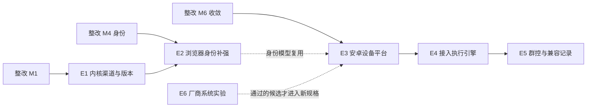

# 执行环境扩展：指纹浏览器管理与安卓设备平台 设计规格

- 日期：2026-09-30；状态：proposed，待用户审批
- 来源：用户与 Claude 关于 CloakBrowser 管理、安卓 / iOS 模拟器的讨论（2026-09-30）
- 关系：独立于整改计划（[整改总纲](2026-09-30-remediation-roadmap.md)），但依赖其成果；安卓部分遵守整改期冻结决定，整改 M6 完成后才开始
- 实施计划：[执行环境扩展里程碑计划](../plans/2026-09-30-execution-environments-milestones.md)
- 参考研究：`docs/research/android-manager-2026-09-30/`（安卓管理工具研究、纯虚拟化可行性）

## 1. 结论

1. **浏览器**：继续使用 CloakBrowser 免费的**公开版内核**（GitHub Releases，官方文档未写并发限制），不接入"登录后的最新免费版"（同时只能开 1 个会话）。管理层补齐四件事：内核渠道与版本治理、身份体检与指纹漂移检测、登录状态与身份的导入导出、移动网页身份。
2. **安卓**：做成**通用设备平台**，不针对特定 App，也不承诺"任何 App 都识别不出模拟器"。桌面优先：官方 Android Emulator（AVD）是 Mac 与 Windows 的主运行时，现有 ReDroid（Mac + Lima）保留为高密度选项。设备和浏览器平级，都是"执行环境"，接入同一套身份、批次、处理台账和执行引擎。
3. **iOS**：不做。没有能在电脑上运行 App Store 应用的开源 iOS 模拟器；将来只有在出现明确业务需求且接受实体 iPhone 时才重新立项。
4. **厂商系统**（HyperOS / One UI 等）：保留为实验轨道，按研究文档的验证步骤推进，不进入产品承诺。

## 2. 背景与约束

| 事实 | 来源 / 核实方式 |
| --- | --- |
| CloakBrowser 用种子控制整套指纹，默认种子范围 10000–99999；在 C++ 层修改画布、WebGL、音频、字体、WebRTC、客户端提示、TLS 指纹；支持代理、按出口 IP 设时区、拟人化（humanize，预设 default / careful） | CloakBrowser PyPI 文档；AutoFlow `providers/browser/worker.py` 的启动参数 |
| 最新免费版需 GitHub 登录且同时只能 1 个会话；Pro 按套餐 5–2,000+；GitHub Releases 上的旧版（v146 及更早）未写并发限制，但缺少 v148 之后的补丁 | CloakBrowser PyPI 页面（包版本 0.5.11） |
| AutoFlow 固定 `cloakbrowser==0.5.9`，内核目录只解析 `public` 与 `licensed` 两种渠道，只支持 Mac（arm64 / x64）与 Windows x64 | `providers/kernel/catalog.py`、`apps/backend/pyproject.toml` |
| 现有安卓模块：Mac ARM64 上用 Lima 虚拟机运行 ReDroid，scrcpy 投屏（音频、剪贴板同步关闭），有设备归属、独占控制、备份、容量预留、批量操作；约 8,600 行后端、6,800 行前端 | 源码与研究文档 |
| 用户已确认：整改期间冻结安卓 / iOS；安卓会跑各种网站或各种 App；使用 CloakBrowser 免费版 | 本次讨论 |
| Play Integrity 的强完整性要求硬件证明的锁定 bootloader，虚拟设备无法满足 | Android 开发者文档（研究文档已引用） |

## 3. 目标与非目标

**目标**

- G-1 批量场景下内核可用且可控：并发不被渠道限制卡住；版本老化可见；每个身份的内核版本稳定。
- G-2 每个浏览器身份能自证"内部一致"，并能发现跨次运行的指纹变化。
- G-3 登录状态与身份可以迁移、备份，而不依赖整目录复制。
- G-4 手机网站有低成本方案（移动网页身份）和高保真方案（安卓设备里的真实 Chrome）。
- G-5 安卓设备可以像浏览器身份一样被创建、管理、分配代理、纳入批次运行，并用通用方式自动化各种 App。
- G-6 对"能不能跑某个 App"给出基于证据的兼容记录，而不是事先承诺。

**非目标**

- 伪造 IMEI、序列号、基带等硬件标识，或以绕过 Play Integrity / 应用反作弊为目标的系统改造。
- iOS 模拟器或 iOS 真机平台。
- Linux 服务器 / 远程设备节点（AutoFlow 目前是 Mac / Windows 桌面应用）。
- 接入第二个浏览器内核（Camoufox）的实现；只预留抽象与触发条件（见 R1-06）。
- 厂商 ROM 的产品化。

## 4. 里程碑与依赖

| 里程碑 | 内容 | 依赖（整改计划） | 最早开始 |
| --- | --- | --- | --- |
| E1 内核渠道与版本治理 | 渠道策略、并发实测、版本落后提示、内核抽象 | 整改 M1（容量设置） | 整改 M1 合并后 |
| E2 浏览器身份补强 | 体检、指纹快照与漂移、Cookie 与身份包导入导出、行为风格、移动网页身份 | 整改 M4（身份模型）、M5 5C（身份页） | 整改 M4 合并后 |
| E3 安卓设备平台 | 运行时端口、AVD 运行时、设备生命周期、设备身份与代理、管理界面 | 整改 M6（解冻、设计系统统一） | 整改完成后 |
| E4 安卓接入执行引擎 | 设备作为执行环境、移动端节点、设备内 Chrome、录制、批量运行 | E3；整改 M2 台账、M6 统一执行引擎 | E3 合并后 |
| E5 群控与兼容记录 | 一控多、按 App × 运行时 × 系统镜像的兼容记录 | E4 | E4 合并后 |
| E6 厂商系统实验（研究轨道） | 研究文档中的 A–E 验证 | 无（不改产品代码） | 随时，结果以知识文档交付 |

## 5. 需求

### E1 内核渠道与版本治理

| 编号 | 需求 |
| --- | --- |
| R1-01 | 默认渠道为 `public`。内核管理页按渠道分组显示，并写明各渠道的并发特性：公开版"官方未写并发限制，版本较旧"；授权版"按授权套餐"。 |
| R1-02 | 不接入"登录后的最新免费版"。若将来接入，该渠道的内核在派发器中强制并发 1，并在选择时提示"同时只能运行 1 个，不适合批量"。本条写入 ADR。 |
| R1-03 | `cloakbrowser` 包版本升级前必须完成评审清单：公开渠道的发布语义、种子范围、启动参数、并发限制是否变化；清单作为 `docs/references/cloakbrowser-upgrade-checklist.md` 维护。 |
| R1-04 | 并发实测：用公开版内核以并发 ≥ 2（及机器推荐值）跑黄金场景 G2，确认无会话数限制；结果写入 `.ai/knowledge`。若发现限制，E1 暂停并回到用户决策。 |
| R1-05 | 版本落后提示：从 Chrome 版本历史服务获取稳定版主版本号（每 24 小时最多请求一次，缓存到本地；离线时不提示、不报错），内核页与身份详情显示"比当前 Chrome 稳定版落后 N 个大版本"，N ≥ 4 时用警告样式。 |
| R1-06 | 内核抽象：身份模板中的"内核"字段为 `{ engine: 'cloakbrowser', edition, version }`；执行层通过 `BrowserEnginePort` 启动，CloakBrowser 是唯一实现。ADR 写明接入 Camoufox 的触发条件：公开渠道停止发布超过 6 个月、或落后稳定版 ≥ 8 个大版本、或出现并发限制。 |
| R1-07 | 被身份或模板引用的内核版本不可删除；删除时列出引用者。 |

### E2 浏览器身份补强

| 编号 | 需求 |
| --- | --- |
| R2-01 | **本地一致性体检**：用身份的完整配置（种子、代理、地区、内核）启动浏览器，打开内置的本地探针页，采集 UA、平台、语言、Intl 时区、屏幕、硬件并发、设备内存、WebGL 厂商 / 渲染器、webdriver 标记、WebRTC 候选 IP；同时从代理出口测 IP 与地理位置。按规则输出通过 / 警告 / 失败项：时区与出口地区不一致、语言与地区不一致、WebRTC 暴露非出口 IP、webdriver 为真、UA 与平台矛盾等。不访问第三方网站。 |
| R2-02 | **外部检测页（可选）**：身份详情提供"用此身份打开检测页"，预置 CreepJS、BrowserScan、Pixelscan 链接；打开后截图保存为运行产物（不入库），供人工查看。不自动解析第三方页面结果。 |
| R2-03 | **指纹快照与漂移**：每次体检与每次批量运行的首个网页节点前，记录探针值的规范化快照与摘要；与该身份上一份快照比较，变化项（不含预期变化如时间）显示在身份详情，并在批次监控中汇总"本批有 N 个身份指纹发生变化"。 |
| R2-04 | **Cookie 导入导出**：支持 JSON（Playwright / 常见扩展格式）与 Netscape 文本；导入写入该身份的登录环境（新代次），导出只导出该身份当前代次。导入前显示将写入的域名与条数。 |
| R2-05 | **身份包导出 / 导入**：身份打包为加密文件（口令派生密钥，scrypt + AES-GCM），内容为身份元数据、种子、地区、内核版本、代理绑定引用、瘦身后的登录环境；代理凭据默认不导出（可勾选）。导入时检查种子冲突：冲突则拒绝或按用户选择重新生成。 |
| R2-06 | **行为风格**：身份上可选择拟人化预设（关闭 / default / careful），映射到 CloakBrowser 的 `humanize` 与 `human_preset`；同一身份每次运行使用同一预设。 |
| R2-07 | **移动网页身份**：身份模板可选择"移动网页"并选定设备描述（UA、视口、像素比、触屏、isMobile）。界面标注"浅层移动伪装：一般网站可用，严格反爬网站可能识别；需要真实手机网页指纹请使用安卓设备"。先完成调研（R2-08）再决定是否使用 CloakBrowser 自身的移动端指纹参数。 |
| R2-08 | 调研任务：核实 CloakBrowser 公开版是否支持移动 / 安卓平台指纹参数（如 `--fingerprint-platform`），结论写入 `.ai/knowledge`；不支持时按 R2-07 的 Playwright 设备描述实现。 |

### E3 安卓设备平台

| 编号 | 需求 |
| --- | --- |
| R3-01 | **运行时端口**：`AndroidRuntimePort` 定义创建、启动、停止、快照、恢复、删除、执行 adb、投屏会话等操作，以及能力声明 `capabilities: { googlePlay, camera, microphone, location, audio, snapshots, maxRecommendedInstances }`。现有 ReDroid-on-Lima 实现改为该端口的一个适配器，行为不变。 |
| R3-02 | **AVD 运行时**：Mac（arm64）与 Windows（x64）使用官方 Android Emulator。SDK 组件（emulator、platform-tools、系统镜像）由 AutoFlow 管理下载，校验摘要，版本固定；无窗口模式运行，画面通过 scrcpy 投到 AutoFlow。Windows 需检测并提示开启 Windows Hypervisor Platform。 |
| R3-03 | **能力如实标注**：界面上的相机、麦克风、定位、Google Play 等能力，只有在"运行时声明支持"且"该运行时 × 系统镜像组合已通过对应验收测试"时才显示为可用；否则显示为不可用并说明原因。 |
| R3-04 | **设备生命周期**：从系统镜像创建、启动、停止、克隆、快照 / 恢复、重置、删除、备份（沿用现有备份）；删除与重置需二次确认并写明会丢失的数据。 |
| R3-05 | **设备身份**：设备可关联整改 M4 的身份对象：固定代理（经宿主侧代理中转，每台设备独立；启动后在设备内测出口 IP 并与身份地区比对）、地区（语言、时区、定位）、设备型号与屏幕模板（来自运行时支持的硬件配置）。不修改 IMEI、序列号等硬件标识。 |
| R3-06 | **操控**：投屏与控制、音频（scrcpy 音频开启可选）、剪贴板同步、文件传入 / 导出、APK 与分包 APK（XAPK / APKS）安装、应用列表与卸载。 |
| R3-07 | **容量**：设备按内存预算计入本机资源（AVD 每台默认预算 3 GB，ReDroid 每台 1.5 GB），与浏览器共同受整改 M1 的内存水位保护；设备管理页显示"本机还可启动约 N 台"。 |
| R3-08 | **界面**：按研究文档的信息架构：我的设备、系统库、设备工作台、运行环境；使用整改 M5 统一后的设计系统，不再使用独立样式。 |

### E4 安卓接入执行引擎

| 编号 | 需求 |
| --- | --- |
| R4-01 | **执行环境**：自动化的环境策略增加 `androidDevice`（固定设备 / 按记录关联的身份所绑定的设备 / 从设备池领取）。设备任务走整改后的统一派发器、处理台账与失败分类；设备失联、adb 断开归为基础设施失败。 |
| R4-02 | **移动端节点**（约 12 个）：启动 / 停止应用、点击（元素 / 坐标）、滑动、输入文本、按键（返回、主页、回车）、等待元素、读取元素文本、截图、按图找图点击、按文字（OCR）点击、安装应用、按描述操作（可选，使用模型管理中的视觉模型）。 |
| R4-03 | **元素定位**：首选界面元素树（uiautomator2），支持按文字、资源 ID、描述、类名、XPath 定位；拿不到元素时用截图识别兜底。选型写入 ADR（uiautomator2 与 Appium 的取舍）。 |
| R4-04 | **设备内 Chrome**：设备上的 Chrome 通过调试端口转发接入，复用现有网页节点（打开网页、点击、输入、提取等），让手机网页任务获得真实安卓网页指纹。可行性先做调研任务；不可行时退回移动端节点操作 Chrome。 |
| R4-05 | **录制**：在设备工作台中录制点击、滑动、输入，点击时同步抓取元素树，优先生成按元素定位的节点，坐标作为后备。 |
| R4-06 | **试跑与批量**：设备节点支持 Studio 试跑（选择设备）与批量运行（每行一台设备或设备池），与浏览器节点共用运行结果页、任务时间线与失败归组。 |

### E5 群控与兼容记录

| 编号 | 需求 |
| --- | --- |
| R5-01 | **群控**：选择一台主控设备与若干从设备，主控上的点击、滑动、输入按屏幕比例同步到从设备；可选"按元素同步"（从设备按相同元素定位执行）；任一从设备失败时显示并可单独接管。 |
| R5-02 | **兼容记录**：按"应用包名 + 版本 × 运行时 × 系统镜像"记录：能安装、能启动、能登录、能正常使用、被拦截（附现象描述与截图产物）。批量运行中应用启动失败、出现已知拦截提示时自动记一条"疑似"，人工确认后生效。创建设备或选择设备池时显示目标应用的兼容记录。 |

### E6 厂商系统实验（研究轨道）

| 编号 | 需求 |
| --- | --- |
| R6-01 | 按 `docs/research/android-manager-2026-09-30/pure-virtualization.md` 第 5 节的 A–E 阶段执行，产出知识文档与可复现脚本；不改产品代码。 |
| R6-02 | 只有"同一镜像组合跑通用户实际动作"的候选，才能以新规格进入 E3 的系统库，且标注为实验。 |

### iOS 决策

| 编号 | 决定 |
| --- | --- |
| R7-01 | 不做 iOS 模拟器或 iOS 设备平台。写入 ADR：Xcode Simulator 只能在 Mac 上运行专为模拟器编译的应用，不能安装 App Store 应用；可虚拟化 iOS 运行第三方应用的只有商业产品 Corellium，不适合集成；用 Chromium 伪装 iOS Safari 差异过大。 |
| R7-02 | 重新立项条件：出现明确的 iOS 业务需求，且接受实体 iPhone。届时参考 WebDriverAgent、go-ios、pymobiledevice3、Zebrunner mcloud。 |

## 6. 设计要点

- **身份是共同的中心**：整改 M4 的身份（种子、代理绑定、地区、登录环境、健康）扩展一个可选的 `device` 关联；浏览器身份与设备身份共用代理粘性分配、地区一致性校验、健康状态与处理台账。
- **执行环境端口**：`BrowserEnginePort`（E1）与 `AndroidRuntimePort`（E3）都是"执行环境提供者"，派发器通过资源端口租借它们；容量统一按内存预算计。
- **诚实原则**：能力只在测试通过后显示；兼容性只来自证据；浅层伪装明确标注。
- **本地优先**：体检不依赖第三方网站；版本信息获取失败不影响任何功能。

## 7. 验收标准

| 编号 | 验收 |
| --- | --- |
| AC-E1-1 | 公开版内核在并发 = 机器推荐值下跑完 G2，无会话数限制错误；结果记录在 `.ai/knowledge`。 |
| AC-E1-2 | 内核页按渠道分组并显示并发特性；被引用内核无法删除并列出引用者；离线时版本提示不出现且无报错。 |
| AC-E2-1 | 体检对"时区与出口地区不一致""WebRTC 暴露本机 IP"两种注入故障分别给出失败项；一致配置全部通过。 |
| AC-E2-2 | 同一身份两次运行指纹无变化时不提示；更换内核版本后提示变化项。 |
| AC-E2-3 | Cookie 导出再导入到新身份后，夹具站点 `/account` 显示已登录；身份包导出后在另一工作区导入，种子、地区、登录状态一致；种子冲突时被拒绝。 |
| AC-E3-1 | Mac 与 Windows 各在 AVD 上完成：创建 → 启动 → 投屏操控 → 安装 APK → 快照 → 恢复 → 删除；ReDroid 路径回归测试全部通过。 |
| AC-E3-2 | 设备绑定代理后，设备内测得的出口 IP 等于代理出口，且与身份地区一致；不一致时拒绝启动任务并说明原因。 |
| AC-E4-1 | 黄金场景 G5（新增）：20 行数据，每行在设备上打开系统"设置"搜索一个词并读取结果，再在设备内 Chrome 打开夹具站点提交表单；台账、失败分类、任务时间线与浏览器任务一致。 |
| AC-E4-2 | 录制一段"打开应用 → 点击 → 输入"的操作，生成的节点按元素定位，回放通过。 |
| AC-E5-1 | 群控 1 主 3 从同步 20 步操作，全部从设备完成；一台从设备断开时其余继续且界面标出断开设备。 |
| AC-E5-2 | 批量运行中应用启动失败自动生成"疑似不兼容"记录，人工确认后在设备创建页可见。 |

## 8. 风险

| 风险 | 应对 |
| --- | --- |
| 公开版内核停止更新或出现并发限制 | R1-04 实测；R1-06 触发条件与第二内核预案；必要时由用户决定是否购买 Pro |
| 内核老化成为可识别特征 | R1-05 可见化；按身份分批升级 |
| AVD 在 Windows 上与其他虚拟化软件冲突 | 启动前检测并给出明确提示；不自动更改系统设置 |
| 各种 App 在虚拟设备上被拦截 | 不承诺；E5 兼容记录；需要时由用户决定是否引入实体设备（新立项） |
| 安卓与浏览器争抢内存 | R3-07 统一内存预算与水位保护 |
| 设备内 Chrome 调试接入不稳定 | R4-04 先调研，失败则退回移动端节点 |
