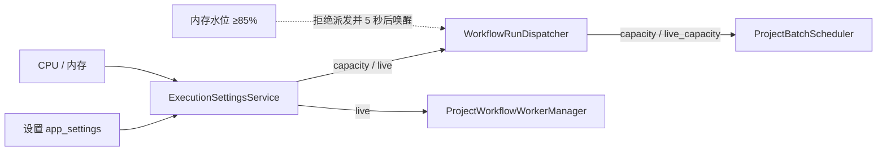

# M1 止血：消除静默失效 设计规格

- 日期：2026-09-30；修订：r2；状态：proposed（按用户已确认的评审方向修订，未实施；开工门槛见总纲）
- 总纲：[整改里程碑总纲](2026-09-30-remediation-roadmap.md)；对应整改方案 A1（先隐藏）、A2、A3、C1、C2、C5（领取移出主循环）、D1、D3、G1、J6
- 前置：[M0 基准与守门](2026-09-30-remediation-m0-baseline-guardrails.md) 已合并（本里程碑的验收数字以 M0 基准为对照）
- 实施计划：[M1 实施计划](../plans/2026-09-30-remediation-m1-stop-silent-failures.md)

## 1. 结论

M1 只修"用户以为生效、实际没生效"和"出了错却看不到原因"的问题，不引入新的业务对象。完成后：

1. 界面上不再出现后端不执行的出错策略、重试、超时动作选项；已保存文档里有这些设置时，运行前会明确提示"尚未生效"。
2. 批量运行的失败日志带上执行器给出的真实原因。
3. 新建流程中，被错误分支接住的失败不再让整次运行失败；旧流程保持原行为，可一键切换。
4. 并发上限按机器配置（8 核 16GB 默认 6），可在设置里调整；等待人工的任务不占执行名额。
5. 领取数据不再阻塞服务主循环；SQLite 开启 WAL。
6. worker 的标准错误输出被保存，崩溃时有据可查。
7. 录制到回车等按键的流程可以直接运行。

## 2. 背景（均已在 ea2cc5b 上核实）

| 问题 | 位置 | 现象 |
| --- | --- | --- |
| 出错策略、重试、超时动作无人读取 | `ConfigPanel.tsx` 1606–1770；`BlockFlowView.tsx` 225–245；`WorkflowEditor.tsx` 1689；`ControlModuleConfigs.tsx` 287 | M0 守门检查列出的 7 个未读取键：errorPolicy、retryCount、retryDelay、retryBackoff、retryExhaustedAction、timeoutAction、onTimeout |
| 批量失败日志丢原因 | `providers/browser/project_graph.py` 约 424 行 | 固定写"工作流节点执行失败" |
| 已处理失败仍算失败 | `application/workflows/runtime.py` `_execute_claimed` | 先 `_remember_failure` 再走错误分支；`run()` 以 `failed_result is None` 判定成功 |
| 并发写死为 2 | `bootstrap/workflows.py` 566、599；`dispatcher.py` 与 `project_workflow_worker.py` 只接受 {1, 2} | 自动化允许 1–100，超出部分静默截断 |
| 人工等待占名额 | `dispatcher.py` `pause_manual` 不移除 owner；`scheduler.py` `_capacity_counts` 把 waiting_manual 计入 | 两个任务同时等人工，全机停住 |
| 领取在主循环同步执行 | `scheduler.py` `_advance_data` 调用 `_claim_data_task` | 1 万行单次 2.0–2.6 秒，期间所有接口卡住 |
| SQLite 未开 WAL | `infrastructure/database/session.py` 只设 `foreign_keys` | 事件提交 p50 约 4.1 毫秒；开启 WAL + NORMAL 后实测约 1.4 毫秒 |
| 两个引擎打开同一数据库 | `bootstrap/proxies.py` 65 行另建 `create_session_factory` | 锁竞争 |
| worker 标准错误被丢弃 | `project_workflow_worker.py` 约 171 行 `stderr=DEVNULL` | 崩溃无诊断 |
| 录制器生成不可运行节点 | `recordingGeneration.ts` 177 行生成 `keyboard_action`，该类别被排除 | 录到回车的流程无法运行 |

## 3. 目标与非目标

**目标**：第 1 节的 7 条。

**非目标**（明确推迟）：

- 出错策略、重试、超时动作的真正实现（M2，整改方案 A1 正式模型）。M1 只隐藏和提示。
- End 节点的"业务结果"（M2）。M1 中运行结果仍是"成功 / 失败"两种。
- 失败分类（A4）、批次熔断（A5）（M2）。
- 事件分级与批量写入（D2）、领取 SQL 下推（B2）（M3）。M1 只把领取挪出主循环，单次耗时不变。
- 单一数据库写线程（C5 完整形态）（M3）。
- Cookie / 本地存储节点、请求拦截节点（G1 其余部分）（M2）。

## 4. 需求

| 编号 | 需求 |
| --- | --- |
| R1-01 | 前端增加 `NODE_RETRY_POLICY_ENABLED = false` 开关。开关关闭时：配置面板不显示"错误处理"整段和"运行超时后 / 重试次数 / 重试耗尽后 / 重试间隔 / 退避策略"；模块条视图不显示出错策略菜单与文字；画布不画"错误回流"连线；循环节点不显示"运行超时后"。"超时时间（秒）"保留（后端会读取）。已保存的值原样保留在文档中，不做迁移、不丢失。 |
| R1-02 | "尚未生效的设置"检测：前端 `findInertSettings(nodes)` 与后端 `inert_settings(document)` 使用同一规则（见 5.1）。Studio 点击运行前，若有命中项，在日志面板写一条 warning，列出节点名与设置名，运行照常进行；项目批次运行时，worker 在开始执行前为每个命中节点写一条 warning 日志。 |
| R1-03 | 批量运行节点失败时，日志和运行错误的 `message` 为"工作流节点执行失败：<原因>"或"工作流节点执行超时：<原因>"。原因取执行器返回的 `error`，其次 `message`，超过 1,000 字符截断。节点使用了凭据派生值时，沿用运行时已有的脱敏结果（原因变为"节点执行失败（错误包含凭据派生值）"），不泄露凭据。`code` 保持不变。 |
| R1-04 | 项目能力调用被拒时，worker 回给流程的错误从"项目能力请求未完成"改为"项目能力请求未完成：<拒绝原因>"，`code` 不变。 |
| R1-05 | 流程文档增加顶层字段 `executionSemantics`，取值 `"autoflow-v2"`；缺省或其他值视为 `"webrpa"`。所有内部递归、结构化并行和画布子流程继承生效语义；有独立保存文档的子流程按其版本显式解析，不能因内部裁剪丢字段退回旧语义。v2 语义下，被错误分支接住的节点失败记为"已处理失败"，不决定运行结果；错误分支中再失败、或没有错误分支的失败，仍使运行失败。webrpa 语义保持现状。`WorkflowRuntimeResult` 增加 `handled_failure_node_ids`。 |
| R1-06 | Studio：新建流程写入 `executionSemantics: "autoflow-v2"`；导入、打开已有文档保持文档原值；文档是 webrpa 语义且含错误连线时，画布顶部显示提示条"这个流程沿用旧的出错规则：错误分支处理后仍算失败。[改用新规则]"，点击后写入 v2 并标记未保存。后端文档校验与保存白名单接受该字段。 |
| R1-07 | 并发上限按机器配置：推荐值 = min(⌊逻辑 CPU × 3 / 4⌋, ⌊总内存 / 1.5 GiB⌋)，下限 1、上限 64。用户可在设置中覆盖（1–64），也可恢复推荐值。设置保存在新表 `app_settings`（键 `execution.maxRunningBrowsers`，带修订号并发控制）。接口 `GET/PUT /api/v1/settings/execution`。更新以事件循环所属的异步锁串行化“校验修订/线程内持久化/循环内应用”，GET 返回已应用的同一修订；初次插入竞争也返回409。保存后立即作用于运行中的派发器和 worker 管理器；调低不会中止已在运行的任务。 |
| R1-08 | 派发器容量改为两个数：执行名额 `capacity`（R1-07 的生效值）与存活浏览器上限 `live_capacity`（= 2 × 执行名额）。去掉 {1, 2} 限制。 |
| R1-09 | 等待人工的运行只占存活浏览器名额，不占执行名额；人工继续时直接恢复，可暂时超出执行名额，超出期间不派发新任务。调度器的全局计数同样区分"执行中"和"存活"。 |
| R1-10 | 内存占用 ≥ 85% 时，派发器拒绝派发新任务（错误码 `WORKFLOW_CAPACITY_FULL`，消息"本机内存占用超过 85%，暂停派发新任务"），5 秒后唤醒调度器重试。 |
| R1-11 | 自动化运行设置中，"请求并发数"旁显示"本机当前最多同时运行 N 个浏览器"；设置值大于 N 时提示"实际同时运行不超过 N 个"。设置页"常规"增加"同时运行的浏览器"卡片：显示推荐值与依据（CPU、内存），可输入覆盖值或恢复推荐。 |
| R1-12 | 数据批次领取（`_claim_data_task`）放到线程中执行（`asyncio.to_thread`），主循环不再等待领取。 |
| R1-13 | SQLite 连接统一设置 `journal_mode=WAL`、`synchronous=NORMAL`、`busy_timeout=5000`、`foreign_keys=ON`；代理管理复用主会话工厂，不再单独建引擎；关闭服务时执行一次 `wal_checkpoint(TRUNCATE)`。 |
| R1-14 | worker 标准错误写入 `<运行产物目录>/worker-stderr.log`，单文件上限 5 MB，超出后丢弃新内容并在末尾注明"已截断"；持续按固定字节块消费管道，不能因无换行或超长行退出；单行尾缓存最多8 KiB，总尾缓存最多200行且256 KiB，文件5 MB上限包含截断标记。磁盘写失败也继续排空并记录诊断不可用。worker 异常退出（`WORKFLOW_WORKER_LOST`）时，错误消息附"诊断日志：runs/<runId>/generation-<n>/worker-stderr.log"，管理器异常携带最后50行；派发器保留 interrupted / WORKFLOW_RESULT_UNKNOWN 的安全终态，并持久化 diagnosticLog、安全处理后的 stderrTail 与 causeCode。API 查询须可见；凭据派生内容不得原样公开，不以manager直接调用替代链路测试。 |
| R1-15 | 新增网页节点 `press_key`（按键）：配置 `key`（Playwright 键名，支持组合如 `Control+A`）、`targetType`（`focused` 当前焦点 / `element` 元素）、`selector`、`timeout`（秒，默认 30）。元素模式先等待元素可见再在元素上按键；焦点模式在当前页面按键。节点归入"网页元素交互"类别，`sideEffect` 视为"可能"（供 M2 使用）。 |
| R1-16 | 录制器遇到按键事件生成 `press_key`（原 `keySequence` → `key`，保留 `targetType`、`selector`）。新增检查：录制器可能生成的每一种节点都必须在后端可执行节点目录中。 |
| R1-17 | M0 守门基线同步收紧：未读取配置键减少 7 个（隐藏的 6 个通用键 + 循环 onTimeout 视为"已由预检读取"，见 5.1）。 |

## 5. 设计

### 5.1 "尚未生效的设置"规则（R1-02、R1-17）

同一张表在前后端各实现一次，由测试互相对照（后端测试读取前端规则文件中的键名列表）：

| 设置 | 视为"已设置"的条件 |
| --- | --- |
| errorPolicy | 存在且 `mode` 不是 `stop` |
| retryCount | 数字且大于 0 |
| retryDelay、retryBackoff、retryExhaustedAction | 仅当 retryCount 大于 0 时计入 |
| timeoutAction | 值为 `retry` 或 `skip` |
| onTimeout（仅 loop 类节点） | 值为 `retry` 或 `skip` |

节点配置可能在 `data` 上，也可能在 `data.config` 上，两处都要读（与 `project_graph.py` 的 `config = data.get('config', data)` 一致）。后端实现放在 `domain/workflows/inert_settings.py`，这使 7 个键在后端源码中出现，守门检查的"未读取"计数随之减少——这正是期望：它们现在被"读取并报告为未生效"。

### 5.2 出错语义（R1-05、R1-06）

- 选择"缺省即旧语义"，理由：已有流程的行为不会在升级后静默改变；新建流程自动获得新语义；用户主动切换时有明确提示。代价：旧流程需要用户点一次"改用新规则"。
- `WorkflowRuntime.execute(..., error_semantics=None)`：`None` 时从文档读取。项目 worker（`ProjectGraphExecutor.run`）在文档被画布子流程改写之前读取语义并显式传入，避免字段在改写中丢失。
- `_WorkflowScheduler._execute_claimed` 的失败分支改为：没有错误分支 → 记录失败并停止；有错误分支 → v2 记入 `handled_failure_node_ids`，webrpa 记录失败；两者都执行错误分支。
- B3 对照测试 `test_failure_dispatches_error_edge_before_runtime_reports_failure` 不改（它验证的是 webrpa 语义，文档无标记）。

### 5.3 并发与名额（R1-07 至 R1-11）



- 3/4 逻辑核与1.5 GiB/任务仅是可覆盖的初始启发式，不是容量安全证明；8核16GB算出6不代表任何流程都能稳定并发6。用受控轻/重页面负载记录峰值RSS、主循环延迟与失败率，未达标时调整默认值并记录依据，不倒推系数凑目标。内存水位保护仅限制新派发。
- 派发器：`_RunOwner` 增加 `waiting_manual`；`pause_manual` / `resume_manual` 维护它；`dispatch` 拒绝条件改为"执行中 owner 数 ≥ capacity"或"owner 总数 ≥ live_capacity"。
- worker 管理器的容量含义是"存活进程数"，等于 `live_capacity`。
- 调度器 `_capacity_counts` 返回 `CapacityCounts(executing, live, automation, batch)`；`executing` 不含 `waiting_manual`。批次级、自动化级限制保持原意（`maxLiveInstances` 本来就是存活实例上限）。
- 取代既有决定：`docs/superpowers/plans/2026-09-26-parameter-batch-concurrency.md` 的"不提高 core 的两个槽上限"；`test_workflow_dispatch.py` 中断言"人工暂停仍占满容量"的用例改为显式 `live_capacity=2` 并新增用例覆盖新规则。

### 5.4 依赖

- 新增直接依赖 `psutil>=7,<8`（`uv.lock` 中已有 7.2.2 作为传递依赖，锁文件版本不变）。用于内存总量与水位；CPU 数用 `os.cpu_count()`。

### 5.5 接口

```text
GET  /api/v1/settings/execution
PUT  /api/v1/settings/execution   { maxRunningBrowsers: int(1–64) | null, expectedRevision: int ≥ 0 }
→ { maxRunningBrowsers, recommendedMaxRunningBrowsers, effectiveMaxRunningBrowsers,
    maxLiveBrowsers, memoryPressure, hardware: { logicalCpus, totalMemoryGb }, revision }
409 SETTINGS_REVISION_CONFLICT（details.currentRevision）
```

生成的 OpenAPI 类型随之更新（`npm run openapi:generate`）。

### 5.6 数据库迁移

`rm1_app_settings`：新建 `app_settings(key PK, value JSON, revision INT, updated_at)`，`down_revision = "0025_merge_studio_credential_environment"`。只增不改。

## 6. 验收标准

| 编号 | 验收 | 证明方式 |
| --- | --- | --- |
| AC1-01 | 开关关闭时，配置面板、模块条视图、画布中不出现 R1-01 列出的控件；已保存的 errorPolicy 等值在保存 / 导出后仍原样存在 | 前端组件测试 |
| AC1-02 | 含 retryCount=3 的节点：Studio 运行前日志出现一条 warning 且运行继续；批量运行任务日志出现同样提示 | 前端测试 + 后端单元测试 |
| AC1-03 | 解析非法 JSON 的节点在批量运行中失败，运行错误和日志 message 以"工作流节点执行失败："开头且带执行器原因；使用凭据的节点失败时不含凭据值 | 后端单元测试 |
| AC1-04 | 覆盖结构化并行、嵌套fork、画布子流程和持久文档子流程；v2 文档"失败节点 → 错误分支 → 处理节点"的运行结果为成功；无标记文档仍为失败；错误分支内再失败仍为失败 | 后端单元测试（运行时 + 项目 worker 两层） |
| AC1-05 | Studio 新建流程导出后含 `executionSemantics: "autoflow-v2"`；旧文档含错误连线时显示提示条，点"改用新规则"后导出含 v2 | 前端测试 |
| AC1-06 | 并发/首次插入/取消注入下数据库修订与dispatcher/worker应用修订一致；`GET /api/v1/settings/execution` 返回的生效值等于派发器 `capacity`；PUT 7 后派发器变为 7/14；过期修订号返回 409；0、65、字符串返回 422 | 契约测试 |
| AC1-07 | capacity=1、live=2 时：A 运行 → B 被拒；A 等待人工 → B 可派发；C 被拒（存活已满）；A 继续后两者都能完成 | 集成测试 |
| AC1-08 | 内存水位模拟为高时派发被拒且 5 秒（测试中缩短）内唤醒监听者；水位恢复后可派发 | 集成测试 |
| AC1-09 | 领取期间主循环基本不被阻塞：1 万行领取期间 `LoopLagMonitor` 的 p50 < 10 毫秒、max < 250 毫秒（原型实测：在主循环内领取 max 1,935 毫秒；放进线程后 max 129 毫秒，剩余延迟来自 GIL，M3 的 SQL 下推彻底解决） | 基准 `bench_claim_loop_lag`（新增） |
| AC1-10 | 事件提交基准 `event_commit_ms_p50` 相对 M0 基线下降 ≥ 50% | 基准 |
| AC1-11 | 连接上 `PRAGMA journal_mode` 返回 `wal`，`busy_timeout` 返回 5000；代理管理使用 `app.state.session_factory` | 单元测试 |
| AC1-12 | 经真实dispatcher与查询API验证未知终态及诊断信息不丢；70,000字节单行、无换行、超文件上限和磁盘失败仍持续排空且worker可退出。worker 进程写 stderr 后异常退出：产物目录有 worker-stderr.log；`WORKFLOW_WORKER_LOST` 的消息含日志路径；超过上限时文件以"已截断"结尾 | 单元测试（StderrSink）+ 集成测试（假 worker 命令） |
| AC1-13 | `press_key` 在元素模式对输入框按 Enter 提交表单；焦点模式按 Tab 移动焦点 | 真实浏览器集成测试（AUTOFLOW_TEST_CLOAKBROWSER） |
| AC1-14 | 录制按键事件生成 `press_key`；"录制器可生成节点 ⊆ 后端可执行节点"检查通过 | 前端测试 |
| AC1-15 | 黄金场景 G3 保留点击版并新增"按回车提交"版，在装有 CloakBrowser 的机器上跑通 | 黄金场景 |
| AC1-16 | 守门检查通过，`unreadConfigKeys` 基线减少 7 | `node scripts/ratchets.mjs` |

## 7. 风险

| 风险 | 应对 |
| --- | --- |
| 旧流程用户不知道要切换新语义 | 提示条只在"旧语义 + 有错误连线"时出现，一次点击完成；M5 的运行结果页再提示一次 |
| 调高并发后低配机器内存吃紧 | 推荐值受内存约束；R1-10 水位保护；设置页展示依据 |
| WAL 改变工作区文件组成（-wal、-shm） | 桌面端工作区校验已接受这两个文件（`apps/desktop/src/main/settings/store.ts` 52 行）；关闭时 checkpoint |
| 领取放进线程后与主循环上的写操作竞争 | `busy_timeout=5000` 吸收短暂锁等待；M3 再引入单一写线程 |
| 新增 `press_key` 触发节点清单类测试 | 按"AutoFlow 原生扩展"路径登记（与 `trace_mark` 相同的清单：`scripts/inventory-studio-completion.mjs`、`scripts/studio-docs.test.mjs`、`audit-module-docs.mjs`），计划中逐一列出 |

## 8. r2 跨层约束

- 最小错误事件转换在 M1 Task 2 提取为两条执行路径共用的纯函数；不提前切换执行入口或改变事件协议。分别从 Studio 和批量实际查询验证真实原因与凭据脱敏。
- to_thread 只移走阻塞，不代表领取不再需要 await；SQLAlchemy Session 在工作线程内部创建/关闭，取消后须等待已开始的事务落定并核验原批次停止门闩，不能误以为取消 await 就取消了数据库提交。
- M1 保留相同配置/场景版本的 M0 对照；新增按键场景独立标版本。没有真实浏览器证据的 AC 继续 pending。
