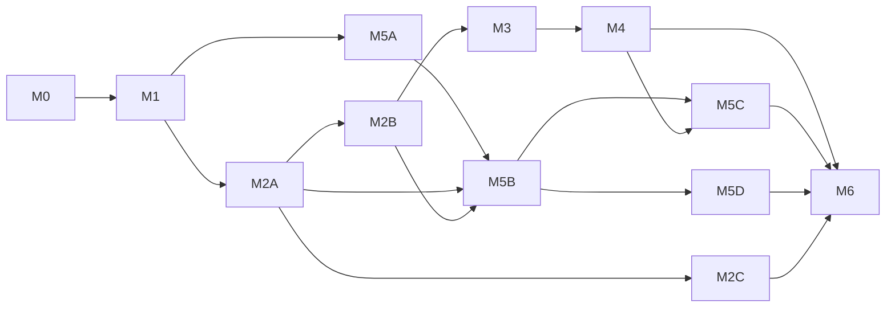

# AutoFlow 整改里程碑总纲

- 日期：2026-09-30；修订：r2（同日评审后修订）
- 状态：confirmed（用户已确认整改方向及本轮文档修订）；M0实施中，其他阶段尚未开始。M2–M6 保持任务级，步骤级细化并审查后继续实施，无需逐阶段批准。
- 来源：用户要求按 M0–M6 评审意见修订；文档基线 `d2c89aeb`，被评审业务源码基线 `ea2cc5b`。
- 上位方案：[AutoFlow 整改方案](2026-09-30-autoflow-remediation-proposal.md)
- 评审依据：[系统设计评审](../../qa/2026-09-30-remediation-reviews/system-design-review.md)、[前端交互评审](../../qa/2026-09-30-remediation-reviews/frontend-interaction-review.md)。原评审是历史观察，不替代本轮契约修订或真实平台验收。

## 1. 结论与不可退让的边界

保留 M0–M6 方向，先让基准可信，再修静默失效，再闭合处理单位、重试与迁移规则。吞吐优化不得削弱执行代次、幂等、租约、未知结果门禁和 End 保存恢复。文档中的代码示例、预期输出不代表已经实施或验证。

M0、M1 保留步骤级计划，实施时逐任务验证真实调用链。M2–M6 在前置接口与测量完成后滚动细化；不为未来阶段预写整套实现。旧版“步骤已完整原型验证、可以直接执行”的结论已 superseded。

## 2. 里程碑与交付边界

| 里程碑 | 可独立交付的结果 | 规格 | 计划 | 开工依据 |
| --- | --- | --- | --- | --- |
| M0 基准与守门 | 唯一行覆盖、正确结果与故障可追踪；离线基准和守门 | [规格](2026-09-30-remediation-m0-baseline-guardrails.md) | [计划](../plans/2026-09-30-remediation-m0-baseline-guardrails.md) | 本轮修订后的步骤级计划 |
| M1 止血 | 隐藏无效设置、错误与诊断端到端可见、完整错误语义、容量与按键 | [规格](2026-09-30-remediation-m1-stop-silent-failures.md) | [计划](../plans/2026-09-30-remediation-m1-stop-silent-failures.md) | M0 退出 |
| M2A 可靠性 | 主处理输入、完整记录身份、台账、未知结果门禁、有限重试与熔断 | [M2 规格](2026-09-30-remediation-m2-business-model-reliability.md) | [M2 计划](../plans/2026-09-30-remediation-m2-business-model-reliability.md) | M1 退出及步骤级审查 |
| M2B 数据契约 | 签名、写回、最小节点输出契约和后端预览写入模式 | 同上 | 同上 | M2A 退出；可独立合并供 M5B 接入 |
| M2C 触发与网页扩展 | 定时/Webhook、Cookie/Storage、请求拦截 | 同上 | 同上 | M2A 后单独细化；不阻塞 M2B/M3 |
| M3 吞吐 | SQL 下推、事件批量；其余优化按测量逐项决定；受限无登录池 | [规格](2026-09-30-remediation-m3-throughput.md) | [计划](../plans/2026-09-30-remediation-m3-throughput.md) | M2A/B 退出，建立 native-batch-v1 基线 |
| M4 身份 | 新种子唯一、历史重复保留、粘性代理、身份独占与 perIdentity 复用 | [规格](2026-09-30-remediation-m4-identity.md) | [计划](../plans/2026-09-30-remediation-m4-identity.md) | M3 会话/资源接口稳定 |
| M5 体验 | 5A 必要控件与布局；5B 数据绑定/试跑/失败处理；5C 身份与窗口衔接；5D 视觉完善 | [规格](2026-09-30-remediation-m5-experience.md) | [计划](../plans/2026-09-30-remediation-m5-experience.md) | 5A 随 M1；5B 随 M2A/B；5C 身份随 M4 |
| M6 收敛 | 统一剩余执行入口、完整历史迁移、表达式转换、受兼容门禁约束的删除 | [规格](2026-09-30-remediation-m6-convergence.md) | [计划](../plans/2026-09-30-remediation-m6-convergence.md) | M4/M5 退出；M2C 如保留交付则亦完成 |

原“前后端各 1 人、13 周”的表格仅为初始估算，现标记 superseded，不是交付承诺。M0/M1 完成后按实测工作量、跨平台验证和连续观察窗口重估；当前不提供未经验证的新周数。

## 3. 依赖关系

- M3 不实现 perIdentity，也不引用尚未建立的 identity_id；该模式连同临时身份种子分配在 M4 接入。M3 的 pool 仅为明确无登录的采集，任务上下文隔离。
- M1 共用最小错误事件转换；M2B 提供最小输出元数据/预览写入契约；M5 消费它们，M6 再完成全部节点规范化及旧入口退役。
- 深色模式、完整动效、全局导航切换属于 M5D，不阻塞 M5B 的业务闭环。所触及组件先用共享基础控件与语义令牌。

## 4. 通用完成定义

1. 每个 AC 对应真实行为测试或带来源的基准；脚本退出 0、skip/xfail 或空结果不能冒充行为通过。
2. 基准记录 scenarioVersion、executionProfile、数据集/故障种子、硬件、内核、并发、commit 与样本次数；同口径多次比较。M0 controlled-one-row-batches-v1 用于正确性及同口径回归；M2B 建立 native-batch-v1 后作为 M3 吞吐比较基线。
3. 保留状态持久化 ACK、执行代次和未知结果保护。行、任务尝试、成功行分别计数；不以重复执行提高吞吐数字。
4. CI 守门存量只减不增；同步代码、规格、测试与 `.ai`。按实际改动运行 lint、类型、测试、构建；文档修订只验证文档，不伪称业务回归通过。
5. 每个切片独立退出评审。平台运行证据分别登记 Windows、macOS ARM/Intel；单平台观察不升级为全平台结论。
6. 连续 7 天黄金场景通过只是稳定性条件；开启/删除旧路径还须兼容、迁移和未决数据清零检查通过。

## 5. 已确认的替代关系（随对应实施合并生效）

| 既有决定 | 替代为 | 阶段 |
| --- | --- | --- |
| 全局容量只允许 1 或 2 | 硬件启发式推荐、用户覆盖、执行/存活分别计数 | M1 |
| 人工等待占执行名额 | 只占存活名额，恢复超额期间不再派发 | M1 |
| 错误分支接住仍使运行失败 | 新文档 v2；旧文档保留旧行为，递归/并行同样遵守 | M1 |
| 再领取只由业务筛选决定 | 台账和完整身份；cycle 仍受未知结果/隔离门禁 | M2A |
| 运行时改表结构 | 结构只在设计期改；自动版本与字段冲突 | M2B |
| 种子属于 Profile | 身份引用种子登记；新分配唯一，旧重复显式保留 | M4 |

## 6. 用户决定与独立维护

1. 2026-09-30 已确认上述整改方向，并要求按评审修订文档。文档提交后立即按依赖实施。用户后续授权已覆盖M0–M6实施、本地提交和后续计划细化审查，无需逐阶段等待批准；部署发布、破坏性数据删除、Git历史改写推送和外部消息不在授权内。
2. 清理历史 QA 截图的授权保留，改为独立维护任务，不是 M0 退出或后续里程碑的前置。先归档可访问资产、生成精确路径清单和哈希、验证镜像备份/恢复；禁止用整个 docs 的 PNG 通配符代替 QA 清单。原型和有效引用单独保留或迁移并更新链接。见 M0 计划独立维护 Task 11。
3. 历史改写推送仍须当时明确确认；向协作者发送外部消息也须明确授权。仅重写经核对的 refs，不使用无差别 force mirror。
4. 身份迁移默认保留原种子；历史重复不是分配器的新例外入口。重新生成由用户逐个决定。
5. Android/iOS 模拟器管理、桌面触发器、Sheets 双向同步扩展冻结；M6 处理实验功能边界。

## 7. 分支与迁移

- 业务里程碑沿既定 `remediation/m<N>-<slug>` 分支约定；切片可独立提交/合并，按实际任务形成清晰提交。
- 功能开关覆盖台账、新语义、身份、会话复用、新布局和标签输入。已有文档行为由版本/显式迁移决定，不能以打开全局开关静默激活旧重试配置。
- Alembic 使用 `rm<N>_` 增量迁移；M6 清理前验证仍受支持的跨版本升级、迁移中断恢复、历史产物访问、旧文件导入和回退备份。
