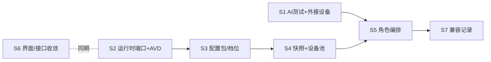

# 安卓模块审计、整改路线与 AI 测试工具 设计规格

- 日期：2026-10-04；状态：proposed，待用户审阅
- 来源：用户与 Claude 的讨论（2026-10-04）：模拟器以测试自家 App 为主、兼顾第三方 App、需要多 App 编排；要求集成 Google ARTEMIS 作为安卓模块内的测试工具（暂不进工作流），并对整个模块做审计与整改设计。
- 关系：修订并细化 [执行环境扩展规格](2026-09-30-execution-environments-design.md) 的 E3–E5；遵守 [整改总纲](2026-09-30-remediation-roadmap.md) 的安卓冻结约定（见 §2、§8）。
- 审计基线：`codex/architecture-baseline@67d08aaf`，只读检查源码、已有规格、研究文档；未启动设备、未安装 ARTEMIS。

## 1. 结论

1. **定位**：安卓模块定位为"**测试工程平台**"：主线测自家 App（可 root、可抓包、可复现），副线以官方原样镜像黑盒测第三方 App，编排支持一次测试操作多个 App，后续扩展到多台设备。
2. **不做**：不伪装真机、不隐藏 root/模拟器、不以通过 Play Integrity 或应用反作弊为目标（沿用 E3 非目标）。第三方 App 拒绝虚拟环境时记录为兼容结果。
3. **最大缺口**：运行时只支持 Mac ARM64（ReDroid on Lima），Windows 用户完全不可用；镜像只能是 ReDroid；没有"预装环境"的概念（root、Shizuku、证书、GApps 都靠手工）；自动化只有坐标点击级节点，没有任何测试工具。
4. **第一个子项目 S1**：在安卓模块内集成 **ARTEMIS AI 测试工具**，同时提供"**外接设备**"入口（接管任意已在 adb 中可见的设备/模拟器，只做测试和操控，不管生命周期）。S1 让 Windows 用户也立即可用，并不依赖工作流引擎。
5. 其余整改按 S2–S7 子项目推进，每个子项目单独出"规格→计划"。

## 2. 背景与约束

| 约束 | 来源 |
| --- | --- |
| 整改期间冻结安卓/iOS，E3 在整改 M6 后开始 | 整改总纲第 80 行；`.ai/decisions/2026-09-30-execution-environments.md` |
| 不伪造硬件标识，不以绕过 Play Integrity 为目标 | 同上 |
| 后端 Python 锁定 `>=3.11,<3.12` | `apps/backend/pyproject.toml` |
| ARTEMIS 要求 Python 3.12+，Apache-2.0，经 adb 连接设备，CLI `artemis run`、Python SDK `artemis-client`、MCP、自带 Web 控制台（8000 端口）；首次任务自动安装辅助无障碍 APK，可用 `ARTEMIS_HELPER_AUTO_INSTALL=false` 关闭；`start.sh` 会自行安装 adb/scrcpy/FFmpeg 并写 IDE 的 MCP 配置 | [google/artemis README](https://github.com/google/artemis)（2026-10-04 读取，未运行） |
| 整改期硬规则 1–7（配置项必须被后端读取、失败原因透传、事件循环不做同步 DB、界面无内部术语等） | `AGENTS.md` |

**冻结冲突**：S1 若在整改 M6 前实施，需要用户明确为 S1 单独解冻（见 §8 待决定 D1）。其余子项目维持原顺序。

## 3. 现状审计

### 3.1 已有能力（保留并复用）

| 领域 | 已有能力 | 位置 |
| --- | --- | --- |
| 运行时 | Mac ARM64 + Lima + ReDroid；ssh 隧道 + `adb connect 127.0.0.1:<port>`；scrcpy 投屏（音频、剪贴板关闭） | `providers/android/mac_runtime.py`、`stream.py` |
| 生命周期 | 创建/启动/停止/删除、保留卷、复制、批量创建、批量动作（取消/重试/冻结结果） | `application/android/devices.py`、`bulk.py`、`fleet.py` |
| 可靠性 | 持久操作、requestId 幂等、代次栅栏、结果未知隔离与核实、独占控制会话与心跳 | `management.py`、`console.py`、`infrastructure/database/android_operations.py` |
| 镜像 | 目录、拉取（仅 `redroid/redroid`）、摘要固定、验证、删除核实、磁盘准入 | `application/android/images.py`、`providers/android/image_catalog.py` |
| 模板 | 环境模板（镜像、分辨率、DPI、CPU、内存、语言、时区；`shellRoot`/`applicationRoot` 仅观测） | `fleet.py`、`TemplateManager.tsx` |
| 数据 | 备份/恢复（guest tar）、清理预览与执行、诊断导出 | `backups.py`、`cleanup.py`、`diagnostics*.py` |
| 应用 | APK 安装、应用列表、启动、验证 | `apk.py`、`ApplicationsPanel.tsx` |
| 界面 | 三列资源看板、创建页、详情、数据维护、环境配置（诊断/镜像/模板/备份/清理） | `pages/AndroidPage.tsx` 等 |

### 3.2 问题清单

严重度：**H** 阻塞核心目标；**M** 明显影响使用或维护；**L** 体验/整洁。

**功能**

| # | 问题 | 证据 | 严重度 |
| --- | --- | --- | --- |
| F1 | 运行时只支持 Darwin arm64，Windows 无法使用 | `mac_runtime.py:155` | H |
| F2 | 镜像来源只允许 `redroid/redroid`，无 AVD/Google Play 镜像 | `image_catalog.py:9` | H |
| F3 | 没有"预装环境"能力：root、Shizuku、抓包证书、GApps、常用 APK 都需手工逐台处理，也不可复现 | 模板只有硬件/地区字段 | H |
| F4 | 没有任何测试工具；工作流节点仅坐标点击、按键、截图、人工 | `domain/android/catalog.py` | H |
| F5 | 投屏无音频、无剪贴板同步；无相机/麦克风/定位 | `stream.py` | M |
| F6 | 没有快照/克隆到"初始化完成"状态的能力，每台新设备从零开机 | 生命周期无 snapshot | M |
| F7 | 工作流分配/接管接口仍保留但返回不可用 | `android_fleet.py` allocations、`_legacy_allocate` | L（死接口） |
| F8 | 无法使用用户自己已启动的模拟器（AVD、其他 adb 设备） | 设备只能由 provider 创建 | M |

**管理**

| # | 问题 | 证据 | 严重度 |
| --- | --- | --- | --- |
| G1 | 三套并行 HTTP 接口（`/android`、`/android/fleet`、`/android/management`），前端需 `managementDeviceToLegacy` 转换 | `AndroidPage.tsx:26`、三个 router | M |
| G2 | 设备高权限状态（root、Shizuku、辅助服务）不可见 | 无字段 | M |
| G3 | 容量只按磁盘准入，未接入整改 M1 的内存水位 | `capacity.py`，E3 R3-07 未做 | M |
| G4 | 没有设备池/预热；批量用设备只能现建 | `fleet.py` | M（编排前置） |

**界面**

| # | 问题 | 证据 | 严重度 |
| --- | --- | --- | --- |
| U1 | `AndroidPage.tsx` 725 行、13+ 个状态，承担路由、会话、管理动作、离开守卫 | 文件本身 | M |
| U2 | 独立样式 `android.css` 2014 行，与共享设计系统偏离 | 文件本身；E3 R3-08 | M |
| U3 | 模板表单要求手输"固定镜像 ID"摘要 | `TemplateManager.tsx` | M |
| U4 | 设备工作台没有"测试"入口，操控、应用、日志分散 | `DeviceConsole.tsx` | M |
| U5 | 模板/镜像/引擎等专业概念直接暴露给普通用户 | 研究文档 §4 | L |

**性能**

| # | 问题 | 严重度 |
| --- | --- | --- |
| P1 | 新设备冷启动 + 手工装环境，单台准备耗时长（无数据，S4 需建基准） | M |
| P2 | 看板 inspect 已优化（列表内 inspect 为 0，见 `.ai/memory`），保持现状 | — |

## 4. 目标与非目标

**目标**

- T-1 Windows 与 Mac 都能用安卓模块做测试（S1 外接设备即可用，S2 托管 AVD）。
- T-2 用"测试工程档/日常档"+配置包，一键得到可复现的测试设备。
- T-3 在设备工作台里用自然语言跑跨 App 测试，产出可回看的证据。
- T-4 编排先单设备多 App，再多设备角色。
- T-5 模块代码与界面收敛到共享设计系统和单一接口面。

**非目标**：伪装真机/隐藏 root；iOS；厂商 ROM 产品化；S1 内接入工作流；使用 ARTEMIS 的 MCP 服务与 Web 控制台。

## 5. 子项目与顺序

| 子项目 | 内容 | 解决 | 依赖 | 对应 |
| --- | --- | --- | --- | --- |
| **S1 AI 测试工具 + 外接设备** | 本文 §6 | F4、F8、U4，部分 F1 | D1 解冻 | 新增 |
| S2 运行时端口 + AVD | `AndroidRuntimePort`；AVD 适配器（Mac/Windows）；ReDroid 改为适配器 | F1、F2、F5 | 整改 M6 | E3 R3-01/02/06 |
| S3 配置包与系统档位 | 配置包（root、Shizuku、证书、GApps、APK 集）声明式安装与检查；"测试工程档/日常档"；高权限状态展示 | F3、G2 | S2 | E3 R3-04 扩展 |
| S4 快照模板 + 设备池 | 已初始化快照克隆；按档位/模板的设备池、预热、领取/归还、恢复干净；内存水位容量 | F6、G3、G4、P1 | S3 | E3 R3-04/07 |
| S5 角色编排 | 工作流设备角色；单角色多 App → 多角色跨设备；uiautomator2 元素节点；ARTEMIS 作为"按描述操作"节点 | F4 剩余 | S4、整改 M6 | E4 R4-01~03/06 |
| S6 界面与接口收敛 | 拆分 `AndroidPage`；移除 `android.css` 独立样式；合并三套接口、删除死的分配接口；镜像选择替代手输摘要 | G1、U1–U3、U5、F7 | S2 前后均可，建议与 S2 同期 | E3 R3-08 |
| S7 兼容记录 | App × 运行时 × 镜像 × 档位的兼容记录；ARTEMIS 报告可作为证据 | 第三方 App | S5 | E5 R5-02 |

## 6. S1 详细设计：AI 测试工具 + 外接设备

### 6.1 用户流程

1. 安卓模块 → 设备工作台（托管设备）或"外接设备"列表（adb 可见的设备）。
2. 打开"AI 测试"面板：首次使用提示安装测试工具（显示版本与占用空间，用户确认后安装）。
3. 填写测试指令（自然语言，可跨 App）、选择模式（快速/深度）、模型、步数上限、超时 → 运行。
4. 运行中：实时步骤列表与截图；"停止"随时可用。托管设备另有只读实时画面和"停止并接管"（结束测试后打开手动操控），外接设备见 §6.4。
5. 结束：结果（通过/失败/已停止/结果待核实）、失败原因原文、截图、logcat、执行轨迹、报告；可"用相同指令重跑"。历史记录按设备列出。

### 6.2 组件

| 单元 | 职责 | 依赖 |
| --- | --- | --- |
| `domain/android/ai_test.py` | 测试运行的状态机与规则：状态 `queued→running→succeeded/failed/cancelled/needs_verification`；输入校验（步数 1–200、超时 30–3600 秒、指令 1–4000 字） | 无 |
| `providers/android/artemis_tool.py`（`ArtemisToolPort` 的唯一实现） | 管理独立 Python 3.12 环境（uv）、安装固定版本、启动/停止子进程、解析进度与结果 | `infrastructure/filesystem/android_paths.py` |
| `providers/android/external_devices.py` | `adb devices -l` 发现外接设备，排除托管设备的序列号 | adb |
| `application/android/ai_tests.py` | 发起：校验设备 → 获取控制权 → 取模型凭据 → 启动工具 → 写进度 → 释放控制权；停止；启动后恢复（进程中断的运行标为待核实） | 上述 + `console.py` 控制会话 + `application/models` |
| `adapters/http/android_ai_tests.py` | HTTP 接口与 schema | application |
| 前端 `domains/android/components/AiTestPanel.tsx`、`ExternalDevices.tsx` | 面板与外接设备列表，使用共享控件 | 生成的 API 类型 |

依赖方向：adapters → application → domain；provider 只经端口被 application 使用（规则：平台差异集中在适配器）。

### 6.3 ARTEMIS 集成方式

- **安装**：在 `android_runtime_root()/tools/artemis/` 下用 uv 创建 Python 3.12 环境，安装**固定提交**的 ARTEMIS（提交哈希写在代码常量中，升级需改代码并回归）。不运行 `start.sh`；adb/scrcpy 用 AutoFlow 已有的。前置条件为本机已有 `uv`（缺失时工具状态显示"需要先安装 uv"，随包内置 uv 留待后续）。已安装状态由工具目录内 `installed.json` 记录的提交判断，安装中状态只在进程内保存（同一时间只允许一次安装）；失败把 uv 输出末尾 50 行透传给用户。
- **调用**：后端用 `asyncio.create_subprocess_exec` 在该环境运行一个随 AutoFlow 发布的小脚本 `artemis_bridge.py`：脚本内用 `artemis-client` 执行任务，把步骤、截图路径、最终结果按 JSON 行写到 stdout。后端逐行读取并落库。**桥接脚本是唯一接触 ARTEMIS API 的地方**，上游接口变化只改它。
- **环境变量**：`ARTEMIS_HELPER_AUTO_INSTALL=false`；模型提供方地址与密钥由 `application/models` 按用户所选 ProviderProfile 解析后只注入子进程环境，不写盘、不写日志。
- **辅助 APK**：首次在某设备运行前检查是否已安装；未安装时界面提示"需要在该设备安装测试辅助组件"，用户确认后经桥接脚本执行 `artemis helper install`。拒绝则不运行（ARTEMIS 自带 UIAutomator2 后备是否可用由 T0 核实，核实前不依赖它）。
- **产物**：每次运行一个目录 `android_runtime_root()/ai-tests/<run_id>/`；库里只存路径和摘要。删除运行记录时删除目录。
- **不使用**：ARTEMIS Web 控制台、MCP、它的自动安装逻辑。

> T0（计划首个任务，spike）：在固定提交上读源码并实测，确认 `artemis-client` 的进度回调/流式接口、设备序列号参数、模型配置方式、取消方式、辅助 APK 安装命令。T0 结论写入 `.ai/knowledge/`；若某项不成立，按 §6.7 降级，不改 S1 的外部契约。

### 6.4 控制权

- 托管设备：`OwnerKind` 增加 `aiTest`。发起时按现有控制会话规则获取独占（设备须 `ready` 且 `control=idle`），沿用代次栅栏与心跳；结束、失败、取消都释放。人工会话进行中时拒绝，返回明确原因。
- 外接设备：AutoFlow 不拥有生命周期，用进程内按序列号的互斥锁防止同一设备并发两个测试；当前被 AutoFlow 托管连接的序列号不出现在外接列表，也不能以外接方式运行；界面注明"外接设备可能被其他程序同时操作"。
- 画面：托管设备运行期间工作台以只读方式显示画面（复用 scrcpy `--no-control`），并提供"停止并接管"。外接设备在 S1 只显示测试步骤截图、只提供"停止"；实时画面与手动操控留到 S2（外接设备纳入运行时端口后）。

### 6.5 数据与接口

新表 `android_ai_test_runs`（迁移前缀遵循整改期 `rm<N>_` 约定；除索引列外其余字段存于 JSON `payload`，与现有安卓表一致）：

| 字段 | 说明 |
| --- | --- |
| `id`, `request_id`（唯一，幂等） | |
| `device_kind`（`managed`/`external`）, `device_id`, `serial` | 托管设备存 id，外接设备存序列号 |
| `instruction`, `mode`（`flash`/`pro`）, `model_id`, `model_key`, `max_steps`, `timeout_seconds` | 全部由后端读取并传入工具 |
| `state`, `error_code`, `error_message` | 失败原因原文（去除凭据） |
| `steps_json`（截断保留最近 200 步）, `artifacts_dir`, `trace_id`, `succeeded` | |
| `tool_version`, `created_at`, `started_at`, `finished_at` | |

数据库读写走 `asyncio.to_thread`（规则 3）。

接口（`/android/ai-tests`）：

| 方法 | 路径 | 说明 |
| --- | --- | --- |
| GET | `/tool` | 工具状态：未安装/安装中/可用/失败，版本 |
| POST | `/tool/install` | 安装（requestId 幂等），返回操作 |
| GET | `/external-devices` | 外接设备列表 |
| POST | `/runs` | 发起运行（202） |
| GET | `/runs?deviceKind=&deviceId=&serial=&cursor=` | 历史 |
| GET | `/runs/{id}` | 详情（含步骤） |
| POST | `/runs/{id}/cancel` | 停止 |
| POST | `/helper` | 在指定设备安装测试辅助组件（用户确认后调用） |
| GET | `/runs/{id}/artifacts/{name}` | 截图/日志/报告，路径限定在运行目录内 |
| DELETE | `/runs/{id}` | 删除记录与产物（界面二次确认） |

更新 OpenAPI 并生成前端类型。

### 6.6 界面

- 设备工作台新增标签"AI 测试"；看板设备卡片与外接设备列表都有入口。
- 面板：指令输入（多行）、模式（快速：每步约 3–5 秒；深度：每步约 15–40 秒，会规划和自检）、模型（来自模型管理）、步数上限、超时；运行按钮。
- 运行中：步骤时间线 + 当前截图 + 只读画面；停止 / 停止并接管。
- 历史：结果、耗时、步数、模型；点开看报告和产物。
- 文案不出现内部术语（如 generation、owner kind、trace）。"结果待核实"解释为"程序中断，无法确定测试是否完成"。
- 全部使用共享控件与语义令牌，不往 `android.css` 加新样式。

### 6.7 失败处理

| 情况 | 行为 |
| --- | --- |
| 工具未安装/安装失败 | 运行按钮禁用并给出安装入口；安装失败显示 uv 输出摘要 |
| 设备不在线 / 被占用 | 拒绝发起，说明原因（不在线、人工操控中、另一个测试进行中） |
| 模型未配置或凭据缺失 | 拒绝发起，链接到模型管理 |
| 子进程异常退出 | `failed`，透传 stderr 末尾 50 行（去除凭据） |
| 超时 | 终止进程树，`failed`，`error_code=AI_TEST_TIMEOUT` |
| 用户停止 | 终止进程树，`cancelled` |
| AutoFlow 重启时运行中 | `needs_verification`，释放控制权；不自动重跑 |
| T0 发现无流式进度 | 降级为结束后一次性展示步骤，运行中只显示画面与计时；外部契约不变 |

### 6.8 测试

- domain：状态迁移、输入边界。
- provider：用假桥接脚本（输出预设 JSON 行/异常退出/超时）测解析、超时终止、取消、环境变量注入且不落日志。
- application：控制权获取与释放（含异常路径）、幂等、重启恢复为待核实、外接设备互斥。
- HTTP：契约与错误码；产物路径越界拒绝。
- 前端：面板状态（未安装/可用/运行中/失败/待核实）、停止并接管、历史。
- 真机验收（单独授权）：一台托管或外接设备上跑"打开设置搜索 Wi-Fi，再打开浏览器访问夹具页"这一跨 App 指令，留存产物。
- 配置项检查：`node scripts/ratchets.mjs` 通过。

### 6.9 验收标准

| 编号 | 验收 |
| --- | --- |
| AC-S1-1 | Windows 上把已启动的 AVD 作为外接设备，安装工具后完成一条跨两个 App 的测试，产物可查看 |
| AC-S1-2 | Mac 托管 ReDroid 设备完成同一测试；运行期间人工操控被拒绝并说明原因；结束后控制权释放 |
| AC-S1-3 | 停止、超时、子进程崩溃、AutoFlow 重启四种情况的状态与界面提示符合 §6.7 |
| AC-S1-4 | 子进程环境以外任何日志、数据库、产物中均找不到模型密钥（自动化测试断言） |
| AC-S1-5 | 后端、前端、类型、lint、OpenAPI、build、ratchets 全部通过 |

## 7. 风险

| 风险 | 应对 |
| --- | --- |
| ARTEMIS 99% 成绩来自 AndroidWorld 基准，对自家 App 效果未知 | 定位为辅助测试；历史与产物便于判断；S5 再接确定性的 uiautomator2 节点 |
| 上游接口变化快（仓库较新） | 固定提交；桥接脚本隔离；升级需回归 |
| 每步调用大模型，费用与时延 | 界面显示模式耗时；步数与超时上限由后端强制 |
| 辅助 APK 改变设备状态 | 安装前确认；S3 后可纳入"测试工程档"配置包 |
| 外接设备不受 AutoFlow 管理 | 明确标注；只做测试和操控，不做生命周期 |

## 8. 待决定

- **D1**：S1 是否在整改 M6 前单独解冻实施？（推荐：是。S1 只新增独立模块、不改执行引擎，与整改范围不重叠。）否则 S1 排在整改 M6 之后、S2 之前。
- D2：S6 界面收敛与 S2 同期还是先行——在 S2 规格时再定。
