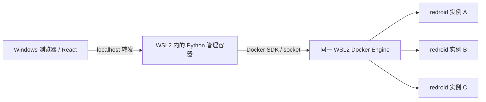

# redroid Python + React Demo 计划

- 日期：2026-09-13。
- 状态：**confirmed，已实施；用户随后要求本轮仅在 Mac 测试。Mac Android / 批量 / Magisk shell root 已验证，Windows 与应用内 root 待验证**。
- 输入：`reference/RedroidManager`、`reference/redroid-script` 的固定版本源码；用户要求直接复用、Python + React、Windows 可用、Demo 放在 `reference`。
- 目标：做一个可运行的小型管理 Demo，通过几个场景演示真实 Android 容器的创建、操作、批量任务和 root 镜像验证。
- 实施输出：Python 后端、React 界面、部署脚本、批量示例、root 构建包装器和测试。实际验证范围见 [VERIFICATION.md](VERIFICATION.md)，启动方式见 [README.md](README.md)。以下保留已确认的设计和验收标准，不将尚未执行的实机验收改为通过。

2026-09-13 范围补充（confirmed，来源：用户“现在只需要在 mac 上进行测试”）：本轮实际部署采用 Apple Silicon Mac → Lima VZ → Ubuntu 24.04 ARM64 → 原生 Docker Engine，Android 使用 `13.0.0_64only-latest` 与软件渲染。Windows 实施入口保留，Windows 验收延期；不等待远程节点。实测记录见 [MAC_TEST.md](MAC_TEST.md)。这是独立 Demo 的平台适配，不改变 AutoFlow 正式架构。

## 1. 实现选择

**保留 RedroidManager 的 Python Flask + Docker SDK 后端，直接复制需要的代码并修正已知问题；将 HTML/原生 JavaScript 界面改写为 React + TypeScript + Vite。**

用户要求的是 Python + React，没有限定 FastAPI。保留 Flask 可以减少与本轮管理验证无关的框架迁移。Demo 独立于 AutoFlow 正式后端；若后续决定进入产品，再按正式 FastAPI 架构迁移用例与接口。

只做一个 Demo 工程，多个演示场景共用实例、API 和界面组件。前端采用设备列表、创建表单、操作区和任务结果表；不做独立设计系统。接口先确定，再接 React；列表从真实后端获取，环境不可用时显示诊断结果。

| 部分 | 选择 | 原因 |
|---|---|---|
| Python 后端 | Flask、Docker SDK；单进程启动 | 最大程度保留参考项目；Demo 的任务状态和同步范围清晰 |
| React 前端 | React、TypeScript、Vite，组件级普通 CSS | 满足指定技术栈，足够支持管理操作 |
| API | JSON、multipart APK 上传、PNG 单帧截图；同源访问 | 直接对应原项目的已有能力 |
| 打包运行 | 多阶段 Dockerfile 构建 React，Python 服务提供构建后的静态页面和 API | 运行端不必另外安装 Node/Python |
| 容器管理 | Docker SDK 连接 Linux 节点的 Docker socket | 管理容器与 redroid 为同一 Engine 下的兄弟容器 |
| 数据 | 每实例独立 Docker named volume；上传文件使用 Demo 专用卷 | 避免 Windows/WSL 路径和权限转换 |
| 任务记录 | 有界后台执行，少量进程内任务记录；界面轮询结果 | 演示批量行为即可，服务重启后任务记录不续跑 |
| HTTP 服务 | 关闭 Flask debug；单进程 WSGI 服务，优先用 Waitress | 本地 Demo 的请求和任务状态保持在同一进程 |

依赖在实现时锁定实际版本。默认使用一个 Android 13 x86_64 镜像作为普通/ root 对照起点，并记录首次验证使用的镜像 ID/digest；选 13 是因为两个参考项目均覆盖该版本，不代表已证明 Magisk 兼容。镜像下载先采用文档中的 Docker 命令，页面展示是否已经缓存，首版不新增镜像下载任务系统。

## 2. Windows 运行方案

建议以 **Windows 11 x64 + WSL2 Ubuntu 24.04 + WSL 内安装的 Docker Engine** 为第一条兼容路径。Windows 浏览器通过本机地址访问管理页面。



具体约束：

1. redroid 需要 Linux 内核能力，尤其 binder/binderfs；使用 memfd 路线时也必须验证所选镜像需要的其他内核能力。普通容器不能补上宿主内核缺失的功能。
2. 首先检查实际 Docker daemon 所在环境：Linux/架构、socket、镜像、binderfs 和启动错误。不能只在 Ubuntu 终端查到 binder，就假定另一台 Docker daemon 也满足条件。
3. WSL 缺少能力时，文档给出自定义 WSL 内核的配置入口及恢复方式；不直接执行网上陈旧的整套命令，也不由 Demo 自动替换系统内核。
4. 主路径明确使用 WSL 内的 Docker Engine，不将 Docker Desktop 的 WSL 集成视为等价证明。Docker Desktop 暂不作为已支持路径。
5. 管理 HTTP 端口绑定 Linux 宿主回环地址，通过 WSL localhost 转发访问；远程 Linux 验证节点使用 SSH 端口转发，不公开 Docker API。
6. Android `/data` 放在 Docker named volume，不挂载 Windows 的 `C:\...` 或 `/mnt/c/...` 作为其数据分区。
7. 启动脚本只负责进入已有 WSL 发行版、执行 Demo Compose 和输出访问地址；发行版名称可配置。Linux/WSL 提供 shell 入口，Windows 提供 PowerShell 入口。对缺少 WSL、Engine、镜像等情况给出具体错误。
8. 原版 redroid 先用软件渲染验证管理链路；GPU 加速不作为第一轮 Windows 通过条件。

redroid 官方 WSL 指南目前展示的是 5.10/5.15 内核时代配置，证明需要相应内核功能，但不是当前 WSL 原样可用的保证。微软文档支持通过 `.wslconfig` 指定自定义内核，并说明 Windows 访问 WSL 网络服务的方法。[redroid WSL 指南](https://github.com/remote-android/redroid-doc/blob/master/deploy/wsl.md)、[WSL 配置](https://learn.microsoft.com/en-us/windows/wsl/wsl-config)、[WSL 网络](https://learn.microsoft.com/en-us/windows/wsl/networking)

**当前开发环境为 macOS，不能据此宣称 Windows 实测通过。** 实现可以先完成 Python/React 检查，真实兼容性验收必须在 Windows + WSL2 节点执行并留下环境版本与结果。没有该节点时，交付记录明确标为“Windows 待实测”。

## 3. 四个演示场景

### Demo 1：创建和管理一台 Android

页面提供环境检查、实例列表和创建表单。创建时选择已缓存镜像，设置名称、分辨率、DPI 与基本资源限制；列表显示容器状态、Android 启动状态、实际 ADB 映射和错误。

支持启动、停止、重启、复制配置创建新实例，以及明确标注会删除数据卷的删除操作。“复制配置”不叫快照克隆；停止和重启保留数据。容器启动后有 Android 就绪检查与超时，不能只根据 Docker running 显示可操作。

**验收：** 创建一个实例、等待 Android 就绪、停止再启动；能够看到实际 Android 版本。写入一个测试标记后重启仍存在，删除时只删除选中 Demo 实例及其专用数据卷。

### Demo 2：查看屏幕、操作和安装 APK

选择设备后显示截图，提供点击、拖动、Home、Back、Recent 和基础文本输入。先采用最多约每秒一次的单帧请求，前一帧完成后再调度下一帧；关闭查看或页面不可见时停止刷新。只预览当前选中设备。

坐标按当前截图真实宽高和实际显示区域换算，不沿用上游写死的 720 × 1280；图片等比显示产生的留白不发送触摸。命令返回错误时界面显示失败；点击与按键按同一设备顺序执行。首版基础文字输入覆盖英文、数字、空格等可验证字符；中文输入法/剪贴板通道作为独立扩展，不能把 `input text` 包装成完整 Unicode 输入支持。

APK 上传采用唯一内部文件名和大小约束，经 Docker SDK 传入容器并执行包管理器安装，显示真实输出。第一轮支持单文件 `.apk`；包名不使用上游自写的二进制 Manifest 猜测逻辑，可从设备读取已安装第三方包列表，再选择启动。

**验收：** 对两个不同分辨率实例正确定位点击；Home/Back 与滑动可见；安装一个已知支持所选 Android 版本和 ABI 的测试 APK，选择包名后启动；无效 APK 明确失败。截图 Demo 的通过标准是可操作与映射正确，不承诺视频帧率。

### Demo 3：三实例批量管理与 Python 调用

在同一界面批量创建 3 个独立实例，显示每个实例的启动结果；支持对选中设备批量启动、停止及安装同一个 APK。首版最多 3 个并行运行目标，后台操作并发限制为 2；这些数值是 Demo 边界，不是 redroid 性能上限。

提供一个简短 Python 示例，通过 Demo HTTP API 完成：创建本次专用实例 → 等待就绪 → 打开系统设置 → 保存各自截图 → 汇总结果 → 清理本次实例。截图文件带任务/实例标识，任意一步失败都输出对应实例错误，清理只作用于该次示例拥有的资源。

已有用户实例的批量操作结束后只恢复操作可用状态，不自动销毁。任务存在时，同一设备的冲突操作返回 busy；后台失败要清除占用。执行中的任务在服务重启后不续跑，页面提示重新查询实例状态。

**验收：** 三个实例端口与数据卷互不串用；三个独立测试标记相互不可见；一个目标失败不掩盖另两个结果；同一目标重复执行被阻止；Python 示例有明确退出状态和本次资源的清理结果。

### Demo 4：普通镜像与 Magisk 镜像对照

在前三个场景可运行后，使用固定版本的 redroid-script 准备 Magisk 镜像，普通与定制镜像各创建一个实例。构建在 WSL/Linux 的临时工作目录中执行，缓存和生成文件不写入原参考仓库。

优先直接调用固定版本的参考脚本，不复制它的全部下载模块进后端。必要的构建错误处理或路径补丁放在临时构建副本，并记录差异。构建完成后独立核查实际产物和镜像 ID，不能仅凭脚本打印成功；构建过程单次执行，避免其固定临时目录相互覆盖。

管理界面允许选择这两个镜像并查看检查结果，区分：容器内执行命令的 UID、ADB shell root、Magisk 安装/运行、`su` 命令结果。ADB shell 检查从 WSL 宿主 CLI 执行并保存结果，不能让管理容器用自身的 `127.0.0.1` 访问宿主发布的端口。应用内申请 root 必须用独立 APK 实测；仅通过 `docker exec id` 或 shell `su` 不算应用级 root 已通过。

**验收：** 定制镜像实际生成、可启动和重启；Magisk 的版本/状态可核查，所需 root 检查有实际输出。如果某个镜像组合不兼容，交付准确的失败结果，不将它描述成已支持。该场景不会自动安装 GApps、转译库或其他无关模块，也不阻塞前三个管理场景的交付。

## 4. 源码直接复用和修复清单

| 来源 | 处理方式 | 必要修改 |
|---|---|---|
| RedroidManager `app.py` 中容器列表、创建、启停 | 直接复制并裁剪 | 固定容器 ADB 5555；Docker 分配宿主端口；返回实际映射；基本输入校验与错误处理 |
| 数据卷、克隆和删除 | 复制其数据卷与参数组织方式 | 卷按唯一实例 ID 命名并标记归属；复制配置使用新卷；删除失败不吞异常 |
| 截图与输入 | 复制 Docker exec 路径，改为单帧接口 | 成功输出/退出码检查、PNG 响应、有限刷新、实际屏幕尺寸、按序输入 |
| APK 上传及安装 | 复制后端主要流程 | 文件归属/边界、唯一名称、解耦包名推断、就绪超时中止、正确记录失败 |
| 批量安装任务 | 保留 job ID + 状态查询思路 | 有界并发、每设备占用、最终失败状态、有限记录；不保留未经处理的无限线程创建 |
| `templates/index.html` | 参考布局与字段，重写为 React 组件 | 移除硬编码宿主 IP、固定坐标和 DOM 字符串拼接；根据 HTTP 状态显示错误 |
| redroid-script `redroid.py` 与 Magisk 模块 | 固定版本调用，必要时临时副本补丁 | Linux 构建、路径隔离、退出状态及新产物确认；原参考目录保持干净 |

特别修正：

- `ports` 字典的键始终是容器端口 `5555/tcp`；宿主端口由 Docker 分配并绑定回环接口，从 inspect 读取，不自己扫描后宣称端口已保留。[Docker SDK 端口定义](https://docker-py.readthedocs.io/en/stable/containers.html)
- 管理端的列表和修改接口都校验 Demo 专用标签，不接受任意容器名后直接操作宿主上的其他容器。
- 镜像不存在、Docker 不可用、启动超时、exec 非零、安装失败和卷删除失败都有可读结果；创建失败仅回收本次创建的资源，不能留下无主卷后返回成功。
- 删除按钮说明数据影响；批量示例仅自动清理自己创建的资源。
- 用户可见 ADB 地址不使用写死的局域网 IP。Windows 端 ADB 连通性和 WSL 转发分别验证，管理核心操作使用同节点 Docker exec。
- 单次截图、安装和就绪等待都有超时；输入采用参数数组，不开放任意 shell 命令接口。
- 管理服务只用于本机访问，关闭 debug，限制变更接口的来源与 JSON 请求；APK 上传允许 multipart 并同样校验来源；不做账户体系。

固定来源：

- RedroidManager：`853b786b29430886ae8db58eb2d9e3432e0c8684`，MIT。
- redroid-script：`a4951b782fc8e06c845d9553bf07bb643fd8c158`，MIT；外部下载组件保留各自来源和许可。

实施时新增 `THIRD_PARTY.md` 和许可证副本，逐项登记来源路径、目标路径和改动。源代码复用不代表沿用上游未经验证的功能宣传。

## 5. 文件位置和实施顺序

拟放置在 `reference/redroid-demo/`。原有 `reference/RedroidManager/` 和 `reference/redroid-script/` 继续保留原始版本；新 Demo 自身的源码由 AutoFlow Git 跟踪，不修改根 workspace 依赖或正式应用。

```text
reference/redroid-demo/
├── PLAN.md                 # 本计划，当前唯一 Demo 文件
├── README.md               # 实施时添加：部署、四个场景、验证结果
├── THIRD_PARTY.md          # 复制来源和修改记录
├── licenses/               # 复制代码对应的原始许可证
├── backend/                # 从 app.py 裁剪而来的 Python 后端及必要检查
├── frontend/               # 独立 React + TypeScript + Vite 工程
├── examples/               # Python 批量示例
├── scripts/                # WSL/Windows 启动、环境检查、root 镜像构建入口
├── Dockerfile              # React 构建 + Python 运行
└── compose.yaml            # 管理服务、专用存储；实例由 API 动态创建
```

实施按可验证的纵向场景推进：

1. **环境与契约：** 核查可用 Linux/WSL 节点，固定镜像与 API 字段/错误；准备服务和 React 最小入口；先验证一台 redroid 能启动。
2. **Demo 1：** 先做创建表单和实例列表组件，再接容器生命周期及数据卷；完成一台设备的真实操作闭环。
3. **Demo 2：** 单帧截图、坐标映射、输入、APK 和包启动；做真实点击、安装和失败路径检查。
4. **Demo 3：** 复用前述接口增加批量任务与 Python 示例；验证资源归属、失败隔离和清理。
5. **Demo 4：** 固定构建输入，验证普通/ root 镜像对照；记录兼容或失败证据。
6. **交付：** 在 Windows + WSL2 执行从启动到清理的步骤，完成文档和源码归属记录。

## 6. 验证命令与完成标准

计划中的基础命令在对应文件实现后执行：

| 层面 | 计划命令/方式 | 证明范围 |
|---|---|---|
| Python | `python -m unittest discover -s backend/tests` | 端口/标签归属/删除错误/命令结果/超时等关键分支；不算 Android 已运行 |
| React | 在 `frontend` 下执行 `npm run typecheck`、`npm test -- --run`、`npm run build` | API 错误状态、坐标换算、输入交互及构建 |
| Compose | `docker compose config`、`docker compose build` | 配置与镜像构建；不算宿主内核满足条件 |
| 单实例 | 浏览器执行 Demo 1、2；检查 Docker 和 Android 返回值 | 真实生命周期与交互 |
| 多实例 | 执行 `examples/batch_demo.py`；核对三个实例、结果和残留资源 | 真实隔离、批量动作及清理 |
| Windows | PowerShell 启动 → WSL Engine → Windows 浏览器 → 三实例验证 | Windows 主路径可用 |
| root | 构建产物、Magisk 状态及各 root 检查实际输出 | 只确认实际通过的权限层次 |
| 原仓库 | 两个参考仓库 `git status --porcelain` 为空，HEAD 与记录一致 | 未改动基准源码 |

不为 UI 的每个静态字段建立测试；重点测试已识别的错误与设备操作边界。实际环境不可用时，交付区分“源码/界面通过”和“Android/Windows 未验证”，不提供假实例冒充成功。

## 7. 后续扩展边界

本批 Demo 聚焦管理、基础操作、批量和 root。实时摄像头、定位/网络/厂商属性配置、完整环境伪装，后续分别做专项 Demo；先验证管理链路，避免将尚未证明的设备能力混入基础演示。视频级投屏、真实快照、多节点调度、正式工作流引擎和桌面打包也在需要时另行扩展。

没有修改 AutoFlow 正式架构。用户已确认本计划并授权实施；Demo 保持独立，实机测试结果单列登记。
